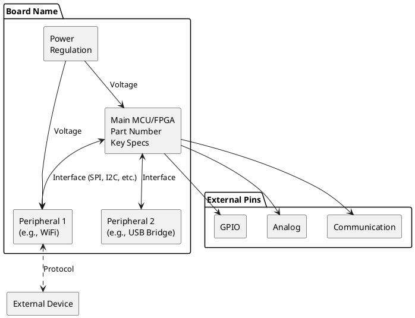
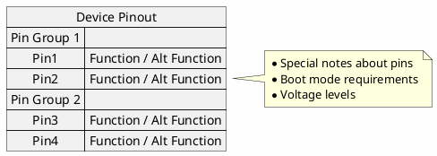

# Programmable Devices Documentation Protocol

Standard operating procedure for creating, maintaining, and expanding the programmable devices inventory documentation.

---

## Table of Contents

1. [Overview](#overview)
2. [Interactive Workflow](#interactive-workflow)
3. [File Verification Procedures](#file-verification-procedures)
4. [Development Tools Documentation](#development-tools-documentation)
5. [PlantUML Diagram Requirements](#plantuml-diagram-requirements)
6. [Directory Structure](#directory-structure)
7. [Adding New Devices](#adding-new-devices)
8. [README Template](#readme-template)
9. [Reviewing Existing Documentation](#reviewing-existing-documentation)
10. [Troubleshooting Downloads](#troubleshooting-downloads)
11. [Maintenance Tasks](#maintenance-tasks)
12. [Request Templates](#request-templates)

---

## Overview

This protocol ensures consistent documentation across all programmable devices in the inventory. Each device gets its own directory containing:

- A standardized README.md with specifications and links
- Locally archived PDFs (datasheets, schematics, reference manuals)
- **Datasheets for primary chip AND peripheral components** (WiFi modules, USB bridges, etc.)
- **Application notes and guides** for the main chip
- **PlantUML block diagrams** showing internal device architecture and external interfaces
- Pinout diagrams and reference cards
- Example code or project templates (where appropriate)

### Key Files

| File | Purpose |
|------|---------|
| `readme.md` | Main index with device tables and navigation |
| `PROGRAMMABLE_DEVICES_DOCUMENTATION_PROTOCOL.md` | This protocol document |
| `MISSING_DOCUMENTATION.md` | Tracks downloads that failed/require manual action |

### Design Principles

1. **Self-contained** - Each device directory should be usable standalone
2. **Offline-first** - Download and archive documentation locally when possible
3. **Consistent format** - Use the standard README template for all devices
4. **Linked index** - Main readme.md provides navigation to all devices
5. **Complete component coverage** - Document not just the main chip but all significant ICs on the board
6. **Visual architecture** - Include PlantUML diagrams for board architecture and pinouts

---

## Interactive Workflow

This section describes how to work with users to gather device information and create documentation.

### Workflow: Adding New Devices

```
┌─────────────────────────────────────────────────────────────────┐
│  USER: "I want to add my [device] to the inventory"             │
└─────────────────────────────────────────────────────────────────┘
                              │
                              ▼
┌─────────────────────────────────────────────────────────────────┐
│  ASK: What is the manufacturer and model/variant?               │
│       (Check silkscreen on PCB, packaging, or vendor page)      │
└─────────────────────────────────────────────────────────────────┘
                              │
                              ▼
┌─────────────────────────────────────────────────────────────────┐
│  ASK: Can you tell me the hardware revision or variant?         │
│       - Check silkscreen (Rev, V1, V2, etc.)                    │
│       - Check chip markings (exact part number)                 │
│       - Memory/flash size variant                               │
└─────────────────────────────────────────────────────────────────┘
                              │
                              ▼
┌─────────────────────────────────────────────────────────────────┐
│  RESEARCH: Look up specifications online                        │
│       - Manufacturer website                                    │
│       - Chip datasheets                                         │
│       - Schematic PDFs                                          │
└─────────────────────────────────────────────────────────────────┘
                              │
                              ▼
┌─────────────────────────────────────────────────────────────────┐
│  CONFIRM: "I found these specs - does this match your board?"   │
│       - List key specifications                                 │
│       - Note any variant-specific differences                   │
└─────────────────────────────────────────────────────────────────┘
                              │
                              ▼
┌─────────────────────────────────────────────────────────────────┐
│  CREATE: Directory and README.md with specifications            │
└─────────────────────────────────────────────────────────────────┘
                              │
                              ▼
┌─────────────────────────────────────────────────────────────────┐
│  DOWNLOAD: PDFs and resources (see Download Checklist below)    │
│       - Datasheet (main chip)                                   │
│       - Schematic                                               │
│       - Board reference manual                                  │
│       - Pinout diagram                                          │
│       - Getting started guide                                   │
└─────────────────────────────────────────────────────────────────┘
                              │
                              ▼
┌─────────────────────────────────────────────────────────────────┐
│  VERIFY: Check all files are valid and match device             │
│       - file *.pdf should show "PDF document"                   │
│       - file *.png/jpg should show image type                   │
│       - Files should be > 50KB typically                        │
│       - Open and visually confirm content matches device        │
└─────────────────────────────────────────────────────────────────┘
                              │
                              ▼
┌─────────────────────────────────────────────────────────────────┐
│  PINOUT: Add complete pinout to README                          │
│       - Download pinout image if available                      │
│       - Include text-based pinout table in README               │
│       - Document alternate pin functions                        │
│       - Note special pins (boot, reset, power)                  │
└─────────────────────────────────────────────────────────────────┘
                              │
                              ▼
┌─────────────────────────────────────────────────────────────────┐
│  UPDATE: Main readme.md index and directory structure           │
└─────────────────────────────────────────────────────────────────┘
```

### Download Checklist

For each new device, attempt to download these files locally:

#### Documentation (Priority Order)

| Priority | Document Type | Typical Filename |
|----------|--------------|------------------|
| 1 | Main Chip Datasheet | `<Chip>_Datasheet.pdf` |
| 2 | Board Schematic | `<Board>_Schematic.pdf` |
| 3 | Board Reference Manual | `<Board>_ReferenceManual.pdf` |
| 4 | **Pinout Image** | `<Board>_Pinout.png` or `.jpg` |
| 5 | Getting Started Guide | `<Board>_GettingStarted.pdf` |
| 6 | Programming Guide | `<Board>_ProgrammingGuide.pdf` |
| 7 | Peripheral Chip Datasheets | `<PeripheralChip>_Datasheet.pdf` |
| 8 | Application Notes | `AN_<number>_<topic>.pdf` |

#### Pinout Requirements

**MANDATORY**: Every device README must include:

1. **Pinout Image** - Download from manufacturer or community sources:
   ```bash
   # Download pinout image
   curl -L -o "<Board>_Pinout.png" "<url>"

   # Verify it's an image
   file <Board>_Pinout.png  # Should show "PNG image data" or similar
   ```

2. **Text-Based Pinout Table** - Include in README for quick reference:
   ```markdown
   ## Pinout

   

   | Pin | Function | Alternate Functions | Notes |
   |-----|----------|---------------------|-------|
   | D0  | GPIO     | RX                  |       |
   | D1  | GPIO     | TX                  |       |
   ```

3. **Special Pin Documentation**:
   - Boot mode pins (GPIO0, BOOT0, etc.)
   - Reset pin
   - Power pins (VCC, GND, VIN)
   - Analog-only pins
   - Pins with restrictions

#### Peripheral Component Documentation

For boards with additional ICs, download datasheets for:

| Component Type | Examples | Why Important |
|----------------|----------|---------------|
| USB Bridge | CH340, CP2102, FT232, FTDI | Driver compatibility, serial settings |
| WiFi/BLE Module | CC3000, nRF8001, ESP module | Protocol details, AT commands |
| Voltage Regulators | AMS1117, LM1117 | Power specs, thermal limits |
| EEPROMs | AT24C, 25LC | Memory map, programming |
| Sensors | MPU6050, BME280 | Registers, I2C addresses |
| Power Management | Charging ICs | Battery handling |

#### Application Notes

Download relevant application notes from chip vendors:

- Configuration and setup guides
- Design recommendations
- Common circuits and use cases
- Migration guides (for similar chips)
- Errata documents

#### Software/Firmware

| Type | When to Download | Storage |
|------|------------------|---------|
| Bootloader source | If open source | `firmware/` subdirectory |
| Board support packages | If small/portable | `software/` subdirectory |
| Example projects | If useful reference | `examples/` subdirectory |
| Driver packages | If hard to find online | `drivers/` subdirectory |

#### What NOT to Download

- Large IDEs (>50MB) - link only
- Proprietary toolchains - link only
- Content requiring login/registration - note in README
- Licensed IP cores - never

### Conversation Templates

#### Starting the conversation

```
I'd be happy to add that to your programmable devices inventory. To make sure I get
the right documentation, can you tell me:

1. What's the exact board/model name? (usually silkscreened on the PCB)
2. What's the main chip part number? (e.g., STM32F103C8T6, ATmega328P)
3. Is there a revision marked? (like "Rev B" or "v2.0")
4. When did you acquire it? (helps identify the hardware generation)
```

#### When user doesn't know the exact chip

```
No problem - let's figure out which chip you have. Can you check:

1. Look at the main chip - what's printed on it? (the largest IC on the board)
2. Is there a silkscreen label near the chip?
3. What does the vendor's product page say?

If you can send me a photo of the board, I can help identify it.
```

#### When user provides partial information

```
Thanks! I found that the [Board] was made in several versions:

- [Board] v1 (2015-2018): [key difference - e.g., different chip variant]
- [Board] v2 (2018-2021): [key difference - e.g., more flash]
- [Board] v3 (2021-present): [key difference - e.g., USB-C connector]

Based on [what they told you], yours is likely the [version].
Does that sound right?
```

#### When specifications need verification

```
I found these specifications for the [Board Rev X]:

| Spec | Value |
|------|-------|
| ... | ... |

A few questions to verify:
1. Does your unit have [specific feature]?
2. What interfaces are on the board? (USB type, headers, connectors)
3. Any installed modules or shields?
```

#### When documentation can't be found

```
I couldn't find downloadable documentation for the [Board]. Here are some options:

1. Do you have any original manuals or CDs that came with it?
2. I can create a basic entry with the specs we know, and you can add docs later
3. Would you like me to search archive.org or maker forums?

What would you prefer?
```

### Handling Special Cases

#### Rebranded/Clone Boards

Many development boards are sold under multiple brand names or as clones:

```
The [Brand] [Board] appears to be a clone/rebrand of [Original Brand] [Original Board].
Documentation for the original should work. Would you like me to:
1. Use the original manufacturer's documentation
2. Search for your specific brand's documentation
3. Include both in the entry with notes about compatibility
```

**Common clone scenarios:**
- Arduino clones (Elegoo, LAFVIN, HiLetgo, etc.) - use official Arduino docs
- ESP32/ESP8266 modules from various manufacturers - use Espressif docs
- STM32 BluePill variants - may have different USB chips or fake STM32 chips
- Generic FPGA boards - may be copies of Digilent/Terasic designs

#### Discontinued Boards

```
The [Board] was discontinued in [year]. Documentation may be harder to find.
I'll check:
1. Archive.org Wayback Machine
2. Maker community forums (Reddit, EEVBlog, Hackaday)
3. GitHub repositories with cached documentation

In the meantime, do you have any original documentation?
```

**Examples of discontinued boards:**
- Particle Spark Core (replaced by Photon)
- Netduino series (.NET Micro Framework discontinued)
- RedBear boards (company acquired)
- Original Arduino boards (replaced by newer revisions)

#### Chinese/Generic Boards

```
This appears to be a generic or clone board. These often:
- Have limited official documentation
- Use common chipsets with known specs
- May have quality variations (check for fake chips)
- Have community-created resources

I'll search for:
1. Reviews that verified actual specifications
2. Teardown articles showing internal components
3. User forums with operational guides
4. Comparison to "official" versions
```

**Known issues with generic boards:**
- STM32 BluePill: Often has fake STM32 chips, wrong USB resistor
- ESP32 clones: May have different flash sizes than advertised
- Arduino clones: Different USB bridge chips (CH340 vs FTDI)

---

## File Verification Procedures

**CRITICAL**: All downloaded files MUST be verified to ensure they match the device.

### Verification Steps

```bash
# 1. Check file type is correct
file *.pdf *.png *.jpg 2>/dev/null

# Expected output:
# - PDFs: "PDF document, version X.X"
# - PNGs: "PNG image data, WxH, ..."
# - JPGs: "JPEG image data, ..."

# 2. Check file sizes are reasonable
ls -lh *.pdf *.png *.jpg 2>/dev/null

# Minimum expected sizes:
# - Datasheets: > 100 KB (usually 1-50 MB)
# - Schematics: > 50 KB
# - Pinout images: > 10 KB

# 3. Detect HTML error pages disguised as PDFs
head -c 100 *.pdf | grep -l "<!DOCTYPE\|<html" 2>/dev/null
# If any output, those files are HTML, not PDF - delete and retry
```

### Content Verification Checklist

After downloading, visually verify each file:

| File Type | What to Check |
|-----------|---------------|
| Datasheet | Title page shows correct chip part number |
| Schematic | Board name matches, revision is appropriate |
| Pinout Image | Pin labels match board silkscreen |
| Reference Manual | Device model/family is correct |
| Application Note | Applies to the chip family in use |

### Common Verification Issues

| Issue | Symptom | Solution |
|-------|---------|----------|
| Wrong chip variant | Datasheet for similar but different part | Find exact part number datasheet |
| Old revision | Schematic doesn't match current board | Search for updated version |
| Generic image | Pinout shows different board variant | Find model-specific pinout |
| Regional variant | Documentation in wrong language | Find English version or note limitation |

### Verification Commands

```bash
# Quick verification script
for pdf in *.pdf; do
    type=$(file "$pdf" | grep -o "PDF document")
    size=$(stat -f%z "$pdf" 2>/dev/null || stat -c%s "$pdf")
    if [ -z "$type" ]; then
        echo "INVALID: $pdf is not a PDF"
    elif [ "$size" -lt 50000 ]; then
        echo "WARNING: $pdf is suspiciously small ($size bytes)"
    else
        echo "OK: $pdf ($size bytes)"
    fi
done
```

---

## Development Tools Documentation

### Official vs Open-Source Tools

**IMPORTANT**: Always document BOTH official/vendor tools AND open-source alternatives for each device.

| Device Type | Official Tools | Open-Source Alternatives |
|-------------|---------------|-------------------------|
| Arduino AVR | Arduino IDE | PlatformIO, avr-gcc, AVRDUDE |
| ESP8266/ESP32 | Arduino IDE (with ESP core) | PlatformIO, ESP-IDF, esptool.py |
| STM32 | STM32CubeIDE, Keil | PlatformIO, arm-none-eabi-gcc, OpenOCD |
| Xilinx FPGA | Vivado | Yosys (limited), SymbiFlow (experimental) |
| Nordic BLE | nRF Connect SDK | Zephyr RTOS, OpenOCD |
| Particle | Particle Cloud IDE | particle-cli (offline), PlatformIO |
| .NET MF | Visual Studio | None (legacy platform) |

### Tool Documentation Requirements

For each device README, include:

1. **Primary/Official IDE** - Vendor-supported development environment
2. **Open-Source Alternatives** - Community tools, cross-platform options
3. **Command-Line Tools** - For scripting and CI/CD
4. **Debugging Tools** - Both official and open-source
5. **Setup Instructions** - Board package URLs, configuration steps

### Arduino IDE & PlatformIO Support Check

**MANDATORY**: For every device, verify and document support in:

#### Arduino IDE Support

| Check | How to Verify |
|-------|---------------|
| Native Support | Check Arduino IDE board list |
| Board Package Required | Search for board manager URL |
| Board Selection | Document exact board name to select |
| Upload Settings | Note any special settings (programmer, port, speed) |

#### PlatformIO Support

| Check | How to Verify |
|-------|---------------|
| Platform | Check [PlatformIO Boards](https://platformio.org/boards) |
| Board ID | Document exact `board = xxx` setting |
| Framework | Note supported frameworks (arduino, espidf, stm32cube, etc.) |
| Upload Protocol | Document upload_protocol if non-standard |

#### Example Format in README

```markdown
## Development Environment Support

### Arduino IDE
- **Supported:** Yes / Requires board package / Not supported
- **Board Package URL:** `https://...`
- **Board Selection:** Tools > Board > "Board Name"
- **Special Settings:** [any notes]

### PlatformIO
- **Supported:** Yes / Experimental / Not supported
- **Board ID:** `board_name`
- **Platform:** `platform_name`
- **Framework:** `arduino` / `espidf` / etc.
```

### Example Software Section Format

```markdown
## Software & Tools

### Official Tools
- **[Vendor IDE]** - Primary development environment
- [Download Link](https://vendor.com/ide)

### Open-Source Alternatives
- **PlatformIO** - Cross-platform, multi-framework IDE
- **[Framework]-gcc** - Command-line compiler
- **OpenOCD** - Open-source debugging

### Board Package Setup
1. Arduino IDE: File > Preferences > Additional Board URLs
2. Add: `https://board-package-url.json`
3. Install via Boards Manager
```

---

## PlantUML Diagram Requirements

### Block Diagrams

Every device README should include PlantUML block diagrams showing:

1. **Internal Architecture** - How components on the board connect to each other
2. **External Interfaces** - Available pins and connectors
3. **Pinout Diagrams** - Pin assignments and alternate functions

### Block Diagram Template



### Pinout Diagram Template



### When to Include Diagrams

| Board Complexity | Required Diagrams |
|-----------------|-------------------|
| Simple (Arduino UNO) | Pinout only |
| Moderate (ESP32, BluePill) | Block diagram + Pinout |
| Complex (Multi-chip, FPGA+MCU) | Full architecture + Pinout + Interfaces |

---

## Directory Structure

```
/programmable-devices/
├── readme.md                                    # Main index with device tables
├── PROGRAMMABLE_DEVICES_DOCUMENTATION_PROTOCOL.md  # This file
├── <device-directory>/
│   ├── README.md                                # Device specifications and info
│   ├── <Chip>_Datasheet.pdf                     # Main chip datasheet
│   ├── <Board>_Schematic.pdf                    # Board schematic
│   ├── <Board>_Pinout.pdf                       # Pinout reference
│   ├── firmware/                                # Bootloader, firmware files
│   ├── examples/                                # Example code
│   └── software/                                # Tools, utilities
```

### Directory Naming Convention

Use lowercase with hyphens:
- `manufacturer-model` (e.g., `arduino-uno`, `digilent-arty-a7`)
- For clones, use generic name (e.g., `arduino-uno` covers official and clones)
- Include variant where significant (e.g., `stm32-bluepill`, `esp32-devkit`)

---

## Adding New Devices

### Step 1: Gather Information

#### Minimum Required Information

```
Device Addition Request (Minimum)
=================================
1. Manufacturer/Brand: _______________
2. Board Name/Model: _______________
3. Main Chip: _______________
4. Device Type: (FPGA, MCU, SoC, etc.)
```

#### Extended Information (for accuracy)

```
Device Details (Extended)
=========================
1. Manufacturer/Brand: _______________
2. Board Name/Model: _______________
3. Hardware Revision: _______________
4. Main Chip (exact part): _______________
5. Flash/RAM Size: _______________
6. Clock Speed: _______________
7. I/O Count: _______________
8. Connectivity: _______________ (USB, WiFi, BLE, etc.)
9. Form Factor: _______________
```

### Step 2: Create Directory

```bash
mkdir -p /path/to/inventory/<manufacturer-model>
```

### Step 3: Research Documentation

Search for documentation in this order:

1. **Manufacturer website** - Most authoritative
2. **Chip vendor site** - For datasheets (ST, Microchip, Espressif, etc.)
3. **Adafruit/SparkFun** - Often have excellent guides
4. **GitHub repositories** - For open-source hardware
5. **Arduino.cc** - For Arduino-compatible boards

### Step 4: Create README.md

Use the [README Template](#readme-template) below.

### Step 5: Download Documentation and Verify

**This step is mandatory** - always attempt to download documentation locally.

#### 5a. Download PDFs

```bash
cd /path/to/inventory/<device-directory>

# Download main chip datasheet
curl -L -o "<Chip>_Datasheet.pdf" "<datasheet_url>"

# Download board schematic (if available)
curl -L -o "<Board>_Schematic.pdf" "<schematic_url>"

# Download reference manual (if available)
curl -L -o "<Board>_ReferenceManual.pdf" "<reference_url>"

# Download pinout image
curl -L -o "<Board>_Pinout.png" "<pinout_url>"

# Download peripheral chip datasheets
curl -L -o "<USBChip>_Datasheet.pdf" "<usb_chip_url>"
```

#### 5b. Verify Downloads

**Step 1: Check file type**

```bash
# Check all PDFs are valid (not HTML error pages)
file *.pdf

# Expected output: "PDF document, version X.X"
# If you see "HTML document" or "XML", the download failed

# Check file sizes (PDFs should typically be > 100KB)
ls -lh *.pdf

# Remove any failed downloads
rm -f *.pdf  # only if file command shows HTML/XML
```

**Step 2: Verify PDF content matches the device**

This is critical - a valid PDF file may still be the wrong document!

```bash
# Extract first page text to verify content
pdftotext -l 1 "<filename>.pdf" - | head -20

# Or if pdftotext not available, check PDF metadata
pdfinfo "<filename>.pdf"
```

**Content verification checklist:**

- [ ] PDF title/header mentions the correct manufacturer
- [ ] PDF title/header mentions the correct chip/board model
- [ ] Content appears to be the right document type (datasheet vs schematic vs reference)
- [ ] Language is appropriate (English or user's preferred language)
- [ ] Document is not for a completely different product
- [ ] Pinout image matches the actual board layout

**Common issues:**

| Problem | Symptom | Solution |
|---------|---------|----------|
| Wrong chip variant | PDF is for similar but different part (e.g., STM32F103C6 vs C8) | Delete and find exact part number |
| Generic datasheet | Shows chip only, not board-specific info | Search for board reference manual |
| Marketing brochure | No technical content | Search for technical documentation |
| Wrong language | Document in Chinese/German/etc | Search for English version |
| Corrupted PDF | Opens but content garbled | Re-download or try alternate source |
| Wrong pinout | Image shows different board variant | Find board-specific pinout |

**If content verification fails:**

1. Delete the incorrect file immediately
2. Document the issue in the README
3. Search for alternate sources
4. If no correct documentation available, note in README and add to `MISSING_DOCUMENTATION.md`:
   ```markdown
   ## Local Files

   *No official documentation found. [Reason/notes]*
   ```

#### 5c. Download Firmware/Examples (if applicable)

```bash
# Create subdirectories
mkdir -p firmware examples

# Download bootloader/firmware files
curl -L -o "firmware/<firmware_file>" "<firmware_url>"

# Clone example repositories (if small)
git clone --depth 1 "<examples_repo>" examples/
```

#### 5d. Handle Download Failures

If downloads fail:
1. Try adding `--user-agent "Mozilla/5.0"` to curl
2. Try archive.org: `https://web.archive.org/web/<year>/<original_url>`
3. Search for alternate sources (Adafruit, SparkFun, GitHub)
4. If no source available:
   - Document in the device README:
     ```markdown
     ## Local Files

     *Note: Documentation requires manual download from [source] (registration required).*
     ```
   - **Add entry to `MISSING_DOCUMENTATION.md`** with:
     - Device name and document type
     - Best known download URL
     - Reason for failure (blocked, requires login, not found)
     - Alternative sources to try

#### 5e. Update README Local Files Section

After downloading, update the README to list local files:

```markdown
## Local Files

### Primary Documentation
- `<Chip>_Datasheet.pdf` - Main chip datasheet
- `<Board>_Schematic.pdf` - Board schematic
- `<Board>_Pinout.png` - Pinout diagram

### Peripheral Documentation
- `<USBChip>_Datasheet.pdf` - USB bridge datasheet
```

### Step 6: Update Main Index

Add entry to the appropriate table in the main `readme.md`.

---

## README Template

```markdown
# [Manufacturer] [Board Name]

**[Device Type Description]**

## Board Information

| Field | Value |
|-------|-------|
| Manufacturer | [Brand/Company] |
| Board | [Board Name] |
| Variant/Revision | [If applicable] |
| Main Chip | [Chip part number] |
| Date Acquired | [When you got it] |
| Quantity | [How many you have] |

## Specifications

| Specification | Value |
|--------------|-------|
| Architecture | [ARM Cortex-M3, AVR, Zynq, etc.] |
| Clock Speed | [Value] |
| Flash | [Value] |
| RAM | [Value] |
| GPIO | [Count] |
| ADC | [Channels/Resolution] |
| PWM | [Channels] |
| Interfaces | [UART, SPI, I2C, etc.] |
| Connectivity | [USB, WiFi, BLE, Ethernet, etc.] |
| Operating Voltage | [Value] |
| Input Voltage | [Range] |

## Block Diagram

[Include PlantUML block diagram showing internal architecture]

## Pinout

[Include PlantUML pinout diagram or link to pinout reference]

## Features

- Feature 1
- Feature 2
- Feature 3

## Programming

| Method | Tools |
|--------|-------|
| [Method 1] | [Tool/Software] |
| [Method 2] | [Tool/Software] |

## Documentation

### Primary Chip
- [Main Chip Datasheet (PDF)](https://example.com/datasheet.pdf)
- [Reference Manual](https://example.com/reference.pdf)
- [Application Notes](https://example.com/appnote.pdf)

### Board Documentation
- [Schematic (PDF)](https://example.com/schematic.pdf)
- [Getting Started Guide](https://example.com/guide.pdf)

### Peripheral Components
- [USB Bridge Datasheet](https://example.com/usb-chip.pdf)
- [Other IC Datasheet](https://example.com/peripheral.pdf)

## Software & Tools

### Official Tools
- **[Vendor IDE]** - Primary development environment
- [Download Link](https://vendor.com/ide)

### Open-Source Alternatives
- **PlatformIO** - Cross-platform IDE with [framework] support
- **[toolchain]-gcc** - Command-line compiler
- **[debugger]** - Debugging tool

### Board Package Setup (if applicable)
1. IDE setup step 1
2. Add board URL: `https://board-package-url.json`
3. Select board from menu

## Notes

Any special notes about this specific board, configurations, quirks, or modifications.

## Local Files

### Primary Documentation
- `<Chip>_Datasheet.pdf` - Main chip datasheet
- `<Board>_Schematic.pdf` - Board schematic

### Peripheral Documentation
- `<USBChip>_Datasheet.pdf` - USB bridge datasheet
- `<OtherIC>_Datasheet.pdf` - Other component datasheet

### Application Notes
- `AN_xxx_topic.pdf` - Relevant application note
```

### Device-Type Specific Sections

**FPGA Boards** - Include: Logic cells, block RAM, DSP slices, I/O banks, transceivers, configuration method

**MCU Boards** - Include: Core architecture, clock speed, flash/RAM, peripherals, bootloader info

**SoC Boards** - Include: Processing system specs, programmable logic specs, hard peripherals

**WiFi/BLE Boards** - Include: Wireless standards, antenna type, range, power modes

**Arduino-Compatible** - Include: Arduino board type equivalent, shield compatibility

---

## Reviewing Existing Documentation

### Periodic Review Checklist

For each device directory, verify:

- [ ] README.md exists and follows template
- [ ] All listed PDFs are present and valid
- [ ] External links are still active
- [ ] Specifications are accurate
- [ ] Software links point to current versions

### Validation Commands

```bash
# Check all PDFs are valid
find . -name "*.pdf" -exec file {} \; | grep -v "PDF document"

# List directories without README
for dir in */; do
  if [ ! -f "$dir/README.md" ]; then
    echo "No README: $dir"
  fi
done
```

---

## Troubleshooting Downloads

### PDF Downloads as HTML

```bash
# Check what was actually downloaded
file downloaded_file.pdf
head -20 downloaded_file.pdf

# If HTML, remove and try alternate source
rm downloaded_file.pdf
```

### Common Download Issues

| Issue | Symptom | Solution |
|-------|---------|----------|
| Redirect to login | Small HTML file | Try archive.org or alternate source |
| Blocked by bot detection | 403 error | Add user-agent header |
| File moved | 404 error | Search for alternate URL |
| JavaScript required | HTML instead of PDF | Manual browser download |

---

## Maintenance Tasks

### Adding New Devices (Quick Reference)

1. `mkdir <manufacturer-model>`
2. Create `README.md` from template
3. Download PDFs with `curl -L -o`
4. Verify PDFs with `file *.pdf` and content check
5. Update main `readme.md` index

### Periodic Maintenance

| Task | Frequency | Description |
|------|-----------|-------------|
| Link check | Monthly | Verify external URLs still work |
| PDF validation | Monthly | Ensure no corrupted files |
| Software updates | Quarterly | Check for new toolchain versions |
| Spec verification | As needed | Confirm specs match actual devices |
| Missing docs review | Monthly | Check `MISSING_DOCUMENTATION.md` for items to retry |

### Managing Missing Documentation

The `MISSING_DOCUMENTATION.md` file tracks downloads that couldn't be automated:

**When to add entries:**
- Download fails after trying all fallback methods
- Site requires login/registration
- Document not available online
- Downloaded file was wrong content
- Pinout image doesn't match the specific board variant

**Entry format:**
```markdown
### Device Name
- [ ] **Document Type** - Description
  - Source: [best URL]
  - Issue: [why it failed]
  - Manual download: [instructions]
```

**When you manually obtain a document:**
1. Place file in the correct device directory
2. Update the device README's "Local Files" section
3. Move the entry in `MISSING_DOCUMENTATION.md` to "Completed" section:
   ```markdown
   ### Device Name
   - [x] **Document Type** - Downloaded YYYY-MM-DD
     - Verified content matches device
     - File: `device-folder/filename.pdf`
   ```

### Archival Best Practices

1. **Keep original filenames** when they're descriptive
2. **Rename to consistent format** when originals are cryptic:
   - `<Chip>_Datasheet.pdf`
   - `<Board>_Schematic.pdf`
   - `<Board>_Pinout.png`
3. **Document download date** in commit message or notes
4. **Preserve version numbers** in filenames for firmware

---

## Request Templates

### User Request: Add New Device

```
I'd like to add the following device to the inventory:

Manufacturer: _______________
Board/Model: _______________
Main Chip: _______________
Type: (FPGA / MCU / SoC / Arduino-compatible / etc.)

Key specs:
- _______________
- _______________

Documentation links (if known):
- _______________

Notes:
_______________
```

### User Request: Update Existing Entry

```
Please update the entry for: _______________

Changes needed:
- [ ] Fix broken documentation link
- [ ] Add missing specification
- [ ] Download additional datasheet/schematic
- [ ] Update software/tool versions
- [ ] Fix pinout image
- [ ] Other: _______________

Details:
_______________
```

### User Request: Review Documentation

```
Please review documentation for: [ ] All devices / [ ] Specific: _______________

Check for:
- [ ] Broken links
- [ ] Missing PDFs/pinouts
- [ ] Outdated software versions
- [ ] Specification accuracy
- [ ] Content verification (files match devices)
```

---

*Protocol version: 1.1*
*Last updated: December 2024*
