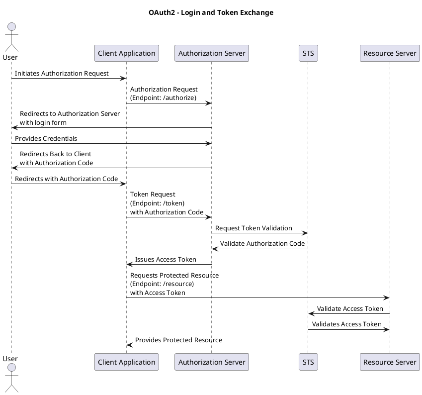
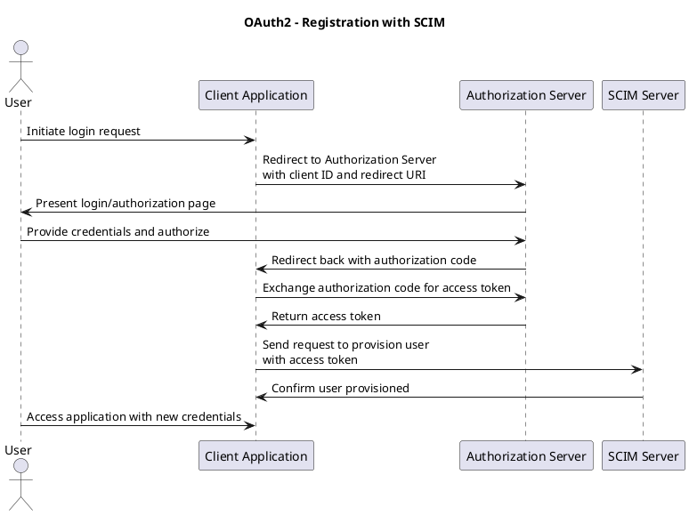
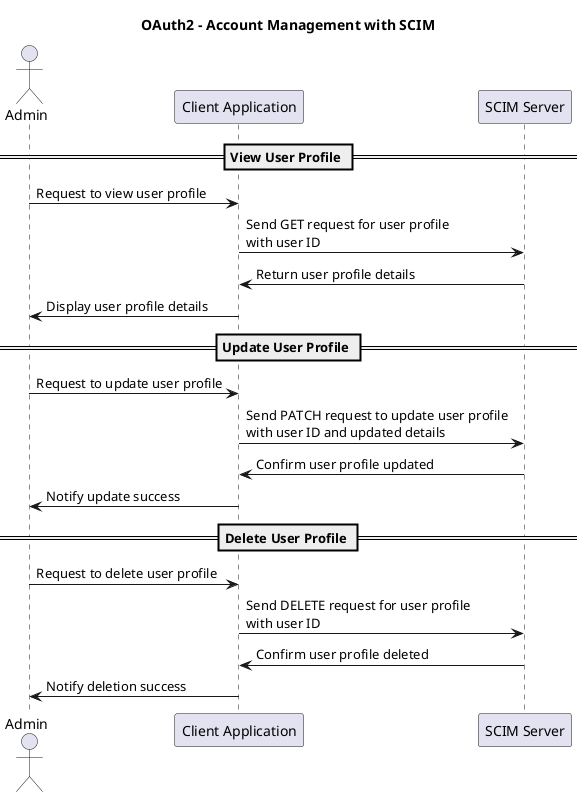

## OAuth2

## Login and Token Exchange

```plantuml
@startuml

title: OAuth2 - Login and Token Exchange

actor User
participant "Client Application" as Client
participant "Authorization Server" as AuthorizationServer
participant STS
participant "Resource Server" as ResourceServer

User -> Client : Initiates Authorization Request
Client -> AuthorizationServer : Authorization Request\n(Endpoint: /authorize)
AuthorizationServer -> User : Redirects to Authorization Server\nwith login form
User -> AuthorizationServer : Provides Credentials
AuthorizationServer -> User : Redirects Back to Client\nwith Authorization Code
User -> Client : Redirects with Authorization Code
Client -> AuthorizationServer : Token Request\n(Endpoint: /token)\nwith Authorization Code
AuthorizationServer -> STS : Request Token Validation
STS -> AuthorizationServer : Validate Authorization Code
AuthorizationServer -> Client : Issues Access Token
Client -> ResourceServer : Requests Protected Resource\n(Endpoint: /resource)\nwith Access Token
ResourceServer -> STS : Validate Access Token
STS -> ResourceServer : Validates Access Token
ResourceServer -> Client : Provides Protected Resource

@enduml
```

## Account Registration

```plantuml
@startuml

title: OAuth2 - Registration with SCIM

actor User
participant "Client Application" as Client
participant "Authorization Server" as AuthServer
participant "SCIM Server" as SCIM

User -> Client: Initiate login request
Client -> AuthServer: Redirect to Authorization Server\nwith client ID and redirect URI
AuthServer -> User: Present login/authorization page
User -> AuthServer: Provide credentials and authorize
AuthServer -> Client: Redirect back with authorization code
Client -> AuthServer: Exchange authorization code for access token
AuthServer -> Client: Return access token

Client -> SCIM: Send request to provision user\nwith access token
SCIM -> Client: Confirm user provisioned

User -> Client: Access application with new credentials

@enduml
```

## Profile Management - SCIM

```plantuml
@startuml

title: OAuth2 - Account Management with SCIM

actor Admin
participant "Client Application" as Client
participant "SCIM Server" as SCIM

== View User Profile ==
Admin -> Client: Request to view user profile
Client -> SCIM: Send GET request for user profile\nwith user ID
SCIM -> Client: Return user profile details
Client -> Admin: Display user profile details

== Update User Profile ==
Admin -> Client: Request to update user profile
Client -> SCIM: Send PATCH request to update user profile\nwith user ID and updated details
SCIM -> Client: Confirm user profile updated
Client -> Admin: Notify update success

== Delete User Profile ==
Admin -> Client: Request to delete user profile
Client -> SCIM: Send DELETE request for user profile\nwith user ID
SCIM -> Client: Confirm user profile deleted
Client -> Admin: Notify deletion success

@enduml
```

