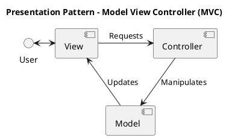
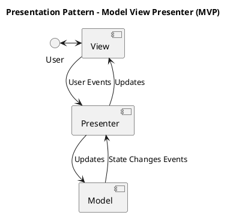
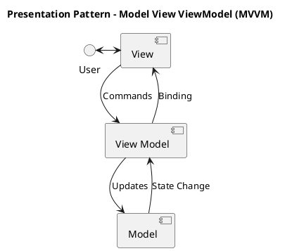

# Presentation Patterns

## Model View Controller (MVC)

```plantuml
@startuml

title: Presentation Pattern - Model View Controller (MVC)

() User

[Model]
[View]
[Controller]

User <-> View

Model --> View : Updates
View -> Controller : Requests
Controller --> Model : Manipulates

@enduml
```

## Model View Presenter (MVP)

```plantuml
@startuml

title: Presentation Pattern - Model View Presenter (MVP)
() User

[View]
[Presenter]
[Model]

User <-> View

View --> Presenter : User Events
Presenter --> View : Updates

Presenter --> Model : Updates
Model --> Presenter : State Changes Events

@enduml
```

## Model View ViewModel (MVVM)

```plantuml
@startuml

title: Presentation Pattern - Model View ViewModel (MVVM)

() User

[View]
[View Model] as ViewModel
[Model]

User <-> View

ViewModel --> View : Binding
View --> ViewModel : Commands

ViewModel --> Model : Updates
Model --> ViewModel : State Change

@enduml
```