# Behavioral Patterns

## Blackboard

The blackboard pattern allows discrete state management across multiple knowledge source providers.  Each knowledge provider owns its own validate and data lookup.  Shared state is stored in the Blackboard and access in managed through the control. 

[Example](../Examples/BehaviorBlackboard/)

### Class Diagram

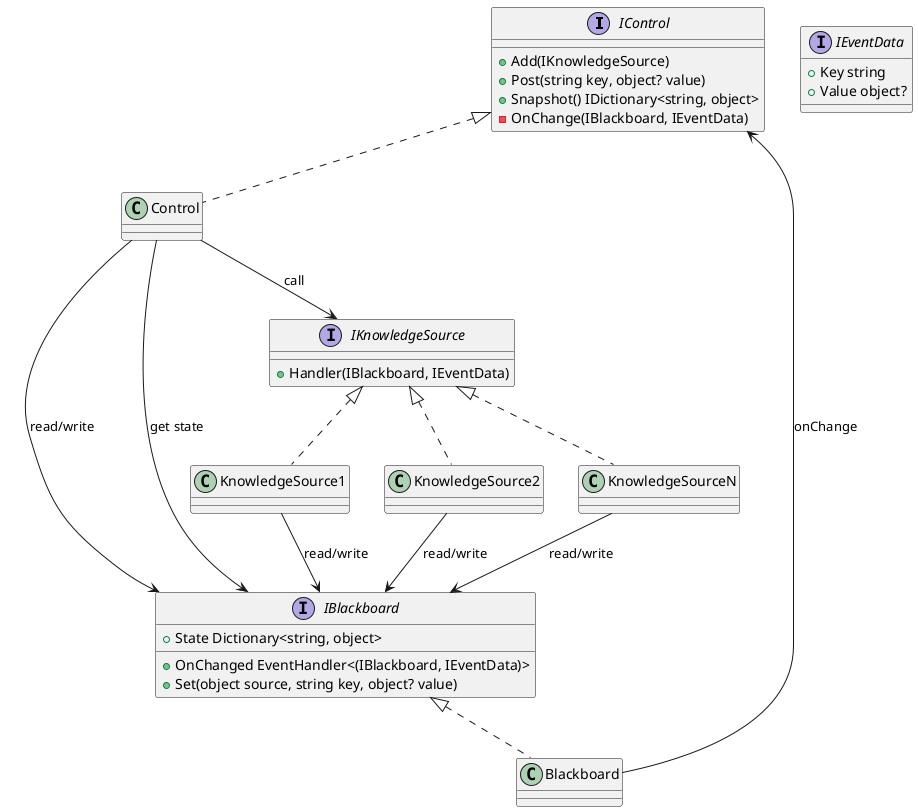

### Sequence Diagram

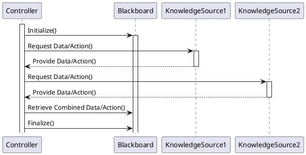

## Chain of Responsibility

Chain of Responsibility provides a means to decouple the requester from the actual handler. If the called operation is not able to complete the request it is passed on to the next handler in the chain until the chain ends or the request is handled.

### Class Diagram

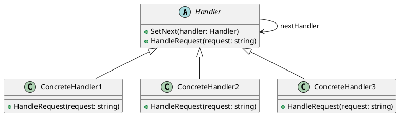

###  Sequence Diagram

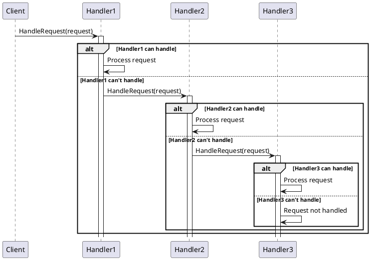

## Command

The command pattern allows for defining a common means to execute operations.  This allows for decoupling the caller from the handler.

## Class Diagram

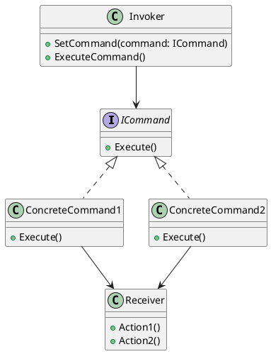

### Sequence Diagram

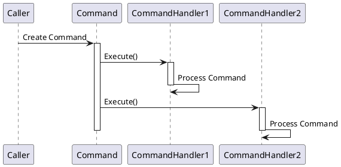

## Interpreter 

Interpreters are used to declare a graph based representation of a syntax expression such as the abstract syntax tree (AST) behind a expression parser.

### Class Diagram

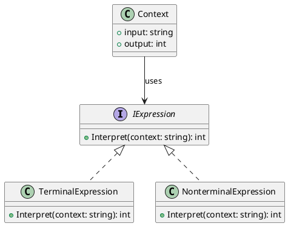

### Sequence Diagram

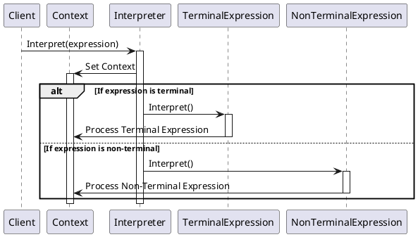

## Iterator or Cursor

Iterators are used to access the elements of a set of objects sequentially.

### Class Diagram

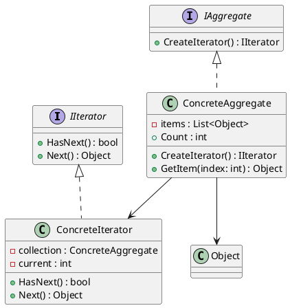

### Sequence Diagram

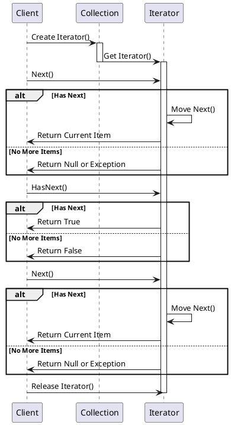

## Mediator

Mediator is used as a meant ot separate object interactions.  

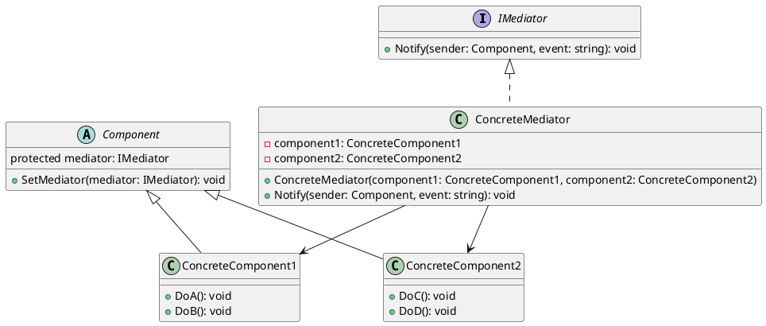

## Memento

Memento is a mean to capture/replay state for an applications.  Examples use cases may include undo/redo functionality or change a change log.

### Class Diagram

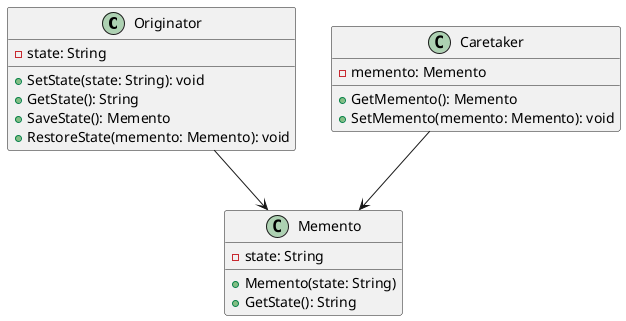

### Sequence Diagram

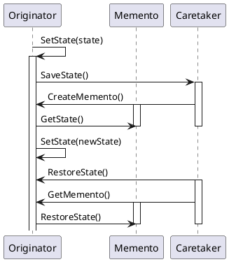

## Observer, Dependents or Publisher/Subscriber

Observers are used to track changes and notify dependents.

### Class Diagram

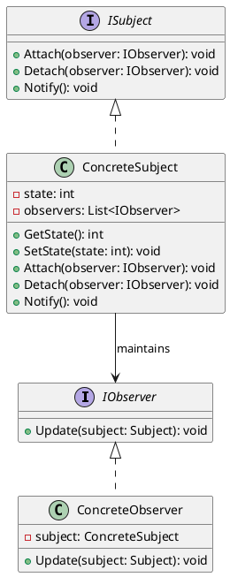

### Sequence Diagram

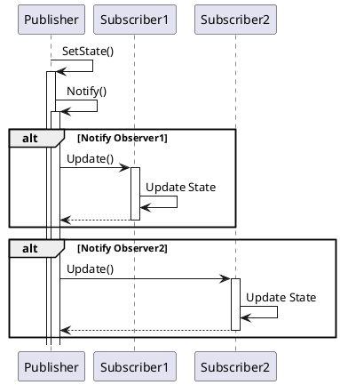

## Specification

The Specifications pattern is used as a means to define combinable business logic

[Example](../Examples/BehaviorSpecification/)

### Class Diagram

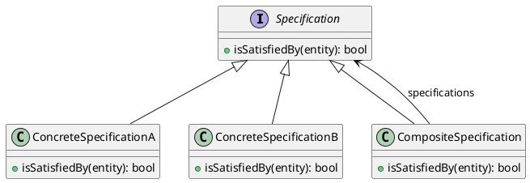

### Sequence Diagram

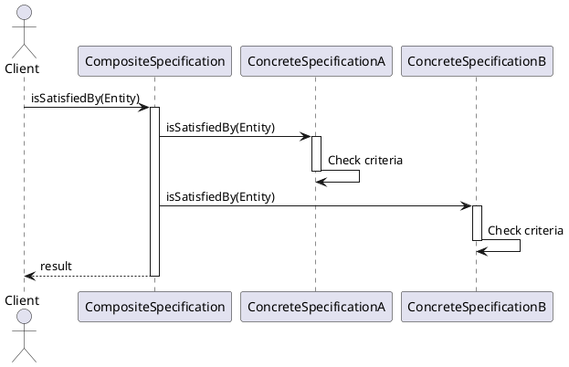

## State

### Class Diagram

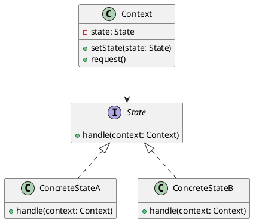

### Sequence Diagram

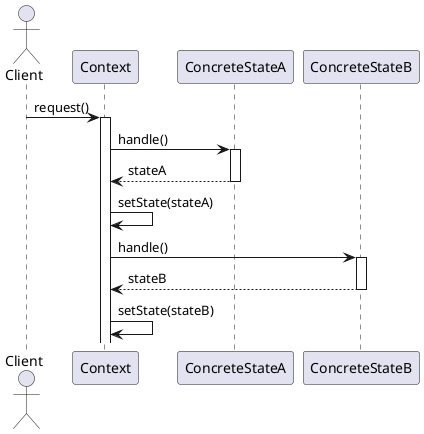

## Strategy

The Strategy patterns allows for changing algorithm independently from the client.

### Class Diagram

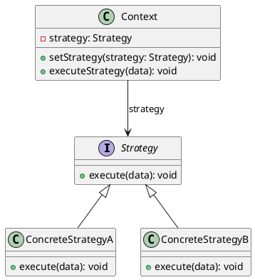

### Sequence Diagram

```plantuml
@startuml

actor Client
participant "Context" as Context
participant "ConcreteStrategyA" as StrategyA
participant "ConcreteStrategyB" as StrategyB

Client -> Context : setStrategy(StrategyA)
activate Context
deactivate Context

Client -> Context : executeStrategy(data)
activate Context
    Context -> StrategyA : execute(data)
    activate StrategyA
        StrategyA -> StrategyA : Perform algorithm
    deactivate StrategyA
    Context -> Client : return result
deactivate Context

Client -> Context : setStrategy(StrategyB)
activate Context
deactivate Context

Client -> Context : executeStrategy(data)
activate Context
    Context -> StrategyB : execute(data)
    activate StrategyB
        StrategyB -> StrategyB : Perform algorithm
    deactivate StrategyB
    Context -> Client : return result
deactivate Context

@enduml
```

## Template Method

Template Methods provide a means to use object hierarchy to abstract your application specific implementation from a shared definition.

### Class Diagram

```plantuml
@startuml
abstract class AbstractClass {
    +templateMethod(): void
    #primitiveOperation1(): void
    #primitiveOperation2(): void
}

class ConcreteClassA {
    +primitiveOperation1(): void
    +primitiveOperation2(): void
}

class ConcreteClassB {
    +primitiveOperation1(): void
    +primitiveOperation2(): void
}

AbstractClass <|-- ConcreteClassA
AbstractClass <|-- ConcreteClassB
@enduml
```

### Sequence Diagram

```plantuml
@startuml
actor Client
participant "ConcreteClassA" as ClassA
participant "ConcreteClassB" as ClassB
participant "AbstractClass" as AbstractClass

Client -> ClassA : templateMethod()
activate ClassA
    ClassA -> AbstractClass : templateMethod()
    activate AbstractClass
        AbstractClass -> ClassA : primitiveOperation1()
        activate ClassA
            ClassA -> ClassA : Execute specific logic
        deactivate ClassA
        AbstractClass -> ClassA : primitiveOperation2()
        activate ClassA
            ClassA -> ClassA : Execute specific logic
        deactivate ClassA
    deactivate AbstractClass
deactivate ClassA

Client -> ClassB : templateMethod()
activate ClassB
    ClassB -> AbstractClass : templateMethod()
    activate AbstractClass
        AbstractClass -> ClassB : primitiveOperation1()
        activate ClassB
            ClassB -> ClassB : Execute specific logic
        deactivate ClassB
        AbstractClass -> ClassB : primitiveOperation2()
        activate ClassB
            ClassB -> ClassB : Execute specific logic
        deactivate ClassB
    deactivate AbstractClass
deactivate ClassB
@enduml
```