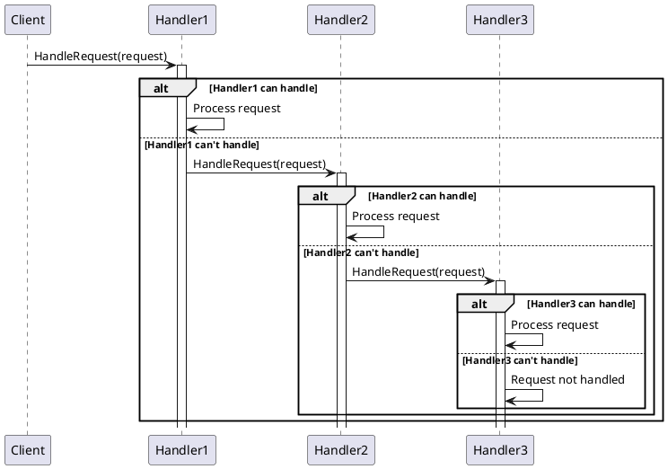

# Behavioral Patterns

## Blackboard

The blackboard pattern allows discrete state management across multiple knowledge source providers.  Each knowledge provider owns its own validate and data lookup.  Shared state is stored in the Blackboard and access in managed through the control. 

### Class Diagram

```plantuml

interface IControl {
    + Add(IKnowledgeSource)
    + Post(string key, object? value)
    + Snapshot() IDictionary<string, object>
    - OnChange(IBlackboard, IEventData)
}

interface IBlackboard {
  + State Dictionary<string, object>
  + OnChanged EventHandler<(IBlackboard, IEventData)>
  + Set(object source, string key, object? value)
}

interface IEventData {
    + Key string
    + Value object?
}

interface IKnowledgeSource {
    + Handler(IBlackboard, IEventData)
}

class KnowledgeSource1 implements IKnowledgeSource {
}

class KnowledgeSource2 implements IKnowledgeSource {
}

class KnowledgeSourceN implements IKnowledgeSource {
}

class Control implements IControl {
}
class Blackboard implements IBlackboard {
}

KnowledgeSource1 --> IBlackboard : read/write
KnowledgeSource2 --> IBlackboard : read/write
KnowledgeSourceN --> IBlackboard : read/write
Blackboard --> IControl  : onChange
Control --> IBlackboard : read/write
Control --> IBlackboard : get state
Control --> IKnowledgeSource : call
```

### Sequence Diagram

```plantuml
participant Controller
participant Blackboard
participant KnowledgeSource1
participant KnowledgeSource2

activate Controller
Controller -> Blackboard: Initialize()
activate Blackboard
  Controller -> KnowledgeSource1: Request Data/Action()
    activate KnowledgeSource1
    return Provide Data/Action()
  Controller -> KnowledgeSource2: Request Data/Action()
    activate KnowledgeSource2
    return Provide Data/Action()
Controller -> Blackboard: Retrieve Combined Data/Action()
Controller -> Blackboard: Finalize()

```

## Chain of Responsibility

Chain of Responsibility provides a means to decouple the requester from the actual handler. If the called operation is not able to complete the request it is passed on to the next handler in the chain until the chain ends or the request is handled.

### Class Diagram

```plantuml
abstract class Handler {
  + SetNext(handler: Handler)
  + HandleRequest(request: string)
}

class ConcreteHandler1 {
  + HandleRequest(request: string)
}

class ConcreteHandler2 {
  + HandleRequest(request: string)
}

class ConcreteHandler3 {
  + HandleRequest(request: string)
}

Handler <|-- ConcreteHandler1
Handler <|-- ConcreteHandler2
Handler <|-- ConcreteHandler3
Handler --> Handler : nextHandler
```

###  Sequence Diagram



## Command

The command pattern allows for defining a common means to execute operations.  This allows for decoupling the caller from the handler.

## Class Diagram

```plantuml
interface ICommand {
    +Execute()
}

class ConcreteCommand1 {
    +Execute()
}

class ConcreteCommand2 {
    +Execute()
}

class Invoker {
    +SetCommand(command: ICommand)
    +ExecuteCommand()
}

class Receiver {
    +Action1()
    +Action2()
}

ICommand <|.. ConcreteCommand1
ICommand <|.. ConcreteCommand2
Invoker --> ICommand
ConcreteCommand1 --> Receiver
ConcreteCommand2 --> Receiver
```

### Sequence Diagram

```plantuml
participant Caller
participant Command
participant CommandHandler1
participant CommandHandler2

Caller -> Command: Create Command
activate Command
Command -> CommandHandler1: Execute()
activate CommandHandler1
CommandHandler1 -> CommandHandler1: Process Command
deactivate CommandHandler1
Command -> CommandHandler2: Execute()
activate CommandHandler2
CommandHandler2 -> CommandHandler2: Process Command
deactivate CommandHandler2
deactivate Command
```

## Interpreter 

Interpreters are used to declare a graph based representation of a syntax expression such as the abstract syntax tree (AST) behind a expression parser.

### Class Diagram

```plantuml
interface IExpression {
    +Interpret(context: string): int
}

class TerminalExpression implements IExpression {
    +Interpret(context: string): int
}

class NonterminalExpression implements IExpression {
    +Interpret(context: string): int
}

class Context {
    +input: string
    +output: int
}

Context --> IExpression : uses
```

### Sequence Diagram

```plantuml
participant Client
participant Context
participant Interpreter
participant TerminalExpression
participant NonTerminalExpression

Client -> Interpreter: Interpret(expression)
activate Interpreter
Interpreter -> Context: Set Context
activate Context

alt If expression is terminal
    Interpreter -> TerminalExpression: Interpret()
    activate TerminalExpression
    TerminalExpression -> Context: Process Terminal Expression
    deactivate TerminalExpression
else If expression is non-terminal
    Interpreter -> NonTerminalExpression: Interpret()
    activate NonTerminalExpression
    NonTerminalExpression -> Context: Process Non-Terminal Expression
    deactivate NonTerminalExpression
end

deactivate Context
deactivate Interpreter
```

## Iterator or Cursor

Iterators are used to access the elements of a set of objects sequentially.

### Class Diagram

```plantuml
interface IIterator {
    +HasNext() : bool
    +Next() : Object
}

interface IAggregate {
    +CreateIterator() : IIterator
}

class ConcreteIterator implements IIterator {
    - collection : ConcreteAggregate
    - current : int
    +HasNext() : bool
    +Next() : Object
}

class ConcreteAggregate implements IAggregate {
    +CreateIterator() : IIterator
    - items : List<Object>
    +Count : int
    +GetItem(index: int) : Object
}

ConcreteAggregate --> ConcreteIterator
ConcreteAggregate --> Object
```

### Sequence Diagram

```plantuml
participant Client
participant Collection
participant Iterator

Client -> Collection: Create Iterator()
activate Collection
Collection -> Iterator: Get Iterator()
deactivate Collection
activate Iterator

Client -> Iterator: Next()
alt Has Next
    Iterator -> Iterator: Move Next()
    Iterator -> Client: Return Current Item
else No More Items
    Iterator -> Client: Return Null or Exception
end

Client -> Iterator: HasNext()
alt Has Next
    Iterator -> Client: Return True
else No More Items
    Iterator -> Client: Return False
end

Client -> Iterator: Next()
alt Has Next
    Iterator -> Iterator: Move Next()
    Iterator -> Client: Return Current Item
else No More Items
    Iterator -> Client: Return Null or Exception
end

Client -> Iterator: Release Iterator()
deactivate Iterator
```

## Mediator

Mediator is used as a meant ot separate object interactions.  

```plantuml
interface IMediator {
    +Notify(sender: Component, event: string): void
}

abstract class Component {
    protected mediator: IMediator
    +SetMediator(mediator: IMediator): void
}

class ConcreteMediator implements IMediator {
    -component1: ConcreteComponent1
    -component2: ConcreteComponent2
    +ConcreteMediator(component1: ConcreteComponent1, component2: ConcreteComponent2)
    +Notify(sender: Component, event: string): void
}

class ConcreteComponent1 extends Component {
    +DoA(): void
    +DoB(): void
}

class ConcreteComponent2 extends Component {
    +DoC(): void
    +DoD(): void
}

ConcreteMediator --> ConcreteComponent1
ConcreteMediator --> ConcreteComponent2
```

## Memento

Memento is a mean to capture/replay state for an applications.  Examples use cases may include undo/redo functionality or change a change log.

### Class Diagram

```plantuml
class Originator {
    - state: String
    + SetState(state: String): void
    + GetState(): String
    + SaveState(): Memento
    + RestoreState(memento: Memento): void
}

class Memento {
    - state: String
    + Memento(state: String)
    + GetState(): String
}

class Caretaker {
    - memento: Memento
    + GetMemento(): Memento
    + SetMemento(memento: Memento): void
}

Originator --> Memento
Caretaker --> Memento
```

### Sequence Diagram

```plantuml
participant Originator
participant Memento
participant Caretaker

Originator -> Originator: SetState(state)
activate Originator
Originator -> Caretaker: SaveState()
activate Caretaker
Caretaker -> Originator: CreateMemento()
activate Memento
Originator -> Memento: GetState()
deactivate Memento
deactivate Caretaker

Originator -> Originator: SetState(newState)

Caretaker -> Originator: RestoreState()
activate Caretaker
Caretaker -> Originator: GetMemento()
activate Memento
Originator -> Memento: RestoreState()
deactivate Memento
deactivate Caretaker
```

## Observer, Dependents or Publisher/Subscriber

Observers are used to track changes and notify dependents.

### Class Diagram

```plantuml
interface IObserver {
    + Update(subject: Subject): void
}

interface ISubject {
    + Attach(observer: IObserver): void
    + Detach(observer: IObserver): void
    + Notify(): void
}

class ConcreteSubject implements ISubject {
    - state: int
    - observers: List<IObserver>
    + GetState(): int
    + SetState(state: int): void
    + Attach(observer: IObserver): void
    + Detach(observer: IObserver): void
    + Notify(): void
}

class ConcreteObserver implements IObserver {
    - subject: ConcreteSubject
    + Update(subject: Subject): void
}

ConcreteSubject --> IObserver : maintains
```

### Sequence Diagram

```plantuml
participant Publisher as Subject
participant Subscriber1 as Observer1
participant Subscriber2 as Observer2

Subject -> Subject: SetState()
activate Subject
  Subject -> Subject: Notify()
  activate Subject

    alt Notify Observer1
        Subject -> Observer1: Update()
        activate Observer1
        Observer1 -> Observer1: Update State
        return
    end

    alt Notify Observer2
        Subject -> Observer2: Update()
        activate Observer2
        Observer2 -> Observer2: Update State
        return
    end

```