# Big Data Patterns

## Batch Processing

Batch Processing is used to process large volumes of data on a scheduled basis.

### Class Diagram

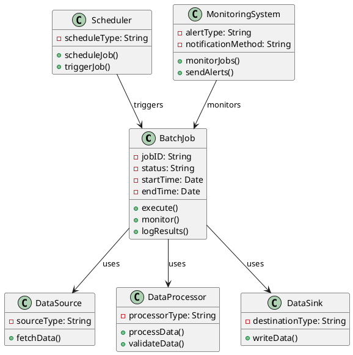

### Sequence Diagram

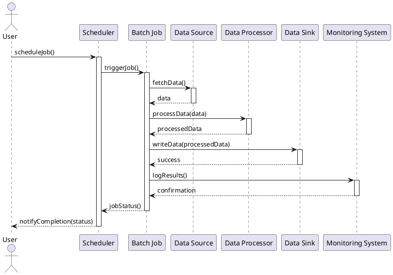

## Stream Processing

Stream Processing is used to process data in near real-time

### Class Diagram

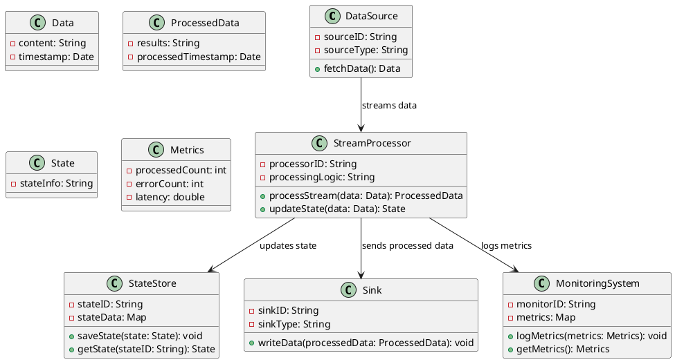

### Sequence Diagram

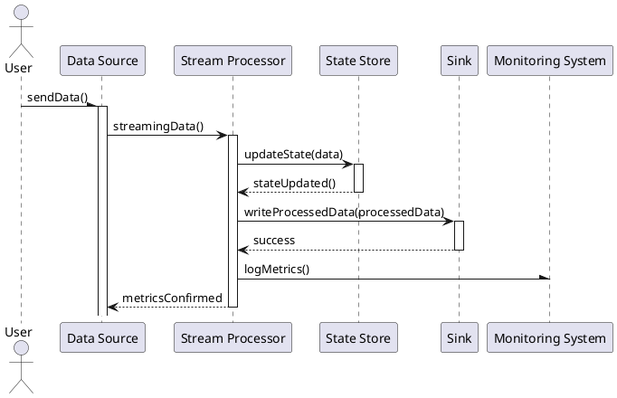

## Data Lake

Data Lake is used to store vast amounts of raw and processed data for analysis and reporting.

### Class Diagram

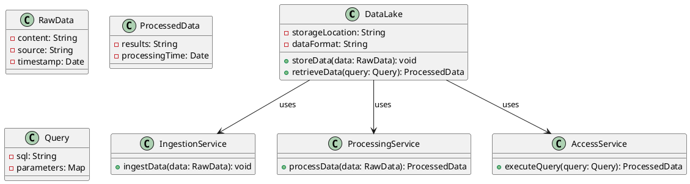

### Sequence Diagram

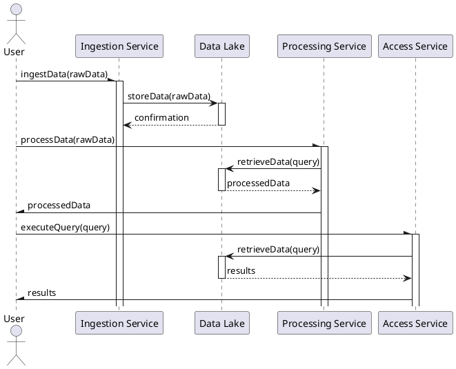

## Data Warehouse

Data Warehouse is used to consolidate and analyze large volumes of structured data from multiple sources for business intelligence and reporting.

### Class Diagram

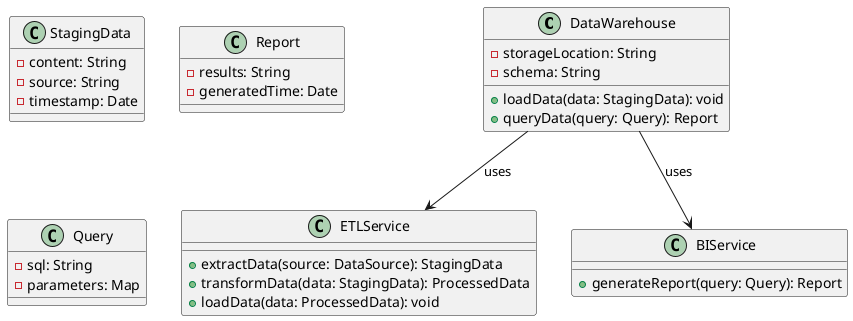

### Sequence Diagram

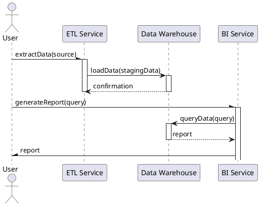

## Federated Data

Federated Data refers to a data architecture that allows data from multiple sources to be accessed and queried as if it were a single unified database, without requiring the data to be physically moved or replicated.

### Class Diagram

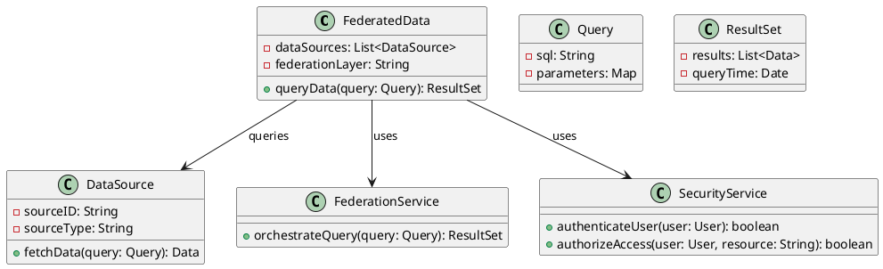

### Sequence Diagram

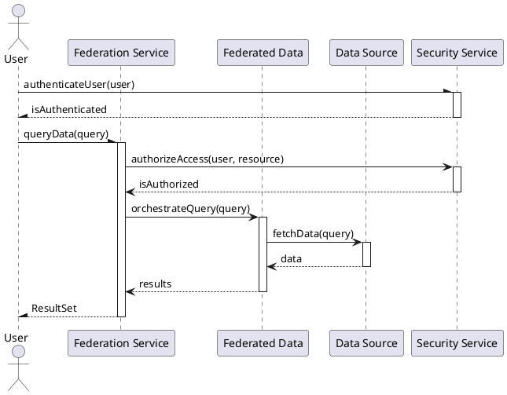

## Data Partitioning

### Class Diagram

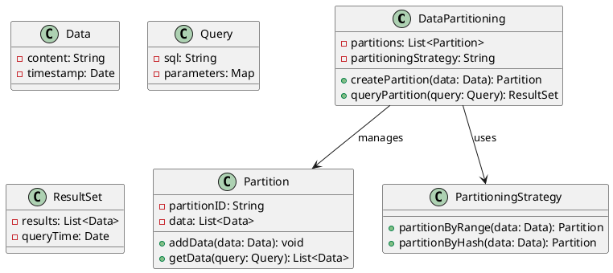

### Sequence Diagram

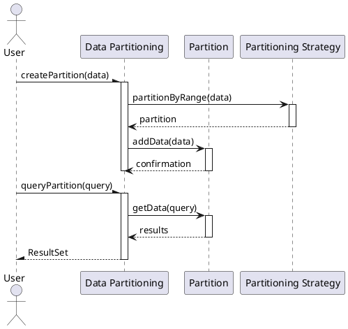
