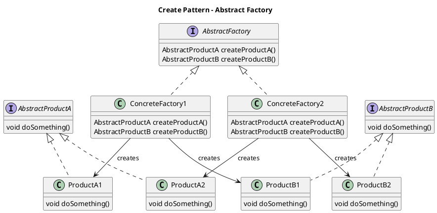
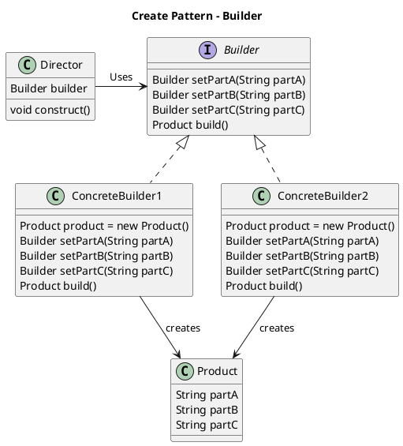
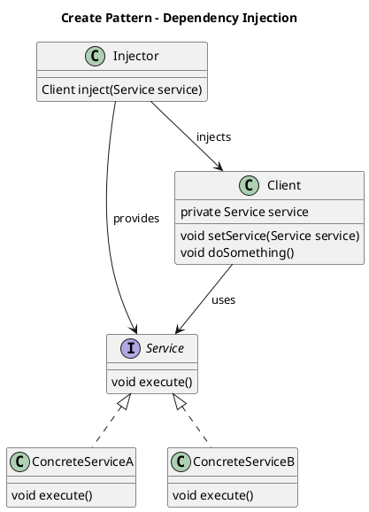
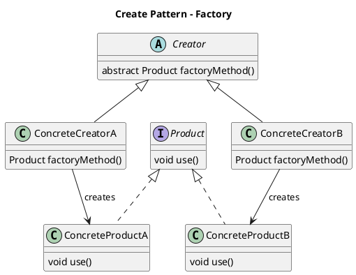
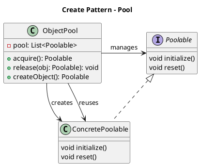
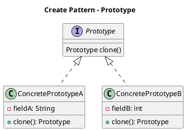
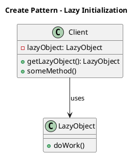
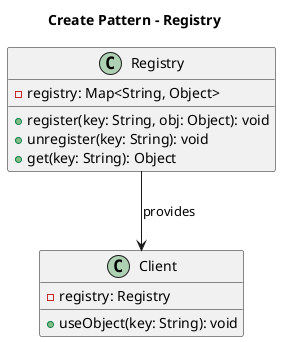
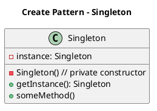

# Creation Patterns

## Abstract Factory

Abstract factories are used to create difference related related objects without specifying their type.

## Builder

Builder is used to construct an object instance with control flow

## Dependency Injection

Dependency Injection is a means to control/provide dependent functionality to a class

## Factory

Factories are used to create the particular type of class instance

## Pool

Object pools provide a means to reuse object instances that are expensive to create.  Examples may include data service connection or threads.

## Prototype

Prototypes create instances by copying an existing object

## Lazy Initialization

Proxies or Lazy Initialized objects may be used for objects that are expensive to create.  The actual creation of the object is not called until the first time the object is required.

## Registry (Multiton)

A registry allowed for storing/re-using a collect of named instances of an object.  

## Singleton

Singletons are used to ensure only a single instance of an object is created in the lifetime of the application.

