# Service Patterns

## Circuit Breaker

Circuit Breakers are a design pattern used in software development to improve the stability and resilience of a system by preventing repeated attempts to execute an operation that is likely to fail. They help to manage failures and prevent cascading failures in distributed systems.

### Class Diagram

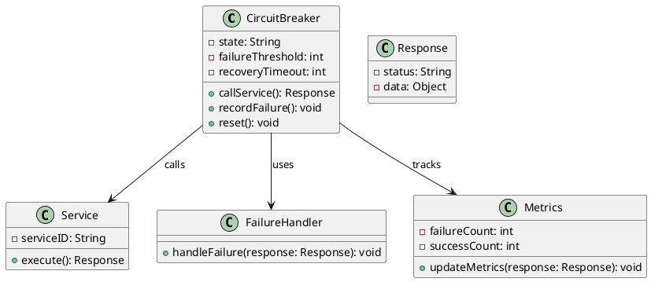

### Sequence Diagram

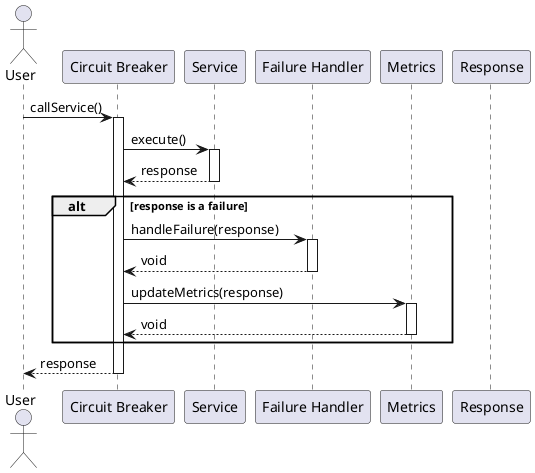

## Service Discovery

Service Discovery is a design pattern used in microservices architecture to enable automatic detection of devices and services on a network. It simplifies the process of locating services and ensures that applications can communicate efficiently and reliably.

### Class Diagram

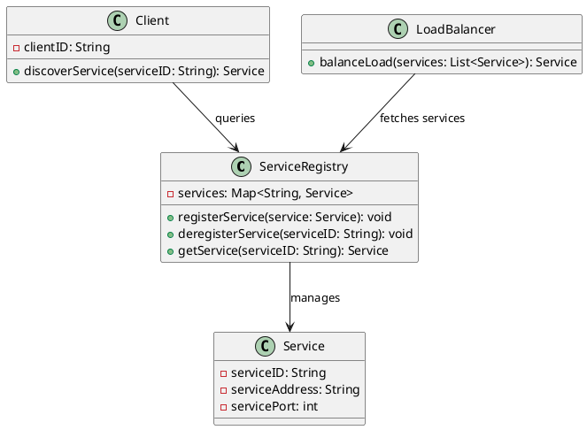

### Sequence Diagram

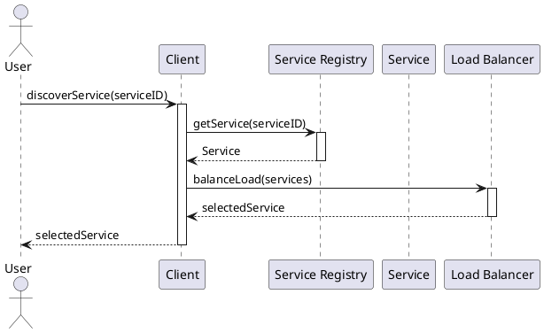

## Bulk Head

The Bulkhead pattern is a design pattern used in software development to improve system resilience by isolating components or services from one another. This approach prevents failures in one part of a system from cascading and affecting other parts, much like bulkheads in a ship that keep water from flooding the entire vessel.

### Class Diagram

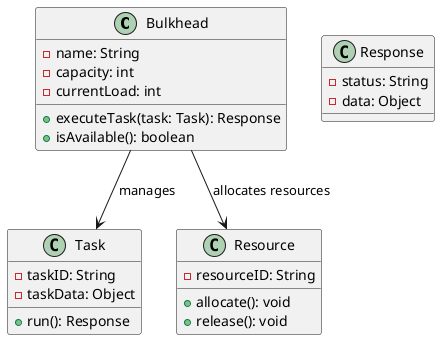

### Sequence Diagram

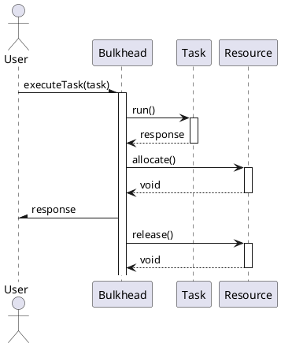

## Stranger Fig

The Strangler Fig pattern is a design pattern used in software development to facilitate the gradual replacement of an existing system with a new one. This approach allows for incremental changes, minimizing risk and ensuring continuous operation during the migration process, much like how a strangler fig tree grows around and eventually replaces its host tree.

### Class Diagram

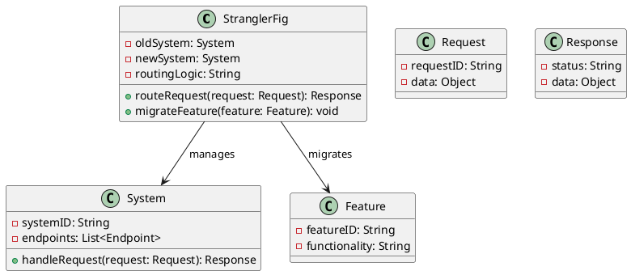

### Sequence Diagram

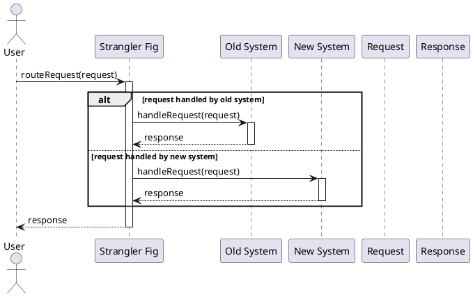

## Database per Service

The Database per Service pattern is a design pattern used in microservices architecture where each microservice has its own dedicated database. This approach ensures data encapsulation, reduces the risk of tight coupling between services, and allows each service to choose the most appropriate database technology for its requirements.

### Class Diagram

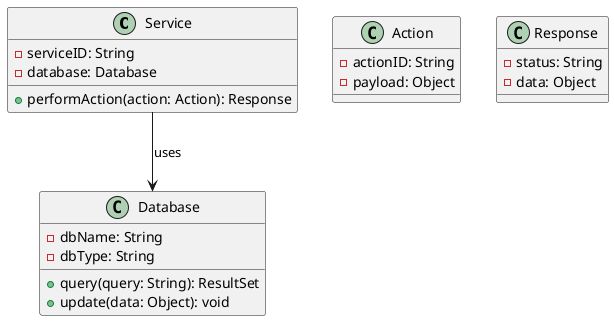

### Sequence Diagram

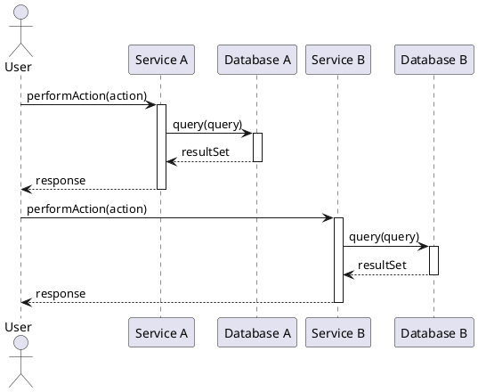

## Message Broker

A Message Broker is a design pattern used in distributed systems to facilitate communication between services by allowing them to send messages to each other without being directly connected. It decouples the sender and receiver, enabling asynchronous communication, load balancing, and improved scalability.

### Class Diagram

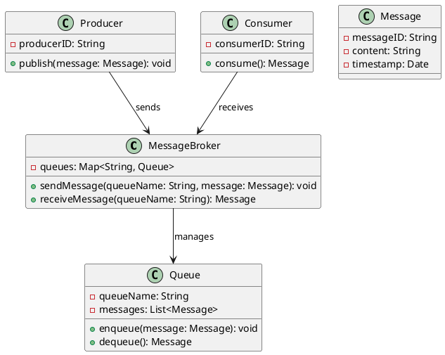

### Sequence Diagram

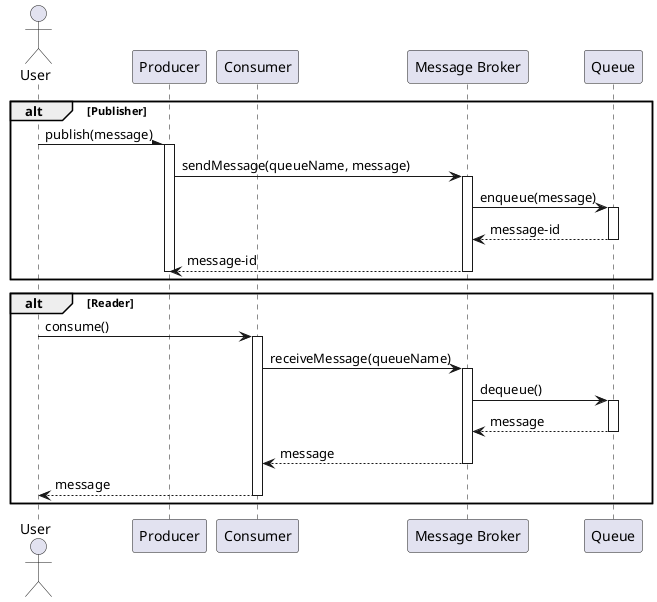

## Health Check

Health Checks are a design pattern used in software systems to monitor the status and performance of services. They provide a way to determine whether a service is operational, allowing for proactive management of service availability, load balancing, and automated recovery.

### Class Diagram

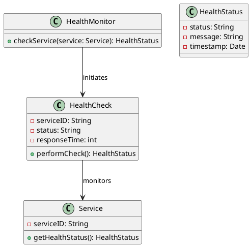

### Sequence Diagram

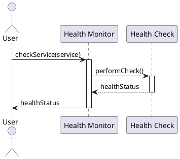