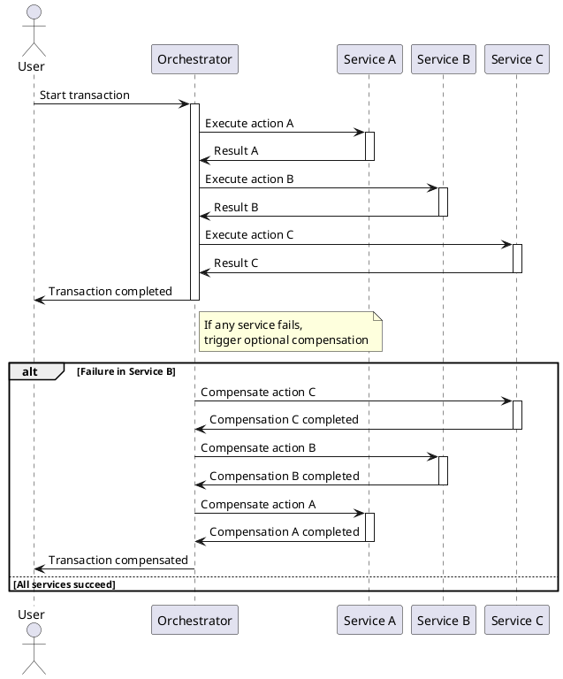
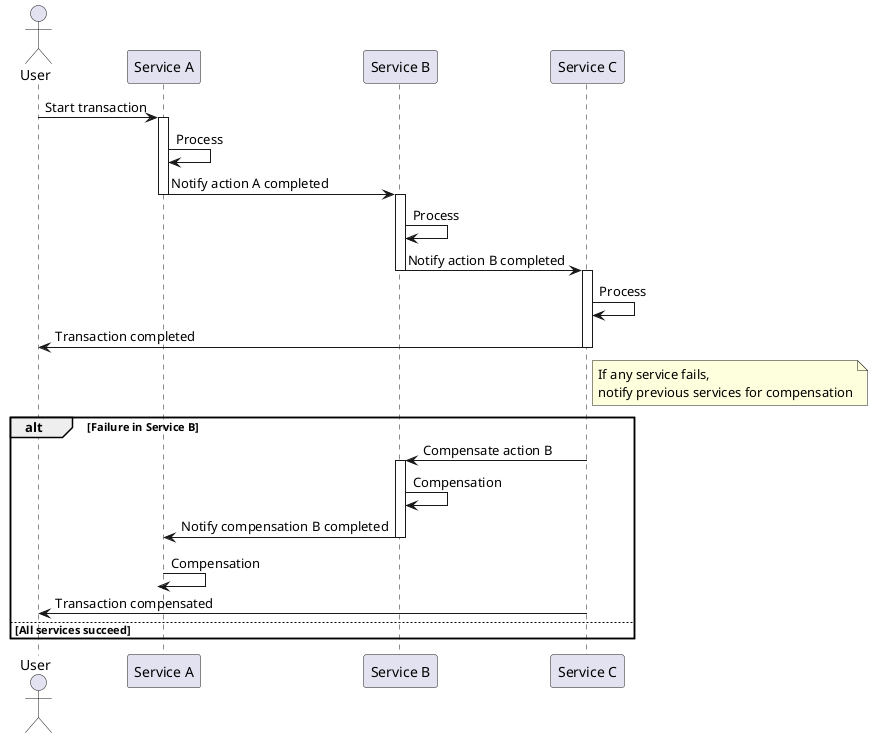
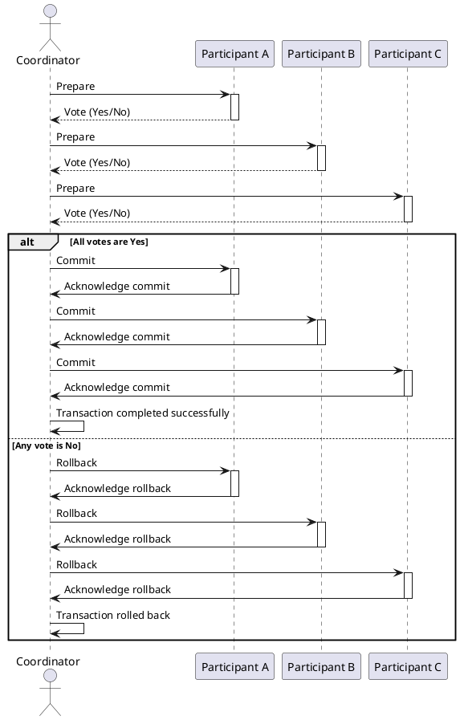
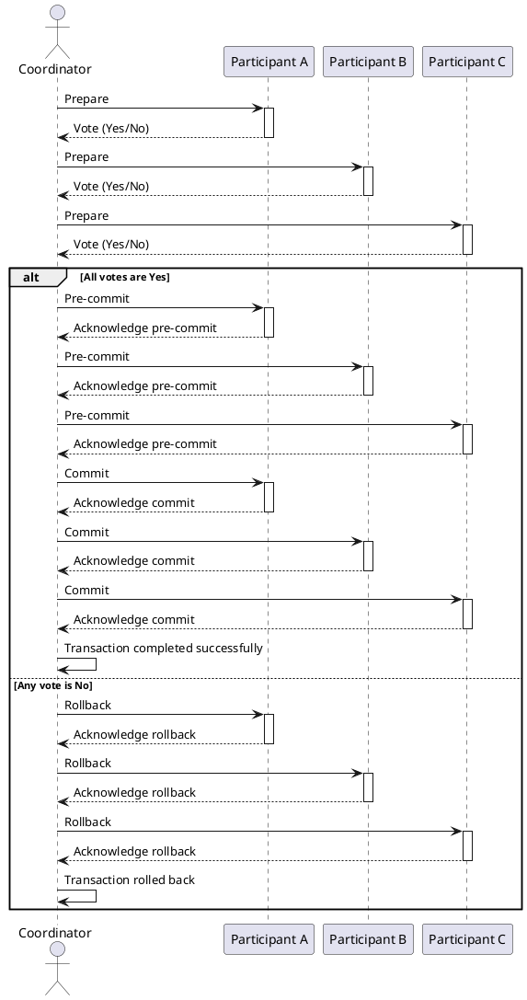
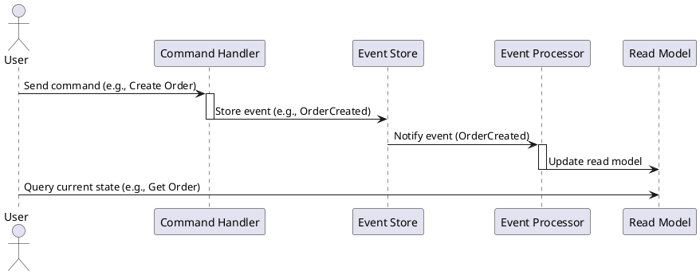
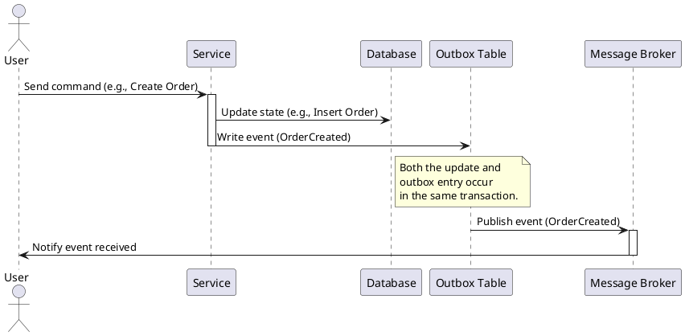

# Transaction Patterns

## Saga

The Saga Design Pattern allows for transaction compensation on failure.

### Saga - Orchestration

### Saga - Choreography

## Two-Phase Commit (2PC)

Two-Phase Commit allows for commit/rollback coordination.

## Three-Phase Commit (3PC)

## Event Sourcing

With Event Sourcing data is stored as a collection of events.  This allows for reconstruction and compensation from any point. 

## Outbox

Outbox provides a means to store the outbound data in a temporary database before publishing final data as an event.

