# Example Diagrams

## Activity Diagram

Activity diagrams are used to visualize the workflow of a process or the activities involved in a system. They illustrate the flow of control and data between activities, making them useful for modeling business processes and system functionalities.

Also know as `Process Map` under BPMN.

[reference](https://plantuml.com/activity-diagram-beta)

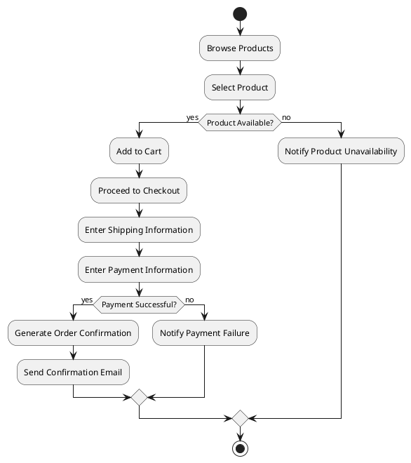

## Class Diagram

Class diagrams are used to model the static structure of a system by depicting its classes, attributes, methods, and the relationships between the classes. They are an essential part of object-oriented design and help in understanding the organization and design of the software.

Also known as `Component Diagram` under C4-Model

[reference](https://plantuml.com/component-diagram)

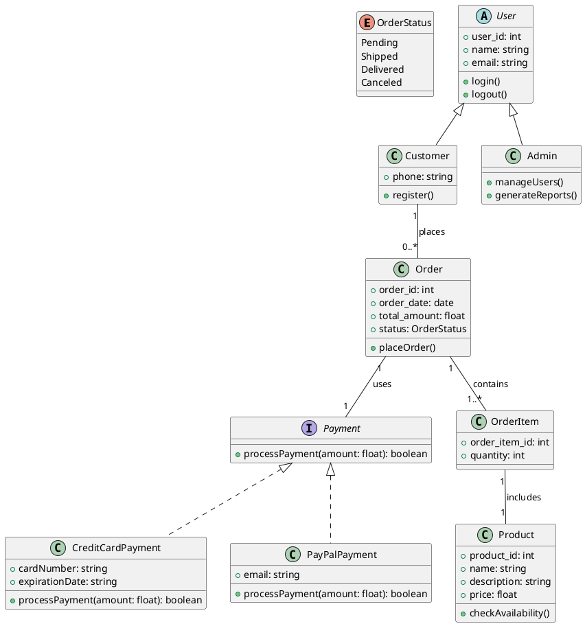

## Collaboration Diagram

Collaboration diagrams (also known as communication diagrams) are used to show how objects interact in a particular scenario, emphasizing the relationships and messages exchanged between them. They focus on the structural organization of the system and how objects collaborate to fulfill a specific task.

Also known as `Choreography Diagram` under BPMN

[reference](https://plantuml.com/component-diagram)

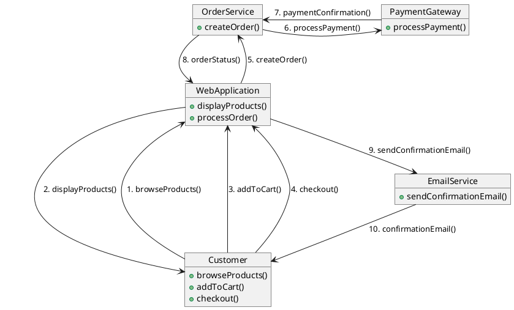

## Component Diagram

Component diagrams are used to visualize the components of a system and their relationships, illustrating how they interact and depend on each other.

Also know as `Value Chain Diagram` under BPMN or `Container Diagram` under C4-Model.

[reference](https://plantuml.com/component-diagram)

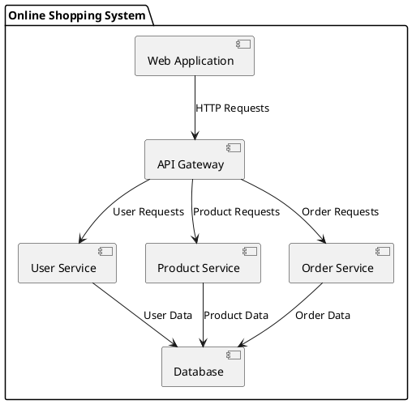

## Cross-Functional Flowchart

A cross-functional flowchart, also known as a swimlane diagram, is a type of flowchart that organizes the activities and processes of a system across different departments or functions within an organization. It visually distinguishes who does what in a process, making it easier to understand the roles and responsibilities of each function involved.

Also know as `Business Process Diagram` under BPMN.

[reference](https://plantuml.com/activity-diagram-beta)

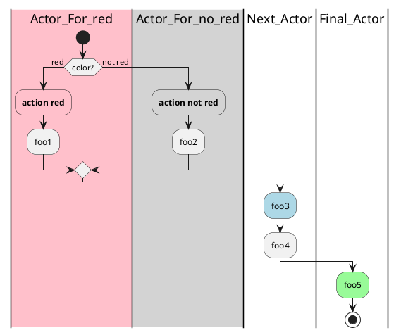

## Data Flow Diagram (DFD)

Data Flow Diagram (DFD) are used to visualize the flow of data within a system, showing how data is processed, stored, and transmitted.

[reference](https://plantuml.com/activity-diagram-beta)

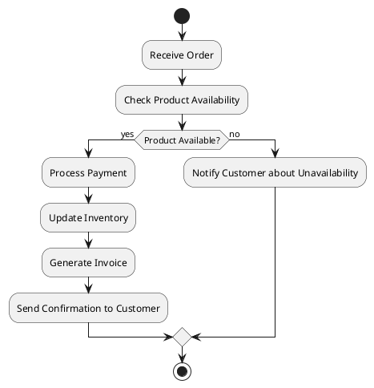

## Data Model - JSON

[reference](https://plantuml.com/json)

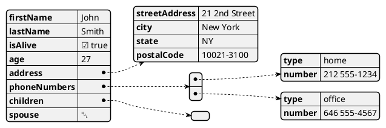

## Data Model - Object

[reference](https://plantuml.com/object-diagram)

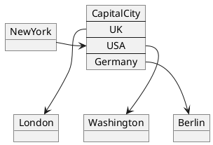

## Data Model - YAML

[reference](https://plantuml.com/yaml)

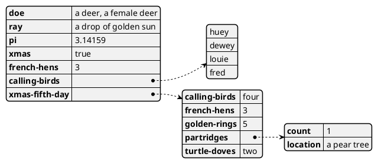

## Deployment Diagram

Deployment diagrams are used to model the physical deployment of artifacts (software components) on nodes (hardware devices) in a system. They illustrate how software components are distributed across different hardware environments, showing the relationships between various components and the physical architecture of the system.

[reference](https://plantuml.com/deployment-diagram)

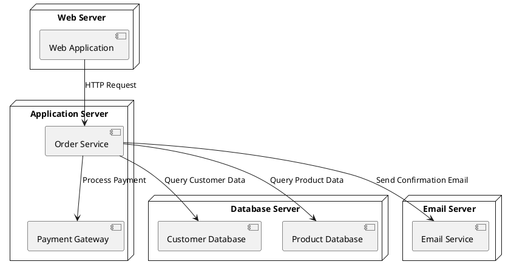

## Entity Relation Diagram (ERD)

Entity Relation Diagram (ERD) are used to design/describe relational databases and data modeling.

[reference](https://plantuml.com/class-diagram)

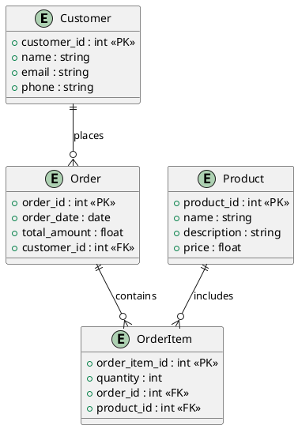

## Gantt Chart

A Gantt chart is a visual project management tool that displays a project's schedule, illustrating the start and finish dates of various elements. It helps in planning, coordinating, and tracking specific tasks within a project.

[reference](https://plantuml.com/gantt-diagram)

```plantuml
@startgantt
[Task1] requires 4 days 
then [Task1.1] requires 4 days
[Task1.1] is 40% completed

[Task1.2] starts at [Task1]'s end and requires 7 days
[Task1.2] is 55% completed

[Task2] requires 5 days
then [Task2.1] requires 4 days
[Task2.1] is 35% completed

[MaxTaskEnd] happens at [Task1.1]'s end
[MaxTaskEnd] happens at [Task1.2]'s end
[MaxTaskEnd] happens at [Task2.1]'s end

@endgantt
```

## Mindmap

A mind map is a visual representation of information that organizes concepts, ideas, and tasks around a central topic. It utilizes a hierarchical structure to show relationships between different elements, making it easier to understand and analyze complex information.

[reference](https://plantuml.com/mindmap-diagram)

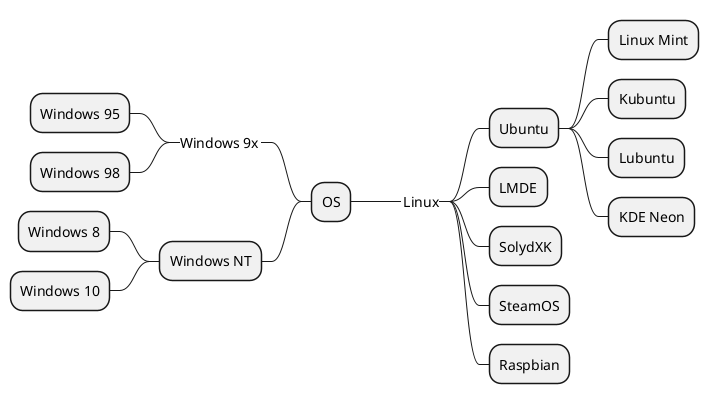

## Network Diagram

Network diagrams are used to represent the layout and connections of a network, illustrating how different devices and components are interconnected. They provide a visual representation of the network's structure, showing how data flows between devices and the relationships between network elements.

[reference](https://plantuml.com/nwdiag)

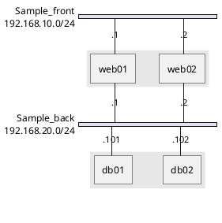

## Package Diagram

A package diagram is a type of UML diagram that organizes classes, interfaces, and other elements into groups called packages. It visually represents the structure of a system by showing how these packages are related to one another and how they depend on each other.

[reference](https://plantuml.com/class-diagram)

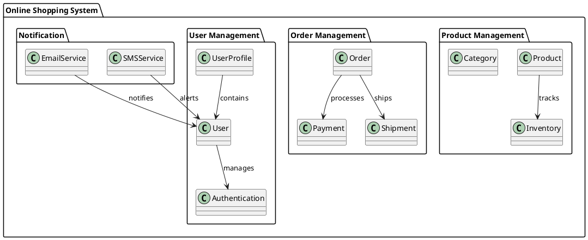

## Sequence Diagram

Sequence diagrams are used to model the interactions between objects or components in a system over time. They depict how messages are exchanged between participants and the order in which these interactions occur, providing a detailed view of the flow of control and data.

Also known as `Orchestration Diagram` or `Collaboration Diagram` under BPMN or `Code Diagram` under C4-Model.

[reference](https://plantuml.com/sequence-diagram)

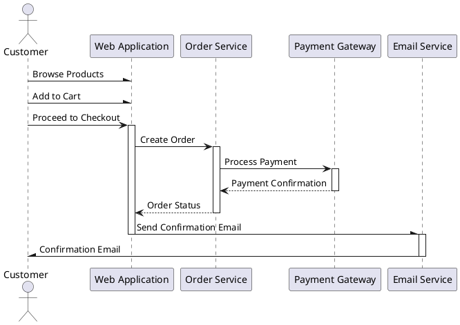

## State Diagram

State diagrams are used to model the dynamic behavior of an object by illustrating its states and the transitions between those states based on events. They help in understanding how an object reacts to different events throughout its lifecycle.

Also know as `Event-Driven Process Chain (EPC)` under BPMN.

[reference](https://plantuml.com/state-diagram)

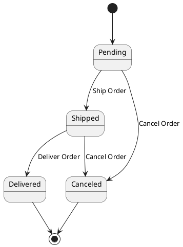

## Timing Diagram

Timing diagrams are used to represent the timing of messages exchanged between objects over a specified period. They focus on the state changes of the system or components over time, illustrating how the timing of events affects the interactions.

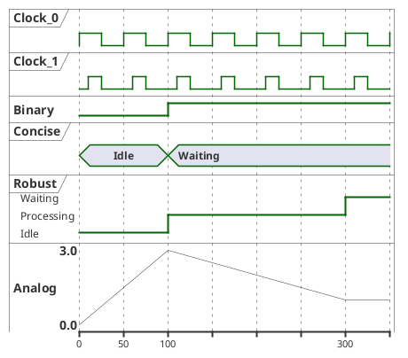

## Use Case Diagram

Use case diagrams are used to visualize the interactions between users (actors) and the system, capturing the functional requirements and depicting how users will interact with the system to achieve specific goals.

Also known as `Context Diagram` under C4-Model

[reference](https://plantuml.com/use-case-diagram)

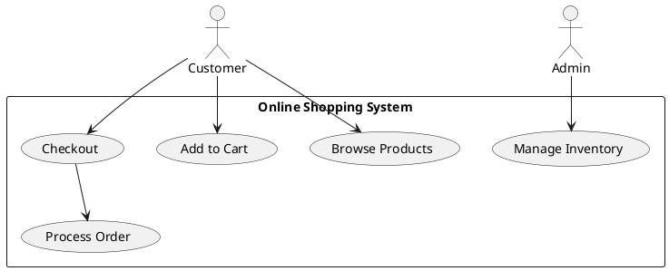

## Wireframe

Wireframes are visual representations of a user interface, showing the layout and structure of a webpage or application without detailed design elements. They help in planning the design and functionality of a product.

[reference](https://plantuml.com/salt)

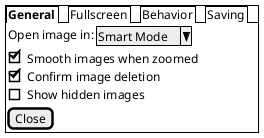

## Work Breakdown Structure (WBS)

A Work Breakdown Structure (WBS) is a hierarchical decomposition of a project into smaller, more manageable components. It helps in organizing the project into tasks and sub-tasks, making it easier to plan, execute, and monitor.

[reference](https://plantuml.com/wbs-diagram)

```plantuml
@startwbs
* Online Shopping Platform Project
** Project Initiation
*** Define Project Scope
*** Identify Stakeholders
*** Conduct Feasibility Study
** Design Phase
*** User Interface Design
**** Create Wireframes
**** Design Mockups
*** Database Design
**** Define Data Model
**** Create ER Diagram
** Development Phase
*** Frontend Development
**** Implement User Authentication
**** Create Product Pages
**** Implement Shopping Cart
*** Backend Development
**** Set Up Web Server
**** Implement Order Processing
**** Integrate Payment Gateway
** Testing Phase
*** Unit Testing
*** Integration Testing
*** User Acceptance Testing
** Deployment Phase
*** Prepare Deployment Environment
*** Deploy Application
*** Monitor Post-Deployment
** Project Closure
*** Document Lessons Learned
*** Release Project Resources
*** Conduct Project Review
@endwbs
```
