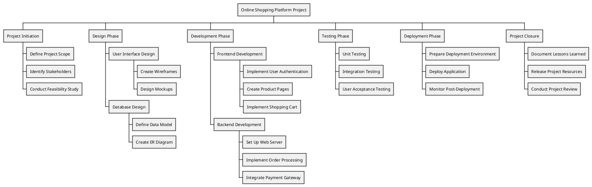

# Example Diagrams

## Activity Diagram

Activity diagrams are used to visualize the workflow of a process or the activities involved in a system. They illustrate the flow of control and data between activities, making them useful for modeling business processes and system functionalities.

[reference](https://plantuml.com/activity-diagram-beta)

## Class Diagram

Class diagrams are used to model the static structure of a system by depicting its classes, attributes, methods, and the relationships between the classes. They are an essential part of object-oriented design and help in understanding the organization and design of the software.

[reference](https://plantuml.com/component-diagram)

## Collaboration Diagram

Collaboration diagrams (also known as communication diagrams) are used to show how objects interact in a particular scenario, emphasizing the relationships and messages exchanged between them. They focus on the structural organization of the system and how objects collaborate to fulfill a specific task.

[reference](https://plantuml.com/component-diagram)

## Component Diagram

Component diagrams are used to visualize the components of a system and their relationships, illustrating how they interact and depend on each other.

## Data Flow Diagram (DFD)

Data Flow Diagram (DFD) are used to visualize the flow of data within a system, showing how data is processed, stored, and transmitted.

[reference](https://plantuml.com/activity-diagram-beta)

## Deployment Diagram

Deployment diagrams are used to model the physical deployment of artifacts (software components) on nodes (hardware devices) in a system. They illustrate how software components are distributed across different hardware environments, showing the relationships between various components and the physical architecture of the system.

[reference](https://plantuml.com/deployment-diagram)

## Entity Relation Diagram (ERD)

Entity Relation Diagram (ERD) are used to design/describe relational databases and data modeling.

[reference](https://plantuml.com/class-diagram)

## Network Diagram

Network diagrams are used to represent the layout and connections of a network, illustrating how different devices and components are interconnected. They provide a visual representation of the network's structure, showing how data flows between devices and the relationships between network elements.

[reference](https://plantuml.com/nwdiag)

## Sequence Diagram

Sequence diagrams are used to model the interactions between objects or components in a system over time. They depict how messages are exchanged between participants and the order in which these interactions occur, providing a detailed view of the flow of control and data.

[reference](https://plantuml.com/sequence-diagram)

## State Diagram

State diagrams are used to model the dynamic behavior of an object by illustrating its states and the transitions between those states based on events. They help in understanding how an object reacts to different events throughout its lifecycle.

[reference](https://plantuml.com/state-diagram)

## Timing Diagram

Timing diagrams are used to represent the timing of messages exchanged between objects over a specified period. They focus on the state changes of the system or components over time, illustrating how the timing of events affects the interactions.

## Use Case Diagram

Use case diagrams are used to visualize the interactions between users (actors) and the system, capturing the functional requirements and depicting how users will interact with the system to achieve specific goals.

[reference](https://plantuml.com/use-case-diagram)

## Wireframe

Wireframes are visual representations of a user interface, showing the layout and structure of a webpage or application without detailed design elements. They help in planning the design and functionality of a product.

[reference](https://plantuml.com/salt)

## Work Breakdown Structure (WBS)

A Work Breakdown Structure (WBS) is a hierarchical decomposition of a project into smaller, more manageable components. It helps in organizing the project into tasks and sub-tasks, making it easier to plan, execute, and monitor.

[reference](https://plantuml.com/wbs-diagram)

