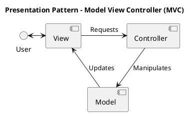
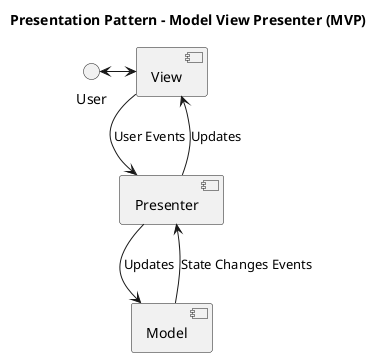
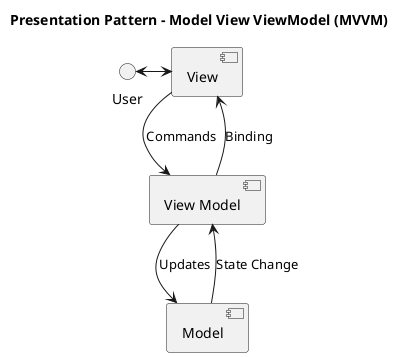
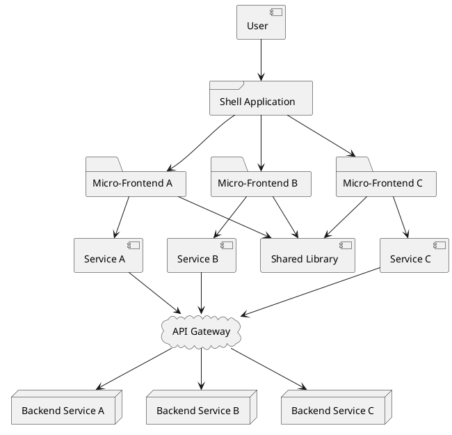

# Presentation Patterns

## Model View Controller (MVC)

## Model View Presenter (MVP)

## Model View ViewModel (MVVM)

## Micro-frontends

Micro-frontends provide a means to loosely integrate a modular frontend application.  By using micro-frontends is is easier to manage application subsystems in though multiple teams as well as more easily manage a mixture of frontend technologies and framework versions.

