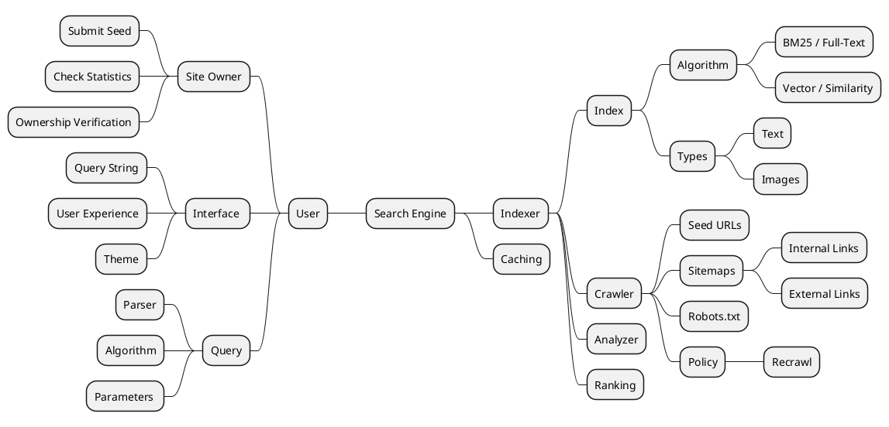
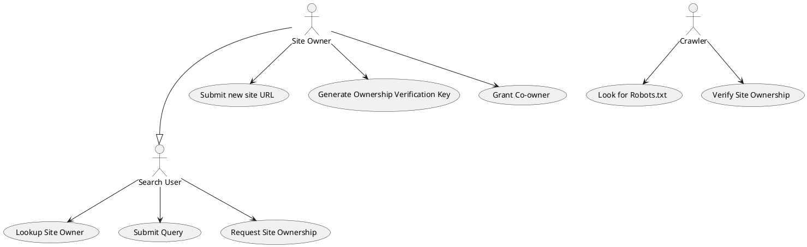

# Web Search Engine

## Summary

Web Search is a common means to navigate the public internet.  Search is part directory service and part library index.

## Ideas

```plantuml
@startmindmap

* Search Engine

++ Indexer

+++ Index
++++ Algorithm
+++++ BM25 / Full-Text
+++++ Vector / Similarity

++++ Types
+++++ Text
+++++ Images

+++ Crawler
++++ Seed URLs
++++ Sitemaps
+++++ Internal Links
+++++ External Links
++++ Robots.txt
++++ Policy
+++++ Recrawl

+++ Analyzer
+++ Ranking

++ Caching

-- User
--- Site Owner
---- Submit Seed
---- Check Statistics
---- Ownership Verification

--- Interface 
---- Query String
---- User Experience
---- Theme

--- Query
---- Parser
---- Algorithm
---- Parameters 

@endmindmap
```

## Use Cases

```plantuml
@startuml

actor "Site Owner" as Owner
actor "Search User" as User
actor Crawler

Owner ---|> User

Owner --> (Submit new site URL)
Owner --> (Generate Ownership Verification Key)
Owner --> (Grant Co-owner)

User --> (Lookup Site Owner)
User --> (Submit Query)
User --> (Request Site Ownership)

Crawler --> (Look for Robots.txt)
Crawler --> (Verify Site Ownership)

@enduml
```