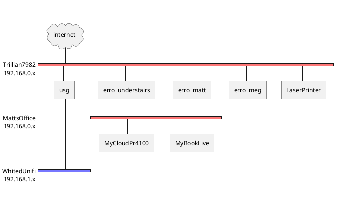
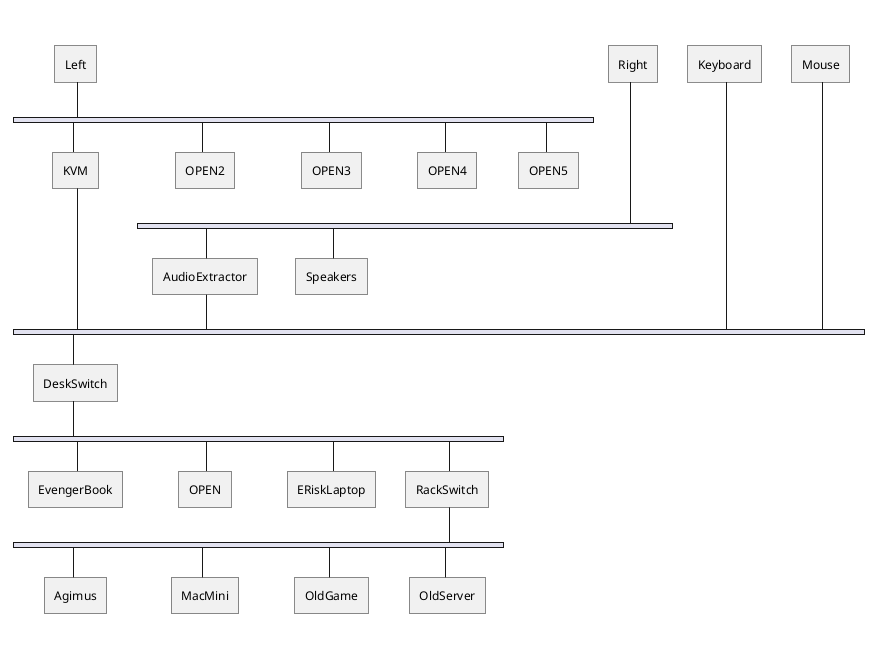
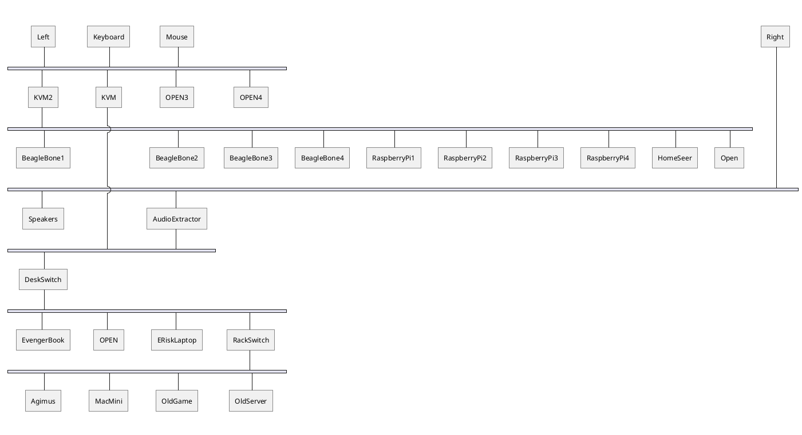

# Home Network

## Layout

```plantuml
@startuml
nwdiag {
    internet [shape = "cloud"];

    network Trillian7982 {
        color = "#ff7777";
        address="192.168.0.x"

        usg;
        erro_understairs
        erro_matt;

        internet;

        erro_meg;
        LaserPrinter
    }

    network MattsOffice {
        color = "#ff7777";
        address="192.168.0.x"

        erro_matt;
        
        MyCloudPr4100;
        MyBookLive;
    }


    network WhitedUnifi {
        color = "#7777ff";
        address="192.168.1.x"
        usg;
    }
}
@enduml
```

## Matt's Desk

```plantuml
@startuml
nwdiag {

    Left;
    Right;
    Keyboard;
    Mouse;

    network {
        Left;

        KVM;
        OPEN2;
        OPEN3;
        OPEN4;
        OPEN5;
    }

    network {
        Right;
        AudioExtractor;
        Speakers;
    }

    network {
        AudioExtractor;
        KVM;
        Keyboard;
        Mouse;   
        
        DeskSwitch    
    }
    network {
        DeskSwitch

        EvengerBook
        OPEN;
        ERiskLaptop;   
        RackSwitch;         
    }
    
    network {  
        RackSwitch;  

        Agimus;
        MacMini;
        OldGame;
        OldServer;
    }
}
@enduml
```

## Matt's Desk - Proposed

```plantuml
@startuml
nwdiag {

    Left;
    Right;
    Keyboard;
    Mouse;

    network {
        Left;
        Keyboard;
        Mouse;   

        KVM2;
        KVM;
        OPEN3;
        OPEN4;
    }

    network {
        KVM2;

        BeagleBone1;
        BeagleBone2;
        BeagleBone3;
        BeagleBone4;

        RaspberryPi1;
        RaspberryPi2;
        RaspberryPi3;
        RaspberryPi4;

        HomeSeer;
        Open;
    }

    network {
        Right;
        Speakers;
        AudioExtractor;
    }

    network {
        AudioExtractor;
        KVM;
        
        DeskSwitch    
    }
    network {
        DeskSwitch

        EvengerBook
        OPEN;
        ERiskLaptop;   
        RackSwitch;         
    }
    
    network {  
        RackSwitch;  

        Agimus;
        MacMini;
        OldGame;
        OldServer;
    }
}
@enduml
```