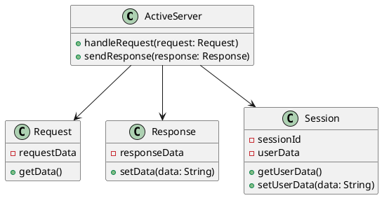
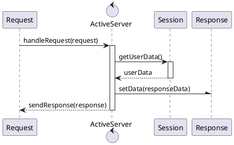
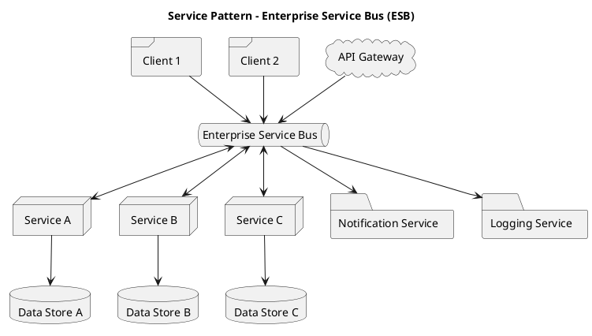
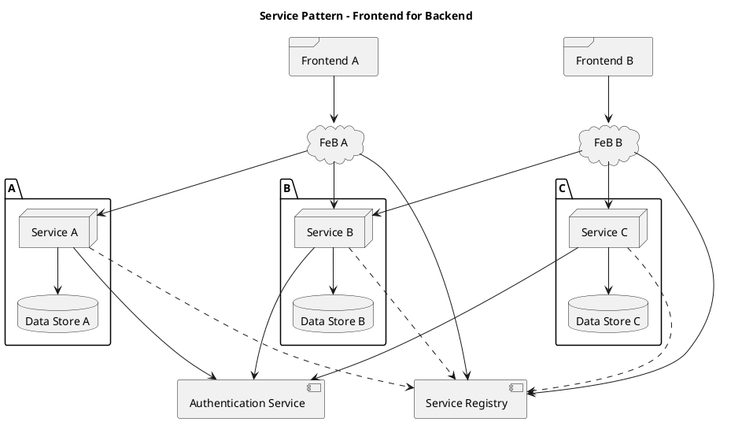
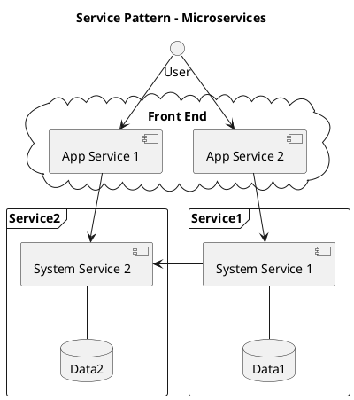
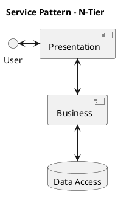
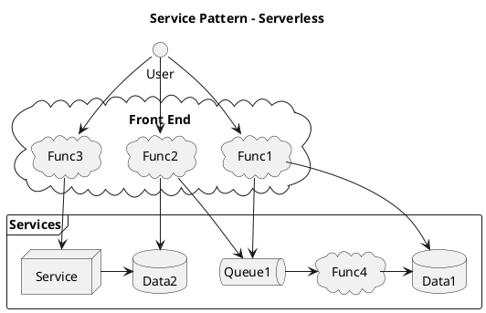
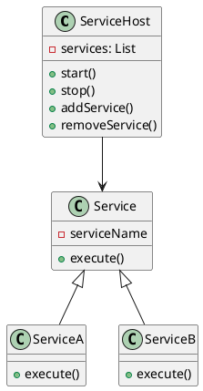
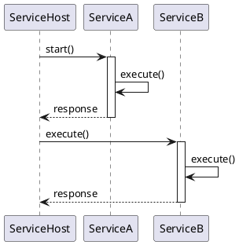
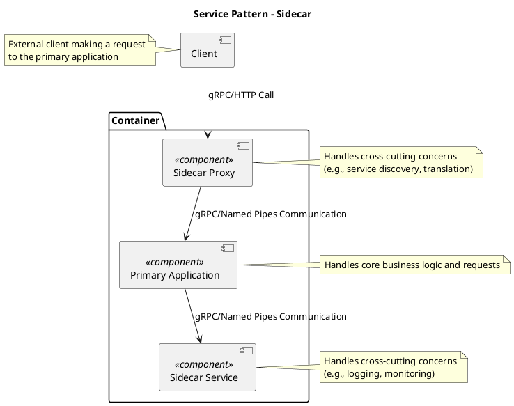

# Service Patterns

## Active Service

An Active Server is an application component that actively processes incoming requests, managing session state and returning responses while orchestrating interactions between services and resources.

### Class Diagram

### Sequence Diagram

## Enterprise Service Bus (ESB)

An Enterprise Service Bus or ESB provides routing, transformation, mediation and much more.  The primary intention of an ESB is to separate the service dependencies between application within a particular enterprise.

### Component Diagram

## Frontend for Backend

`Frontend for Backend` providers a means to desegregate backend services from frontend applications.  Features such as versioning, translation, authentication and more may be controlled independently per frontend application allowing for easier maintenance and deployments.

### Component Diagram

## Microservices

## N-Tier, Layered

## Serverless

## Service Host

A Service Host is an application component that manages the lifecycle and communication of multiple independent services, providing a centralized interface for client interactions.

### Class Diagram

### Sequence Diagram

## Sidecar

A Sidecar is an application component that is an external process in the same container or a secondary process in a related container to manage some cross cutting concern.  

