# Concurrency Patterns

## Actor Model

The Actor Model is a concurrency design pattern used in software development that treats "actors" as the fundamental units of computation. Each actor encapsulates its state and behavior, communicates with other actors through asynchronous message passing, and operates independently. This pattern simplifies the development of concurrent and distributed systems, enabling better scalability and fault tolerance.

### Class Diagram

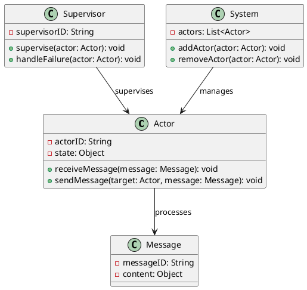

### Sequence Diagram

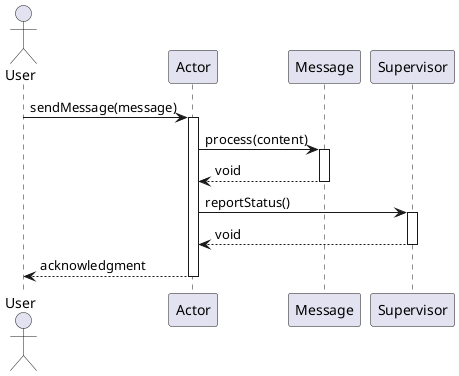

## Async/Await

Async/Await is a programming pattern that simplifies asynchronous programming by allowing developers to write asynchronous code in a synchronous style. It provides a way to work with promises more easily, improving code readability and maintainability while handling asynchronous operations without blocking the main execution thread.

This patterns is also known as Awaitable Futures and Promises.

### Class Diagram

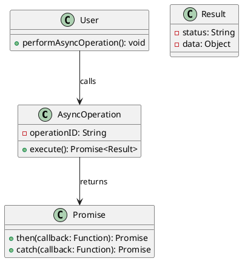

### Sequence Diagram

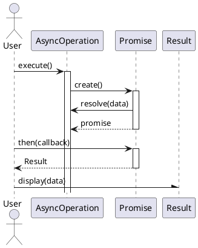

## Fork/Join

The Fork/Join pattern is a design pattern used in parallel programming to divide a task into smaller subtasks that can be executed concurrently (forked) and then combined (joined) to produce a final result. This pattern helps to efficiently utilize system resources and improve performance by breaking down complex tasks into manageable parts that can be processed in parallel.

### Class Diagram

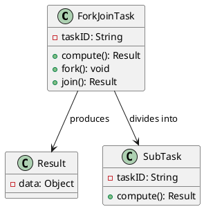

### Activity Diagram

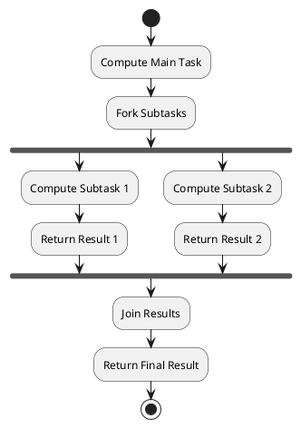

## Pipelining

Pipelining is a design pattern used in software development to process data in stages, where each stage performs a specific transformation or operation on the data. This approach allows for concurrent processing of multiple data items, improving throughput and resource utilization by minimizing idle time between processing steps.

### Class Diagram

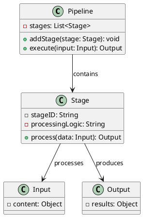

### Sequence Diagram

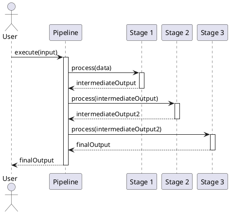

## Producer/Consumer

The Producer/Consumer pattern is a design pattern used in concurrent programming to manage the flow of data between two or more processes (producers and consumers) that operate asynchronously. Producers generate data and place it in a shared buffer, while consumers retrieve and process the data from the buffer. This pattern helps to decouple the production and consumption of data, allowing for more flexible and scalable applications.

### Class Diagram

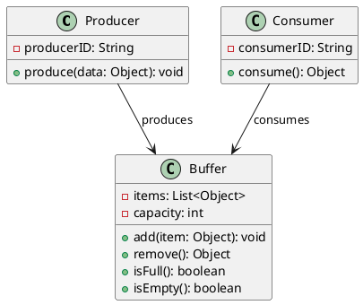

### Sequence Diagram

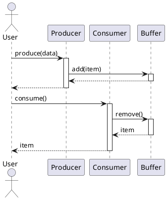

## Read/Write Lock

Read/Write Locks are a concurrency control pattern used to manage access to shared resources in a multithreaded environment. This pattern allows multiple readers to access the resource simultaneously while ensuring that only one writer can modify the resource at a time. This improves performance in scenarios where reads are more frequent than writes.

### Class Diagram

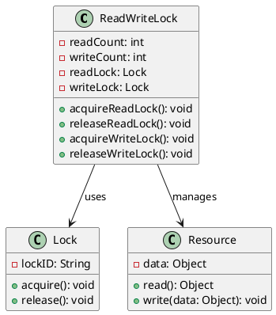

### Sequence Diagram

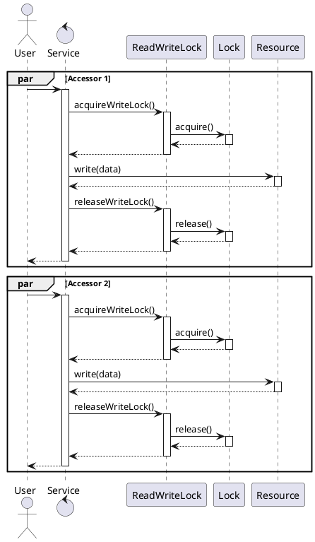
