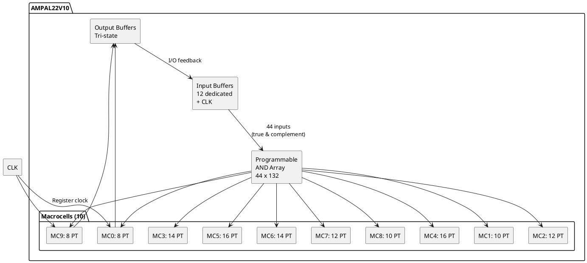

# AMPAL22V10APC

**Programmable Array Logic (PAL) Device**

## Device Information

| Field | Value |
|-------|-------|
| Manufacturer | AMD (Advanced Micro Devices) |
| Part Number | AMPAL22V10APC |
| Type | PAL (Programmable Array Logic) |
| Package | PDIP-24 |
| Technology | Bipolar fuse (OTP) |
| Date Acquired | |
| Quantity | |

## Part Number Breakdown

```
AMPAL22V10APC
  │   │  │││
  │   │  ││└─ C = Commercial temp (0°C to +75°C)
  │   │  │└── P = Plastic DIP package
  │   │  └─── A = Speed grade (15ns for -A)
  │   └────── 22V10 = 22 inputs, 10 Versatile outputs
  └────────── AMPAL = AMD PAL
```

## Specifications

| Specification | Value |
|--------------|-------|
| Architecture | PAL (AND-OR array) |
| Inputs | 12 dedicated + 10 I/O feedback |
| Outputs | 10 (configurable) |
| Macrocells | 10 |
| Product Terms | 132 total (8-16 per output) |
| Propagation Delay | 15 ns (-A grade) |
| fMAX | 50 MHz |
| Operating Voltage | 5V ± 10% |
| Technology | Bipolar (one-time programmable) |

## Speed Grades

| Suffix | tPD (ns) | fMAX (MHz) |
|--------|----------|------------|
| -A | 15 | 50 |
| -B | 25 | 33 |
| -C | 35 | 25 |

## Pinout (PDIP-24)

```
            AMPAL22V10APC
              +---U---+
         CLK |1    24| VCC
          I0 |2    23| I/O9
          I1 |3    22| I/O8
          I2 |4    21| I/O7
          I3 |5    20| I/O6
          I4 |6    19| I/O5
          I5 |7    18| I/O4
          I6 |8    17| I/O3
          I7 |9    16| I/O2
          I8 |10   15| I/O1
          I9 |11   14| I/O0
         GND |12   13| I10
              +------+
```

### Pin Functions

| Pin | Name | Function |
|-----|------|----------|
| 1 | CLK/I | Clock input (or general input) |
| 2-11 | I0-I9 | Dedicated inputs |
| 12 | GND | Ground |
| 13 | I10 | Dedicated input |
| 14-23 | I/O0-I/O9 | Programmable I/O (active low OE) |
| 24 | VCC | Power (+5V) |

## 22V10 Architecture

### Macrocell Structure

Each of the 10 macrocells contains:
- Programmable AND array (44 inputs)
- OR gate (variable product terms)
- D flip-flop with async reset
- Output polarity select (XOR)
- Tri-state output buffer
- Programmable output enable

### Product Term Distribution

| Output | Product Terms | Typical Use |
|--------|---------------|-------------|
| I/O0 | 8 | Simple logic |
| I/O1 | 10 | Medium logic |
| I/O2 | 12 | Medium logic |
| I/O3 | 14 | Complex logic |
| I/O4 | 16 | Most complex |
| I/O5 | 16 | Most complex |
| I/O6 | 14 | Complex logic |
| I/O7 | 12 | Medium logic |
| I/O8 | 10 | Medium logic |
| I/O9 | 8 | Simple logic |

**Total**: 132 product terms (8+10+12+14+16+16+14+12+10+8)

## Block Diagram



## Macrocell Detail

```
                    Product Terms (8-16)
                           │
                    ┌──────┴──────┐
                    │   OR Gate   │
                    └──────┬──────┘
                           │
              ┌────────────┼────────────┐
              │            │            │
         ┌────┴────┐  ┌────┴────┐  ┌────┴────┐
         │   AR    │  │   S0    │  │   S1    │
         │ (Reset) │  │(Config) │  │(Config) │
         └────┬────┘  └────┬────┘  └────┬────┘
              │            │            │
              │       ┌────┴────────────┴────┐
              │       │   Output Select      │
              │       │   (Reg/Comb/Pol)     │
              │       └──────────┬───────────┘
              │                  │
         ┌────┴────┐        ┌────┴────┐
         │  D-FF   │───────►│  XOR    │
         │         │        │(Polarity│
         └────┬────┘        └────┬────┘
              │                  │
         CLK ─┘             ┌────┴────┐
                            │Tri-State│
                            │ Buffer  │
                            └────┬────┘
                                 │
                            ┌────┴────┐
                            │   OE    │──── (From PT)
                            └─────────┘
                                 │
                              Output
```

## Output Configurations

Each macrocell can be configured as:

| Mode | S1 | S0 | Description |
|------|----|----|-------------|
| Registered, Active Low | 0 | 0 | D-FF output, inverted |
| Registered, Active High | 0 | 1 | D-FF output, non-inverted |
| Combinatorial, Active Low | 1 | 0 | Direct, inverted |
| Combinatorial, Active High | 1 | 1 | Direct, non-inverted |

## Programming

### One-Time Programmable (OTP)

The AMPAL22V10 uses bipolar fuse technology:
- **Cannot be erased** - Once programmed, permanent
- **Fuses are "blown"** to create logic
- **Verify after programming** - Critical!

### Programmers

| Programmer | Support | Notes |
|------------|---------|-------|
| TL866II Plus | Yes | Universal programmer |
| XGecu T48/T56 | Yes | Newer universal |
| Data I/O | Yes | Professional |
| ALL-11 | Yes | Gang programmer |

### Programming Voltage

| Parameter | Value |
|-----------|-------|
| VPP | 11.5V - 12.5V |
| VCC | 5V |
| Program pulse | ~100µs |

## Design Software

### WinCUPL (Free)

```cupl
Name     22V10_Example;
PartNo   AMPAL22V10APC;
Date     2024;
Designer Your Name;
Company  None;
Assembly None;
Location None;
Device   p22v10;

/* Inputs */
Pin 1  = CLK;
Pin 2  = A;
Pin 3  = B;
Pin 4  = C;
Pin 5  = D;

/* Outputs */
Pin 23 = Y0;
Pin 22 = Y1;
Pin 21 = Q0;  /* Registered */

/* Combinatorial outputs */
Y0 = A & B;
Y1 = A # B;

/* Registered output */
Q0.D = C & D;
Q0.AR = !A;    /* Async reset */
```

### GALasm (Open Source)

```
GAL22V10
Example

CLK  A  B  C  D  NC NC NC NC NC NC GND
NC  Y0 Y1 Q0 NC NC NC NC NC NC NC VCC

Y0 = A * B
Y1 = A + B

Q0.R = C * D
```

### PALASM / ABEL

Also supported by various legacy tools.

## JEDEC File Structure

The programming file contains:
- Fuse map (5828 fuses for 22V10)
- Checksum
- Device identification

```
*QP24*        /* 24-pin device */
*QF5828*      /* 5828 fuses */
*L00000 11111111... /* Fuse data */
*C1234*       /* Checksum */
```

## Timing Parameters

| Parameter | Symbol | -A | -B | -C | Unit |
|-----------|--------|----|----|----|----- |
| Propagation (comb) | tPD | 15 | 25 | 35 | ns |
| Clock to output | tCO | 10 | 15 | 20 | ns |
| Setup time | tSU | 15 | 20 | 25 | ns |
| Hold time | tH | 0 | 0 | 0 | ns |
| Clock width (high) | tWH | 10 | 15 | 20 | ns |
| Clock width (low) | tWL | 10 | 15 | 20 | ns |
| Max frequency | fMAX | 50 | 33 | 25 | MHz |

## Documentation

- [AMPAL22V10 Datasheet](https://www.alldatasheet.com/datasheet-pdf/pdf/107093/AMD/PALCE22V10.html)
- [PAL Device Handbook](https://archive.org/details/bitsavers_aboriesGAta1988_26929880)
- [WinCUPL Manual](https://ww1.microchip.com/downloads/en/DeviceDoc/doc0737.pdf)

## Comparison: PAL vs GAL

| Feature | PAL (AMPAL22V10) | GAL (ATF22V10C) |
|---------|------------------|-----------------|
| Technology | Bipolar fuse | EEPROM |
| Reprogrammable | No (OTP) | Yes (100+ cycles) |
| Speed | Faster | Comparable |
| Power | Higher | Lower |
| Availability | Legacy | Current production |
| Price | Obsolete | Available |

## Compatible Replacements

The AMPAL22V10 can be replaced by:

| Part | Manufacturer | Notes |
|------|--------------|-------|
| ATF22V10C | Microchip | EEPROM, reprogrammable |
| GAL22V10D | Lattice | EEPROM, reprogrammable |
| PALCE22V10 | AMD/Vantis | CMOS PAL |

**Note**: GAL replacements are pin-compatible and use the same JEDEC files.

## Common Applications

- Glue logic
- Address decoding
- State machines
- Bus interfaces
- Control logic
- Legacy system repair
- Vintage computer cloning

## 22V10 vs Other PALs

| Device | Inputs | Outputs | Product Terms | Registered |
|--------|--------|---------|---------------|------------|
| 16L8 | 10 | 8 | 64 | No |
| 16R8 | 8 | 8 | 64 | All |
| 20L8 | 14 | 8 | 64 | No |
| **22V10** | **12+10** | **10** | **132** | **Configurable** |

## Notes

- **OTP device** - Cannot be erased; use GAL for development
- **Legacy part** - AMD no longer manufactures PALs
- **Pin compatible** - Direct replacement with ATF22V10C
- **5V only** - No 3.3V version exists
- **Async reset** - Each macrocell has async reset capability
- **Variable product terms** - Center outputs have more terms
- **Polarity control** - Each output can be active high or low
- **Security fuse** - Can protect design from readback

## Development Workflow

```
1. Design logic (schematic or HDL)
        ↓
2. Write CUPL/ABEL/PALASM source
        ↓
3. Compile to JEDEC file
        ↓
4. Test in simulator (optional)
        ↓
5. Program GAL22V10 for testing (erasable)
        ↓
6. Verify design works
        ↓
7. Program final AMPAL22V10 (permanent)
        ↓
8. Verify programmed device
```

## Troubleshooting

### Programming Fails
- Verify correct device selected in programmer
- Check VPP voltage (11.5-12.5V)
- Try slower programming speed
- Device may already be programmed (OTP)

### Output Always High/Low
- Check output enable configuration
- Verify pin assignments in source
- Check for stuck-at faults

### Timing Issues
- Verify speed grade matches design
- Add pipeline registers if needed
- Check for race conditions

## Local Files

### Documentation
- `AMPAL22V10_Datasheet.pdf` - Device datasheet
- `WinCUPL_Manual.pdf` - Design software manual
