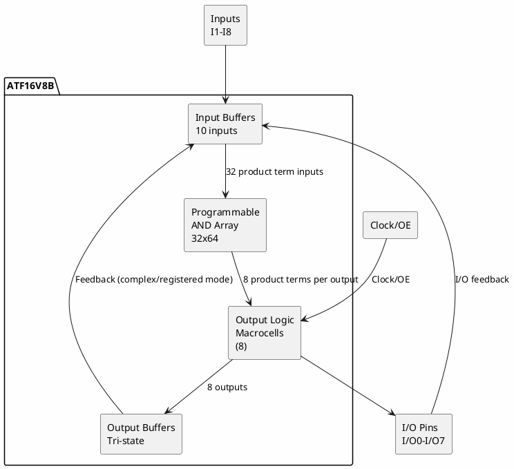

# ATF16V8B

**Simple Programmable Logic Device (SPLD/GAL)**

## Device Information

| Field | Value |
|-------|-------|
| Manufacturer | Microchip (formerly Atmel) |
| Part Number | ATF16V8B / ATF16V8BQL |
| Type | GAL (Generic Array Logic) |
| Package | DIP-20, PLCC-20, SOIC-20 |
| Date Acquired | |
| Quantity | |

## Specifications

| Specification | Value |
|--------------|-------|
| Architecture | PAL/GAL SPLD |
| Logic Macrocells | 8 |
| Inputs | 10 dedicated + 8 I/O |
| Outputs | 8 (configurable) |
| Product Terms | 64 (8 per output) |
| Propagation Delay | 5-15 ns (speed grade) |
| Operating Voltage | 5V |
| Technology | EEPROM (reprogrammable) |
| Erase/Program Cycles | 100+ |

## Speed Grades

| Part Number | tPD (ns) | fMAX (MHz) |
|-------------|----------|------------|
| ATF16V8B-15 | 15 | 62.5 |
| ATF16V8B-10 | 10 | 83.3 |
| ATF16V8B-7 | 7 | 125 |
| ATF16V8BQL-15 | 15 | 62.5 (low power) |

## Pinout (DIP-20)

```
              ATF16V8B
              +---U---+
        CLK/I |1    20| VCC
          I1  |2    19| I/O7
          I2  |3    18| I/O6
          I3  |4    17| I/O5
          I4  |5    16| I/O4
          I5  |6    15| I/O3
          I6  |7    14| I/O2
          I7  |8    13| I/O1
          I8  |9    12| I/O0
         GND  |10   11| OE/I
              +-------+
```

### Pin Functions

| Pin | Name | Function |
|-----|------|----------|
| 1 | CLK/I | Clock input or general input |
| 2-9 | I1-I8 | Dedicated inputs |
| 10 | GND | Ground |
| 11 | OE/I | Output enable or input |
| 12-19 | I/O0-I/O7 | Programmable I/O |
| 20 | VCC | Power (+5V) |

## Operating Modes

The ATF16V8B supports three operating modes:

### Simple Mode
- All outputs are combinatorial
- Pin 1 is input, Pin 11 is input
- No feedback from outputs

### Complex Mode
- Outputs can be combinatorial or registered
- Pin 1 is clock, Pin 11 is output enable
- Output feedback available

### Registered Mode
- All outputs are registered (flip-flops)
- Pin 1 is clock, Pin 11 is output enable
- Synchronous operation

## Block Diagram



## Programming

| Method | Tools |
|--------|-------|
| Parallel Programmer | TL866II Plus, Wellon, Xeltek |
| Dedicated GAL Programmer | GALEP, ALL-11 |

### Programming Software

| Software | Description |
|----------|-------------|
| WinCUPL | Atmel's design software (free) |
| CUPL | Command-line compiler |
| GALasm | Open-source GAL assembler |
| ispLEVER Classic | Lattice tools (for ATF series) |

## Design Flow

```
1. Write logic equations (CUPL/Abel)
          ↓
2. Compile to JEDEC file
          ↓
3. Program with programmer
          ↓
4. Verify device
```

## CUPL Example

```cupl
Name     Example;
PartNo   ATF16V8B;
Date     2024;
Designer Your Name;
Company  None;
Assembly None;
Location None;
Device   g16v8a;

/* Inputs */
Pin 2 = A;
Pin 3 = B;
Pin 4 = C;
Pin 5 = D;

/* Outputs */
Pin 19 = Y1;
Pin 18 = Y2;
Pin 17 = Y3;

/* Logic Equations */
Y1 = A & B;           /* AND gate */
Y2 = A # B;           /* OR gate */
Y3 = !A;              /* NOT gate */
```

## Documentation

- [ATF16V8B Datasheet](https://ww1.microchip.com/downloads/en/DeviceDoc/Atmel-0364-PLD-ATF16V8B-Datasheet.pdf)
- [WinCUPL User Manual](https://ww1.microchip.com/downloads/en/DeviceDoc/doc0737.pdf)
- [CUPL Programmer's Reference](https://ww1.microchip.com/downloads/en/DeviceDoc/doc0738.pdf)

## Software & Tools

### Design Software
- **WinCUPL** - Free from Microchip
- **GALasm** - Open source (galasm.sourceforge.net)

### Programmers
- **TL866II Plus** - Popular universal programmer
- **XGecu T48/T56** - Newer universal programmer
- **Wellon VP-598** - Professional programmer

## Common Uses

- Glue logic replacement
- Address decoding
- State machines
- Legacy system repair
- Vintage computer restoration
- Educational projects

## Comparison with Other PLDs

| Device | Type | Macrocells | I/O | Speed |
|--------|------|------------|-----|-------|
| ATF16V8B | GAL | 8 | 8 | 7-15ns |
| ATF22V10C | GAL | 10 | 10 | 5-15ns |
| ATF750C | CPLD | 10 | 22 | 5-15ns |
| XC9536 | CPLD | 36 | 34 | 5ns |

## Notes

- **GAL = Reprogrammable PAL** - Can be erased and reprogrammed
- **5V only** - Not 3.3V compatible
- **Replace 16L8/16R8** - Pin compatible with older PALs
- **CUPL syntax** - Industry standard PLD language
- **Security bit** - Can prevent readback (one-time)
- **Still manufactured** - Available from Microchip

## Legacy Compatibility

The ATF16V8B can replace:

| Part | Description |
|------|-------------|
| PAL16L8 | Combinatorial PAL |
| PAL16R8 | Registered PAL |
| PAL16R6 | 6 registered, 2 combinatorial |
| PAL16R4 | 4 registered, 4 combinatorial |
| GAL16V8 | Other manufacturers |

## Local Files

### Documentation
- `ATF16V8B_Datasheet.pdf` - Main datasheet
- `WinCUPL_Manual.pdf` - Design software manual
