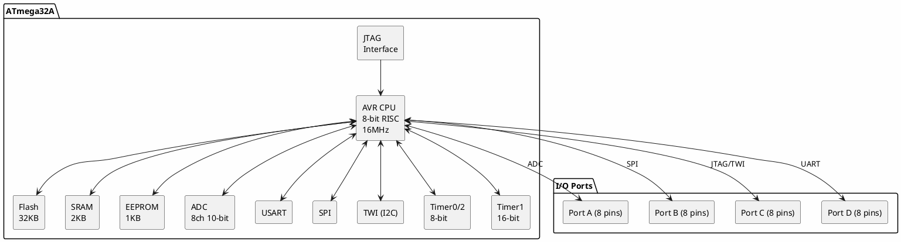

# ATmega32 / ATmega32A

**8-bit AVR Microcontroller**

## Device Information

| Field | Value |
|-------|-------|
| Manufacturer | Microchip (formerly Atmel) |
| Part Number | ATmega32A |
| Package | DIP-40, TQFP-44, QFN-44 |
| Date Acquired | |
| Quantity | |

## Specifications

| Specification | Value |
|--------------|-------|
| Architecture | AVR 8-bit RISC |
| Clock Speed | Up to 16 MHz |
| Flash | 32 KB |
| SRAM | 2 KB |
| EEPROM | 1 KB |
| GPIO | 32 |
| Operating Voltage | 2.7-5.5V |
| ADC | 8 channels, 10-bit |

## Peripherals

| Peripheral | Quantity/Details |
|-----------|------------------|
| Timer/Counter | 3 (2x 8-bit, 1x 16-bit) |
| PWM | 4 channels |
| UART | 1 (hardware USART) |
| SPI | 1 (master/slave) |
| I2C (TWI) | 1 |
| ADC | 8 channels (10-bit) |
| Analog Comparator | 1 |
| External Interrupts | 3 (INT0, INT1, INT2) |
| JTAG | Yes (Port C) |

## Pinout (DIP-40)

```
                    ATmega32A
                    +----U----+
     (T0/XCK) PB0   |1      40| PA0 (ADC0)
        (T1) PB1    |2      39| PA1 (ADC1)
   (INT2/AIN0) PB2  |3      38| PA2 (ADC2)
   (OC0/AIN1) PB3   |4      37| PA3 (ADC3)
        (SS) PB4    |5      36| PA4 (ADC4)
      (MOSI) PB5    |6      35| PA5 (ADC5)
      (MISO) PB6    |7      34| PA6 (ADC6)
       (SCK) PB7    |8      33| PA7 (ADC7)
           RESET    |9      32| AREF
             VCC    |10     31| GND
             GND    |11     30| AVCC
           XTAL2    |12     29| PC7 (TOSC2)
           XTAL1    |13     28| PC6 (TOSC1)
       (RXD) PD0    |14     27| PC5 (TDI)
       (TXD) PD1    |15     26| PC4 (TDO)
      (INT0) PD2    |16     25| PC3 (TMS)
      (INT1) PD3    |17     24| PC2 (TCK)
      (OC1B) PD4    |18     23| PC1 (SDA)
      (OC1A) PD5    |19     22| PC0 (SCL)
       (ICP) PD6    |20     21| PD7 (OC2)
                    +---------+
```

## Block Diagram



## Programming

| Method | Tools |
|--------|-------|
| ISP | USBasp, AVR ISP mkII |
| JTAG | Atmel-ICE, AVR Dragon, JTAGICE |
| Bootloader | With custom bootloader |
| Parallel | STK500, legacy programmers |

### ISP Wiring

| Programmer | ATmega32A |
|------------|-----------|
| MOSI | PB5 (pin 6) |
| MISO | PB6 (pin 7) |
| SCK | PB7 (pin 8) |
| RESET | RESET (pin 9) |
| VCC | VCC (pin 10) |
| GND | GND (pin 11) |

### JTAG Wiring

| JTAG | ATmega32A |
|------|-----------|
| TDI | PC5 (pin 27) |
| TDO | PC4 (pin 26) |
| TMS | PC3 (pin 25) |
| TCK | PC2 (pin 24) |

## Documentation

- [ATmega32A Datasheet](https://ww1.microchip.com/downloads/en/DeviceDoc/Atmel-8155-8-bit-Microcontroller-AVR-ATmega32A_Datasheet.pdf)
- [AVR JTAG Application Note](https://ww1.microchip.com/downloads/en/AppNotes/doc2521.pdf)

## Software & Tools

### Arduino IDE (MightyCore)

1. Add URL: `https://mcudude.github.io/MightyCore/package_MCUdude_MightyCore_index.json`
2. Install "MightyCore"
3. Select "ATmega32"

### PlatformIO

```ini
[env:atmega32]
platform = atmelavr
board = ATmega32
framework = arduino
upload_protocol = usbasp
```

## ATmega32 vs ATmega32A

| Feature | ATmega32 | ATmega32A |
|---------|----------|-----------|
| Max Clock | 16 MHz | 16 MHz |
| Voltage | 4.5-5.5V | 2.7-5.5V |
| Power | Higher | Lower (improved) |
| Status | Obsolete | Active |

## Common Uses

- Industrial control
- 40-pin DIP projects
- JTAG debugging learning
- Legacy project maintenance
- LCD interfaces
- Motor control

## Notes

- **40 pins** - More I/O than ATmega328
- **JTAG debugging** - Built-in debug interface
- **8 ADC channels** - All on Port A
- **DIP-40 package** - Breadboard friendly
- **Legacy part** - Still widely used but older design
- **MightyCore** - Best Arduino support

## Related Parts

| Part | Flash | RAM | GPIO | Package |
|------|-------|-----|------|---------|
| ATmega16A | 16 KB | 1 KB | 32 | DIP-40 |
| ATmega32A | 32 KB | 2 KB | 32 | DIP-40 |
| ATmega64A | 64 KB | 4 KB | 53 | TQFP-64 |
| ATmega644 | 64 KB | 4 KB | 32 | DIP-40 |
| ATmega1284 | 128 KB | 16 KB | 32 | DIP-40 |

## Local Files

### Pinout


### Documentation
- `ATmega32A_Datasheet.pdf` - Main datasheet
