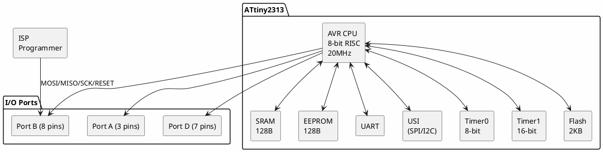

# ATtiny2313

**8-bit AVR Microcontroller**

## Device Information

| Field | Value |
|-------|-------|
| Manufacturer | Microchip (formerly Atmel) |
| Part Number | ATtiny2313 / ATtiny2313A |
| Package | DIP-20, SOIC-20 |
| Date Acquired | |
| Quantity | |

## Specifications

| Specification | Value |
|--------------|-------|
| Architecture | AVR 8-bit RISC |
| Clock Speed | Up to 20 MHz |
| Flash | 2 KB |
| SRAM | 128 bytes |
| EEPROM | 128 bytes |
| GPIO | 18 |
| Operating Voltage | 2.7-5.5V (ATtiny2313A) |
| I/O Voltage | 5V tolerant |

## Peripherals

| Peripheral | Quantity/Details |
|-----------|------------------|
| Timer/Counter | 2 (8-bit + 16-bit) |
| PWM | 4 channels |
| UART | 1 (full duplex) |
| USI | 1 (SPI/I2C capable) |
| Analog Comparator | 1 |
| External Interrupts | 2 |
| Pin Change Interrupts | 3 groups |

## Pinout

```
                 ATtiny2313
                 +----U----+
     (RESET) PA2 |1      20| VCC
       (RXD) PD0 |2      19| PB7 (SCK/PCINT7)
       (TXD) PD1 |3      18| PB6 (MISO/PCINT6)
      (XTAL) PA1 |4      17| PB5 (MOSI/PCINT5)
      (XTAL) PA0 |5      16| PB4 (OC1B/PCINT4)
      (INT0) PD2 |6      15| PB3 (OC1A/PCINT3)
      (INT1) PD3 |7      14| PB2 (OC0A/PCINT2)
       (T0)  PD4 |8      13| PB1 (AIN1/PCINT1)
      (OC0B) PD5 |9      12| PB0 (AIN0/PCINT0)
             GND |10     11| PD6 (ICP)
                 +---------+
```

## Block Diagram



## Programming

| Method | Tools |
|--------|-------|
| ISP (In-System Programming) | USBasp, AVR ISP mkII, Arduino as ISP |
| High-Voltage Programming | STK500, specialized programmers |
| debugWIRE | Atmel-ICE, AVR Dragon |

### ISP Wiring

| Programmer | ATtiny2313 |
|------------|------------|
| MOSI | PB5 (pin 17) |
| MISO | PB6 (pin 18) |
| SCK | PB7 (pin 19) |
| RESET | PA2 (pin 1) |
| VCC | VCC (pin 20) |
| GND | GND (pin 10) |

## Fuse Settings

| Fuse | Default | Description |
|------|---------|-------------|
| CKSEL | 0100 | Internal 8MHz oscillator |
| CKDIV8 | 0 | Clock divided by 8 (1MHz default) |
| SUT | 10 | Start-up time |
| BODLEVEL | 111 | Brown-out detection disabled |
| DWEN | 1 | debugWIRE disabled |

### Common Fuse Configurations

```bash
# 8MHz internal (no divider)
avrdude -U lfuse:w:0xe4:m -U hfuse:w:0xdf:m -U efuse:w:0xff:m

# External crystal
avrdude -U lfuse:w:0xff:m -U hfuse:w:0xdf:m -U efuse:w:0xff:m
```

## Documentation

- [ATtiny2313 Datasheet](https://ww1.microchip.com/downloads/en/DeviceDoc/Atmel-2543-AVR-ATtiny2313_Datasheet.pdf)
- [ATtiny2313A Datasheet](https://ww1.microchip.com/downloads/en/DeviceDoc/ATtiny2313A-4313-DataSheet-DS40002071A.pdf)
- [AVR Instruction Set Manual](https://ww1.microchip.com/downloads/en/DeviceDoc/AVR-Instruction-Set-Manual-DS40002198A.pdf)

## Software & Tools

### Official Tools
- **Microchip Studio** (formerly Atmel Studio) - Full IDE with debugging
- **MPLAB X IDE** - Microchip's cross-platform IDE

### Open-Source Alternatives
- **avr-gcc** - GCC compiler for AVR
- **avrdude** - Command-line programmer
- **PlatformIO** - Cross-platform IDE (platform: atmelavr)
- **Arduino IDE** - With ATtinyCore board package

### Arduino IDE Setup (ATtinyCore)

1. File > Preferences > Additional Board URLs
2. Add: `http://drazzy.com/package_drazzy.com_index.json`
3. Tools > Board > Boards Manager > Install ATTinyCore
4. Select "ATtiny2313/4313"
5. Set clock, BOD, and programmer options

### PlatformIO

```ini
[env:attiny2313]
platform = atmelavr
board = attiny2313
framework = arduino
upload_protocol = usbasp
```

## Common Uses

- Simple embedded controllers
- LED drivers
- Serial communication projects
- PWM motor control
- Learning AVR assembly/C

## Notes

- **Very limited resources** - 2KB flash, 128B RAM requires careful programming
- **No ADC** - Use ATtiny24/44/84 if analog inputs needed
- **USI not true SPI/I2C** - Requires bit-banging libraries
- **debugWIRE** - Single-wire debugging on RESET pin
- **ATtiny2313A** - Improved version with wider voltage range, picoPower

## Comparison with Similar Parts

| Part | Flash | RAM | ADC | Price |
|------|-------|-----|-----|-------|
| ATtiny2313 | 2KB | 128B | No | $ |
| ATtiny4313 | 4KB | 256B | No | $ |
| ATtiny24 | 2KB | 128B | 8ch | $ |
| ATtiny85 | 8KB | 512B | 4ch | $$ |

## Local Files

### Pinout


### Documentation
- `ATtiny2313_Datasheet.pdf` - Main datasheet
