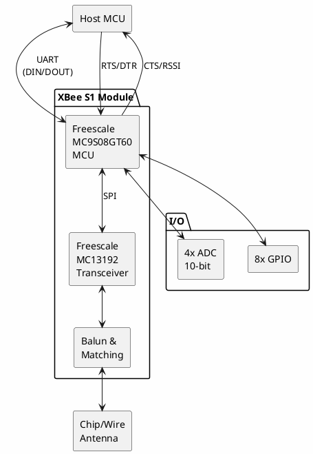

# MaxStream XBee

**802.15.4 Wireless Module (Original)**

## Device Information

| Field | Value |
|-------|-------|
| Manufacturer | MaxStream (now Digi International) |
| Model | XBee Series 1 |
| FCC ID | OUR-XBEE |
| Protocol | IEEE 802.15.4 |
| Frequency | 2.4 GHz ISM |
| Date Acquired | |
| Quantity | |

## Company History

MaxStream was the original manufacturer of XBee modules. The company was acquired by Digi International in 2006. The "OUR-XBEE" FCC ID reflects the original MaxStream branding (OUR = MaxStream's grantee code).

## Specifications

| Specification | Value |
|--------------|-------|
| Frequency Band | 2.4 GHz (2.400 - 2.4835 GHz) |
| RF Data Rate | 250 kbps |
| Serial Data Rate | Up to 115.2 kbps |
| Indoor Range | ~100 ft (30 m) |
| Outdoor Range | ~300 ft (100 m) |
| Transmit Power | 1 mW (0 dBm) |
| Receiver Sensitivity | -92 dBm |
| Supply Voltage | 2.8 - 3.4 V |
| Transmit Current | 45 mA @ 3.3V |
| Receive Current | 50 mA @ 3.3V |
| Sleep Current | < 10 µA |

## XBee vs XBee Pro Comparison

| Feature | XBee (This) | XBee Pro |
|---------|-------------|----------|
| FCC ID | OUR-XBEE | OUR-XBEEPRO |
| TX Power | 1 mW (0 dBm) | 60 mW (+18 dBm) |
| Indoor Range | ~100 ft | ~300 ft |
| Outdoor Range | ~300 ft | ~1 mile |
| TX Current | 45 mA | 215 mA |
| RX Current | 50 mA | 55 mA |
| Form Factor | 24.4 x 27.6 mm | 24.4 x 32.9 mm |

## Pinout (20-pin, 2mm pitch)

```
         MaxStream XBee
        +-----------+
   VCC  |1   +-+  20| GND
  DOUT  |2   | |  19| (not connected)
   DIN  |3   +-+  18| (not connected)
   DO8  |4        17| AD3/DIO3
 RESET  |5        16| AD2/DIO2
  RSSI  |6        15| ASSOC/AD1/DIO1
  DIO10 |7        14| VREF
   (nc) |8        13| ON/SLEEP
   DTR  |9        12| CTS/DIO7
   GND  |10       11| AD4/DIO4
        +-----------+
```

### Pin Descriptions

| Pin | Name | Direction | Description |
|-----|------|-----------|-------------|
| 1 | VCC | - | Power supply (2.8-3.4V) |
| 2 | DOUT | Output | UART Data Out (TX to host) |
| 3 | DIN/CONFIG | Input | UART Data In (RX from host) |
| 4 | DO8 | Output | Digital output 8 |
| 5 | RESET | Input | Module reset (active low) |
| 6 | RSSI/PWM0 | Output | RX signal strength (PWM) |
| 7 | DIO10/PWM0 | Both | Digital I/O 10 |
| 8 | (reserved) | - | Do not connect |
| 9 | DTR/SLEEP_RQ/DI8 | Input | Sleep request / Digital input 8 |
| 10 | GND | - | Ground |
| 11 | AD4/DIO4 | Both | Analog input 4 / Digital I/O 4 |
| 12 | CTS/DIO7 | Both | Clear to Send / Digital I/O 7 |
| 13 | ON/SLEEP | Output | Module status indicator |
| 14 | VREF | Input | Voltage reference for ADC |
| 15 | ASSOC/AD1/DIO1 | Both | Associate LED / Analog 1 / DIO 1 |
| 16 | AD2/DIO2 | Both | Analog input 2 / Digital I/O 2 |
| 17 | AD3/DIO3 | Both | Analog input 3 / Digital I/O 3 |
| 18 | (nc) | - | Not connected |
| 19 | (nc) | - | Not connected |
| 20 | GND | - | Ground |

## Physical Dimensions

```
Standard XBee:
+---------------------------+
|                           |
|    24.4 mm (0.96")        |
|  +-------------------+    |
|  |                   | 27.6 mm
|  |     RF Module     | (1.09")
|  |                   |    |
|  +-------------------+    |
|  | | | | | | | | | | |    |
+---------------------------+
   2mm pitch, 20 pins
```

## Block Diagram



## Operating Modes

### Idle/Receive Mode
- Module listens for incoming RF packets
- Current: ~50 mA

### Transmit Mode
- Active when sending data
- Current: ~45 mA
- Max payload: 100 bytes per packet

### Command Mode
- Enter with "+++" (1 sec guard time before/after)
- Configure module with AT commands
- Exit with ATCN or timeout

### Sleep Modes

| Mode | AT Command | Current Draw |
|------|------------|--------------|
| Pin Hibernate | SM=1 | < 10 µA |
| Pin Doze | SM=2 | < 50 µA |
| Cyclic Sleep | SM=4 | Variable |
| Cyclic Sleep w/ Pin Wake | SM=5 | Variable |

## AT Command Reference

### Network Commands

| Command | Parameter | Description |
|---------|-----------|-------------|
| ATID | 0x0000-0xFFFF | PAN ID |
| ATCH | 0x0B-0x1A | Operating channel |
| ATMY | 0x0000-0xFFFF | 16-bit source address |
| ATDH | 0x00000000-0xFFFFFFFF | Destination high |
| ATDL | 0x0000-0xFFFF | Destination low |
| ATSH | Read only | Serial number high |
| ATSL | Read only | Serial number low |

### Serial Interface Commands

| Command | Parameter | Description |
|---------|-----------|-------------|
| ATBD | 0-7 | Baud rate (0=1200...7=115200) |
| ATNB | 0-4 | Parity (0=8N1, 1=8E1, etc.) |
| ATAP | 0-2 | API mode enable |
| ATAO | 0-1 | API output mode |

### RF Commands

| Command | Parameter | Description |
|---------|-----------|-------------|
| ATPL | 0-4 | Power level |
| ATCA | 0x24-0x50 | CCA threshold |
| ATRR | 0-6 | XBee retries |

### I/O Commands

| Command | Description |
|---------|-------------|
| ATD0-D8 | Configure DIO0-DIO8 |
| ATP0-P1 | Configure PWM0-PWM1 |
| ATIR | I/O sample rate |
| ATIS | Force I/O sample |

### Diagnostic Commands

| Command | Description |
|---------|-------------|
| ATDB | Last packet RSSI (dBm) |
| ATVR | Firmware version |
| ATHV | Hardware version |
| ATEC | CCA failures |
| ATEA | ACK failures |

## Configuration Example

### Basic Point-to-Point Setup

**Module A (Coordinator):**
```
+++
OK
ATID 1234
OK
ATMY 0
OK
ATDL 1
OK
ATWR
OK
ATCN
```

**Module B (End Device):**
```
+++
OK
ATID 1234
OK
ATMY 1
OK
ATDL 0
OK
ATWR
OK
ATCN
```

## Software & Tools

### XCTU (X-CTU)

Digi's official configuration utility:
- Discover and configure XBee modules
- Update firmware
- Monitor serial data
- Range test utility

Download: https://www.digi.com/products/embedded-systems/digi-xbee/digi-xbee-tools/xctu

### Arduino Integration

```cpp
// Simple transparent mode example
#include <SoftwareSerial.h>

// XBee connected to pins 2 (RX) and 3 (TX)
SoftwareSerial xbee(2, 3);

void setup() {
    Serial.begin(9600);   // Debug serial
    xbee.begin(9600);     // XBee default baud
    Serial.println("XBee Ready");
}

void loop() {
    // Receive from XBee, send to Serial Monitor
    if (xbee.available()) {
        char c = xbee.read();
        Serial.print(c);
    }

    // Receive from Serial Monitor, send to XBee
    if (Serial.available()) {
        char c = Serial.read();
        xbee.print(c);
    }
}
```

### API Mode Frame Structure

```
Start Delimiter | Length    | Frame Data           | Checksum
    0x7E        | MSB  LSB  | API ID + Data        | 1 byte
```

Common API Frame Types:
| API ID | Frame Type |
|--------|------------|
| 0x00 | TX Request (64-bit address) |
| 0x01 | TX Request (16-bit address) |
| 0x80 | RX Packet (64-bit address) |
| 0x81 | RX Packet (16-bit address) |
| 0x08 | AT Command |
| 0x88 | AT Command Response |
| 0x89 | TX Status |

## Hardware Design Notes

### Minimum Circuit

```
        +3.3V
          |
         [C1]  (10µF)
          |
   +------+------+
   |      |      |
  [C2]   VCC    GND
 (100nF)  |      |
   |     XBee    |
   +------+------+
          |
         GND

DIN  <--- Host TX (with level shift if 5V)
DOUT ---> Host RX
```

### Level Shifting (5V Systems)

```
5V TX ----[1K]----+----[2K]---- GND
                  |
                  +------------ XBee DIN (3.3V)
```

Or use a dedicated level shifter IC (74LVC245, TXB0104, etc.)

## Antenna Options

| Variant | Antenna Type | Notes |
|---------|--------------|-------|
| XB24-AWI-001 | Wire (whip) | Best range |
| XB24-ACI-001 | Chip (PCB) | Most compact |
| XB24-AUI-001 | U.FL connector | External antenna |

## Regulatory Compliance

| Region | Certification |
|--------|---------------|
| USA | FCC ID: OUR-XBEE |
| Canada | IC: 4214A-XBEE |
| Europe | ETSI EN 300 328 |

## Documentation

- [XBee/XBee-PRO OEM RF Module Datasheet](https://www.digi.com/resources/documentation/digidocs/pdfs/90000982.pdf)
- [XBee Product Manual](https://www.digi.com/resources/documentation/digidocs/pdfs/90000866.pdf)
- [Digi XBee 802.15.4 Page](https://www.digi.com/products/embedded-systems/digi-xbee/rf-modules/2-4-ghz-rf-modules/xbee-802-15-4)

## Notes

- **MaxStream legacy**: Same module now sold by Digi International
- **S1 vs S2**: S1 is 802.15.4 only; S2 adds ZigBee mesh (not compatible)
- **Original form factor**: Set the standard 20-pin 2mm footprint
- **Lower power**: Standard XBee uses less power than Pro version
- **Firmware updates**: Use XCTU; older modules may need legacy firmware
- **802.15.4**: Simple protocol, no mesh routing (use S2 for mesh)

## Troubleshooting

### Cannot Enter Command Mode
- Ensure 1 second guard time before and after +++
- Do not press Enter after +++
- Check baud rate matches (default 9600)

### No Communication
- Verify both modules have same PAN ID (ATID)
- Check channel matches (ATCH)
- Verify addressing (ATDL on one = ATMY on other)
- Check signal strength with ATDB command

### Intermittent Communication
- Check power supply stability
- Add decoupling capacitors
- Check for 2.4 GHz interference
- Verify antenna connection

## Accessories

| Accessory | Description |
|-----------|-------------|
| XBee Explorer USB | SparkFun USB adapter |
| XBee Explorer Dongle | Compact USB adapter |
| XBee Shield | Arduino shield |
| Breakout Board | 2mm to 0.1" adapter |
| XBIB-U-DEV | Digi development board |

## Related Modules

| Module | Protocol | Power | Notes |
|--------|----------|-------|-------|
| XBee S1 | 802.15.4 | 1 mW | This module |
| XBee Pro S1 | 802.15.4 | 60 mW | High power version |
| XBee S2C | ZigBee | 3 mW | Mesh networking |
| XBee 3 | Multiple | 8 mW | Latest generation |

## Local Files

### Documentation
- `XBee_S1_Datasheet.pdf` - Module datasheet
- `XBee_ProductManual.pdf` - Complete reference
