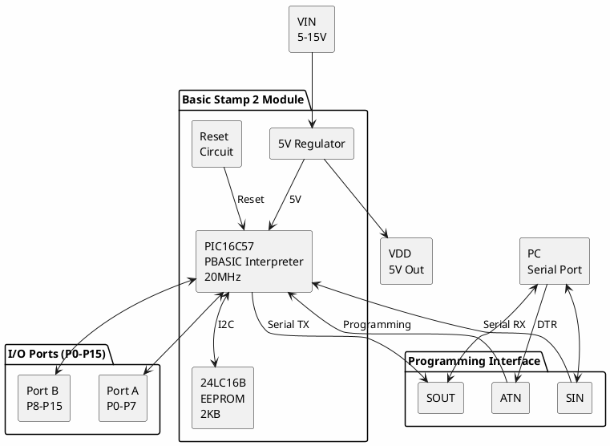

# Parallax Basic Stamp 2

**PBASIC Microcontroller Module**

## Module Information

| Field | Value |
|-------|-------|
| Manufacturer | Parallax Inc. |
| Model | Basic Stamp 2 (BS2) |
| Part Number | BS2-IC |
| Form Factor | 24-pin DIP module |
| Date Acquired | |
| Quantity | |

## Specifications

| Specification | Value |
|--------------|-------|
| Processor | PIC16C57 (interpreter) + EEPROM |
| Clock Speed | 20 MHz (internal) |
| Execution Speed | ~4,000 instructions/sec |
| Program Memory | 2 KB EEPROM (~500 instructions) |
| RAM | 32 bytes (26 user, 6 I/O) |
| I/O Pins | 16 (directly addressable) |
| Operating Voltage | 5-15V (regulated to 5V) |
| Current Draw | ~3 mA (idle), ~8 mA (active) |

## Basic Stamp 2 Variants

| Model | Speed | Program Slots | RAM | Features |
|-------|-------|---------------|-----|----------|
| BS2 | 4,000 inst/s | 1 (2KB) | 32B | Original |
| BS2e | 4,000 inst/s | 8 (16KB) | 32B | More memory |
| BS2sx | 10,000 inst/s | 8 (16KB) | 64B | Faster |
| BS2p24 | 12,000 inst/s | 8 (16KB) | 128B | 24-pin, I2C |
| BS2p40 | 12,000 inst/s | 8 (16KB) | 128B | 40-pin, LCD |
| BS2pe | 12,000 inst/s | 8 (16KB) | 128B | Low power |
| BS2px | 19,000 inst/s | 8 (16KB) | 128B | Fastest |

## Pinout

```
                 Basic Stamp 2
                   +----U----+
            SOUT  1|         |24  VIN (5-15V)
             SIN  2|         |23  VSS (GND)
             ATN  3|         |22  RES (Reset)
            VSS  4|         |21  VDD (+5V out)
              P0  5|         |20  P15
              P1  6|         |19  P14
              P2  7|         |18  P13
              P3  8|         |17  P12
              P4  9|         |16  P11
              P5 10|         |15  P10
              P6 11|         |14  P9
              P7 12|         |13  P8
                   +---------+
```

### Pin Functions

| Pin | Name | Function |
|-----|------|----------|
| 1 | SOUT | Serial Out (to PC) |
| 2 | SIN | Serial In (from PC) |
| 3 | ATN | Attention (programming) |
| 4, 23 | VSS | Ground |
| 5-12 | P0-P7 | I/O Port A |
| 13-20 | P8-P15 | I/O Port B |
| 21 | VDD | +5V Output (regulated) |
| 22 | RES | Reset (active low) |
| 24 | VIN | Power Input (5-15V) |

## Block Diagram



## Programming

### Hardware Setup
- Connect via serial port (DB-9) or USB-Serial adapter
- Use Parallax serial cable or equivalent
- Power via VIN (5-15V) or regulated 5V to VDD

### Serial Connection

| PC | Basic Stamp |
|----|-------------|
| TX (pin 3) | SIN (pin 2) |
| RX (pin 2) | SOUT (pin 1) |
| DTR (pin 4) | ATN (pin 3) |
| GND (pin 5) | VSS (pin 4/23) |

## PBASIC Language

### Example Program

```basic
' {$STAMP BS2}
' {$PBASIC 2.5}

' Blink LED on P0
Main:
  HIGH 0          ' Turn on P0
  PAUSE 500       ' Wait 500ms
  LOW 0           ' Turn off P0
  PAUSE 500       ' Wait 500ms
  GOTO Main       ' Loop forever
```

### Common PBASIC Commands

| Command | Description |
|---------|-------------|
| HIGH pin | Set pin high |
| LOW pin | Set pin low |
| TOGGLE pin | Toggle pin state |
| INPUT pin | Set pin as input |
| OUTPUT pin | Set pin as output |
| PAUSE ms | Delay in milliseconds |
| SEROUT | Serial output |
| SERIN | Serial input |
| PULSIN | Measure pulse width |
| PULSOUT | Generate pulse |
| PWM | Pulse width modulation |
| DEBUG | Send debug message to PC |
| FOR...NEXT | Loop structure |
| IF...THEN | Conditional |
| GOSUB | Subroutine call |

## Documentation

- [Basic Stamp Manual](https://www.parallax.com/package/basic-stamp-syntax-and-reference-manual/)
- [PBASIC Reference](https://www.parallax.com/package/basic-stamp-syntax-and-reference-manual/)
- [Basic Stamp Editor Help](https://www.parallax.com/package/basic-stamp-editor/)
- [What's a Microcontroller (Tutorial)](https://www.parallax.com/product/whats-a-microcontroller/)

## Software & Tools

### Official Tools
- **Basic Stamp Editor** - Windows IDE from Parallax (free)
- **Basic Stamp Windows Editor** - Legacy version
- Download: https://www.parallax.com/package/basic-stamp-editor/

### Alternative Tools
- **Stampw.exe** - Command-line tokenizer
- **Linux PBASIC tools** - Community ports (limited)

### Development Environment

1. Download Basic Stamp Editor from Parallax
2. Install USB-Serial drivers if needed
3. Connect Basic Stamp via serial cable
4. Select correct COM port in software
5. Write PBASIC code
6. Click Run to download and execute

## Common Uses

- Education and learning microcontrollers
- Hobby robotics (Boe-Bot)
- Data logging
- Home automation
- Sensor interfaces
- Serial communication projects

## Notes

- **Interpreted language** - Slower than compiled C but easier to learn
- **Limited memory** - 2KB for program, 32 bytes RAM
- **Serial only** - No USB; requires serial port or adapter
- **5V logic** - Not 3.3V compatible without level shifting
- **Active community** - Parallax forums still active
- **Educational focus** - Designed for learning, not production

## Accessories

| Accessory | Description |
|-----------|-------------|
| Board of Education | Prototyping carrier board |
| Homework Board | Budget carrier board |
| Boe-Bot | Robot kit |
| BASIC Stamp Activity Kit | Starter kit with components |

## Comparison with Modern Options

| Feature | BS2 | Arduino Uno | ESP32 |
|---------|-----|-------------|-------|
| Language | PBASIC | C/C++ | C/C++ |
| Speed | 4K inst/s | 16 MHz | 240 MHz |
| Flash | 2 KB | 32 KB | 4 MB |
| RAM | 32 B | 2 KB | 520 KB |
| I/O | 16 | 20 | 34 |
| Price | $$$ | $ | $ |
| Learning Curve | Low | Medium | Medium |

## Historical Significance

The Basic Stamp, introduced in 1992, was one of the first microcontroller modules designed specifically for hobbyists and educators. It pioneered the concept of an easy-to-use, programmable microcontroller module that didn't require specialized programming equipment, influencing later platforms like Arduino.

## Local Files

### Documentation
- `BasicStamp2_Manual.pdf` - PBASIC reference manual
- `BasicStamp2_Datasheet.pdf` - Hardware specifications
