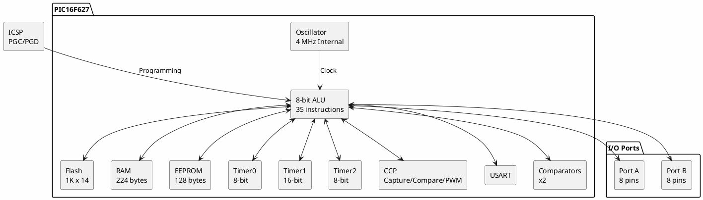

# PIC16F627

**8-bit Flash Microcontroller**

## Device Information

| Field | Value |
|-------|-------|
| Manufacturer | Microchip |
| Part Number | PIC16F627-04/P |
| Family | PIC16F6xx |
| Package | PDIP-18 |
| Speed Grade | 4 MHz (-04) |
| Date Acquired | |
| Quantity | |

## Specifications

| Specification | Value |
|--------------|-------|
| Architecture | 8-bit RISC (Harvard) |
| Program Memory | 1024 words (1K x 14-bit) |
| RAM | 224 bytes |
| EEPROM | 128 bytes |
| I/O Pins | 16 |
| Operating Voltage | 3.0-5.5V |
| Clock Speed | DC - 4 MHz (this part) |
| Timers | 3 (Timer0, Timer1, Timer2) |
| Oscillator | Internal 4 MHz + external options |

## PIC16F62x Family Comparison

| Part | Program | RAM | EEPROM | Max Clock | Comparators |
|------|---------|-----|--------|-----------|-------------|
| PIC16F627 | 1K | 224 | 128 | 20 MHz | 2 |
| PIC16F627A | 1K | 224 | 128 | 20 MHz | 2 |
| PIC16F628 | 2K | 224 | 128 | 20 MHz | 2 |
| PIC16F628A | 2K | 224 | 128 | 20 MHz | 2 |
| PIC16F648A | 4K | 256 | 256 | 20 MHz | 2 |

## Peripherals

| Peripheral | Quantity/Details |
|-----------|------------------|
| Timer0 | 8-bit with prescaler |
| Timer1 | 16-bit with external clock |
| Timer2 | 8-bit with period register |
| CCP | 1 (Capture/Compare/PWM) |
| USART | 1 (async/sync) |
| Comparators | 2 with internal ref |
| Brown-out Reset | Yes |
| WDT | Yes (internal RC) |
| Low-Voltage Programming | Yes (LVP) |

## Pinout (PDIP-18)

```
              PIC16F627
              +---U---+
    RA2/AN2   |1    18| RA1/AN1
    RA3/AN3   |2    17| RA0/AN0
    RA4/T0CKI |3    16| RA7/OSC1/CLKIN
  RA5/MCLR/VPP|4    15| RA6/OSC2/CLKOUT
        VSS   |5    14| VDD
   RB0/INT    |6    13| RB7/T1OSI/PGD
   RB1/RX/DT  |7    12| RB6/T1OSO/PGC
   RB2/TX/CK  |8    11| RB5
   RB3/CCP1   |9    10| RB4/PGM
              +-------+
```

### Pin Functions

| Pin | Name | Functions |
|-----|------|-----------|
| 1 | RA2 | I/O, Analog AN2, Comparator |
| 2 | RA3 | I/O, Analog AN3, Comparator |
| 3 | RA4 | I/O, Timer0 clock input |
| 4 | RA5 | MCLR (reset), VPP (programming) |
| 5 | VSS | Ground |
| 6 | RB0 | I/O, External interrupt |
| 7 | RB1 | I/O, USART RX |
| 8 | RB2 | I/O, USART TX |
| 9 | RB3 | I/O, CCP1 |
| 10 | RB4 | I/O, Low-voltage program |
| 11 | RB5 | I/O |
| 12 | RB6 | I/O, Timer1 osc, ICSP clock |
| 13 | RB7 | I/O, Timer1 osc, ICSP data |
| 14 | VDD | Power (+5V) |
| 15 | RA6 | I/O, Oscillator (CLKOUT) |
| 16 | RA7 | I/O, Oscillator (CLKIN) |
| 17 | RA0 | I/O, Analog AN0 |
| 18 | RA1 | I/O, Analog AN1 |

## Block Diagram



## Programming

| Method | Tools |
|--------|-------|
| ICSP | PICkit 2/3/4, ICD 2/3/4 |
| HVP | High-voltage programmers |
| LVP | Low-voltage via RB4 (if enabled) |
| Socket | TL866II Plus, K8048RS |

### ICSP Connections

| Signal | Pin | Function |
|--------|-----|----------|
| VPP | RA5 (pin 4) | Programming voltage (13V) |
| VDD | Pin 14 | +5V |
| VSS | Pin 5 | Ground |
| PGD | RB7 (pin 13) | Data |
| PGC | RB6 (pin 12) | Clock |

### ICSP Wiring (PICkit)

| PICkit Pin | Function | PIC16F627 |
|------------|----------|-----------|
| 1 | VPP/MCLR | Pin 4 (RA5) |
| 2 | VDD | Pin 14 |
| 3 | VSS | Pin 5 |
| 4 | PGD | Pin 13 (RB7) |
| 5 | PGC | Pin 12 (RB6) |
| 6 | LVP/PGM | Pin 10 (RB4) - optional |

## Development Tools

### Official (Microchip)
- **MPLAB X IDE** - Free development environment
- **XC8 Compiler** - Free version available
- **PICkit 3/4** - Programmer/debugger

### Open Source
- **SDCC** - Small Device C Compiler (supports PIC16)
- **gputils** - GNU PIC Utilities (assembler, linker)
- **pk2cmd** - Command-line PICkit 2 software
- **picprog** - Simple PIC programmer for Linux

### Programmers

| Programmer | Support | Notes |
|------------|---------|-------|
| PICkit 2/3/4 | Full | Official Microchip |
| ICD 2/3/4 | Full | Debugger + programmer |
| TL866II Plus | Full | Universal programmer |
| Velleman K8048RS | Full | RS-232 required (see Test Equipment) |
| PICkit 2 Clone | Full | Inexpensive clones work |

## Oscillator Options

The PIC16F627 supports multiple clock sources:

| Mode | Description |
|------|-------------|
| INTRC | Internal 4 MHz RC |
| ER | External RC |
| XT | Crystal (up to 4 MHz) |
| HS | High-speed crystal (4-20 MHz) |
| LP | Low-power crystal (32 kHz) |

**Note:** This -04 part is limited to 4 MHz max. Use PIC16F627-20 for higher speeds.

## Documentation

- [PIC16F627/628/648 Datasheet](https://ww1.microchip.com/downloads/en/DeviceDoc/40300C.pdf)
- [PIC16F627A/628A/648A Datasheet](https://ww1.microchip.com/downloads/en/DeviceDoc/40044G.pdf)
- [PICmicro Mid-Range Reference Manual](https://ww1.microchip.com/downloads/en/DeviceDoc/33023a.pdf)

## Example Code (MPLAB XC8)

```c
#include <xc.h>

// Configuration bits
#pragma config FOSC = INTOSCIO  // Internal oscillator, I/O on RA6/RA7
#pragma config WDTE = OFF       // Watchdog timer off
#pragma config PWRTE = ON       // Power-up timer on
#pragma config MCLRE = ON       // MCLR pin enabled
#pragma config BOREN = ON       // Brown-out reset on
#pragma config LVP = OFF        // Low-voltage programming off
#pragma config CPD = OFF        // Data EEPROM protection off
#pragma config CP = OFF         // Code protection off

#define _XTAL_FREQ 4000000      // 4 MHz internal oscillator

void main(void) {
    TRISB = 0x00;               // Port B as output
    PORTB = 0x00;               // Clear Port B

    while(1) {
        PORTB ^= 0x01;          // Toggle RB0
        __delay_ms(500);        // 500ms delay
    }
}
```

## Example Code (SDCC)

```c
#include <pic14/pic16f627.h>

// Configuration word
unsigned int at _CONFIG configWord =
    _INTRC_OSC_NOCLKOUT & _WDT_OFF & _PWRTE_ON & _MCLRE_ON & _LVP_OFF;

void delay(unsigned int count) {
    while(count--);
}

void main(void) {
    TRISB = 0x00;               // Port B as output
    PORTB = 0x00;

    while(1) {
        PORTB ^= 0x01;          // Toggle RB0
        delay(60000);
    }
}
```

## Common Uses

- LED flashers and drivers
- Simple control applications
- Serial communication projects
- PWM motor control
- Sensor interfaces
- Replacement for discrete logic

## Notes

- **-04/P** suffix means 4 MHz max, PDIP package
- **Internal oscillator** - No external crystal needed
- **USART** - Can do async serial (RS-232 level shifter needed)
- **Legacy part** - PIC16F627A is the newer revision
- **Pin compatible** with PIC16F628, PIC16F648A (more memory)
- **LVP caution** - If LVP enabled, RB4 cannot be used as I/O

## Alternatives

For new designs, consider:
- **PIC16F627A** - Same pinout, improved features
- **PIC16F1827** - Enhanced mid-range, more peripherals
- **ATtiny85** - AVR alternative, Arduino compatible
- **STM32G0** - 32-bit ARM, similar price point

## Local Files

### Documentation
- `PIC16F627_Datasheet.pdf` - Device datasheet
