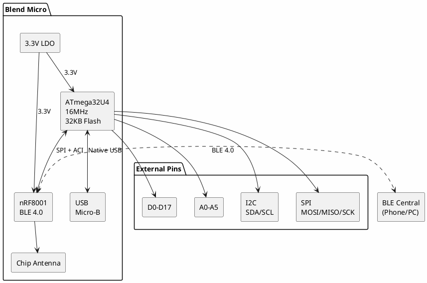
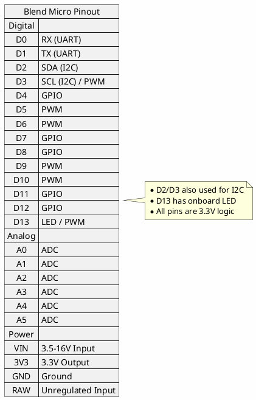

# RedBear Blend Micro

**Arduino-Compatible BLE Development Board**

## Board Information

| Field | Value |
|-------|-------|
| Manufacturer | RedBear Lab |
| Board | Blend Micro |
| MCU | ATmega32U4 |
| BLE Module | Nordic nRF8001 |
| Date Acquired | |
| Quantity | |

## Specifications

### MCU (ATmega32U4)

| Specification | Value |
|--------------|-------|
| Architecture | AVR 8-bit |
| Clock Speed | 16 MHz |
| Flash | 32 KB (4 KB bootloader) |
| SRAM | 2.5 KB |
| EEPROM | 1 KB |
| Operating Voltage | 3.3V |

### BLE Module (nRF8001)

| Specification | Value |
|--------------|-------|
| Bluetooth | BLE 4.0 |
| TX Power | -18 to +4 dBm |
| Range | ~30m (typical) |
| Profiles | GATT, GAP |
| Interface | SPI + ACI |

## Block Diagram



## Pinout



## nRF8001 Connection

| nRF8001 | ATmega32U4 | Function |
|---------|-----------|----------|
| MOSI | PB2 | SPI Data In |
| MISO | PB3 | SPI Data Out |
| SCK | PB1 | SPI Clock |
| REQN | PD4 | Request (to nRF8001) |
| RDYN | PD7 | Ready (from nRF8001) |
| RST | - | Connected to MCU reset |

## Features

- Arduino Leonardo compatible
- Bluetooth Low Energy 4.0
- Native USB (HID, Serial, MIDI)
- Chip antenna (no external antenna needed)
- Breadboard compatible
- Small footprint

## Programming

| Method | Tools |
|--------|-------|
| USB (Bootloader) | Arduino IDE |
| ICSP | AVR programmer |

## BLE Development

The nRF8001 uses Nordic's ACI (Application Controller Interface):

```cpp
#include <SPI.h>
#include <BLEPeripheral.h>

BLEPeripheral ble;
BLEService ledService("19B10000-E8F2-537E-4F6C-D104768A1214");
BLECharCharacteristic ledChar("19B10001-E8F2-537E-4F6C-D104768A1214",
                               BLERead | BLEWrite);

void setup() {
    ble.setLocalName("BlendMicro");
    ble.setAdvertisedServiceUuid(ledService.uuid());
    ble.addAttribute(ledService);
    ble.addAttribute(ledChar);
    ble.begin();
}
```

## Documentation

- [Blend Micro Product Page](https://redbear.cc/product/blend-micro.html)
- [ATmega32U4 Datasheet](https://ww1.microchip.com/downloads/en/DeviceDoc/Atmel-7766-8-bit-AVR-ATmega16U4-32U4_Datasheet.pdf)
- [nRF8001 Datasheet](https://infocenter.nordicsemi.com/pdf/nRF8001_PS_v1.3.pdf)
- [nRF8001 Product Spec](https://infocenter.nordicsemi.com/index.jsp?topic=%2Fcom.nordic.infocenter.nrf8001.v1.3%2Fnrf8001.html)
- [BLE Peripheral Library](https://github.com/sandeepmistry/arduino-BLEPeripheral)

## Software & Tools

- **Arduino IDE** - Select "Arduino Leonardo"
- **BLEPeripheral Library** - BLE stack for nRF8001
- **nRF Connect** - Mobile app for BLE testing
- [RedBear Library](https://github.com/RedBearLab/nRF8001)

### Arduino IDE Setup

1. Install Arduino IDE
2. Select Board: "Arduino Leonardo"
3. Install BLEPeripheral library via Library Manager
4. Or use RedBear's RBL_nRF8001 library

## Common Uses

- BLE beacons
- Wireless sensors
- Phone-controlled projects
- BLE HID devices
- Fitness/health devices
- Smart home sensors

## Notes

- **3.3V logic** - Not 5V tolerant
- BLE only (not Bluetooth Classic)
- nRF8001 is BLE peripheral only (can't scan/connect to other devices)
- Limited to 6 characteristics per service
- RedBear Lab discontinued - libraries community maintained
- Compatible with iOS, Android, Windows, macOS BLE

## Alternatives

For newer BLE projects:
- **nRF52840 boards** - More capable BLE 5.0
- **ESP32** - WiFi + BLE combo
- **Arduino Nano 33 BLE** - Official Arduino BLE board

## Local Files

*Documentation to be downloaded*
