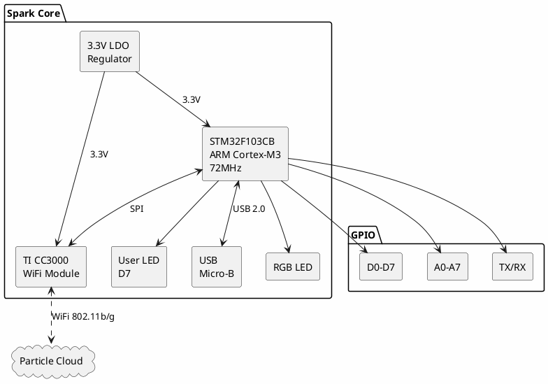
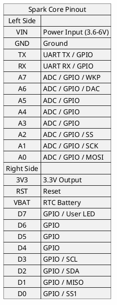

# Spark Core (Particle)

**WiFi-Enabled IoT Development Board**

## Board Information

| Field | Value |
|-------|-------|
| Manufacturer | Particle (formerly Spark) |
| Board | Spark Core |
| MCU | STM32F103CB |
| WiFi Module | TI CC3000 |
| Date Acquired | |
| Quantity | |

## Specifications

| Specification | Value |
|--------------|-------|
| Core | ARM Cortex-M3 |
| Clock Speed | 72 MHz |
| Flash | 128 KB |
| SRAM | 20 KB |
| WiFi | 802.11 b/g (CC3000) |
| GPIO | 18 |
| ADC | 8 channels (12-bit) |
| DAC | None |
| Operating Voltage | 3.3V |
| Input Voltage | 3.6-6V |

## Wireless Specifications

| Feature | Value |
|---------|-------|
| WiFi Module | TI CC3000 |
| Standards | 802.11 b/g |
| Security | WEP, WPA, WPA2 |
| IPv4 | Yes |
| TCP/UDP | Yes |

## Block Diagram

## Pinout

## Peripherals

| Peripheral | Pins |
|-----------|------|
| UART | TX, RX |
| SPI | A2(SS), A1(SCK), A0(MOSI), D1(MISO) |
| I2C | D3(SCL), D2(SDA) |
| PWM | D0, D1, A0, A1, A4, A5, A6, A7 |
| ADC | A0-A7 (12-bit) |

## Board Features

- RGB status LED
- User LED on D7
- Micro-USB connector
- MODE button (for setup/DFU)
- RST button
- Chip antenna
- Breadboard compatible

## Programming

| Method | Tools |
|--------|-------|
| Particle Cloud | Web IDE (build.particle.io) |
| USB DFU | particle-cli, dfu-util |
| Serial | particle-cli |
| JTAG/SWD | OpenOCD (advanced) |

### Particle Cloud Development

1. Create account at build.particle.io
2. Claim device using Particle app
3. Write code in Web IDE
4. Flash over-the-air

## Documentation

- [Spark Core Datasheet](https://docs.particle.io/datasheets/discontinued/core-datasheet/)
- [STM32F103CB Datasheet](https://www.st.com/resource/en/datasheet/stm32f103cb.pdf)
- [TI CC3000 Datasheet](https://www.ti.com/lit/ds/symlink/cc3000.pdf)
- [Particle Documentation](https://docs.particle.io/)

## Software & Tools

- **Particle Web IDE** - Cloud-based development
- **Particle CLI** - Command-line tools
- **Particle Workbench** - VS Code extension
- [Particle CLI Install](https://docs.particle.io/getting-started/developer-tools/cli/)

## LED Status Codes

| Color | Pattern | Meaning |
|-------|---------|---------|
| Cyan | Breathing | Connected to cloud |
| Cyan | Fast blink | Connecting to cloud |
| Green | Blinking | Connecting to WiFi |
| Blue | Blinking | Listening mode (setup) |
| Magenta | Blinking | Updating firmware |
| Red | Blinking | Error/Panic |

## Notes

- **Legacy device** - Succeeded by Particle Photon/Argon
- CC3000 WiFi module has known issues
- Particle Cloud subscription may be required for some features
- Open-source hardware and firmware
- OTA updates via Particle Cloud
- Can be used offline with local compile

## Local Files

*Documentation to be downloaded*
