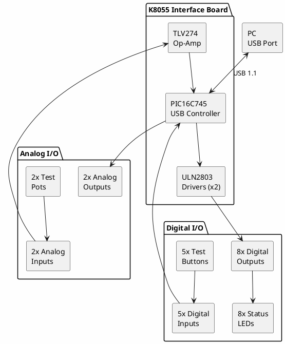

# Velleman K8055

**USB Experiment Interface Board**

## Unit Information

| Field | Value |
|-------|-------|
| Manufacturer | Velleman |
| Model | K8055 (Kit) / VM110 (Assembled) |
| Type | USB I/O Interface |
| Status | Working |
| Date Ordered | - |
| Purchase Price | - (receipt not found) |
| Source | Micro Center |
| Quantity | 3 |

## Specifications

| Specification | Value |
|--------------|-------|
| Interface | USB 1.1 (Full Speed) |
| Power Supply | USB bus powered (~70mA) |
| Digital Inputs | 5 (active low, ground = 0) |
| Digital Outputs | 8 (open collector, 50V/100mA max) |
| Analog Inputs | 2 (8-bit resolution) |
| Analog Outputs | 2 (8-bit, 0-5V or PWM) |
| Counters | 2 (on inputs 1 & 2, max 2kHz) |
| Conversion Time | 20ms per command |
| Dimensions | 145 x 88 x 20 mm |

## I/O Details

### Digital Inputs (5 channels)

| Input | Connector | Notes |
|-------|-----------|-------|
| I1 | Terminal + button | Counter capable |
| I2 | Terminal + button | Counter capable |
| I3 | Terminal + button | General purpose |
| I4 | Terminal + button | General purpose |
| I5 | Terminal + button | General purpose |

- Active low: Open/high = 1, Ground = 0
- On-board test buttons for each input
- Directly accepts switches, buttons, relay contacts

### Digital Outputs (8 channels)

| Output | Type | Max Rating |
|--------|------|------------|
| O1-O8 | Open collector | 50V / 100mA |

- Open collector (ULN2803 driver)
- LEDs on board for status indication
- Can drive relays, LEDs, small motors

### Analog Inputs (2 channels)

| Input | Resolution | Range | Notes |
|-------|------------|-------|-------|
| A1 | 8-bit | 0-5V | Gain x1, x4, x15 selectable |
| A2 | 8-bit | 0-5V | Gain x1, x4, x15 selectable |

- Internal +5V test voltage (jumper selectable)
- On-board potentiometers for testing
- Input impedance adjustable via gain resistors
- Gain x4: Install 3.3K resistor at R8/R9
- Gain x15: Install 820 ohm resistor at R8/R9

### Analog Outputs (2 channels)

| Output | Resolution | Mode | Specs |
|--------|------------|------|-------|
| DA1 | 8-bit | Voltage | 0-5V, 1.5K output impedance |
| DA2 | 8-bit | Voltage | 0-5V, 1.5K output impedance |
| PWM1 | 8-bit | PWM | 0-100%, open collector 40V/100mA |
| PWM2 | 8-bit | PWM | 0-100%, open collector 40V/100mA |

### Counters (2 channels)

- Inputs I1 and I2 can function as event counters
- Maximum frequency: ~2kHz (depends on I/O load)
- Adjustable debounce time via software
- 32-bit counter values

## Block Diagram



## Board Layout

```
+--------------------------------------------------+
|  [USB]                                    K8055  |
|                                                  |
|  [O1][O2][O3][O4][O5][O6][O7][O8]  <- Output LEDs|
|                                                  |
|  [A1 POT] [A2 POT]                               |
|                                                  |
|  (I1)(I2)(I3)(I4)(I5)  <- Test buttons           |
|                                                  |
|  === Terminal Block ===                          |
|  GND A1 A2 DA1 DA2 I1 I2 I3 I4 I5 CLK DATA      |
|  GND O1 O2 O3 O4 O5 O6 O7 O8 +5V PWM1 PWM2      |
+--------------------------------------------------+
```

## Address Selection

Up to 4 K8055 boards can be connected simultaneously:

| SK5 | SK6 | Address |
|-----|-----|---------|
| Open | Open | 0 |
| Closed | Open | 1 |
| Open | Closed | 2 |
| Closed | Closed | 3 |

## Software

### Official Software
- **K8055 Demo Software** - Windows test application
- **K8055.DLL** - Windows DLL for custom applications
- Download: [Velleman Downloads](https://www.velleman.eu/support/downloads/?code=K8055)

### DLL Functions

```c
// Connection
int  OpenDevice(int CardAddress);
void CloseDevice();

// Digital I/O
int  ReadDigitalChannel(int Channel);
int  ReadAllDigital();
void WriteDigitalChannel(int Channel, int Status);
void WriteAllDigital(int Data);
void ClearDigitalChannel(int Channel);
void ClearAllDigital();
void SetDigitalChannel(int Channel);
void SetAllDigital();

// Analog I/O
int  ReadAnalogChannel(int Channel);
void ReadAllAnalog(int *Data1, int *Data2);
void OutputAnalogChannel(int Channel, int Data);
void OutputAllAnalog(int Data1, int Data2);
void ClearAnalogChannel(int Channel);
void ClearAllAnalog();
void SetAnalogChannel(int Channel);
void SetAllAnalog();

// Counters
void ResetCounter(int CounterNr);
int  ReadCounter(int CounterNr);
void SetCounterDebounceTime(int CounterNr, int DebounceTime);
```

### Open Source / Linux Support

| Tool | Platform | Notes |
|------|----------|-------|
| [libk8055](https://github.com/rm-hull/k8055) | Linux | Open source library |
| [pyk8055](https://github.com/rm-hull/pyk8055) | Python | Python bindings |
| [k8055 kernel module](https://sourceforge.net/projects/libk8055/) | Linux | Kernel driver |

### Linux Installation

```bash
# Install libusb
sudo apt install libusb-dev

# Clone and build libk8055
git clone https://github.com/rm-hull/k8055
cd k8055
make
sudo make install

# Add udev rule for non-root access
echo 'SUBSYSTEM=="usb", ATTR{idVendor}=="10cf", ATTR{idProduct}=="5500", MODE="0666"' | \
    sudo tee /etc/udev/rules.d/99-k8055.rules
sudo udevadm control --reload-rules
```

### Python Example

```python
import k8055

# Open board at address 0
board = k8055.Board()
board.open(0)

# Read digital inputs
inputs = board.read_digital()
print(f"Digital inputs: {inputs:05b}")

# Set digital output 1
board.set_digital_channel(1)

# Read analog input 1
value = board.read_analog_channel(1)
print(f"Analog 1: {value}")

# Set analog output
board.output_analog_channel(1, 128)  # 50%

# Read counter
count = board.read_counter(1)
print(f"Counter 1: {count}")

board.close()
```

### Visual Basic Example

```vb
' Declare DLL functions
Private Declare Function OpenDevice Lib "k8055d.dll" (ByVal CardAddress As Long) As Long
Private Declare Sub CloseDevice Lib "k8055d.dll" ()
Private Declare Function ReadDigitalChannel Lib "k8055d.dll" (ByVal Channel As Long) As Long
Private Declare Sub SetDigitalChannel Lib "k8055d.dll" (ByVal Channel As Long)

' Usage
Dim h As Long
h = OpenDevice(0)  ' Open card at address 0

If ReadDigitalChannel(1) Then
    MsgBox "Input 1 is HIGH"
End If

SetDigitalChannel(1)  ' Turn on output 1

CloseDevice
```

## Documentation

- [K8055 Assembly Manual (PDF)](https://cdn.velleman.eu/downloads/0/illustrated/illustrated_assembly_manual_k8055_uk_rev3.pdf)
- [K8055 User Manual](https://www.velleman.eu/downloads/0/user/usermanual_k8055_uk.pdf)
- [K8055 DLL Manual](https://www.velleman.eu/downloads/0/software/k8055_dll_manual.pdf)
- [Velleman K8055 Product Page](https://www.velleman.eu/products/view/?id=351346)

## Common Applications

- Data logging (temperature, voltage, etc.)
- Home automation control
- Process monitoring
- Educational projects
- Test equipment automation
- Relay control systems
- LED displays
- Simple robotics

## Hardware Revisions

| Version | Notes |
|---------|-------|
| K8055 | Original kit version |
| VM110 | Pre-assembled version |
| K8055N | Newer revision, improved compatibility |
| VM110N | Pre-assembled newer version |

## Notes

- **Discontinued** - Replaced by K8055N/VM110N, but still widely available
- **USB powered** - No external power needed
- **20ms latency** - Not suitable for high-speed applications
- **Windows driver** - May need compatibility mode on Windows 10/11
- **Multiple boards** - Up to 4 boards per PC via address jumpers
- **Open collector outputs** - Need external pull-up or load to +V
- **8-bit resolution** - 256 levels for analog (0-255)

## Troubleshooting

### Board Not Detected
- Check USB cable connection
- Verify Windows driver installed
- Try different USB port (avoid USB 3.0 hubs)
- Check address jumpers (SK5/SK6)

### Analog Readings Unstable
- Use shielded cables for analog inputs
- Enable input filtering in software
- Check for ground loops

### Outputs Not Working
- Verify external load connected (open collector)
- Check maximum current rating (100mA per output)
- Test with on-board LEDs first

## Alternatives

For new projects, consider:
- **Arduino** - More flexible, huge community
- **Raspberry Pi GPIO** - Linux-based, more I/O
- **LabJack U3** - Higher resolution, faster
- **National Instruments USB-6001** - Professional DAQ

## Local Files

### Documentation
- `K8055_AssemblyManual.pdf` - Kit assembly instructions
- `K8055_UserManual.pdf` - User guide
- `K8055_DLL_Manual.pdf` - Programming reference
