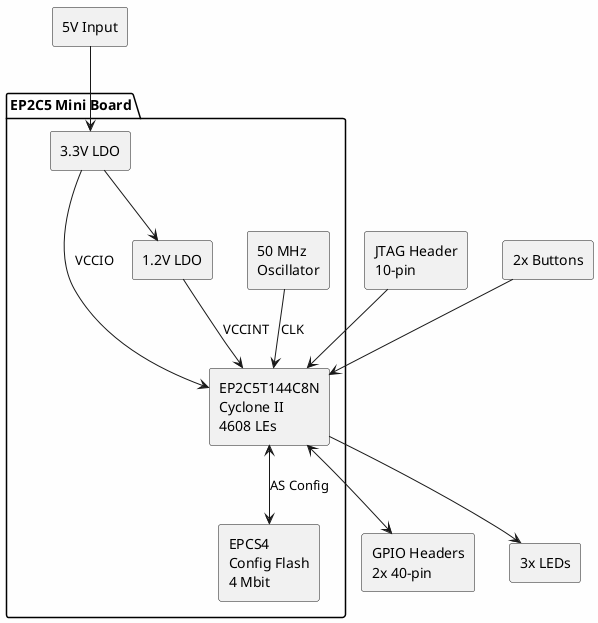

# Altera Cyclone II EP2C5 Mini Board

**Low-Cost FPGA Development Board**

## Device Information

| Field | Value |
|-------|-------|
| FPGA | Altera (Intel) Cyclone II |
| Part Number | EP2C5T144C8N |
| Board Type | Mini Development Board (Generic) |
| Companion Board | Land Boards EP2C5-DB-TH Rev 1 |
| Date Acquired | |
| Quantity | |

## FPGA Specifications (EP2C5T144C8N)

| Specification | Value |
|--------------|-------|
| Logic Elements | 4,608 |
| M4K RAM Blocks | 26 |
| Total RAM Bits | 119,808 |
| Embedded Multipliers | 13 (18x18) |
| PLLs | 2 |
| User I/O Pins | 89 |
| Package | TQFP-144 |
| Speed Grade | C8 (fastest) |

## Cyclone II Family Comparison

| Part | LEs | RAM Bits | Multipliers | I/O |
|------|-----|----------|-------------|-----|
| EP2C5 | 4,608 | 119,808 | 13 | 89 |
| EP2C8 | 8,256 | 165,888 | 18 | 85 |
| EP2C20 | 18,752 | 239,616 | 26 | 142 |
| EP2C35 | 33,216 | 483,840 | 35 | 322 |
| EP2C70 | 68,416 | 1,152,000 | 150 | 422 |

## Mini Board Features

### Typical Generic Mini Board

| Feature | Description |
|---------|-------------|
| FPGA | EP2C5T144C8N |
| Configuration | AS (Active Serial) mode |
| Config Device | EPCS4 (4 Mbit serial config) |
| Oscillator | 50 MHz |
| Power | 5V input, on-board 3.3V/1.2V regulators |
| LEDs | 3 user LEDs |
| Buttons | 2 user buttons |
| JTAG | 10-pin header (directly accessible) |
| GPIO | 2x 40-pin headers (active mode I/O) |

### Block Diagram



## Land Boards EP2C5-DB-TH (Daughter Board)

The EP2C5-DB-TH Rev 1 is a companion daughter board from Land Boards:

| Feature | Description |
|---------|-------------|
| Compatibility | EP2C5 Mini Board |
| Mounting | Through-hole headers |
| I/O Expansion | Additional peripherals |

### Typical Daughter Board Features
- VGA output
- PS/2 keyboard/mouse
- Seven-segment displays
- Additional LEDs/switches
- Audio output
- SD card slot

## Pin Configuration

### JTAG Header (10-pin)

```
         +---------+
    TCK  | 1     2 | GND
    TDO  | 3     4 | VCC
    TMS  | 5     6 | (nc)
    (nc) | 7     8 | (nc)
    TDI  | 9    10 | GND
         +---------+
```

### Typical GPIO Header Pinout

I/O pins directly connected to FPGA pins. Consult specific board schematic for exact mapping.

## Programming

### Methods

| Method | Tool | Files |
|--------|------|-------|
| JTAG | USB Blaster | .sof (SRAM) |
| Active Serial | USB Blaster | .pof (Flash) |

### JTAG Programming

Directly loads to FPGA SRAM - lost on power off:

```
1. Connect USB Blaster to JTAG header
2. Open Quartus Programmer
3. Add .sof file
4. Click "Start"
```

### Flash Programming (Persistent)

Programs EPCS serial flash - survives power cycle:

```
1. Convert .sof to .pof in Quartus
2. Connect USB Blaster
3. Select "Active Serial Programming" mode
4. Program EPCS device with .pof
```

## Development Software

### Intel Quartus Prime Lite (Free)

Current versions support Cyclone II:
- Quartus Prime Lite 13.0sp1 (last with full Cyclone II support)
- Quartus II Web Edition 13.0 (recommended for Cyclone II)

Download: https://www.intel.com/content/www/us/en/software-kit/711791/intel-quartus-ii-web-edition-design-software-version-13-0sp1-for-windows.html

### Quartus II 13.0 Limitations

| Feature | Support |
|---------|---------|
| Synthesis | Yes |
| Place & Route | Yes |
| Timing Analysis | Yes |
| SignalTap | Yes |
| ModelSim-Altera | Yes (Starter) |

**Note**: Newer Quartus versions dropped Cyclone II support.

## Verilog Example (Blink LED)

```verilog
module blink (
    input  wire clk,      // 50 MHz
    output reg  led
);

reg [25:0] counter;

always @(posedge clk) begin
    counter <= counter + 1;
    if (counter == 0)
        led <= ~led;
end

endmodule
```

### Pin Assignment (QSF)

```tcl
set_location_assignment PIN_17 -to clk
set_location_assignment PIN_3 -to led

set_global_assignment -name FAMILY "Cyclone II"
set_global_assignment -name DEVICE EP2C5T144C8
```

## VHDL Example

```vhdl
library IEEE;
use IEEE.STD_LOGIC_1164.ALL;
use IEEE.NUMERIC_STD.ALL;

entity blink is
    Port (
        clk : in  STD_LOGIC;
        led : out STD_LOGIC
    );
end blink;

architecture Behavioral of blink is
    signal counter : unsigned(25 downto 0) := (others => '0');
begin
    process(clk)
    begin
        if rising_edge(clk) then
            counter <= counter + 1;
            if counter = 0 then
                led <= not led;
            end if;
        end if;
    end process;
end Behavioral;
```

## Design Flow

```
1. Create Quartus Project
        ↓
2. Write HDL (Verilog/VHDL)
        ↓
3. Add Pin Assignments
        ↓
4. Compile (Analysis & Synthesis → Fitter → Assembler)
        ↓
5. Generate .sof (SRAM) or .pof (Flash)
        ↓
6. Program via USB Blaster
```

## USB Blaster Connection

| USB Blaster | EP2C5 Mini |
|-------------|------------|
| TCK | TCK |
| TDO | TDO |
| TMS | TMS |
| TDI | TDI |
| VCC | VCC (3.3V) |
| GND | GND |

See also: `altera-usb-blaster/` in Test Equipment

## Clock Resources

| Resource | Quantity |
|----------|----------|
| Global Clocks | 8 |
| PLLs | 2 |
| PLL Input Freq | 16-275 MHz |
| PLL Output Freq | 16-500 MHz |

### PLL Example

```verilog
// Use Quartus MegaWizard to generate PLL
// Input: 50 MHz → Output: 100 MHz

pll_50to100 pll_inst (
    .inclk0(clk_50),
    .c0(clk_100)
);
```

## Memory Resources

| Type | Quantity | Size |
|------|----------|------|
| M4K Blocks | 26 | 4,608 bits each |
| Total M4K | - | 119,808 bits |
| Distributed RAM | Via LEs | Variable |

## I/O Standards Supported

| Standard | Voltage |
|----------|---------|
| LVTTL | 3.3V |
| LVCMOS | 3.3V/2.5V/1.8V |
| SSTL-2 Class I/II | 2.5V |
| HSTL Class I/II | 1.8V |
| PCI | 3.3V |
| LVDS | Differential |

## Power Requirements

| Rail | Voltage | Typical Current |
|------|---------|-----------------|
| VCCINT | 1.2V | 200-500 mA |
| VCCIO | 3.3V | 100-300 mA |
| Input | 5V | ~800 mA total |

## Documentation

- [Cyclone II Device Handbook](https://www.intel.com/content/dam/www/programmable/us/en/pdfs/literature/hb/cyc2/cyc2_cii5v1.pdf)
- [Cyclone II Datasheet](https://www.intel.com/content/dam/www/programmable/us/en/pdfs/literature/hb/cyc2/cyc2_cii51001.pdf)
- [Quartus II Handbook](https://www.intel.com/content/dam/www/programmable/us/en/pdfs/literature/hb/qts/quartusii_handbook.pdf)
- [Land Boards Wiki](http://land-boards.com/blwiki/index.php?title=EP2C5-DB)

## Common Projects

- LED blinker / chaser
- VGA display controller
- UART communication
- SPI/I2C interfaces
- Simple CPU cores (RISC-V, J1, etc.)
- PWM motor control
- Digital filters
- Logic analyzer
- Signal generator

## Notes

- **Legacy FPGA** - Cyclone II is older generation (2004)
- **Quartus 13.0** - Last version with Cyclone II support
- **USB Blaster** - Required for programming (clone works fine)
- **3.3V I/O** - All I/O banks are 3.3V on TQFP-144 package
- **EPCS4 config** - ~500ms configuration time at power-up
- **EP2C5 vs EP2C8** - Some boards come with larger EP2C8
- **Chinese clone boards** - Very common, quality varies
- **Daughter boards** - Land Boards and others add peripherals

## Troubleshooting

### JTAG Not Detected
- Check USB Blaster connection
- Verify JTAG cable orientation
- Ensure board is powered
- Check USB Blaster drivers

### Configuration Fails
- Verify correct device selected in Quartus
- Check .sof file is for correct device
- Try JTAG before Active Serial
- Check EPCS device is detected

### Design Doesn't Work
- Check pin assignments match board
- Verify clock pin is correct
- Use SignalTap to debug internal signals
- Check timing constraints

### Board Won't Boot from Flash
- Ensure .pof was programmed (not .sof)
- Verify EPCS device contains valid configuration
- Check configuration mode pins
- Try reprogramming EPCS

## Accessories

| Item | Purpose |
|------|---------|
| USB Blaster | JTAG/AS programming |
| EP2C5-DB-TH | Daughter board with peripherals |
| Level shifters | 5V interfacing |
| Oscilloscope probe clips | Signal probing |

## Alternative Boards

For new FPGA projects, consider:
- **Cyclone IV** - Newer, better supported (DE0-Nano)
- **Cyclone 10 LP** - Current low-cost option
- **Lattice iCE40** - Open source toolchain (Yosys/nextpnr)
- **Xilinx Spartan-7** - Alternative vendor

## Local Files

### Documentation
- `EP2C5_MiniBoard_Schematic.pdf` - Board schematic
- `Cyclone_II_Handbook.pdf` - FPGA reference
- `EP2C5-DB-TH_Schematic.pdf` - Daughter board schematic
