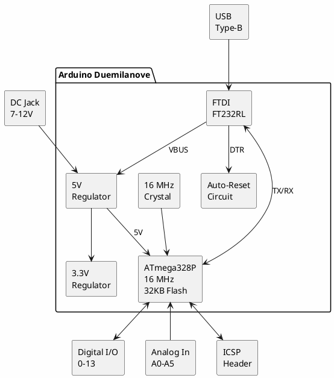

# Arduino Duemilanove

**8-bit AVR Development Board**

## Device Information

| Field | Value |
|-------|-------|
| Manufacturer | Arduino |
| Model | Duemilanove (2009) |
| MCU | ATmega328P (or ATmega168) |
| USB Chip | FTDI FT232RL |
| Year | 2008-2010 |
| Date Acquired | |
| Quantity | |

## Specifications

| Specification | Value |
|--------------|-------|
| Microcontroller | ATmega328P |
| Architecture | 8-bit AVR |
| Clock Speed | 16 MHz |
| Flash Memory | 32 KB (2 KB bootloader) |
| SRAM | 2 KB |
| EEPROM | 1 KB |
| Digital I/O | 14 (6 PWM) |
| Analog Inputs | 6 |
| Operating Voltage | 5V |
| Input Voltage | 7-12V (recommended) |
| DC Current per I/O | 40 mA |
| USB | Type-B (FTDI FT232RL) |

## Arduino Board Comparison

| Board | MCU | Flash | RAM | USB Chip | Year |
|-------|-----|-------|-----|----------|------|
| Diecimila | ATmega168 | 16 KB | 1 KB | FTDI | 2007 |
| **Duemilanove** | ATmega328P | 32 KB | 2 KB | FTDI | 2008 |
| UNO R1-R3 | ATmega328P | 32 KB | 2 KB | ATmega16U2 | 2010 |
| UNO R4 | RA4M1 | 256 KB | 32 KB | Native | 2023 |

## Pinout

```
                    Arduino Duemilanove
                    +--[USB Type-B]--+
                    |    [RESET]     |
              AREF -|                |-
               GND -|                |- IOREF (not present)
 (SCL/ADC5) A5/19 -|                |- RESET
 (SDA/ADC4) A4/18 -|                |- 3.3V
     (ADC3) A3/17 -|                |- 5V
     (ADC2) A2/16 -|                |- GND
     (ADC1) A1/15 -|   ATmega328P   |- GND
     (ADC0) A0/14 -|                |- VIN
              VIN -|                |-
              GND -|    [16MHz]     |- 0 (RX) ← USB
              GND -|                |- 1 (TX) → USB
               5V -|                |- 2 (INT0)
               3V -|    [FTDI]      |- 3 (INT1/PWM)
            RESET -|                |- 4
                    |    [ICSP]     |- 5 (PWM)
      (SS)  10/SS -|                |- 6 (PWM)
    (MOSI) 11/PWM -|                |- 7
    (MISO) 12     -|                |- 8
     (SCK) 13/LED -|________________|- 9 (PWM)

                    PWM: 3, 5, 6, 9, 10, 11
```

### Pin Functions

| Pin | Primary | Alternate Functions |
|-----|---------|---------------------|
| 0 | Digital I/O | RX (Serial receive) |
| 1 | Digital I/O | TX (Serial transmit) |
| 2 | Digital I/O | INT0 (External interrupt) |
| 3 | Digital I/O | INT1, PWM (Timer2) |
| 4 | Digital I/O | T0 (Timer0 input) |
| 5 | Digital I/O | PWM (Timer0), T1 |
| 6 | Digital I/O | PWM (Timer0) |
| 7 | Digital I/O | - |
| 8 | Digital I/O | ICP1 (Input capture) |
| 9 | Digital I/O | PWM (Timer1) |
| 10 | Digital I/O | PWM (Timer1), SS (SPI) |
| 11 | Digital I/O | PWM (Timer2), MOSI (SPI) |
| 12 | Digital I/O | MISO (SPI) |
| 13 | Digital I/O | SCK (SPI), Built-in LED |
| A0-A5 | Analog In | Digital I/O 14-19 |
| A4 | Analog In | SDA (I2C) |
| A5 | Analog In | SCL (I2C) |

## Block Diagram



## Power Options

| Source | Voltage | Notes |
|--------|---------|-------|
| USB | 5V | From FTDI, limited current |
| DC Jack | 7-12V | Center positive, 2.1mm |
| VIN pin | 7-12V | Same as DC jack input |
| 5V pin | 5V | Direct 5V input (bypasses regulator) |

**Auto-selection**: Board automatically selects highest voltage source.

## FTDI FT232RL USB Interface

The Duemilanove uses a genuine FTDI FT232RL chip (unlike later clones with CH340):

| Feature | Value |
|---------|-------|
| USB | Full Speed (12 Mbps) |
| Baud Rates | 300 - 3M baud |
| VID:PID | 0403:6001 |
| Driver | FTDI VCP or D2XX |

### Auto-Reset Circuit

The DTR signal from the FT232RL triggers reset via a 100nF capacitor, enabling automatic reset when uploading sketches.

## ICSP Header

```
        MISO  1 ● ○ 2  VCC
         SCK  3 ○ ○ 4  MOSI
       RESET  5 ○ ○ 6  GND
```

Used for:
- Burning bootloader
- Programming without bootloader
- SPI communication

## Programming

### Arduino IDE

1. Select Board: **Tools → Board → Arduino Duemilanove or Diecimila**
2. Select Processor: **ATmega328P** (or ATmega168)
3. Select Port: COM port / /dev/ttyUSBx
4. Upload sketch

### Bootloader

| Parameter | Value |
|-----------|-------|
| Bootloader | Optiboot (or older Arduino bootloader) |
| Size | 2 KB (512 bytes with Optiboot) |
| Baud Rate | 57600 (old) or 115200 (Optiboot) |
| Protocol | STK500v1 |

### AVRDUDE (Direct)

```bash
# Upload via bootloader
avrdude -c arduino -p atmega328p -P /dev/ttyUSB0 -b 57600 -U flash:w:sketch.hex

# Upload via ISP (USBasp)
avrdude -c usbasp -p atmega328p -U flash:w:sketch.hex
```

## Duemilanove vs UNO

| Feature | Duemilanove | UNO |
|---------|-------------|-----|
| MCU | ATmega328P | ATmega328P |
| USB Chip | FTDI FT232RL | ATmega16U2 |
| USB Type | Type-B | Type-B |
| Auto-Reset | Via FTDI DTR | Via 16U2 |
| VID:PID | 0403:6001 (FTDI) | 2341:0043 (Arduino) |
| Price (2010) | ~$30 | ~$25 |

**Key difference**: FTDI chip vs ATmega16U2 for USB. Both functionally equivalent for most uses.

## Software Compatibility

Fully compatible with:
- Arduino IDE (all versions)
- PlatformIO
- AVR-GCC toolchain
- All Arduino libraries

## Example Sketch

```cpp
// Blink LED on pin 13
void setup() {
    pinMode(13, OUTPUT);
}

void loop() {
    digitalWrite(13, HIGH);
    delay(1000);
    digitalWrite(13, LOW);
    delay(1000);
}
```

## Documentation

- [Arduino Duemilanove Product Page](https://docs.arduino.cc/retired/boards/arduino-duemilanove/)
- [ATmega328P Datasheet](https://ww1.microchip.com/downloads/en/DeviceDoc/Atmel-7810-Automotive-Microcontrollers-ATmega328P_Datasheet.pdf)
- [FT232R Datasheet](https://ftdichip.com/wp-content/uploads/2020/08/DS_FT232R.pdf)
- [Arduino Language Reference](https://www.arduino.cc/reference/en/)

## Notes

- **"Duemilanove"** = Italian for "2009"
- **Discontinued** - Replaced by Arduino UNO in 2010
- **FTDI genuine** - No driver issues unlike CH340 clones
- **Two MCU variants**: Early boards used ATmega168 (16KB flash)
- **Bootloader baud**: 57600 for original bootloader, 115200 for Optiboot
- **Identical to UNO** electrically (except USB chip)
- **Legacy boards** may need older Arduino IDE versions

## Troubleshooting

### Upload Fails
- Check correct board/processor selected
- Try pressing reset just before upload starts
- Verify COM port in Device Manager
- Try 57600 baud if 115200 fails

### Port Not Found
- Install FTDI VCP drivers
- Check USB cable (some are charge-only)
- Try different USB port

### Sketch Too Large
- ATmega168 variant has only 16KB flash
- Check processor selection in IDE

## Related Boards

| Board | Notes |
|-------|-------|
| Arduino Diecimila | Predecessor (ATmega168) |
| Arduino UNO | Successor (ATmega16U2 USB) |
| Arduino Nano | Same MCU, smaller form factor |

## Local Files

### Documentation
- `Duemilanove_Schematic.pdf` - Board schematic
- `ATmega328P_Datasheet.pdf` - MCU datasheet
