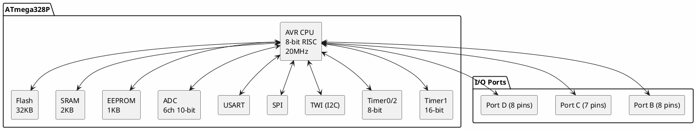

# ATmega328 / ATmega328P

**8-bit AVR Microcontroller**

## Device Information

| Field | Value |
|-------|-------|
| Manufacturer | Microchip (formerly Atmel) |
| Part Number | ATmega328P / ATmega328PB |
| Package | DIP-28, TQFP-32, QFN-32 |
| Date Acquired | |
| Quantity | |

## Specifications

| Specification | Value |
|--------------|-------|
| Architecture | AVR 8-bit RISC |
| Clock Speed | Up to 20 MHz |
| Flash | 32 KB |
| SRAM | 2 KB |
| EEPROM | 1 KB |
| GPIO | 23 |
| Operating Voltage | 1.8-5.5V |
| ADC | 6/8 channels, 10-bit |

## Peripherals

| Peripheral | Quantity/Details |
|-----------|------------------|
| Timer/Counter | 3 (2x 8-bit, 1x 16-bit) |
| PWM | 6 channels |
| UART | 1 (hardware) |
| SPI | 1 (master/slave) |
| I2C (TWI) | 1 |
| ADC | 6 channels (8 on SMD packages) |
| Analog Comparator | 1 |
| External Interrupts | 2 (INT0, INT1) |
| Pin Change Interrupts | 24 |

## Pinout (DIP-28)

```
                  ATmega328P
                  +----U----+
   (RESET) PC6    |1      28| PC5 (ADC5/SCL)
     (RXD) PD0    |2      27| PC4 (ADC4/SDA)
     (TXD) PD1    |3      26| PC3 (ADC3)
    (INT0) PD2    |4      25| PC2 (ADC2)
    (INT1) PD3    |5      24| PC1 (ADC1)
      (T0) PD4    |6      23| PC0 (ADC0)
           VCC    |7      22| GND
           GND    |8      21| AREF
   (XTAL1) PB6    |9      20| AVCC
   (XTAL2) PB7    |10     19| PB5 (SCK)
      (T1) PD5    |11     18| PB4 (MISO)
    (AIN0) PD6    |12     17| PB3 (MOSI/OC2A)
    (AIN1) PD7    |13     16| PB2 (SS/OC1B)
    (ICP1) PB0    |14     15| PB1 (OC1A)
                  +---------+
```

## Arduino UNO Pin Mapping

| Arduino | ATmega328P | Function |
|---------|------------|----------|
| D0 | PD0 | RX |
| D1 | PD1 | TX |
| D2 | PD2 | INT0 |
| D3 | PD3 | INT1/PWM |
| D4 | PD4 | - |
| D5 | PD5 | PWM |
| D6 | PD6 | PWM |
| D7 | PD7 | - |
| D8 | PB0 | - |
| D9 | PB1 | PWM |
| D10 | PB2 | PWM/SS |
| D11 | PB3 | PWM/MOSI |
| D12 | PB4 | MISO |
| D13 | PB5 | SCK/LED |
| A0-A5 | PC0-PC5 | ADC |

## Block Diagram



## Programming

| Method | Tools |
|--------|-------|
| ISP | USBasp, AVR ISP mkII, Arduino as ISP |
| Bootloader | USB (Arduino) |
| debugWIRE | Atmel-ICE |
| JTAG | Not available (use ATmega328PB) |

### ISP Wiring

| Programmer | ATmega328P |
|------------|------------|
| MOSI | PB3 (pin 17) |
| MISO | PB4 (pin 18) |
| SCK | PB5 (pin 19) |
| RESET | PC6 (pin 1) |
| VCC | VCC (pin 7) |
| GND | GND (pin 8/22) |

## Documentation

- [ATmega328P Datasheet](https://ww1.microchip.com/downloads/en/DeviceDoc/Atmel-7810-Automotive-Microcontrollers-ATmega328P_Datasheet.pdf)
- [ATmega328PB Datasheet](https://ww1.microchip.com/downloads/en/DeviceDoc/40001906A.pdf)

## Software & Tools

### Arduino IDE
- Native support (Arduino UNO uses ATmega328P)
- Select "Arduino UNO" or "Arduino Nano"

### PlatformIO

```ini
[env:atmega328p]
platform = atmelavr
board = atmega328p
framework = arduino
```

### Standalone (without Arduino)

```ini
[env:atmega328p_bare]
platform = atmelavr
board = ATmega328P
board_build.f_cpu = 16000000L
upload_protocol = usbasp
```

## Fuse Settings

| Fuse | Default | Typical Arduino |
|------|---------|-----------------|
| LOW | 0x62 | 0xFF (external crystal) |
| HIGH | 0xD9 | 0xDE (bootloader) |
| EXTENDED | 0xFF | 0xFD (BOD 2.7V) |

## ATmega328 vs ATmega328P vs ATmega328PB

| Feature | 328 | 328P | 328PB |
|---------|-----|------|-------|
| picoPower | No | Yes | Yes |
| UARTs | 1 | 1 | 2 |
| I2C | 1 | 1 | 2 |
| SPI | 1 | 1 | 2 |
| Timers | 3 | 3 | 5 |
| Touch | No | No | Yes |

## Common Uses

- Arduino UNO / Nano
- Standalone embedded projects
- Educational platform
- Hobby robotics
- IoT prototyping

## Notes

- **Most popular AVR** - Huge community, extensive libraries
- **Arduino compatible** - Direct support in Arduino IDE
- **Hardware UART** - Unlike ATtiny series
- **Hardware I2C/SPI** - Full peripheral support
- **5V tolerant** - Easy to interface with legacy devices

## Local Files

### Pinout


### Documentation
- `ATmega328P_Datasheet.pdf` - Main datasheet
