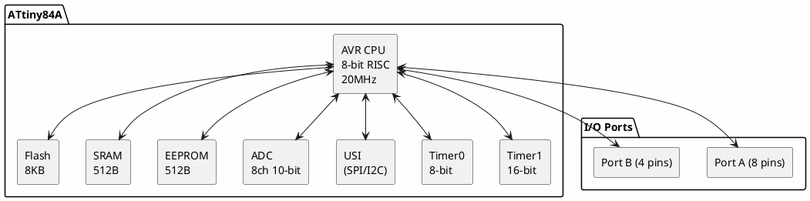

# ATtiny84A

**8-bit AVR Microcontroller**

## Device Information

| Field | Value |
|-------|-------|
| Manufacturer | Microchip (formerly Atmel) |
| Part Number | ATtiny84A |
| Package | DIP-14, SOIC-14, QFN-20 |
| Date Acquired | |
| Quantity | |

## Specifications

| Specification | Value |
|--------------|-------|
| Architecture | AVR 8-bit RISC |
| Clock Speed | Up to 20 MHz |
| Flash | 8 KB |
| SRAM | 512 bytes |
| EEPROM | 512 bytes |
| GPIO | 12 |
| Operating Voltage | 1.8-5.5V |
| ADC | 8 channels, 10-bit |

## Peripherals

| Peripheral | Quantity/Details |
|-----------|------------------|
| Timer/Counter | 2 (8-bit + 16-bit) |
| PWM | 4 channels |
| USI | 1 (SPI/I2C capable) |
| ADC | 8 channels (10-bit) |
| Analog Comparator | 1 |
| External Interrupts | 1 (INT0) |
| Pin Change Interrupts | 12 |

## Pinout

```
                ATtiny84A
                +----U----+
            VCC |1      14| GND
 (XTAL1) PB0    |2      13| PA0 (ADC0/AREF)
 (XTAL2) PB1    |3      12| PA1 (ADC1)
 (RESET) PB3    |4      11| PA2 (ADC2)
   (INT0) PB2   |5      10| PA3 (ADC3)
   (ADC7) PA7   |6       9| PA4 (ADC4/SCK)
   (ADC6) PA6   |7       8| PA5 (ADC5/MISO)
                +---------+
```

### Pin Functions

| Pin | Port | ADC | Timer | USI | Other |
|-----|------|-----|-------|-----|-------|
| PA0 | GPIO | ADC0 | - | - | AREF |
| PA1 | GPIO | ADC1 | - | - | AIN0 |
| PA2 | GPIO | ADC2 | - | - | AIN1 |
| PA3 | GPIO | ADC3 | - | - | T0 |
| PA4 | GPIO | ADC4 | - | SCK | T1/CLK |
| PA5 | GPIO | ADC5 | OC1B | MISO | - |
| PA6 | GPIO | ADC6 | OC1A | MOSI | - |
| PA7 | GPIO | ADC7 | OC0B | - | - |
| PB0 | GPIO | - | OC0A | - | XTAL1 |
| PB1 | GPIO | - | - | - | XTAL2 |
| PB2 | GPIO | - | - | - | INT0 |
| PB3 | RESET | - | - | - | dW |

## Block Diagram



## Programming

| Method | Tools |
|--------|-------|
| ISP | USBasp, AVR ISP mkII, Arduino as ISP |
| High-Voltage | STK500, HV programmers |
| debugWIRE | Atmel-ICE |

### ISP Wiring

| Programmer | ATtiny84A |
|------------|-----------|
| MOSI | PA6 (pin 7) |
| MISO | PA5 (pin 8) |
| SCK | PA4 (pin 9) |
| RESET | PB3 (pin 4) |
| VCC | VCC (pin 1) |
| GND | GND (pin 14) |

## Documentation

- [ATtiny84A Datasheet](https://ww1.microchip.com/downloads/en/DeviceDoc/ATtiny24A-44A-84A-DataSheet-DS40002269A.pdf)
- [AVR Instruction Set](https://ww1.microchip.com/downloads/en/DeviceDoc/AVR-Instruction-Set-Manual-DS40002198A.pdf)

## Software & Tools

### Arduino IDE Setup (ATtinyCore)

1. Add URL: `http://drazzy.com/package_drazzy.com_index.json`
2. Install "ATTinyCore"
3. Select "ATtiny84/84A"

### PlatformIO

```ini
[env:attiny84a]
platform = atmelavr
board = attiny84
framework = arduino
upload_protocol = usbasp
```

## ATtiny84 vs ATtiny84A

| Feature | ATtiny84 | ATtiny84A |
|---------|----------|-----------|
| Low voltage | 2.7V min | 1.8V min |
| Power modes | Standard | Enhanced |
| Brown-out | Fixed levels | More options |
| Temperature | -40 to +85°C | Same |

## Common Uses

- More pins than ATtiny85
- Sensor interfaces (8 ADC channels)
- Small control projects
- I2C slave devices
- LED drivers

## Notes

- **More I/O than ATtiny85** - 12 GPIO vs 6
- **8 ADC channels** - Good for sensor applications
- **16-bit timer** - Better PWM resolution than ATtiny85
- **No hardware UART** - Use SoftwareSerial
- **picoPower** - Very low sleep current

## Related Parts

| Part | Flash | RAM | GPIO | ADC |
|------|-------|-----|------|-----|
| ATtiny24A | 2 KB | 128 B | 12 | 8 |
| ATtiny44A | 4 KB | 256 B | 12 | 8 |
| ATtiny84A | 8 KB | 512 B | 12 | 8 |

## Local Files

### Pinout


### Documentation
- `ATtiny84A_Datasheet.pdf` - Main datasheet
