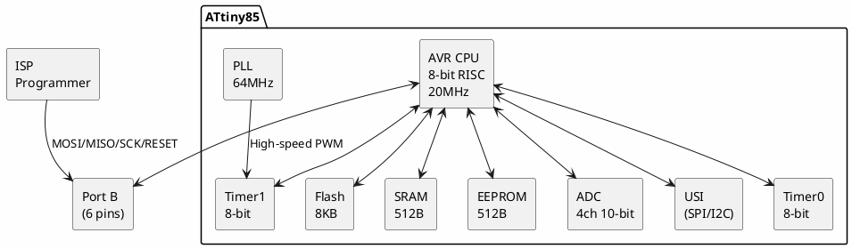

# ATtiny85

**8-bit AVR Microcontroller**

## Device Information

| Field | Value |
|-------|-------|
| Manufacturer | Microchip (formerly Atmel) |
| Part Number | ATtiny85 / ATtiny85V |
| Package | DIP-8, SOIC-8, QFN-20 |
| Date Acquired | |
| Quantity | |

## Specifications

| Specification | Value |
|--------------|-------|
| Architecture | AVR 8-bit RISC |
| Clock Speed | Up to 20 MHz (10 MHz @ 2.7V) |
| Flash | 8 KB |
| SRAM | 512 bytes |
| EEPROM | 512 bytes |
| GPIO | 6 (5 usable with reset disabled) |
| Operating Voltage | 2.7-5.5V (1.8V for V variant) |
| ADC | 4 channels, 10-bit |

## Peripherals

| Peripheral | Quantity/Details |
|-----------|------------------|
| Timer/Counter | 2 (8-bit) |
| PWM | 4 channels (Timer0 + Timer1) |
| USI | 1 (SPI/I2C capable) |
| ADC | 4 channels (10-bit) |
| Analog Comparator | 1 |
| External Interrupts | 1 (INT0) |
| Pin Change Interrupts | 6 |

## Pinout

```
              ATtiny85
              +---U---+
  (RESET) PB5 |1     8| VCC
    (ADC3) PB3|2     7| PB2 (ADC1/SCK)
    (ADC2) PB4|3     6| PB1 (MISO/OC0B)
          GND |4     5| PB0 (MOSI/OC0A)
              +-------+
```

### Pin Functions

| Pin | Primary | ADC | Timer | USI | Other |
|-----|---------|-----|-------|-----|-------|
| PB0 | GPIO | - | OC0A | MOSI/SDA | AREF |
| PB1 | GPIO | - | OC0B | MISO | - |
| PB2 | GPIO | ADC1 | OC1B | SCK/SCL | INT0 |
| PB3 | GPIO | ADC3 | OC1B | - | PCINT3 |
| PB4 | GPIO | ADC2 | OC1B | - | PCINT4 |
| PB5 | RESET | ADC0 | - | - | dW |

## Block Diagram



## Programming

| Method | Tools |
|--------|-------|
| ISP | USBasp, AVR ISP mkII, Arduino as ISP |
| High-Voltage | STK500, HV programmers |
| debugWIRE | Atmel-ICE |

### ISP Wiring

| Programmer | ATtiny85 |
|------------|----------|
| MOSI | PB0 (pin 5) |
| MISO | PB1 (pin 6) |
| SCK | PB2 (pin 7) |
| RESET | PB5 (pin 1) |
| VCC | VCC (pin 8) |
| GND | GND (pin 4) |

## Documentation

- [ATtiny85 Datasheet](https://ww1.microchip.com/downloads/en/DeviceDoc/Atmel-2586-AVR-8-bit-Microcontroller-ATtiny25-ATtiny45-ATtiny85_Datasheet.pdf)
- [AVR Instruction Set](https://ww1.microchip.com/downloads/en/DeviceDoc/AVR-Instruction-Set-Manual-DS40002198A.pdf)

## Software & Tools

### Official Tools
- **Microchip Studio** - Full IDE
- **MPLAB X IDE** - Cross-platform

### Open-Source Alternatives
- **Arduino IDE** - With ATtinyCore or Digispark
- **PlatformIO** - Cross-platform
- **avr-gcc / avrdude** - Command-line

### Arduino IDE Setup

**ATtinyCore:**
1. Add URL: `http://drazzy.com/package_drazzy.com_index.json`
2. Install "ATTinyCore" from Boards Manager
3. Select "ATtiny85"

**Digispark (for USB bootloader):**
1. Add URL: `http://digistump.com/package_digistump_index.json`
2. Install "Digistump AVR Boards"
3. Select "Digispark (Default - 16.5mhz)"

### PlatformIO

```ini
[env:attiny85]
platform = atmelavr
board = attiny85
framework = arduino
upload_protocol = usbasp
```

## Special Features

### High-Speed Timer1
- Driven by 64 MHz PLL
- Up to 250 kHz PWM
- Useful for high-frequency applications

### USB with V-USB
- Software USB implementation
- Used in Digispark boards
- 1.5 Mbps low-speed USB

## Common Uses

- Digispark USB development board
- Small embedded projects
- LED drivers / NeoPixel controllers
- USB HID devices
- Sensor nodes
- Wearables

## Notes

- **Popular for small projects** - Good balance of features vs size
- **No hardware UART** - Use SoftwareSerial or USI
- **USI not true I2C** - Requires TinyWire library
- **Limited pins** - Only 6 I/O (5 if using reset)
- **Disable reset for extra pin** - Requires HV programmer to recover

## Digispark Bootloader

Many ATtiny85s come with Micronucleus USB bootloader:
- Programs via USB (no programmer needed)
- Uses ~2KB of flash
- 5-second programming window on reset

## Local Files

### Pinout


### Documentation
- `ATtiny85_Datasheet.pdf` - Main datasheet
