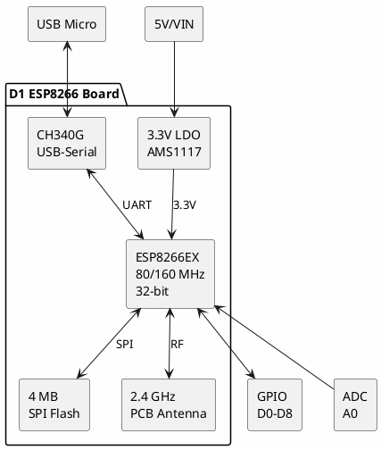

# D1 ESP8266 (Arduino Compatible)

**ESP8266 WiFi Development Board (UNO Form Factor)**

## Device Information

| Field | Value |
|-------|-------|
| Manufacturer | WeMos / Generic |
| Model | D1 (ESP8266-based) |
| MCU | ESP8266EX |
| Form Factor | Arduino UNO compatible |
| Date Acquired | |
| Quantity | |

## Specifications

| Specification | Value |
|--------------|-------|
| SoC | ESP8266EX |
| CPU | Tensilica L106 32-bit RISC |
| Clock Speed | 80 MHz (160 MHz boost) |
| Flash | 4 MB (external) |
| RAM | 80 KB user available |
| WiFi | 802.11 b/g/n (2.4 GHz) |
| GPIO | 11 (active low on some) |
| ADC | 1 (10-bit, 0-1V) |
| PWM | Software, all GPIO |
| Operating Voltage | 3.3V |
| Input Voltage | 5-12V (via regulator) |

## D1 Board Variants

| Variant | USB Chip | Flash | Notes |
|---------|----------|-------|-------|
| D1 (Original) | CH340G | 4 MB | Arduino UNO size |
| D1 Mini | CH340G | 4 MB | Compact form factor |
| D1 Mini Pro | CH340G | 16 MB | External antenna option |
| D1 R2 | CH340G | 4 MB | Improved layout |

## Pinout (D1 UNO Form Factor)

```
                      D1 ESP8266
                   +--[USB Micro]--+
                   |               |
            RESET -|    ESP8266    |-
             3.3V -|               |-
               5V -|    [Antenna]  |- SCL (D1/GPIO5)
              GND -|               |- SDA (D2/GPIO4)
              GND -|    [CH340]    |- D3 (GPIO0) *FLASH
              VIN -|               |- D4 (GPIO2) *LED
                   |               |- D5 (GPIO14) SCK
         A0 (ADC) -|               |- D6 (GPIO12) MISO
                   |               |- D7 (GPIO13) MOSI
           D0/RST -|_______________|- D8 (GPIO15) SS

    * D4 has onboard LED (active LOW)
    * D3 is FLASH button (boot mode)
```

### Pin Mapping (Arduino → ESP8266)

| D1 Pin | Arduino | ESP8266 GPIO | Function |
|--------|---------|--------------|----------|
| TX | D1 TX | GPIO1 | UART TX |
| RX | D1 RX | GPIO3 | UART RX |
| D0 | - | GPIO16 | Wake from deep sleep |
| D1 | SCL | GPIO5 | I2C Clock |
| D2 | SDA | GPIO4 | I2C Data |
| D3 | - | GPIO0 | Boot mode / Flash button |
| D4 | - | GPIO2 | Built-in LED (active LOW) |
| D5 | SCK | GPIO14 | SPI Clock |
| D6 | MISO | GPIO12 | SPI MISO |
| D7 | MOSI | GPIO13 | SPI MOSI |
| D8 | SS | GPIO15 | SPI CS (pull-down at boot) |
| A0 | A0 | ADC0 | Analog input (0-1V) |

### Boot Mode Pins

| GPIO0 | GPIO2 | GPIO15 | Mode |
|-------|-------|--------|------|
| HIGH | HIGH | LOW | Normal boot (flash) |
| LOW | HIGH | LOW | UART download mode |
| x | x | HIGH | SD card boot |

**Important**: GPIO15 must be LOW at boot, GPIO0 and GPIO2 must be HIGH.

## Block Diagram



## Arduino IDE Setup

### Board Manager URL

Add to **File → Preferences → Additional Board Manager URLs**:
```
http://arduino.esp8266.com/stable/package_esp8266com_index.json
```

### Board Selection

1. **Tools → Board → ESP8266 Boards → LOLIN(WeMos) D1 R1** or **Generic ESP8266 Module**
2. **Flash Size**: 4MB (FS:2MB OTA:~1019KB)
3. **Upload Speed**: 921600
4. **CPU Frequency**: 80 MHz or 160 MHz

## Programming

### Via USB (CH340)

Standard Arduino upload via USB:

```bash
# Using esptool.py
esptool.py --chip esp8266 --port /dev/ttyUSB0 --baud 921600 \
    write_flash 0x00000 firmware.bin
```

### PlatformIO Configuration

```ini
[env:d1]
platform = espressif8266
board = d1
framework = arduino
monitor_speed = 115200
upload_speed = 921600
```

## WiFi Example

```cpp
#include <ESP8266WiFi.h>

const char* ssid = "YourNetwork";
const char* password = "YourPassword";

void setup() {
    Serial.begin(115200);

    WiFi.begin(ssid, password);
    Serial.print("Connecting");

    while (WiFi.status() != WL_CONNECTED) {
        delay(500);
        Serial.print(".");
    }

    Serial.println();
    Serial.print("IP: ");
    Serial.println(WiFi.localIP());
}

void loop() {
    // Your code here
}
```

## Web Server Example

```cpp
#include <ESP8266WiFi.h>
#include <ESP8266WebServer.h>

const char* ssid = "YourNetwork";
const char* password = "YourPassword";

ESP8266WebServer server(80);

void handleRoot() {
    String html = "<html><body>";
    html += "<h1>ESP8266 D1</h1>";
    html += "<p>Hello from ESP8266!</p>";
    html += "</body></html>";
    server.send(200, "text/html", html);
}

void setup() {
    Serial.begin(115200);

    WiFi.begin(ssid, password);
    while (WiFi.status() != WL_CONNECTED) {
        delay(500);
    }

    Serial.println(WiFi.localIP());

    server.on("/", handleRoot);
    server.begin();
}

void loop() {
    server.handleClient();
}
```

## Deep Sleep Example

```cpp
// D0 must be connected to RST for wake

void setup() {
    Serial.begin(115200);
    Serial.println("Awake!");

    // Do work here

    Serial.println("Going to sleep for 10 seconds...");
    ESP.deepSleep(10e6);  // Microseconds
}

void loop() {
    // Never reached
}
```

## Power Consumption

| Mode | Current |
|------|---------|
| Active (WiFi TX) | ~170 mA |
| Active (WiFi RX) | ~56 mA |
| Active (no WiFi) | ~15 mA |
| Light Sleep | ~0.4 mA |
| Deep Sleep | ~20 µA |

## GPIO Considerations

### Pins with Restrictions

| Pin | Restriction |
|-----|-------------|
| GPIO0 (D3) | Boot mode - must be HIGH at boot |
| GPIO2 (D4) | Boot mode - must be HIGH at boot, has LED |
| GPIO15 (D8) | Must be LOW at boot |
| GPIO16 (D0) | Only pin that can wake from deep sleep |
| ADC | 0-1V input only (use voltage divider for 3.3V) |

### Safe Pins for General I/O

- D1 (GPIO5), D2 (GPIO4) - Best for I2C
- D5 (GPIO14), D6 (GPIO12), D7 (GPIO13) - SPI or general use

## CH340 USB Driver

| OS | Driver |
|----|--------|
| Windows 10/11 | Usually auto-installs |
| Windows 7/8 | Manual CH340 driver install |
| macOS | CH340 driver from WCH |
| Linux | Built-in (ch341 module) |

## Shields & Compatibility

**Arduino shield compatibility**: LIMITED
- 3.3V logic (not 5V tolerant!)
- Different pin mapping
- Fewer I/O pins than UNO

Use shields designed for ESP8266 or D1 specifically.

## Documentation

- [ESP8266 Arduino Core](https://github.com/esp8266/Arduino)
- [ESP8266 Technical Reference](https://www.espressif.com/sites/default/files/documentation/esp8266-technical_reference_en.pdf)
- [WeMos D1 Wiki](https://www.wemos.cc/en/latest/d1/d1_mini.html)
- [ESP8266 Community Forum](https://www.esp8266.com/)

## Notes

- **3.3V ONLY** - GPIO pins are NOT 5V tolerant
- **Limited GPIO** - Fewer pins than Arduino UNO
- **ADC range** - 0-1V only, use voltage divider
- **PWM** - Software PWM, may flicker
- **Boot pins** - D3, D4, D8 have boot requirements
- **Flash button** - D3 (GPIO0) doubles as flash mode button
- **LED** - D4 (GPIO2) has onboard LED, active LOW
- **Deep sleep** - Connect D0 to RST for wake capability
- **CH340 clone** - Some boards have counterfeit chips

## Troubleshooting

### Upload Fails
- Hold FLASH button while pressing RESET
- Release FLASH after upload starts
- Try lower upload speed (115200)
- Check CH340 driver installed

### WiFi Won't Connect
- Check 2.4 GHz network (no 5 GHz support)
- Verify credentials
- Try WiFi.disconnect() first
- Check power supply (needs ~170mA for TX)

### Brownout/Resets
- USB power may be insufficient
- Use external 5V supply
- Add 100µF capacitor on 3.3V rail

### GPIO Conflicts
- Check boot mode pin requirements
- GPIO15 pulled LOW prevents boot
- GPIO0/2 LOW at boot enters flash mode

## Comparison with Other ESP8266 Boards

| Board | GPIO | Flash | Form Factor | USB |
|-------|------|-------|-------------|-----|
| D1 | 11 | 4 MB | UNO size | CH340 |
| D1 Mini | 11 | 4 MB | Compact | CH340 |
| NodeMCU | 11 | 4 MB | Breadboard | CP2102/CH340 |
| ESP-01 | 2 | 1 MB | Minimal | None |

## Local Files

### Documentation
- `ESP8266_Datasheet.pdf` - SoC datasheet
- `D1_Schematic.pdf` - Board schematic
