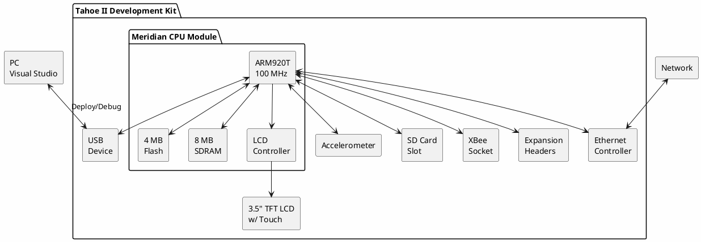

# Device Solutions Tahoe II

**.NET Micro Framework Development Kit**

## Device Information

| Field | Value |
|-------|-------|
| Manufacturer | Device Solutions (EmbeddedFusion) |
| Model | Tahoe II Development Kit |
| Revision | Rev 1.0 |
| Year | 2008 |
| Platform | .NET Micro Framework |
| Status | Working |
| Date Acquired | - |
| Purchase Price | $0.00 (competition prize) |
| Source | Microsoft .NET Micro Framework competition |
| Quantity | 1 |

## Specifications

| Specification | Value |
|--------------|-------|
| CPU Module | Meridian CPU |
| Processor | Freescale i.MXS (ARM920T) |
| Clock Speed | 100 MHz |
| Flash | 4 MB |
| SDRAM | 8 MB |
| Display | 3.5" TFT LCD with Touch |
| Ethernet | Yes (on-board) |
| Wireless | XBee socket |
| Storage | SD card slot |
| Sensors | Accelerometer |

## Meridian CPU Module

The Tahoe II is built around the Meridian CPU module:

| Specification | Value |
|--------------|-------|
| Processor Core | ARM920T |
| Clock | 100 MHz |
| Flash Memory | 4 MB |
| SDRAM | 8 MB |
| Module Size | 35mm x 35mm |
| LCD Controller | Built-in |
| USB | Device mode |

### Meridian Interfaces

| Interface | Details |
|-----------|---------|
| GPIO | Multiple pins available |
| SPI | Bus available on expansion |
| I2C | Bus available on expansion |
| Serial | RS-232 level + TTL |
| USB | Device (client) mode |

## Block Diagram



## Tahoe vs Tahoe II Comparison

| Feature | Tahoe (Original) | Tahoe II |
|---------|------------------|----------|
| CPU | Meridian | Meridian |
| Display | 2.7" LCD | 3.5" LCD w/ Touch |
| Ethernet | Expansion module | On-board |
| Accelerometer | No | Yes |
| SD Card | Yes | Yes |
| XBee Socket | Yes | Yes |
| Price (2008) | $399 | $399 |

## Expansion Headers

The Tahoe II features expansion headers compatible with the Meridian/P:

### EXP1 Header
- Additional GPIO
- Serial port (TTL)
- SPI signals

### EXP2 Header
- Additional GPIO
- I2C signals
- Analog inputs

## Software Development

### Requirements
- **Visual Studio** 2008/2010 with .NET Micro Framework SDK
- **.NET Micro Framework** v3.0 or v4.0
- **Device Solutions SDK** - Board support package

### Development Environment Setup

1. Install Visual Studio (2008 or 2010 recommended for era)
2. Install .NET Micro Framework SDK
3. Install Device Solutions Tahoe II SDK/BSP
4. Connect Tahoe II via USB
5. Deploy and debug directly from Visual Studio

### .NET Micro Framework Features

| Feature | Support |
|---------|---------|
| C# Language | Full |
| Debugging | Via USB |
| GPIO | Microsoft.SPOT.Hardware |
| SPI | Microsoft.SPOT.Hardware.SPI |
| I2C | Microsoft.SPOT.Hardware.I2C |
| Serial | System.IO.Ports |
| Networking | System.Net (Ethernet) |
| Graphics | Microsoft.SPOT.Presentation |
| Touch | Microsoft.SPOT.Touch |
| File System | System.IO (SD card) |

## Example Code

### Blink LED (C#)

```csharp
using System;
using System.Threading;
using Microsoft.SPOT;
using Microsoft.SPOT.Hardware;

namespace TahoeIIBlink
{
    public class Program
    {
        public static void Main()
        {
            // Configure GPIO pin as output
            OutputPort led = new OutputPort(Cpu.Pin.GPIO_Pin1, false);

            while (true)
            {
                led.Write(true);   // LED on
                Thread.Sleep(500);
                led.Write(false);  // LED off
                Thread.Sleep(500);
            }
        }
    }
}
```

### Read Accelerometer

```csharp
using System;
using Microsoft.SPOT;
using Microsoft.SPOT.Hardware;

namespace TahoeIIAccel
{
    public class Program
    {
        public static void Main()
        {
            // Initialize I2C for accelerometer
            I2CDevice accel = new I2CDevice(new I2CDevice.Configuration(0x1D, 400));

            byte[] writeBuffer = new byte[1];
            byte[] readBuffer = new byte[6];

            while (true)
            {
                // Read X, Y, Z registers
                writeBuffer[0] = 0x00;  // Start register
                I2CDevice.I2CTransaction[] xActions = new I2CDevice.I2CTransaction[]
                {
                    I2CDevice.CreateWriteTransaction(writeBuffer),
                    I2CDevice.CreateReadTransaction(readBuffer)
                };

                accel.Execute(xActions, 1000);

                Debug.Print("X: " + readBuffer[0] + " Y: " + readBuffer[2] + " Z: " + readBuffer[4]);
                Thread.Sleep(100);
            }
        }
    }
}
```

### Simple Web Server

```csharp
using System;
using System.Net;
using System.Net.Sockets;
using System.Text;
using System.Threading;
using Microsoft.SPOT;
using Microsoft.SPOT.Net.NetworkInformation;

namespace TahoeIIWebServer
{
    public class Program
    {
        public static void Main()
        {
            // Wait for DHCP
            NetworkInterface ni = NetworkInterface.GetAllNetworkInterfaces()[0];
            while (ni.IPAddress == "0.0.0.0")
            {
                Thread.Sleep(1000);
                ni = NetworkInterface.GetAllNetworkInterfaces()[0];
            }

            Debug.Print("IP Address: " + ni.IPAddress);

            // Create socket
            Socket server = new Socket(AddressFamily.InterNetwork,
                                       SocketType.Stream,
                                       ProtocolType.Tcp);
            server.Bind(new IPEndPoint(IPAddress.Any, 80));
            server.Listen(10);

            while (true)
            {
                Socket client = server.Accept();

                string response = "HTTP/1.1 200 OK\r\n" +
                                  "Content-Type: text/html\r\n\r\n" +
                                  "<html><body><h1>Tahoe II Web Server</h1></body></html>";

                client.Send(Encoding.UTF8.GetBytes(response));
                client.Close();
            }
        }
    }
}
```

## Documentation

- [Device Solutions Website (Archive)](http://devicesolutions.net/)
- [.NET Micro Framework on Microsoft Learn](https://learn.microsoft.com/en-us/archive/blogs/smaillet/tahoemeridian-firmware-updates-and-a-new-net-micro-framework-rapid-prototyping-system)
- [.NET Micro Framework Wikipedia](https://en.wikipedia.org/wiki/.NET_Micro_Framework)

## Software Downloads

### Historical Sources
- **Device Solutions SDK** - Was available from devicesolutions.net (site may be down)
- **.NET Micro Framework SDK** - Microsoft archives
- **Visual Studio 2010** - Still available from Microsoft

### Archive Resources
- Check archive.org for Device Solutions downloads
- .NET Micro Framework community forums may have archived SDKs
- GitHub repos may contain BSP code

## Programming/Deployment

| Method | Interface | Notes |
|--------|-----------|-------|
| USB | USB Device | Primary deployment method |
| MFDeploy | USB | Microsoft deployment tool |

### Deployment Steps

1. Build project in Visual Studio
2. Connect Tahoe II via USB
3. Select device in project properties
4. Press F5 to deploy and debug
5. Application persists in flash

## Notes

- **.NET Micro Framework** - Deprecated by Microsoft (2015), but still functional
- **Visual Studio 2010** - Best compatibility for .NET MF development
- **USB Driver** - May need legacy driver installation on Windows 10/11
- **Meridian CPU** - Same module used in original Tahoe and Meridian/P boards
- **XBee Compatible** - Can add wireless via XBee modules
- **Touch Screen** - Resistive touch on 3.5" display
- **Company Status** - Device Solutions appears to be inactive

## Common Issues

### Device Not Detected
- Install .NET Micro Framework SDK (includes USB drivers)
- Try USB 2.0 port (not USB 3.0)
- Check Device Manager for unknown devices
- May need Windows compatibility mode

### Deployment Fails
- Ensure correct device selected in Visual Studio
- Try MFDeploy utility to verify connection
- Check that firmware version matches SDK version
- Erase deployment area and retry

### Display Issues
- LCD configuration stored in device config area
- Use LCD configuration tool if using different display
- Check ribbon cable connection

## Alternatives

For modern .NET embedded development:
- **Wilderness Labs Meadow** - .NET on STM32F7
- **nanoFramework** - Open source .NET for MCUs
- **TinyCLR OS** - GHI Electronics, successor to .NET MF
- **Raspberry Pi + .NET** - Full .NET on Linux

## Related Devices

| Device | Platform | Notes |
|--------|----------|-------|
| Netduino | .NET Micro Framework | Arduino form factor |
| FEZ Domino | .NET Micro Framework | GHI Electronics |
| Tahoe (Original) | .NET Micro Framework | Predecessor |
| Meridian/P | .NET Micro Framework | Smaller prototyping board |

## Local Files

### Documentation
- `TahoeII_UserGuide.pdf` - User manual (if available)
- `TahoeII_Schematic.pdf` - Board schematic (if available)
