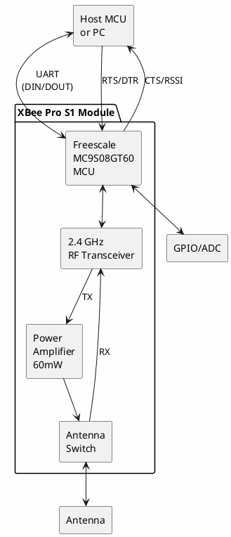

# Digi XBee Pro S1

**802.15.4 Wireless Module (High Power)**

## Device Information

| Field | Value |
|-------|-------|
| Manufacturer | Digi International (formerly MaxStream) |
| Model | XBee-PRO Series 1 |
| FCC ID | OUR-XBEEPRO |
| Protocol | IEEE 802.15.4 |
| Frequency | 2.4 GHz ISM |
| Date Acquired | |
| Quantity | |

## Specifications

| Specification | Value |
|--------------|-------|
| Frequency Band | 2.4 GHz (2.400 - 2.4835 GHz) |
| RF Data Rate | 250 kbps |
| Serial Data Rate | Up to 115.2 kbps |
| Indoor Range | ~300 ft (90 m) |
| Outdoor Range | Up to 1 mile (1.6 km) |
| Transmit Power | 60 mW (+18 dBm) |
| Receiver Sensitivity | -100 dBm |
| Supply Voltage | 2.8 - 3.4 V |
| Transmit Current | 215 mA @ 3.3V |
| Receive Current | 55 mA @ 3.3V |
| Sleep Current | < 10 µA |

## XBee vs XBee Pro S1 Comparison

| Feature | XBee S1 | XBee Pro S1 |
|---------|---------|-------------|
| FCC ID | OUR-XBEE | OUR-XBEEPRO |
| TX Power | 1 mW (0 dBm) | 60 mW (+18 dBm) |
| Indoor Range | ~100 ft | ~300 ft |
| Outdoor Range | ~300 ft | ~1 mile |
| TX Current | 45 mA | 215 mA |
| RX Current | 50 mA | 55 mA |
| Form Factor | Same | Same |

## Pinout (20-pin, 2mm pitch)

```
        XBee Pro S1
       +-----------+
  VCC  |1   +-+  20| GND
 DOUT  |2   | |  19| (not connected)
  DIN  |3   +-+  18| (not connected)
 DIO12 |4        17| AD3/DIO3
RESET  |5        16| AD2/DIO2
 RSSI  |6        15| ASSOC/AD1/DIO1
 DIO11 |7        14| VREF
  (nc) |8        13| ON/SLEEP
  DTR  |9        12| CTS/DIO7
  GND  |10       11| AD4/DIO4
       +-----------+
```

### Pin Descriptions

| Pin | Name | Direction | Description |
|-----|------|-----------|-------------|
| 1 | VCC | - | Power supply (2.8-3.4V) |
| 2 | DOUT | Output | UART Data Out (TX) |
| 3 | DIN | Input | UART Data In (RX) |
| 4 | DIO12 | Both | Digital I/O 12 |
| 5 | RESET | Input | Module reset (active low) |
| 6 | RSSI/PWM0 | Output | RX signal strength indicator (PWM) |
| 7 | DIO11 | Both | Digital I/O 11 |
| 8 | (nc) | - | Not connected |
| 9 | DTR/SLEEP_RQ | Input | Pin sleep control |
| 10 | GND | - | Ground |
| 11 | AD4/DIO4 | Both | Analog input 4 / Digital I/O 4 |
| 12 | CTS/DIO7 | Both | Clear to Send / Digital I/O 7 |
| 13 | ON/SLEEP | Output | Module status indicator |
| 14 | VREF | Input | Voltage reference for ADC |
| 15 | ASSOC/AD1/DIO1 | Both | Associate LED / Analog 1 / DIO 1 |
| 16 | AD2/DIO2 | Both | Analog input 2 / Digital I/O 2 |
| 17 | AD3/DIO3 | Both | Analog input 3 / Digital I/O 3 |
| 18 | (nc) | - | Not connected |
| 19 | (nc) | - | Not connected |
| 20 | GND | - | Ground |

## Block Diagram



## Operating Modes

### Serial Interface Modes

| Mode | Description |
|------|-------------|
| Transparent | Data in = Data out (default) |
| API | Framed data with addressing and I/O |

### Sleep Modes

| Mode | Command | Current | Wake Source |
|------|---------|---------|-------------|
| Normal | SM=0 | 55 mA RX | Always awake |
| Pin Sleep | SM=1 | < 10 µA | DTR pin low |
| Cyclic Sleep | SM=4,5 | < 50 µA avg | Timer/pin |

## AT Commands (Common)

### Configuration Commands

| Command | Description | Default |
|---------|-------------|---------|
| ATID | PAN ID (network ID) | 3332 |
| ATMY | 16-bit source address | 0 |
| ATDL | Destination address low | 0 |
| ATDH | Destination address high | 0 |
| ATCH | Channel (0x0B - 0x1A) | 0x0C |
| ATBD | Baud rate | 3 (9600) |
| ATAP | API enable | 0 (transparent) |

### Baud Rate Values (ATBD)

| Value | Baud Rate |
|-------|-----------|
| 0 | 1200 |
| 1 | 2400 |
| 2 | 4800 |
| 3 | 9600 (default) |
| 4 | 19200 |
| 5 | 38400 |
| 6 | 57600 |
| 7 | 115200 |

### Diagnostic Commands

| Command | Description |
|---------|-------------|
| ATDB | Received signal strength (dBm) |
| ATVR | Firmware version |
| ATHV | Hardware version |
| ATSH | Serial number high |
| ATSL | Serial number low |

## Configuration Example

Enter command mode and configure:

```
+++              (wait 1 second, no line ending)
OK
ATID 1234        (set PAN ID to 0x1234)
OK
ATMY 1           (set my address to 1)
OK
ATDL 2           (set destination to address 2)
OK
ATBD 4           (set baud to 19200)
OK
ATWR             (write to non-volatile memory)
OK
ATCN             (exit command mode)
OK
```

## Software & Tools

### Configuration Software
- **XCTU** - Digi's official configuration tool (Windows, macOS, Linux)
  - Download: https://www.digi.com/products/embedded-systems/digi-xbee/digi-xbee-tools/xctu

### Libraries

| Platform | Library |
|----------|---------|
| Arduino | XBee library (Andrew Rapp) |
| Python | python-xbee, digi-xbee |
| C/C++ | libxbee |

### Arduino Example

```cpp
#include <SoftwareSerial.h>

SoftwareSerial xbee(2, 3);  // RX, TX

void setup() {
    Serial.begin(9600);
    xbee.begin(9600);
}

void loop() {
    // Forward XBee to Serial
    if (xbee.available()) {
        Serial.write(xbee.read());
    }

    // Forward Serial to XBee
    if (Serial.available()) {
        xbee.write(Serial.read());
    }
}
```

### Python Example

```python
from digi.xbee.devices import XBeeDevice

# Open device
device = XBeeDevice("/dev/ttyUSB0", 9600)
device.open()

# Send data
device.send_data_broadcast("Hello XBee!")

# Receive data
def data_received(xbee_message):
    print(f"From {xbee_message.remote_device.get_64bit_addr()}: "
          f"{xbee_message.data.decode()}")

device.add_data_received_callback(data_received)
```

## Hardware Integration

### Voltage Level Shifting

The XBee Pro operates at 3.3V logic. For 5V systems:

| Signal | Direction | Level Shift Required |
|--------|-----------|---------------------|
| DIN | XBee Input | Yes (5V → 3.3V) |
| DOUT | XBee Output | No (3.3V readable by 5V) |

Simple voltage divider for DIN:
```
5V MCU TX ---[1K]---+---[2K]--- GND
                    |
                    +---------- XBee DIN
```

### Power Supply Requirements

- **Minimum capacity**: 215mA during transmit
- **Decoupling**: 1µF and 100nF capacitors near VCC
- **3.3V regulator**: AMS1117-3.3 or similar

## Antenna Options

| Type | Part Number | Notes |
|------|-------------|-------|
| Wire | XBP24-AWI | Integrated whip antenna |
| Chip | XBP24-ACI | Compact PCB antenna |
| U.FL | XBP24-AUI | External antenna via U.FL |
| RPSMA | XBP24-ASI | External antenna via RPSMA |

## Network Topologies

```
Point-to-Point:
[Node A] <-----> [Node B]

Point-to-Multipoint:
           [Node B]
          /
[Coordinator] ---- [Node C]
          \
           [Node D]

Peer-to-Peer:
[Node A] <---> [Node B]
    ^            ^
    |            |
    v            v
[Node D] <---> [Node C]
```

## Documentation

- [XBee/XBee-PRO S1 Datasheet](https://www.digi.com/resources/documentation/digidocs/pdfs/90000982.pdf)
- [XBee S1 Product Manual](https://www.digi.com/resources/documentation/digidocs/pdfs/90000866.pdf)
- [XCTU User Guide](https://www.digi.com/resources/documentation/digidocs/90001458-13/default.htm)

## Regulatory Information

| Region | Certification |
|--------|---------------|
| USA | FCC ID: OUR-XBEEPRO |
| Canada | IC: 4214A-XBEEPRO |
| Europe | CE marked |
| Australia | C-Tick |

## Notes

- **S1 vs S2/S2C**: S1 uses 802.15.4 point-to-multipoint; S2 adds ZigBee mesh
- **Not interoperable**: S1 cannot communicate with S2/S2C modules
- **Pro = More Power**: Same protocol, longer range, higher current draw
- **Firmware**: Use XCTU to update; S1 firmware is separate from S2
- **Pin compatible**: Same footprint as standard XBee, higher current
- **External antenna**: Recommended for maximum range
- **Line of sight**: 1 mile range requires clear line of sight

## Troubleshooting

### No Communication
- Verify matching PAN ID (ATID) on both modules
- Check channel (ATCH) matches
- Confirm destination address (ATDL) matches remote's ATMY
- Verify baud rate matches host device

### Short Range
- Check antenna connection
- Verify power supply can deliver 215mA
- Try external antenna model
- Check for 2.4GHz interference (WiFi, microwave)

### Module Not Responding
- Wait 1 second before +++ (guard time)
- Check baud rate (try 9600 default)
- Verify 3.3V power supply
- Try factory reset via XCTU

## Accessories

| Item | Purpose |
|------|---------|
| XBee Explorer USB | USB to XBee adapter |
| XBee Shield | Arduino shield with XBee socket |
| XBee Breakout | 2mm to 0.1" pitch adapter |
| XBIB-U-DEV | Digi development board (see Test Equipment) |

## Related Devices

| Model | Protocol | Power | Range |
|-------|----------|-------|-------|
| XBee S1 | 802.15.4 | 1 mW | 300 ft |
| XBee Pro S1 | 802.15.4 | 60 mW | 1 mile |
| XBee S2C | ZigBee | 3 mW | 200 ft |
| XBee Pro S2C | ZigBee | 63 mW | 2 miles |
| XBee 3 | 802.15.4/ZigBee/DigiMesh | 8 mW | 300 ft |

## Local Files

### Documentation
- `XBee_Pro_S1_Datasheet.pdf` - Module datasheet
- `XBee_S1_Manual.pdf` - Product manual
