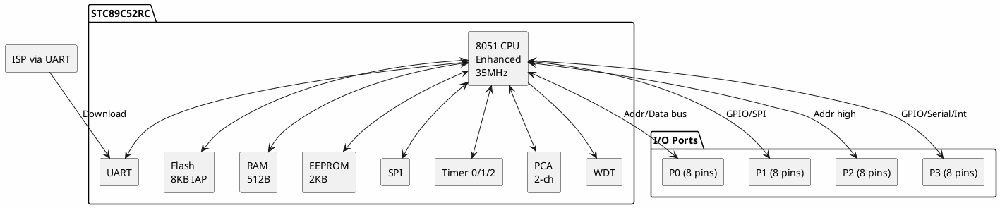

# STC 89C52RC

**8051-Compatible Microcontroller**

## Device Information

| Field | Value |
|-------|-------|
| Manufacturer | STC Microelectronics (China) |
| Part Number | STC89C52RC |
| Package | DIP-40, PLCC-44, LQFP-44 |
| Date Acquired | |
| Quantity | |

## Specifications

| Specification | Value |
|--------------|-------|
| Architecture | 8051-compatible (enhanced) |
| Clock Speed | Up to 35 MHz (6T mode), 12 MHz (12T mode) |
| Flash | 8 KB (In-Application Programmable) |
| RAM | 512 bytes (256 internal + 256 extended) |
| EEPROM | 2 KB (data storage) |
| GPIO | 32 (4 ports x 8 bits) |
| Operating Voltage | 3.4-5.5V |
| Operating Temp | -40 to +85°C (Industrial) |

## Peripherals

| Peripheral | Quantity/Details |
|-----------|------------------|
| Timer/Counter | 3 (16-bit) |
| UART | 1 (full duplex) |
| Interrupts | 8 sources |
| SPI | 1 (master/slave) |
| Watchdog | 1 |
| Power-down Modes | Idle, Power-down |
| PCA | 2 channels (PWM/Capture/Compare) |

## Pinout (DIP-40)

```
                    STC89C52RC
                    +----U----+
         (T2) P1.0  |1      40| VCC
        (T2X) P1.1  |2      39| P0.0 (AD0)
              P1.2  |3      38| P0.1 (AD1)
              P1.3  |4      37| P0.2 (AD2)
              P1.4  |5      36| P0.3 (AD3)
        (MOSI) P1.5 |6      35| P0.4 (AD4)
        (MISO) P1.6 |7      34| P0.5 (AD5)
         (SCK) P1.7 |8      33| P0.6 (AD6)
              RST   |9      32| P0.7 (AD7)
         (RXD) P3.0 |10     31| EA/VPP
         (TXD) P3.1 |11     30| ALE/PROG
        (INT0) P3.2 |12     29| PSEN
        (INT1) P3.3 |13     28| P2.7 (A15)
          (T0) P3.4 |14     27| P2.6 (A14)
          (T1) P3.5 |15     26| P2.5 (A13)
          (WR) P3.6 |16     25| P2.4 (A12)
          (RD) P3.7 |17     24| P2.3 (A11)
             XTAL2  |18     23| P2.2 (A10)
             XTAL1  |19     22| P2.1 (A9)
              GND   |20     21| P2.0 (A8)
                    +---------+
```

## Block Diagram



## Programming

### ISP (In-System Programming)

The STC89C52RC is programmed via UART - no external programmer needed!

| Method | Tools |
|--------|-------|
| ISP (Serial) | STC-ISP software + USB-Serial adapter |
| Parallel Programmer | Legacy method (not recommended) |

### ISP Wiring

| USB-Serial | STC89C52RC |
|------------|------------|
| TXD | P3.0 (RXD, pin 10) |
| RXD | P3.1 (TXD, pin 11) |
| GND | GND (pin 20) |
| DTR (optional) | RST (pin 9) via capacitor |

### Programming Procedure

1. Install STC-ISP software (Windows)
2. Connect USB-Serial adapter
3. Select COM port and MCU type
4. Load HEX file
5. Click "Download/Program"
6. **Power cycle the MCU** (STC enters ISP mode on power-up)
7. Programming completes automatically

## Clock Modes

| Mode | Cycles/Instruction | Max Freq | Compatibility |
|------|-------------------|----------|---------------|
| 12T | 12 clocks | 12 MHz | Standard 8051 |
| 6T | 6 clocks | 35 MHz | 2x faster |

Note: 6T mode runs code twice as fast with same crystal.

## STC-Specific Features

### In-Application Programming (IAP)
- Can modify Flash from running code
- Useful for bootloaders, configuration storage

### Internal RC Oscillator
- No external crystal needed (some variants)
- Programmable frequency

### Power-Down Wake-up
- Wake on external interrupt
- Low-power modes

## Documentation

- [STC89C52RC Datasheet (English)](http://www.stcmicro.com/datasheet/STC89C52RC-en.pdf)
- [STC89C52RC Datasheet (Chinese)](http://www.stcmicro.com/datasheet/STC89C52RC.pdf)
- [STC-ISP Software Download](http://www.stcmicro.com/rjxz.html)

## Software & Tools

### Official Tools
- **STC-ISP** - Programming software from STC (Windows, free)
- Download from: http://www.stcmicro.com/rjxz.html

### Development Environments
- **Keil C51** - Industry-standard 8051 IDE (commercial, free limited version)
- **SDCC** - Open-source 8051 C compiler
- **MCU 8051 IDE** - Open-source IDE with simulator

### SDCC (Open Source)

```bash
# Compile
sdcc -mmcs51 program.c

# Output: program.ihx (Intel HEX)
```

### Keil uVision Setup

1. Install Keil C51 (free version available)
2. Create new project for AT89C52 (compatible)
3. Add source files
4. Build project
5. Use STC-ISP to download HEX file

## Example Code (SDCC)

```c
#include <8052.h>

// LED on P1.0
#define LED P1_0

void delay(unsigned int ms) {
    unsigned int i, j;
    for (i = 0; i < ms; i++)
        for (j = 0; j < 120; j++);
}

void main() {
    while (1) {
        LED = 0;      // LED on (active low)
        delay(500);
        LED = 1;      // LED off
        delay(500);
    }
}
```

## Comparison: STC vs AT89C52

| Feature | STC89C52RC | AT89C52 |
|---------|------------|---------|
| ISP Programming | UART (easy) | Parallel (complex) |
| Clock Modes | 6T/12T | 12T only |
| Max Speed | 35 MHz | 24 MHz |
| Internal EEPROM | 2 KB | None |
| SPI | Yes | No |
| PCA | Yes | No |
| Price | Very low | Higher |

## Common Uses

- Industrial control
- LED displays
- Serial communication
- Motor control
- Educational projects
- Legacy 8051 project upgrades

## Notes

- **8051 compatible** - Works with standard 8051 code/tools
- **Chinese documentation** - Most detailed docs in Chinese
- **Easy programming** - No programmer needed, just USB-Serial
- **Power cycle to program** - Must power off/on to enter ISP mode
- **6T mode** - Effectively doubles speed vs standard 8051
- **Very cheap** - Popular for cost-sensitive projects
- **EA pin** - Must be tied HIGH for internal Flash operation

## Common Issues

### Programming Fails
- Must power cycle (not just reset) to enter ISP mode
- Some USB-Serial adapters have timing issues; try different adapter
- Check baud rate settings in STC-ISP

### Code Runs Slow
- Check if 6T mode is enabled in STC-ISP settings
- Verify crystal frequency setting

### Port 0 Problems
- P0 needs external pull-ups (open-drain)
- Other ports (P1, P2, P3) have internal pull-ups

## Related Parts

| Part | Flash | RAM | Features |
|------|-------|-----|----------|
| STC89C51RC | 4 KB | 512 B | Smaller flash |
| STC89C52RC | 8 KB | 512 B | This chip |
| STC89C54RD+ | 16 KB | 1280 B | More memory |
| STC89C58RD+ | 32 KB | 1280 B | Largest in series |
| STC12/15/8 series | Varies | Varies | Newer, faster |

## Local Files

### Pinout


### Documentation
- `STC89C52RC_Datasheet.pdf` - Main datasheet (English)
