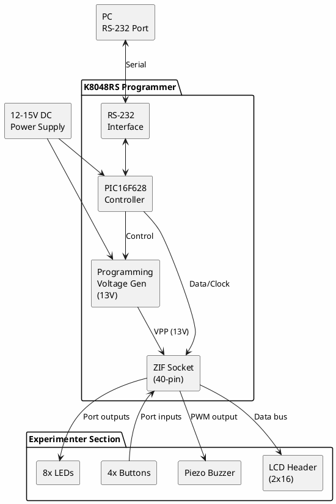

# Velleman K8048RS

**PIC Microcontroller Programmer & Experimenter Kit**

## Kit Information

| Field | Value |
|-------|-------|
| Manufacturer | Velleman |
| Model | K8048RS (Kit) / VM111 (Assembled) |
| Year | 2003 |
| Date Acquired | |
| Quantity | |

## Kit Description

The K8048RS is a PIC microcontroller programmer and experimenter board. It programs various 8-pin, 14-pin, 18-pin, 28-pin, and 40-pin PIC microcontrollers and includes an experimenter area with LEDs, buttons, and a buzzer for testing programs.

## Specifications

| Specification | Value |
|--------------|-------|
| Interface | RS-232 Serial (9-pin D-sub) |
| Power Supply | 12-15V DC, 300mA |
| Programming Voltage | 13V (generated on-board) |
| Supported PICs | 8/14/18/28/40-pin |
| On-board Features | 8 LEDs, 4 buttons, buzzer, LCD header |

## Supported PIC Microcontrollers

### 8-Pin
- PIC12C508/509, PIC12C508A/509A
- PIC12CE518/519
- PIC12F508/509, PIC12F629/675

### 14-Pin
- PIC16C505
- PIC16F505, PIC16F630/676

### 18-Pin
- PIC16C54/56/58, PIC16C554/558
- PIC16C61/62/64/65
- PIC16C71/73/74
- PIC16F54, PIC16F627/628
- PIC16F83/84, PIC16F84A
- PIC16F818/819, PIC16F87/88
- PIC16F872/873/874/876/877

### 28-Pin
- PIC16C62/63/64/65/66/67
- PIC16C72/73/74/76/77
- PIC16F72/73/74/76/77
- PIC16F870/871/872/873/874/876/877

### 40-Pin
- PIC16C64/65/66/67
- PIC16C74/76/77
- PIC16F74/77
- PIC16F874/877

## Block Diagram

## Board Features

### Programming Section
- 40-pin ZIF (Zero Insertion Force) socket
- Automatic device detection (some models)
- ICSP header for in-circuit programming
- Programming LED indicator

### Experimenter Section
- 8 LEDs connected to port pins
- 4 push buttons with debouncing
- Piezo buzzer for audio output
- 16-character LCD connector (active accent accent accent accent accent accent)
- Breadboard-compatible expansion area

## Hardware Setup

### Power Supply
- Input: 12-15V DC, center positive
- Current: 300mA minimum
- Do NOT use higher than 15V

### RS-232 Connection
- Standard 9-pin serial cable (straight-through)
- May require USB-to-Serial adapter on modern PCs
- Baud rate: 19200 bps

### ICSP Header

| Pin | Function |
|-----|----------|
| 1 | VPP (Programming voltage) |
| 2 | VDD (+5V) |
| 3 | GND |
| 4 | PGD (Data) |
| 5 | PGC (Clock) |

## Software

### Official Software
- **PICprog2006** - Velleman's programming software (Windows)
- Download from Velleman website

### Alternative Software
- **PICPgm** - Open-source PIC programmer
- **WinPic800** - Freeware programmer software
- **IC-Prog** - Classic PIC programming software

## Documentation

- [K8048RS Assembly Manual](https://www.velleman.eu/downloads/0/illustrated/illustrated_assembly_manual_k8048.pdf)
- [K8048RS User Manual](https://www.velleman.eu/downloads/0/user/usermanual_k8048_vm111.pdf)
- [Supported Device List](https://www.velleman.eu/support/device-list/?id=351087)

## Programming Procedure

1. Install PICprog software
2. Connect RS-232 cable to PC
3. Apply 12-15V DC power
4. Insert PIC chip in ZIF socket (pin 1 aligned)
5. Select device type in software
6. Load HEX file
7. Click Program
8. Verify (automatic or manual)

## LED Experimenter Pinout

| LED | PIC Pin (18-pin) | PIC Pin (40-pin) |
|-----|------------------|------------------|
| D1 | RB0 | RB0 |
| D2 | RB1 | RB1 |
| D3 | RB2 | RB2 |
| D4 | RB3 | RB3 |
| D5 | RB4 | RB4 |
| D6 | RB5 | RB5 |
| D7 | RB6 | RB6 |
| D8 | RB7 | RB7 |

## Notes

- **RS-232 only** - No USB version; requires USB-Serial adapter for modern PCs
- **Vintage kit** - 2003 era, may not support newer PICs
- **Serial port timing** - Some USB-Serial adapters have timing issues
- **Kit assembly** - Requires soldering skills for K8048 kit version
- **VM111** - Pre-assembled version of same board
- **ICSP capable** - Can program PICs in-circuit

## Common Issues

### Programming Fails
- Check RS-232 cable connection
- Verify correct COM port selected
- Try different USB-Serial adapter (FTDI chipset recommended)
- Ensure power supply is 12-15V

### Device Not Detected
- Clean ZIF socket contacts
- Verify chip orientation (pin 1 marker)
- Check device is in supported list

## Alternatives

For modern PIC development:
- **PICkit 3/4** - Official Microchip programmer
- **MPLAB Snap** - Budget Microchip programmer/debugger
- **PICkit 2 Clone** - Inexpensive clones available

## Local Files

### Documentation
- `K8048_AssemblyManual.pdf` - Kit assembly instructions
- `K8048_UserManual.pdf` - User manual and software guide
