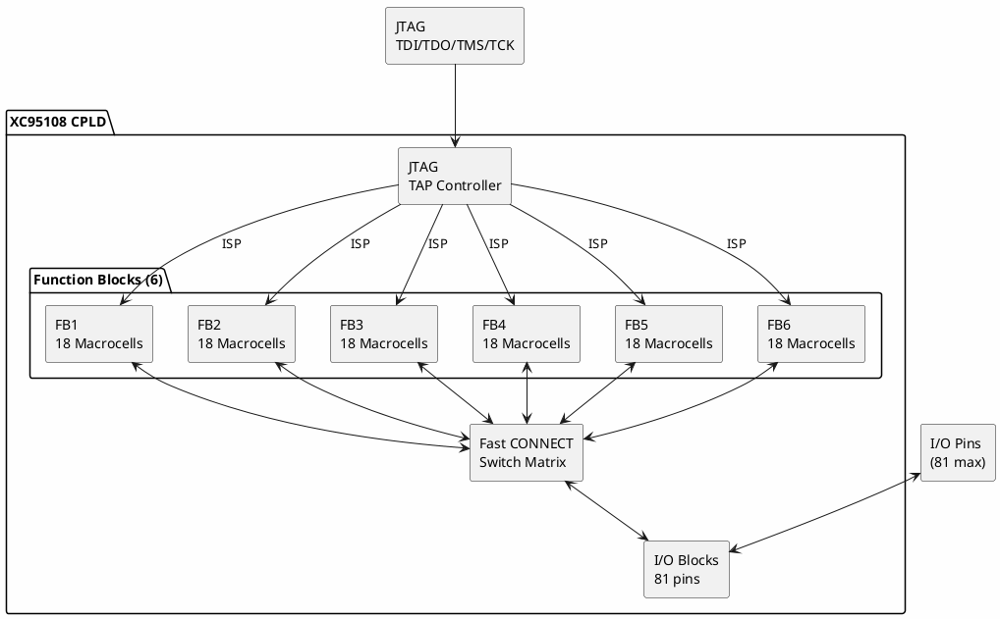

# Xilinx XC95108

**CPLD (Complex Programmable Logic Device)**

## Device Information

| Field | Value |
|-------|-------|
| Manufacturer | Xilinx (now AMD) |
| Part Number | XC95108 |
| Family | XC9500 |
| Package | PLCC-84, TQFP-100, PQ160 |
| Date Acquired | |
| Quantity | |

## Specifications

| Specification | Value |
|--------------|-------|
| Architecture | CPLD |
| Macrocells | 108 |
| Function Blocks | 6 |
| I/O Pins | 81 (package dependent) |
| Registers | 108 |
| Product Terms | 540 (90 per FB) |
| tPD (pin-to-pin) | 7.5 ns |
| fMAX | 125 MHz |
| Operating Voltage | 5V |
| Technology | Flash (ISP) |

## XC9500 Family Comparison

| Part | Macrocells | I/O | Speed (ns) |
|------|------------|-----|------------|
| XC9536 | 36 | 34 | 5 |
| XC9572 | 72 | 52 | 5 |
| XC95108 | 108 | 81 | 7.5 |
| XC95144 | 144 | 81 | 7.5 |
| XC95216 | 216 | 166 | 10 |
| XC95288 | 288 | 192 | 10 |

## Architecture

### Function Block (FB)
- 18 macrocells per block
- 54 inputs (from interconnect)
- 18 outputs
- 90 product terms (5 per macrocell)

### Macrocell
- Configurable as combinatorial or registered
- D-type flip-flop with async preset/reset
- XOR gate for polarity control
- Individual output enable

## Block Diagram



## JTAG Programming Interface

| Pin | Function |
|-----|----------|
| TDI | Test Data In |
| TDO | Test Data Out |
| TMS | Test Mode Select |
| TCK | Test Clock |

### JTAG Wiring

| Programmer | XC95108 |
|------------|---------|
| TDI | TDI pin |
| TDO | TDO pin |
| TMS | TMS pin |
| TCK | TCK pin |
| VCC | VCCIO |
| GND | GND |

## Programming

| Method | Tools |
|--------|-------|
| JTAG/ISP | Xilinx Platform Cable, generic JTAG |
| Parallel Port | Xilinx Parallel Cable III (legacy) |

### Programming Software

| Software | Status |
|----------|--------|
| Xilinx ISE WebPACK | Free, supports XC9500 |
| Xilinx iMPACT | Programming utility |
| UrJTAG | Open-source JTAG |
| xc3sprog | Open-source Xilinx programmer |

## Design Flow

```
1. Write HDL (Verilog/VHDL) or schematic
          ↓
2. Synthesize (ISE XST)
          ↓
3. Implement (Fit to CPLD)
          ↓
4. Generate programming file (.jed)
          ↓
5. Program via JTAG (iMPACT)
```

## Verilog Example

```verilog
module counter (
    input  clk,
    input  reset,
    output reg [7:0] count
);

always @(posedge clk or posedge reset) begin
    if (reset)
        count <= 8'b0;
    else
        count <= count + 1;
end

endmodule
```

## VHDL Example

```vhdl
library IEEE;
use IEEE.STD_LOGIC_1164.ALL;
use IEEE.STD_LOGIC_ARITH.ALL;

entity counter is
    Port ( clk   : in  STD_LOGIC;
           reset : in  STD_LOGIC;
           count : out STD_LOGIC_VECTOR(7 downto 0));
end counter;

architecture Behavioral of counter is
    signal cnt : STD_LOGIC_VECTOR(7 downto 0) := "00000000";
begin
    process(clk, reset)
    begin
        if reset = '1' then
            cnt <= "00000000";
        elsif rising_edge(clk) then
            cnt <= cnt + 1;
        end if;
    end process;
    count <= cnt;
end Behavioral;
```

## Documentation

- [XC9500 Family Datasheet](https://www.xilinx.com/support/documentation/data_sheets/ds063.pdf)
- [XC9500 In-System Programming Guide](https://www.xilinx.com/support/documentation/application_notes/xapp058.pdf)
- [CPLD Design Techniques](https://www.xilinx.com/support/documentation/application_notes/xapp444.pdf)

## Software & Tools

### Official Tools
- **Xilinx ISE WebPACK 14.7** - Free, last version to support XC9500
  - Download: https://www.xilinx.com/support/download/index.html/content/xilinx/en/downloadNav/vivado-design-tools/archive-ise.html
- **iMPACT** - Programming utility (part of ISE)

### Open-Source Alternatives
- **UrJTAG** - JTAG programming
- **xc3sprog** - Xilinx programming utility
- **OpenOCD** - Limited CPLD support

### ISE Installation Notes

ISE 14.7 is the last version supporting XC9500:
1. Download ISE WebPACK 14.7 from Xilinx archive
2. Install on Windows 7/10 or Linux
3. Get free WebPACK license
4. Use iMPACT for programming

## Common Uses

- Glue logic
- Address decoding
- Interface bridging
- State machines
- Prototyping before FPGA
- Legacy system maintenance

## XC9500 vs XC9500XL vs XC9500XV

| Feature | XC9500 | XC9500XL | XC9500XV |
|---------|--------|----------|----------|
| Voltage | 5V | 3.3V | 2.5V |
| Speed | 5-15ns | 5-15ns | 4-10ns |
| Power | Higher | Lower | Lowest |
| ISP | Yes | Yes | Yes |

## Notes

- **5V device** - XC9500XL (3.3V) more common now
- **Legacy** - Newer designs use XC2C (CoolRunner) or FPGAs
- **ISE required** - Vivado doesn't support XC9500
- **ISP capable** - Program in-circuit via JTAG
- **Deterministic timing** - All paths have same delay
- **Non-volatile** - Retains configuration without power

## Alternatives

For new designs:
- **Xilinx XC2C** (CoolRunner-II) - Lower power, 1.8V core
- **Lattice MachXO** - Modern CPLD/FPGA hybrid
- **Intel MAX II/V/10** - Modern CPLDs
- **Microchip ATF15xx** - 5V compatible

## Local Files

### Documentation
- `XC9500_Datasheet.pdf` - Family datasheet
- `XC95108_Pinout.pdf` - Package pinouts
