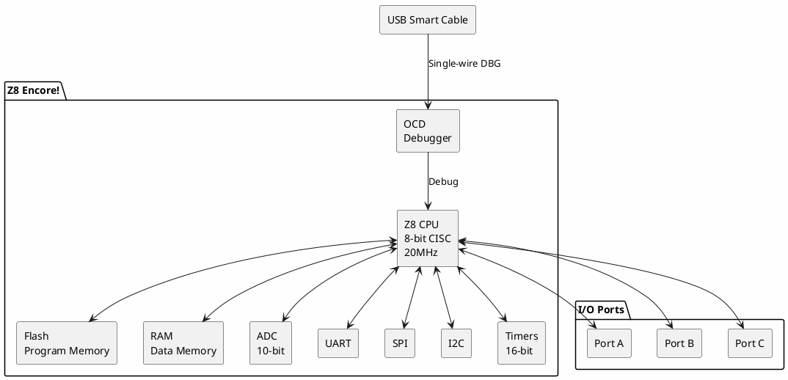

# Zilog Z8 Encore!

**8-bit CISC Microcontroller**

## Device Information

| Field | Value |
|-------|-------|
| Manufacturer | Zilog (now Littelfuse) |
| Family | Z8 Encore! |
| Common Parts | Z8F0411, Z8F0421, Z8F0822, Z8F1621 |
| Package | DIP-20, SOIC-20, various |
| Date Acquired | |
| Quantity | |

## Z8 Encore! Series Overview

| Part | Flash | RAM | GPIO | Package |
|------|-------|-----|------|---------|
| Z8F0411 | 4 KB | 256 B | 13 | 20-pin |
| Z8F0421 | 4 KB | 256 B | 25 | 28-pin |
| Z8F0822 | 8 KB | 512 B | 13 | 20-pin |
| Z8F1621 | 16 KB | 1 KB | 25 | 28-pin |
| Z8F6423 | 64 KB | 4 KB | 60 | 80-pin |

## Specifications (Z8F0822 Example)

| Specification | Value |
|--------------|-------|
| Architecture | 8-bit CISC |
| Clock Speed | Up to 20 MHz |
| Flash | 8 KB |
| RAM | 512 bytes |
| EEPROM | Via Flash emulation |
| GPIO | 13 |
| Operating Voltage | 2.7-3.6V |
| ADC | 8 channels, 10-bit |

## Peripherals

| Peripheral | Quantity/Details |
|-----------|------------------|
| Timer/Counter | 2 (16-bit) |
| PWM | 4 channels |
| UART | 1 |
| SPI | 1 |
| I2C | 1 |
| ADC | 8 channels (10-bit) |
| Comparators | 2 |
| WDT | 1 |
| On-Chip Debugger | Yes |

## Pinout (20-pin DIP - Z8F0822)

```
               Z8F0822
               +--U--+
        PA0    |1  20| VDD
        PA1    |2  19| PA7
        PA2    |3  18| PA6
        PA3    |4  17| PA5
        RESET  |5  16| PA4
        PC0    |6  15| PB7
        PC1    |7  14| PB6
        PC2    |8  13| PB5
        PC3    |9  12| PB4
        VSS    |10 11| DBG
               +-----+
```

## Block Diagram



## Programming

| Method | Tools |
|--------|-------|
| On-Chip Debugger | Zilog USB Smart Cable |
| ISP | Via OCD interface |

### Debug Interface

The Z8 Encore! uses a single-wire debug interface (DBG pin):

| Signal | Pin |
|--------|-----|
| DBG | Pin 11 (20-pin) |
| VDD | Power |
| VSS | Ground |

## Documentation

- [Z8 Encore! Product Page](https://www.zilog.com/index.php?option=com_product&task=product&businessLine=1&id=77&parent_id=77&Ession=1)
- [Z8F0822 Datasheet](https://www.zilog.com/docs/z8encore/PS0199.pdf)
- [Z8 Encore! Reference Manual](https://www.zilog.com/docs/z8encore/UM0128.pdf)
- [Z8 Instruction Set](https://www.zilog.com/docs/z8encore/UM0129.pdf)

## Software & Tools

### Official Tools
- **ZDS II IDE** - Zilog Developer Studio (free)
- **Z8 Encore! Smart Cable** - USB programming/debug
- Download from: https://www.zilog.com/software/

### Development Environment

1. Download ZDS II from Zilog website
2. Install USB Smart Cable drivers
3. Connect Smart Cable to DBG pin
4. Create new project in ZDS II
5. Select target device
6. Write C or assembly code
7. Build and download

## Programming Languages

- **C** - Full ANSI C support in ZDS II
- **Assembly** - Z8 assembly language
- **BASIC** - Some third-party support

## Example C Code

```c
#include <ez8.h>

void main(void) {
    // Configure PA0 as output
    PAADDR = 0x01;  // Select PA0
    PACTL = 0x00;   // Output mode
    
    while(1) {
        PAOUT = 0x01;   // PA0 high
        delay(500);
        PAOUT = 0x00;   // PA0 low
        delay(500);
    }
}
```

## Z8 History

| Generation | Year | Features |
|------------|------|----------|
| Z8 | 1979 | Original 8-bit MCU |
| Super8 | 1988 | Enhanced version |
| Z8 Encore! | 2002 | Flash, modern peripherals |
| Z8 Encore! XP | 2004 | Extended peripherals |
| Z8 Encore! MC | 2006 | Motor control |

## Common Uses

- Industrial automation
- Motor control
- Sensor interfaces
- Legacy system replacement
- Automotive accessories
- Consumer electronics

## Notes

- **Single-wire debug** - Simple programming interface
- **Low pin count options** - 20-pin devices available
- **Free IDE** - ZDS II is free from Zilog
- **Legacy architecture** - Z8 has long history
- **Zilog acquired** - Now part of Littelfuse
- **Declining support** - Consider alternatives for new designs

## Alternatives

For new designs, consider:
- **STM32** - ARM Cortex-M, more modern
- **AVR** - ATmega/ATtiny, huge community
- **PIC** - Microchip, wide selection

## Local Files

### Documentation
- `Z8F0822_Datasheet.pdf` - Z8F0822 datasheet
- `Z8_Encore_ReferenceManual.pdf` - Programming reference
