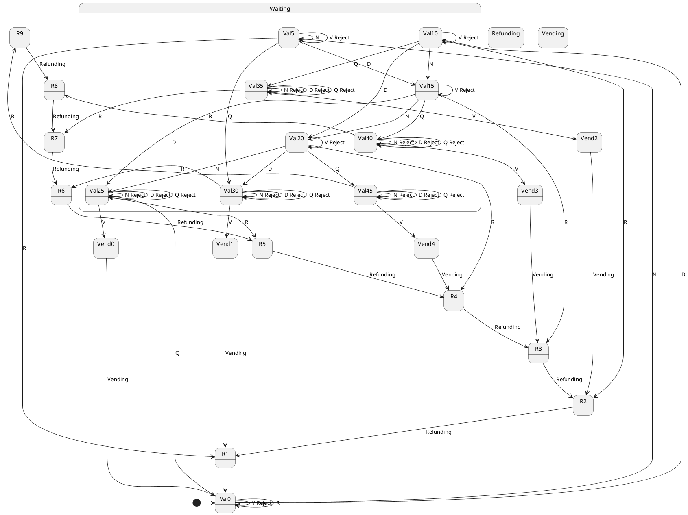

```plantuml
@startuml

[*] -> Val0 

state Waiting {
    state Val0
    state Val5
    state Val10
    state Val15
    state Val20
    state Val25
    state Val30
    state Val35
    state Val40
    state Val45
}

Val0 --> Val5 : N
Val0 --> Val10 : D
Val0 --> Val25 : Q
Val0 --> Val0 : V Reject
Val0 --> Val0 : R

Val5 --> Val5 : N
Val5 --> Val15 : D
Val5 --> Val30 : Q
Val5 --> Val5 : V Reject
Val5 --> R1 : R

Val10 --> Val15 : N
Val10 --> Val20 : D
Val10 --> Val35 : Q
Val10 --> Val10 : V Reject
Val10 --> R2 : R

Val15 --> Val20 : N
Val15 --> Val25 : D
Val15 --> Val40 : Q
Val15 --> Val15 : V Reject
Val15 --> R3 : R

Val20 --> Val25 : N
Val20 --> Val30 : D
Val20 --> Val45 : Q
Val20 --> Val20 : V Reject
Val20 --> R4 : R

Val25 --> Val25 : N Reject
Val25 --> Val25 : D Reject
Val25 --> Val25 : Q Reject
Val25 --> Vend0 : V
Val25 --> R5 : R

Val30 --> Val30 : N Reject
Val30 --> Val30 : D Reject
Val30 --> Val30 : Q Reject
Val30 --> Vend1 : V
Val30 --> R6 : R

Val35 --> Val35 : N Reject
Val35 --> Val35 : D Reject
Val35 --> Val35 : Q Reject
Val35 --> Vend2 : V
Val35 --> R7 : R

Val40 --> Val40 : N Reject
Val40 --> Val40 : D Reject
Val40 --> Val40 : Q Reject
Val40 --> Vend3 : V
Val40 --> R8 : R

Val45 --> Val45 : N Reject
Val45 --> Val45 : D Reject
Val45 --> Val45 : Q Reject
Val45 --> Vend4 : V
Val45 --> R9 : R

state Refunding {
    state R1
    state R2
    state R3
    state R4
    state R5
    state R6
    state R7
    state R8
    state R9
}

R1 --> Val0
R2 --> R1 : Refunding
R3 --> R2 : Refunding
R4 --> R3 : Refunding
R5 --> R4 : Refunding
R6 --> R5 : Refunding
R7 --> R6 : Refunding
R8 --> R7 : Refunding
R9 --> R8 : Refunding

state Vending {
    state Vend0
    state Vend1
    state Vend2
    state Vend3
    state Vend4
}

Vend0 --> Val0 : Vending
Vend1 --> R1 : Vending
Vend2 --> R2 : Vending
Vend3 --> R3 : Vending
Vend4 --> R4 : Vending

@enduml
```