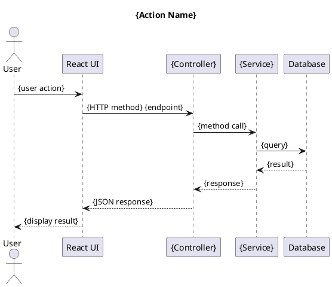
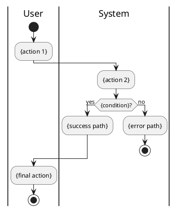

# Protocol: Documentation Structure

Standards for organizing and writing system documentation.

---

## Directory Structure

```
docs/{system-name}/
├── README.md                    # Entry point with navigation
├── VERSION                      # Git hashes for version tracking
├── roles.md                     # Role definitions and permissions
├── action-index.md              # Role → Screen → Action matrix
├── screen-index.md              # All screens with routes
├── architecture/
│   ├── solution-architecture.md # Backend architecture
│   └── ux-architecture.md       # Frontend architecture
├── product-management/
│   ├── view-products/
│   │   ├── list-products.md     # Action: View product list
│   │   └── view-product-detail.md
│   ├── create-product/
│   │   ├── create-manually.md
│   │   └── upload-from-file.md
│   └── manage-products/
│       └── allocate-to-district.md
├── user-management/
│   ├── list-users.md
│   ├── create-user.md
│   └── edit-user.md
├── organization-management/
│   ├── manufacturers/
│   │   └── manage-manufacturers.md
│   └── school-districts/
│       └── manage-districts.md
├── reporting/
│   ├── product-reports/
│   │   └── product-by-category.md
│   ├── allergen-reports/
│   │   └── allergen-dashboard.md
│   └── user-reports/
│       └── user-activity.md
├── data-integration/
│   └── oneworldsync/
│       └── import-products.md
├── presentation/
│   ├── charts/
│   │   └── charts-index.md
│   ├── reports-index.md
│   ├── exports/
│   │   └── exports-index.md
│   └── uploads/
│       └── uploads-index.md
├── user-journeys/
│   ├── README.md               # Journey index
│   ├── first-login.md
│   ├── create-product.md
│   └── approve-products.md
├── wireframes/
│   └── screen-wireframes.md
└── tracking/
    ├── endpoints.md            # API endpoint checklist
    └── screens.md              # Screen implementation checklist
```

---

## File Naming Conventions

| Type | Pattern | Example |
|------|---------|---------|
| Action files | `{verb}-{noun}.md` | `list-products.md`, `create-user.md` |
| Index files | `{topic}-index.md` | `charts-index.md`, `reports-index.md` |
| Journey files | `{action-phrase}.md` | `first-login.md`, `approve-products.md` |
| Feature dirs | `{noun-plural}/` | `manufacturers/`, `school-districts/` |
| Action dirs | `{verb}-{noun}/` | `view-products/`, `create-product/` |

---

## Action Document Template

Each action file must include these sections:

```markdown
# {Action Name}

## Overview
Brief description of what this action does (1-2 sentences).

## Roles
| Role | Access |
|------|--------|
| Super Admin | {scope} |
| Cooperative Admin | {scope} |
| District Admin | {scope} |
| District User | {scope} |
| Cooperative User | {scope} |
| Manufacturer User | {scope} |

## Sequence Diagram



## Endpoint Details

### Primary Endpoint
```
{METHOD} {path}
Authorization: Bearer {token}
Roles: {allowed roles}
```

### Request Model
```typescript
interface {RequestModel} {
  field: type;  // description
}
```

### Response Model
```typescript
interface {ResponseModel} {
  success: boolean;
  payload: {
    // fields
  };
}
```

## Frontend Implementation

### Location
- Page: `{path to page component}`
- API: `{path to API client}`

### Key Components
- {component name}: {purpose}

## Business Rules
1. {rule 1}
2. {rule 2}

## Error Handling

| Error | HTTP Code | Response |
|-------|-----------|----------|
| {error} | {code} | {message} |

## Review Checklist

- [ ] {check item 1}
- [ ] {check item 2}
```

---

## User Journey Template

```markdown
# User Journey: {Journey Name}

## Goal
{What the user is trying to accomplish}

## Actors
- {Actor 1}
- {Actor 2}

## Preconditions
- {Condition 1}
- {Condition 2}

---

## Journey Flow



---

## Step-by-Step Flow

### Step 1: {Step Name}
```
User Action: {what user does}

System Response:
  - {response 1}
  - {response 2}
```

### Step 2: {Step Name}
...

---

## Wireframes

### {Screen Name}
```
┌─────────────────────────────────────────────────────────────────────────────┐
│  {ASCII wireframe}                                                          │
└─────────────────────────────────────────────────────────────────────────────┘
```

---

## Error Paths

| Error | Cause | Resolution |
|-------|-------|------------|
| {error} | {cause} | {resolution} |

---

## Review Checklist

### {Category 1}
- [ ] {check item}

### {Category 2}
- [ ] {check item}
```

---

## Index Document Template (action-index.md)

Structure: Role → Screen → Action with review checkboxes

```markdown
# Action Index

## Role: {Role Name} (Role ID: {id})

### {Screen Category}

| Action | Endpoint | Status |
|--------|----------|:------:|
| {action} | `{endpoint}` | {status} |

**Screen:** `{route}`
**Doc:** [{link}]({path})

- [ ] {action 1}
- [ ] {action 2}
```

---

## Cross-Reference Pattern

When referencing between v-next and rewrite-review:

```markdown
> **Original System:** [../rewrite-review/{path}](../rewrite-review/{path})
```

When referencing within same system:

```markdown
**See Also:**
- [{related topic}]({relative path})
```

---

## Status Indicators

Use these symbols consistently:

| Symbol | Meaning |
|--------|---------|
| ✅ | Fully implemented |
| ⚠️ | Partially implemented or has issues |
| ❌ | Not implemented |
| 🔄 | Changed pattern (different from original) |
| 📋 | Reference to other documentation |

---

## Grouping Rules

### Product Management
- `view-products/` - List and detail views
- `create-product/` - Creation methods (manual, upload, OCR)
- `manage-products/` - Allocation, suggestions, approval
- `product-approval/` - Approval workflow (if exists)

### User Management
- Individual action files (no subdirectories)
- `list-users.md`, `create-user.md`, `edit-user.md`

### Organization Management
- Subdirectory per entity type
- `manufacturers/manage-manufacturers.md`
- `school-districts/manage-districts.md`
- `distributors/manage-distributors.md`

### Reporting
- Subdirectory per report category
- `product-reports/{report-name}.md`
- `allergen-reports/{report-name}.md`
- `user-reports/{report-name}.md`

### Data Integration
- Subdirectory per integration source
- `oneworldsync/import-products.md`
- `azure-blob/file-storage.md`

---

## Version Tracking

Each documentation set must have a `VERSION` file:

```markdown
# {System} Documentation Version

Generated: {YYYY-MM-DD}

## Submodule Versions

| Submodule | Git Hash | Repository |
|-----------|----------|------------|
| {name} | `{hash}` | {repo} |

## How to Compare

```bash
cd {submodule}
git diff {hash}..HEAD --stat
```
```

---

## Review Checklist for New Documentation

- [ ] Directory structure matches this protocol
- [ ] All action files use action template
- [ ] All journey files use journey template
- [ ] PlantUML diagrams render correctly
- [ ] ASCII wireframes are aligned
- [ ] Cross-references use relative paths
- [ ] Status indicators are consistent
- [ ] VERSION file has current git hashes
- [ ] README.md has navigation table
