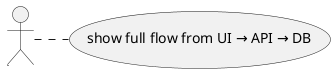

# Protocol: Generate Rewrite Review Documentation

Generate comprehensive documentation for reviewing/planning a system rewrite. This documentation maps user actions to service calls, captures architecture, user journeys, and wireframes.

## Trigger
- User requests documentation for a rewrite/migration project
- User asks to document existing system for review
- User wants to create specs from existing code

## Prerequisites Check
1. Identify if documentation already exists at `docs/rewrite-review/`
2. If exists, ask user: "Update existing docs or start fresh?"
3. Confirm target output location with user

## Phase 1: Discovery

### 1.1 Explore Backend Architecture
```
Task: Explore the backend codebase to identify:
- All controllers and their endpoints
- Service layer structure
- Repository/data access patterns
- Authentication/authorization mechanisms
- External integrations
- Background services
```

Output: List of all endpoints grouped by feature area

### 1.2 Explore Frontend Architecture
```
Task: Explore the frontend codebase to identify:
- Routing structure
- State management approach
- Component hierarchy
- API communication patterns
- Authentication flow
```

Output: Navigation structure and component map

### 1.3 Identify User Roles
```
Task: Find all user roles and permissions:
- Role definitions (enums, constants, database)
- Authorization checks in controllers
- Frontend route protection
- Role-based UI differences
```

Output: Complete role permissions matrix

## Phase 2: Create Index Documents

### 2.1 Create Directory Structure
```bash
mkdir -p docs/rewrite-review/{architecture,user-journeys,wireframes,presentation/{charts,exports,uploads},product-management,user-management,reporting,organization-management,data-integration,community}
```

### 2.2 Create README.md
Include:
- Quick links to all major documents
- Structure overview
- API response patterns
- Review checklist template

### 2.3 Create roles.md
Include:
- Role ID → Name mapping
- Permissions matrix by feature
- Authorization implementation details

### 2.4 Create action-index.md
Structure: Role → Screen → Click action
Include checkboxes for review tracking
Link to detailed documentation

### 2.5 Create screen-index.md
Structure: Screen → Endpoints → Status
Include endpoint-by-endpoint checklist

## Phase 3: Architecture Documentation

### 3.1 Create solution-architecture.md
Include:
- System overview diagram (PlantUML)
- Component architecture
- Data flow diagram
- Authentication flow
- Background services
- Database schema overview
- Technology stack
- Deployment architecture

### 3.2 Create ux-architecture.md
Include:
- Site map by role
- Navigation structure
- Page layout patterns
- Component hierarchy
- State management architecture
- Responsive breakpoints

## Phase 4: Presentation Layer Documentation

### 4.1 Create charts-index.md
For each chart:
- Location (screen)
- Chart type
- Data source endpoint
- Data format
- Review checklist

### 4.2 Create reports-index.md
For each report:
- Route and endpoint
- Filters available
- Columns displayed
- Export capability
- Role access

### 4.3 Create exports-index.md
For each export:
- Endpoint
- Request model
- Columns exported
- Role permissions

### 4.4 Create uploads-index.md
For each upload type:
- Screen location
- Endpoint
- File types accepted
- Size limits
- Processing flow

## Phase 5: Feature Documentation

### 5.1 For Each Major Feature Area
Create `{feature}/README.md` with:
- Feature overview
- Sub-features list
- Common patterns

### 5.2 For Each User Action
Create `{feature}/{action}.md` with:

```markdown
# {Action Name}

## Overview
Brief description of what this action does.

## Roles
| Role | Access |
|------|--------|
| ... | ... |

## Sequence Diagram


## Endpoint Details
- Method, path, auth
- Request model (TypeScript)
- Response model (TypeScript)

## Frontend Implementation
- Page location
- Key components
- State management

## Business Rules
1. ...
2. ...

## Review Checklist
- [ ] ...
```

## Phase 6: User Journeys

### 6.1 Identify Key Journeys
- First-time login
- Primary CRUD flows
- Complex multi-step workflows
- Role-specific flows

### 6.2 For Each Journey
Create `user-journeys/{journey}.md` with:
- Goal
- Actors
- Preconditions
- PlantUML flow diagram
- Step-by-step walkthrough
- ASCII wireframes for each step
- Error paths
- Review checklist

## Phase 7: Wireframes

### 7.1 Create screen-wireframes.md
Include ASCII wireframes for:
- Application shell/layout
- Dashboard variants
- List pages
- Form pages
- Report pages
- Modal patterns
- Mobile responsive views
- Loading/empty/error states

## Updating Existing Documentation

If documentation exists:

1. **Compare endpoints**: Check if new endpoints exist not documented
2. **Check roles**: Verify role matrix still accurate
3. **Review journeys**: Confirm flows haven't changed
4. **Update wireframes**: Match current UI
5. **Add new sections**: For any new features

Run comparison:
```
For each endpoint in codebase:
  If not in docs: Add to "Missing Documentation" list
  If in docs but different: Add to "Needs Update" list
```

## Output Checklist

- [ ] README.md with structure overview
- [ ] roles.md with permissions matrix
- [ ] action-index.md with role→screen→action checklist
- [ ] screen-index.md with endpoint checklist
- [ ] solution-architecture.md with system diagrams
- [ ] ux-architecture.md with navigation/component structure
- [ ] charts-index.md
- [ ] reports-index.md
- [ ] exports-index.md
- [ ] uploads-index.md
- [ ] Feature documentation (one per major feature)
- [ ] User journey documents (3-5 key journeys)
- [ ] screen-wireframes.md

## Estimated Effort

| Phase | Approximate Tool Calls |
|-------|------------------------|
| Discovery | 10-20 |
| Index Documents | 5-10 |
| Architecture | 2-4 |
| Presentation | 4-8 |
| Features | 15-30 |
| Journeys | 8-15 |
| Wireframes | 2-4 |
| **Total** | **46-91** |
