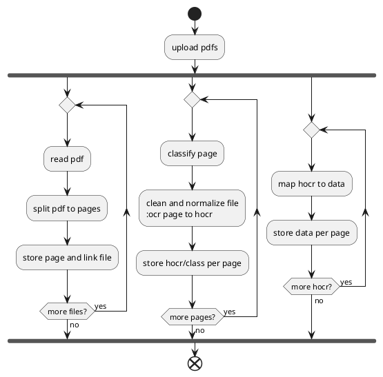
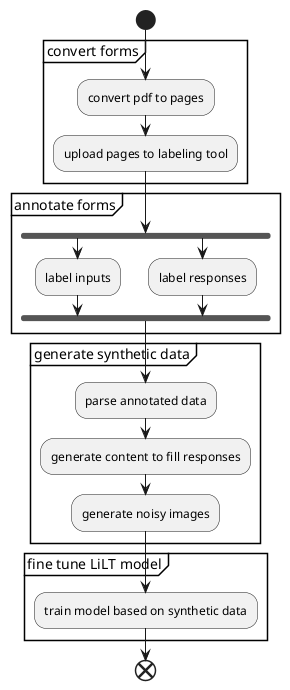

# Form data extraction

## General

- https://form.io/the-one-thing-everyone-in-insurance-tech-is-talking-about-that-no-one-likes-is-pdf-management/
- https://medium.com/@masreis/text-extraction-and-ocr-with-apache-tika-302464895e5f
- https://cwiki.apache.org/confluence/display/TIKA/TikaOCR
- https://github.com/ocropus/hocr-tools

## Proposed Design

### Notes

- Image Manipulation Libraries
  - [Augraphy](https://github.com/sparkfish/augraphy)
    - Generate scanner style noise such as bleed, texture, background, shadows and more
  - [Albumentations](https://github.com/albumentations-team/albumentations)
- Fonts
  - [Font Squirrel(https://www.fontsquirrel.com/)
  - [Da Font](https://www.dafont.com/)
  - [Google Font](https://fonts.google.com/)
- Required Dataset
  - Annotated Forms
    - Mark up images in Label Studio
    - Use Tesseract OCR to extract base text and map to annotations
    - generate data to populated forms
      - Use random location adjustment, mix of fonts including handwriting font
    - Apply image transformation to include skewed, curled, and other scanner issues
    - train model to classify image types
      - https://spotintelligence.com/2023/10/23/document-classification-python/
      - https://github.com/NickTheta/Document_Classification_v1
      - https://github.com/MiteshPuthran/Document_Classification
      - https://www.digitalvidya.com/blog/document-classification-python-machine-learning/
      - https://github.com/SciSharp/TensorFlow.NET
    - train model for improved OCR

### Process Flow

1. Convert base PDF to pages (JPG or PNG)
2. Manually Annotate Pages
   - Use a tool such as Label Studio
   - Mark Input Labels
   - Mark Input Response Text Areas
   - Mark Input Response Check Boxes
3. Generate Synthetic Dataset
   - Read Annotated Images and Data
   - Generate content for the form, capture data and rendered image
   - Process rendered images 
4. Build annotated dataset based on raw and manipulated images.
5. Set up pipeline to clean scanned documents
   - Convert and register images for OCR processing (this will normalize the images so they are easier to process such as removing scanner noise, tears, rotations and so on)
6. Classify form sets to simplify the OCR mapping.  
   - train a model mapping either first page or possibly all pages to a particular page definition set
7. Build model to map data to scanned images.  
   - this may either be a direct model such as one of the LayoutLM or LiLT models or a simplified location based OCR using something like tesseract and the locations from annotation
8. Validate results
9. Create feedback process
   - will likely need a way to capture misses in production and use that information to improve the model over time.  

### Design

#### Process Rendered Forms

#### Generate Data Set and Construct Model

