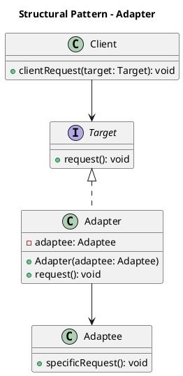
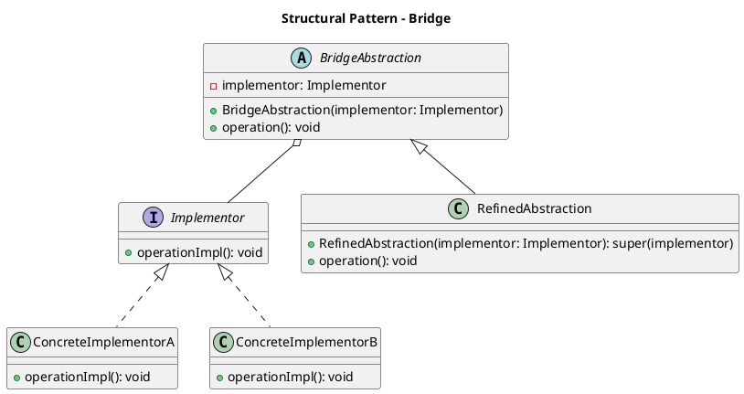
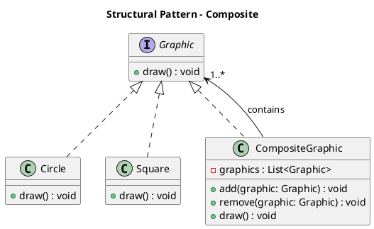
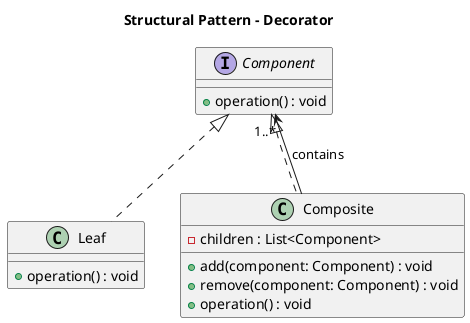
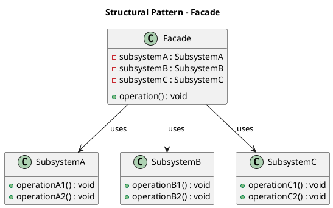
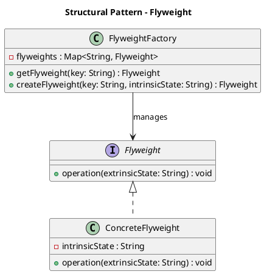
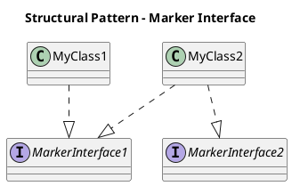
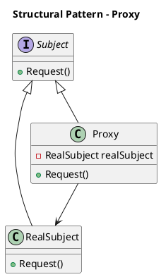

# Structural Patterns

## Adapter

Adapters are used to convert from one implementation to another.

## Bridge

Bridge pattern is used to decouple abstractions from implementations 

## Composite

Composite classes may be used to simplify multiple types into a single component.  This provides a means to represent complex hierarchies in a simplified fashion.

## Decorator / Wrapper

Decorators provide a means to add functionality to a object dynamically without sub-classing.

## Facade

Facades may be used to isolated sub-systems of functionality into a simplified abstraction.  This provide a means to manage access to a collection of functionality in from a single point.

## Flyweight

Flyweight provides a means to reduce resources by allowing child classed to reference the same implementation instead of creating their own.

## Marker/Tagging Interfaces

Marker interfaces are a means to provide additional metadata to your type definitions.   

## Proxy

Proxies are similar to an adapter but typically provide an additional layer such as logging or access control. 

