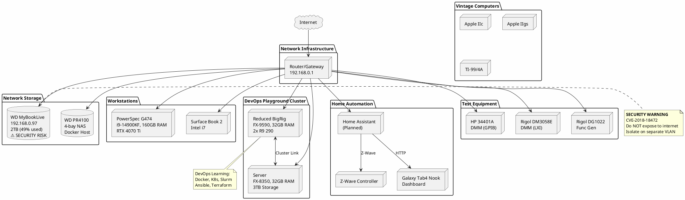

# Network Diagram

Home network topology, device inventory, and IP assignments.

---

## Network Overview

```
                              ┌─────────────┐
                              │  Internet   │
                              └──────┬──────┘
                                     │
                              ┌──────▼──────┐
                              │ eero 6+     │
                              │ Gateway     │◄──── WiFi 6 Mesh ────► 8x eero nodes
                              │192.168.0.1  │      (whole-home)
                              └──────┬──────┘
                                     │ GbE
              ┌──────────────────────┴──────────────────────┐
              │                                             │
              ▼                                             ▼
┌──────────────────────────┐              ┌──────────────────────────┐
│  MokerLink Switch #1     │◄────────────►│  MokerLink Switch #2     │
│  8x 2.5GbE + 10G SFP     │   10G SFP+   │  8x 2.5GbE + 10G SFP     │
│  (Servers / Storage)     │              │  (Workstations / IoT)    │
└──────────────────────────┘              └──────────────────────────┘
     │ 2.5G                                    │ 2.5G
     ├── DevOps Cluster                        ├── PowerSpec G474
     │   • Reduced BigRig                      ├── Surface Book 2
     │   • Server FX8350                       ├── Galaxy Tab4 (dashboard)
     ├── PR4100 NAS                            └── IoT / Z-Wave
     └── MyBookLive (192.168.0.97) ⚠️
```

### Network Equipment

| Device | Specs | Qty | Purchased |
|--------|-------|-----|-----------|
| Amazon eero 6+ | WiFi 6 mesh, Thread, 1Gbps | 9 | 3 w/house + 2x 3-packs |
| MokerLink 2.5G Managed Switch | 8x 2.5GbE + 10G SFP, VLAN/LACP/QoS | 2 | 2024-03-17 |
| ipolex SFP+ to RJ45 10Gb | 10GBase-T transceiver | 2 | 2024-03-17 |

*See [Device Lab/networking/](Device%20Lab/networking/) for full details.*

---

## IP Address Assignments

### Network: 192.168.0.0/24

#### Infrastructure

| IP Address | Device | Type | Status | Notes |
|------------|--------|------|--------|-------|
| 192.168.0.1 | eero 6+ Gateway | Mesh Router | Active | Primary router, WiFi 6, Thread |
| DHCP | eero 6+ Mesh Nodes (x8) | Mesh Extender | Active | Whole-home coverage |
| TBD | MokerLink 2.5G Switch #1 | Managed Switch | Active | 8x 2.5GbE + 10G SFP |
| TBD | MokerLink 2.5G Switch #2 | Managed Switch | Active | 8x 2.5GbE + 10G SFP |

**ISP:** Verizon Wireless (Gateway: 192.168.1.1)

#### Network Storage

| IP Address | Device | Type | Status | Notes |
|------------|--------|------|--------|-------|
| 192.168.0.67 | [WD My Cloud PR4100](Device%20Lab/network-storage/wd-mycloud-pr4100/) | NAS | Active | 4-bay JBOD, ~20TB, Intel N3710 |
| 192.168.0.97 | [WD MyBookLive](Device%20Lab/network-storage/wd-mybooklive/) | NAS | Active | 2TB, **ISOLATE** - security risk |

#### Workstations

| IP Address | Device | Type | Status | Notes |
|------------|--------|------|--------|-------|
| 192.168.0.69 | [PowerSpec G474](Device%20Lab/desktops/powerspec-g474/) | Desktop | Active | Primary workstation (reserved) |
| DHCP | Surface Book 2 | Laptop | Active | Portable |

#### Printers

| IP Address | Device | Type | Status | Notes |
|------------|--------|------|--------|-------|
| 192.168.0.48 | Brother HL-3170CDW | Color Laser | Active | Craft Room, wireless |

#### DevOps Playground Cluster

| IP Address | Device | Type | Status | Notes |
|------------|--------|------|--------|-------|
| TBD | [Reduced BigRig](Device%20Lab/desktops/reduced-bigrig/) | Server | Building | FX-9590, 32GB |
| TBD | [Server FX-8350](Device%20Lab/desktops/server-fx8350/) | Server | Building | FX-8350, 32GB, 3TB storage |

#### Home Automation

| IP Address | Device | Type | Status | Notes |
|------------|--------|------|--------|-------|
| TBD | Home Assistant | Controller | Planned | May run on cluster or dedicated Pi |
| TBD | Z-Wave Controller | Hub | TBD | Z-Net bridge or Z-Stick |
| DHCP | [Galaxy Tab4 Nook](Device%20Lab/mobile/samsung-galaxy-tab4-nook/) | Dashboard | Planned | After LineageOS flash |

#### Test Equipment (Network-Capable)

| IP Address | Device | Type | Status | Notes |
|------------|--------|------|--------|-------|
| TBD | HP 34401A | DMM | TBD | GPIB, potential LXI gateway |
| TBD | Rigol DM3058E | DMM | TBD | LXI/Ethernet capable |
| TBD | Rigol DG1022 | Function Gen | TBD | USB, potential network |

#### Mobile Devices

| IP Address | Device | Type | Status | Notes |
|------------|--------|------|--------|-------|
| DHCP | [Amazon Fire HD](Device%20Lab/mobile/amazon-fire-hd/) | Tablet | TBD | |
| DHCP | [Apple iPad Mini](Device%20Lab/mobile/apple-ipad-mini/) | Tablet | TBD | |
| DHCP | [Sony PSVita](Device%20Lab/gaming/sony-psvita/) | Handheld | TBD | WiFi capable |

---

## Reserved IP Ranges (Recommended)

| Range | Purpose | Count |
|-------|---------|-------|
| 192.168.0.1-9 | Infrastructure (router, switches, APs) | 9 |
| 192.168.0.10-29 | Servers (static) | 20 |
| 192.168.0.30-49 | NAS / Storage (static) | 20 |
| 192.168.0.50-79 | Test Equipment (static) | 30 |
| 192.168.0.80-99 | IoT / Smart Home (static) | 20 |
| 192.168.0.100-199 | DHCP pool (dynamic) | 100 |
| 192.168.0.200-249 | Lab / Experimental | 50 |
| 192.168.0.250-254 | Reserved | 5 |

---

## PlantUML Network Diagram



---

## Network Segments (Current / Planned)

### Current: Flat Network

All devices on single 192.168.0.0/24 subnet.

### Planned: VLAN Segmentation

| VLAN ID | Name | Subnet | Purpose | Devices |
|---------|------|--------|---------|---------|
| 1 | Default | 192.168.0.0/24 | General | Workstations, laptops |
| 10 | Servers | 192.168.10.0/24 | Server infrastructure | DevOps cluster |
| 20 | Storage | 192.168.20.0/24 | NAS devices | PR4100 |
| 30 | IoT | 192.168.30.0/24 | Smart home | Z-Wave, tablets, sensors |
| 40 | Lab | 192.168.40.0/24 | Test equipment | GPIB/LXI instruments |
| 50 | Guest | 192.168.50.0/24 | Guest access | Internet only, isolated |
| 99 | Isolated | 192.168.99.0/24 | No internet | MyBookLive, testing |

---

## Network Services

### Current Services

| Service | Host | IP:Port | Protocol | Status |
|---------|------|---------|----------|--------|
| SMB/CIFS | MyBookLive | 192.168.0.97:445 | TCP | Active |

### Planned Services

| Service | Host | IP:Port | Protocol | Purpose |
|---------|------|---------|----------|---------|
| SMB/CIFS | PR4100 | TBD:445 | TCP | File sharing |
| SSH | PR4100 | TBD:22 | TCP | Management |
| HTTP/S | PR4100 | TBD:80/443 | TCP | Web UI |
| Home Assistant | Cluster/Pi | TBD:8123 | TCP | Home automation |
| Portainer | Cluster | TBD:9000 | TCP | Container management |
| Traefik | Cluster | TBD:80/443 | TCP | Reverse proxy |
| Grafana | Cluster | TBD:3000 | TCP | Monitoring dashboards |
| Prometheus | Cluster | TBD:9090 | TCP | Metrics collection |

---

## Security Considerations

### Critical: MyBookLive Vulnerabilities

| CVE | Severity | Description |
|-----|----------|-------------|
| CVE-2018-18472 | Critical | Unauthenticated remote command execution |
| CVE-2021-35941 | Critical | Factory reset without authentication |

**Mitigation:**
- [x] Document known vulnerabilities
- [ ] Place on isolated VLAN (no internet)
- [ ] Disable WD cloud/remote access features
- [ ] Monitor for unusual network activity
- [ ] Consider migrating data to PR4100 and retiring

### General Security Checklist

- [ ] Change default router password
- [ ] Enable WPA3 on WiFi (or WPA2-AES minimum)
- [ ] Disable WPS
- [ ] Enable firewall on router
- [ ] Set up VLAN segmentation
- [ ] Configure guest network isolation
- [ ] Enable logging
- [ ] Regular firmware updates
- [ ] Document all port forwards

---

## Cross-References

- [Device Lab/](Device%20Lab/) - Full device inventory
- [Device Lab/projects/docker-cluster.md](Device%20Lab/projects/docker-cluster.md) - DevOps Playground details
- [home-automation/](home-automation/) - Home automation project
- [Test Equipment/](Test%20Equipment/) - Lab equipment inventory
- [Vintage Computers/](Vintage%20Computers/) - Retro systems

---

*Last updated: January 2026*
