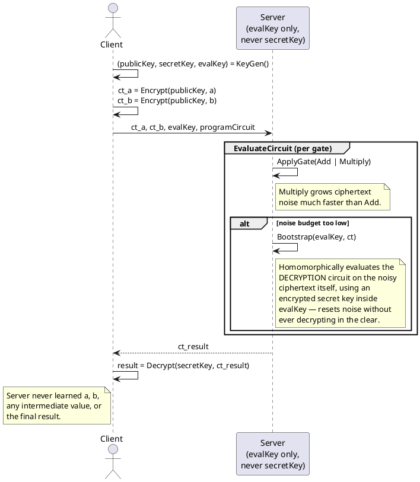

# Fully Homomorphic Encryption (FHE)

**Category:** Homomorphic encryption (arbitrary computation)
**Status:** Practical for narrow workloads as of 2026; general-purpose use still costly
**Home project:** [encrypted-search-and-computation](README.md)

## Table of Contents

- [What It Is](#what-it-is)
- [How It Works](#how-it-works)
- [Pseudocode](#pseudocode)
- [Protocol Flow](#protocol-flow)
- [The Homomorphic Encryption Ladder](#the-homomorphic-encryption-ladder)
- [Major Schemes](#major-schemes)
- [Libraries](#libraries)
- [Strengths](#strengths)
- [Limitations](#limitations)
- [Real-World Production Use (2026)](#real-world-production-use-2026)
- [Related Standards/Constructions](#related-standardsconstructions)

## What It Is

Fully Homomorphic Encryption supports **both** addition and multiplication on ciphertexts — which
is enough to build any Boolean or arithmetic circuit, meaning arbitrary computation over encrypted
data with no operation limit and no need to ever decrypt intermediate values. A third party (a
cloud server, say) can run an arbitrary program on your encrypted input and hand back an encrypted
result that only you can decrypt, having never seen the plaintext at any point.

## How It Works

Every homomorphic scheme (PHE included) that supports multiplication has a problem: multiplying
ciphertexts increases the "noise" embedded in each ciphertext (most modern schemes are
lattice-based, built on Learning With Errors (LWE) or its ring variant (RLWE), and rely on noisy
encodings for security). Enough noise accumulation makes decryption fail. Craig Gentry's 2009
breakthrough (his PhD thesis, building the first-ever FHE construction) was **bootstrapping**: a
technique to homomorphically evaluate the scheme's own decryption circuit on a noisy ciphertext,
producing a fresh, low-noise ciphertext encrypting the same value — effectively "refreshing" a
ciphertext without ever decrypting it in the clear. That's the mechanism that turns a
noise-limited "somewhat homomorphic" scheme into one with no depth limit at all.

## Pseudocode

High-level circuit-evaluation view (this is the shape of what a library like SEAL/OpenFHE/TFHE-rs
does internally — real noise budgeting, relinearization, and bootstrapping triggers are scheme-
specific and considerably more involved). Illustrative, not implementable as-is.

```
function KeyGen(securityParam):
    (publicKey, secretKey) = LWE.Setup(securityParam)     // lattice-based keypair
    evalKey = GenerateEvalKey(publicKey, secretKey)        // enables Add/Multiply/Bootstrap
                                                            // without ever exposing secretKey
    return (publicKey, secretKey, evalKey)

function Encrypt(publicKey, value):
    return LWE.Encrypt(publicKey, value)                   // ciphertext carries some initial noise

function Decrypt(secretKey, ciphertext):
    return LWE.Decrypt(secretKey, ciphertext)

// --- Homomorphic operations — evalKey only, no secretKey required ---
function HomomorphicAdd(evalKey, ct1, ct2):
    return ct1 + ct2                                       // noise grows additively (cheap)

function HomomorphicMultiply(evalKey, ct1, ct2):
    ctRaw = TensorProduct(ct1, ct2)                         // noise grows MUCH faster than Add
    return Relinearize(evalKey, ctRaw)                      // keep ciphertext size constant

function Bootstrap(evalKey, ct):
    // Homomorphically evaluates the scheme's OWN decryption circuit on ct,
    // using an encrypted copy of the secret key baked into evalKey — output
    // encrypts the same value as ct, but with noise reset to a low baseline.
    return HomomorphicEvaluate(evalKey, DecryptionCircuit, ct)

// --- Evaluate an arbitrary circuit, bootstrapping whenever noise gets too high ---
function EvaluateCircuit(evalKey, circuit, encryptedInputs):
    wireValues = encryptedInputs
    for gate in circuit.gatesInTopologicalOrder():
        result = ApplyGate(gate, wireValues, evalKey)        // Add or Multiply
        if NoiseBudget(result) < BOOTSTRAP_THRESHOLD:
            result = Bootstrap(evalKey, result)
        wireValues[gate.output] = result
    return wireValues[circuit.finalOutput]

// --- Client ---
(publicKey, secretKey, evalKey) = KeyGen(securityParam)
ct_a = Encrypt(publicKey, a)
ct_b = Encrypt(publicKey, b)
Client -> Server: send ct_a, ct_b, evalKey (NOT secretKey)

// --- Server: never sees a, b, evalKey does not expose secretKey ---
ct_result = EvaluateCircuit(evalKey, programCircuit, [ct_a, ct_b])
Server -> Client: send ct_result

// --- Client: only the client can ever produce a plaintext ---
result = Decrypt(secretKey, ct_result)
```

## Protocol Flow



## The Homomorphic Encryption Ladder

```
PHE (one op, unlimited times)
  → Somewhat Homomorphic Encryption (SHE) — both ops, but only up to a fixed circuit
    depth before noise overwhelms the ciphertext
    → Leveled FHE — SHE, but parameterized in advance for a known circuit depth
      (no bootstrapping needed if you know the depth up front)
      → Fully Homomorphic Encryption — bootstrapping removes the depth limit entirely,
        arbitrary circuits, unlimited operations
```

## Major Schemes

- **BGV / BFV** — exact integer arithmetic over encrypted data. BFV in particular is the common
  choice when the computation needs exact (not approximate) integer results.
- **CKKS** — approximate arithmetic over encrypted real/complex numbers. The scheme of choice for
  encrypted machine learning (neural network inference, statistics) where a small amount of
  numerical approximation error is acceptable in exchange for practical performance.
- **TFHE** — optimized for very fast bootstrapping *per gate*, making it well suited to Boolean
  circuits and small encrypted lookups (its bootstrapping is fast enough to run after nearly every
  gate, unlike BGV/BFV/CKKS where bootstrapping is an expensive operation to be minimized).

## Libraries

- **[Microsoft SEAL](https://github.com/microsoft/SEAL)** — C++, implements BFV and CKKS; mature,
  widely used, "battle-tested" in enterprise contexts.
- **[OpenFHE](https://github.com/openfheorg/openfhe-development)** (Duality Technologies et al.) —
  production-oriented, implements essentially all major schemes (BGV, BFV, CKKS, TFHE-style) under
  one API, letting a project switch schemes without a full rewrite.
- **[TFHE-rs](https://github.com/zama-ai/tfhe-rs)** and
  **[Concrete](https://github.com/zama-ai/concrete)** (Zama) — Rust implementations of TFHE;
  Concrete additionally compiles plain Python programs into their FHE equivalent, and Zama's
  Concrete ML layer targets encrypted ML specifically.
- **[TFHE library](https://www.tfhe.com/)** (original C/C++ reference implementation) — "Fast
  Fully Homomorphic Encryption over the Torus," the reference for the TFHE scheme itself.

## Strengths

- No fundamental leakage: unlike OPE/ORE, an FHE ciphertext reveals nothing about order, value, or
  frequency — the security reduction is to standard lattice hardness assumptions (LWE/RLWE),
  which are also widely believed to be post-quantum resistant.
- Supports genuinely arbitrary computation — the only scheme in this survey that isn't restricted
  to a single operation or a comparison-only query shape.

## Limitations

- Performance is the whole story here: even with 15+ years of optimization since Gentry's original
  construction, general-purpose FHE computation remains orders of magnitude slower than plaintext
  computation. Bootstrapping in particular is expensive.
- Choosing the right scheme (BFV vs. CKKS vs. TFHE) requires understanding the shape of your
  computation (exact vs. approximate, arithmetic-heavy vs. Boolean/lookup-heavy) — there isn't a
  single scheme that's best for everything.
- Tooling has matured a lot (Concrete compiling Python directly) but still requires real
  cryptographic expertise to get right, especially around noise budget and parameter selection.

## Real-World Production Use (2026)

As of 2026, FHE ships in production specifically where the workload is a **narrow, well-bounded
private lookup** rather than general-purpose computation:

- Apple's Live Caller ID and Enhanced Visual Search
- Microsoft Edge's Password Monitor (checking a password against a breach list without revealing
  it)
- Zama's encrypted-transaction mainnet deployment on Ethereum, processing on the order of tens of
  transactions per second

The pattern across all three: a small, fixed, well-understood computation (a lookup, a comparison,
a balance update) rather than an arbitrary program — which is exactly where FHE's cost is currently
affordable.

## Related Standards/Constructions

**Academic foundations:**
- Gentry — *Fully Homomorphic Encryption Using Ideal Lattices* (STOC 2009) — the original
  construction and bootstrapping technique.
- Brakerski, Gentry, Vaikuntanathan — BGV scheme.
- Fan, Vercauteren — BFV scheme (a simplification/variant building on BGV).
- Cheon, Kim, Kim, Song — CKKS (approximate arithmetic).
- Chillotti, Gama, Georgieva, Izabachène — TFHE (fast gate-by-gate bootstrapping).

**Standardization (unlike OPE/ORE, FHE has real standards-body activity underway):**
- **[ISO/IEC 28033 series](https://www.iso.org/standard/87638.html)** (ISO/IEC JTC1/SC27/WG2) —
  a dedicated multi-part FHE standard in active development. Part 1 (General: definitions,
  security models, hardness assumptions, message/ciphertext/key spaces) reached Draft
  International Standard status in 2025; Part 5 (Scheme Switching, based on the Chimera
  framework) is still a Working Draft.
- **[HomomorphicEncryption.org](https://homomorphicencryption.org/)** — the industry/government/
  academic consortium (IBM, Microsoft, Duality, MIT, Stanford, and others) whose community
  security standard (2018, updated 2024) is the de facto reference nearly every FHE library
  (SEAL, OpenFHE, TFHE-rs) uses for parameter selection, and which has directly shaped the
  ISO/IEC 28033 drafting above.
- **[NIST Privacy-Enhancing Cryptography program](https://csrc.nist.gov/projects/pec/fhe)** tracks
  FHE alongside PSI/MPC/ZKP (no finished NIST FHE standard yet); its
  [Multi-Party Threshold Cryptography project](https://csrc.nist.gov/projects/threshold-cryptography)
  (NIST IR 8214C) has an open call that explicitly includes *threshold* FHE.
- Full details and links: [RESEARCH_BIBLIOGRAPHY.md § Standards Bodies](RESEARCH_BIBLIOGRAPHY.md#standards-bodies--ongoing-standardization).

- See [Partially Homomorphic Encryption](phe-partially-homomorphic-encryption.md) for the
  single-operation predecessor this generalizes, and its already-finished ISO standard.
