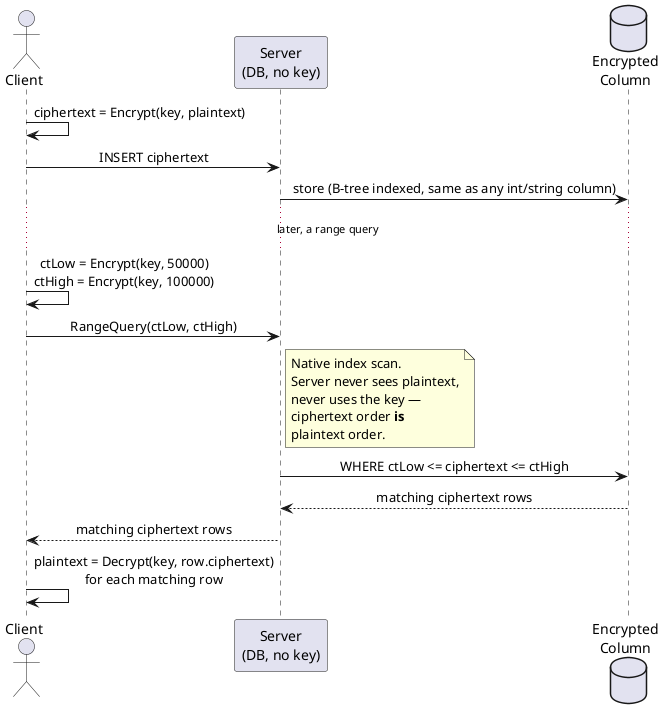

# Order-Preserving Encryption (OPE)

**Category:** Property-preserving encryption
**Status:** Largely deprecated for new designs
**Home project:** [encrypted-search-and-computation](README.md)

## Table of Contents

- [What It Is](#what-it-is)
- [How It Works](#how-it-works)
- [Pseudocode](#pseudocode)
- [Protocol Flow](#protocol-flow)
- [Strengths](#strengths)
- [Limitations](#limitations)
- [Known Attacks](#known-attacks)
- [Use Cases](#use-cases)
- [Related Standards / Constructions](#related-standardsconstructions)

## What It Is

Order-Preserving Encryption produces ciphertexts whose numeric/byte order exactly matches the
order of the plaintexts they came from: if `a < b` in plaintext, then `Enc(a) < Enc(b)` in
ciphertext, for *any* key. That means a database (or anything else) can sort, index (B-tree),
and range-query the encrypted column directly — `WHERE encrypted_salary BETWEEN X AND Y` — using
completely standard indexing machinery, without ever decrypting or even holding the key.

## How It Works

The foundational scheme is Boldyreva, Chenette, Lee, and O'Neill's 2009 construction (BCLO),
which builds an order-preserving map by simulating "throwing balls into a random binomial-drawn
sequence of bins" — effectively sampling a random monotonic function from plaintext space to a
larger ciphertext space, keyed by a pseudorandom function so it's not learnable without the key
in isolation. Later work (Popa, Li, Zeldovich — "mutable OPE"/mOPE, used in CryptDB) made the
encoding *interactive* and built incrementally as data is inserted, trading a stateful protocol
for tighter ideal-security guarantees than the original stateless BCLO scheme.

## Pseudocode

Simplified illustration of the BCLO idea — recursively narrow the ciphertext range using a
pseudorandom-function-seeded split, so the split point is deterministic (same plaintext always
maps the same way under one key) but unpredictable without the key. **Not a rigorous
reproduction of the paper's hypergeometric sampling** — enough to show the shape of the
mechanism, not to implement from.

```
function Encrypt(key, plaintext, ptRange = [ptMin, ptMax], ctRange = [ctMin, ctMax]):
    if ptRange is a single value:
        return DeterministicSample(ctRange, seed = PRF(key, plaintext))

    ptMid = Midpoint(ptRange)
    // PRF-seeded split keeps the mapping consistent for a given key/dataset
    // while being unpredictable to anyone without the key.
    ctSplit = ctRange.min + PRFWeightedSplit(PRF(key, ptMid), ptRange, ctRange)

    if plaintext <= ptMid:
        return Encrypt(key, plaintext, [ptRange.min, ptMid], [ctRange.min, ctSplit])
    else:
        return Encrypt(key, plaintext, [ptMid + 1, ptRange.max], [ctSplit + 1, ctRange.max])

function Decrypt(key, ciphertext, ptRange, ctRange):
    // Same recursive walk, using the ciphertext to pick a branch instead of the plaintext
    if ptRange is a single value:
        return ptRange.value
    ptMid = Midpoint(ptRange)
    ctSplit = ctRange.min + PRFWeightedSplit(PRF(key, ptMid), ptRange, ctRange)
    if ciphertext <= ctSplit:
        return Decrypt(key, ciphertext, [ptRange.min, ptMid], [ctRange.min, ctSplit])
    else:
        return Decrypt(key, ciphertext, [ptMid + 1, ptRange.max], [ctSplit + 1, ctRange.max])

// --- Client: encrypt on insert, encrypt query bounds ---
ciphertextRow = Encrypt(key, plaintextSalary)
Server.Insert(ciphertextRow)

ctLow  = Encrypt(key, 50000)
ctHigh = Encrypt(key, 100000)
matchingRows = Server.RangeQuery(ctLow, ctHigh)   // server holds no key

// --- Server: no key required, ciphertext order == plaintext order ---
function Server.RangeQuery(ctLow, ctHigh):
    return [row for row in encryptedColumn if ctLow <= row.ciphertext <= ctHigh]

// --- Client: decrypt only the results it got back ---
plaintextResults = [Decrypt(key, row.ciphertext) for row in matchingRows]
```

## Protocol Flow



## Strengths

- Zero-modification range queries: a standard B-tree index over ciphertexts just works.
- No per-query interaction with a trusted party — the server evaluates comparisons unaided.
- Performance is close to native (no expensive per-comparison cryptographic operation once
  encrypted — the comparison *is* just an integer/byte comparison).

## Limitations

- **By design**, OPE leaks the complete order of every value in a column. Order plus frequency
  (how often each value appears) is a lot of side-channel information about a real-world
  distribution (e.g., a salary column, ages, ZIP codes).
- Ciphertext size typically must grow relative to plaintext to leave room for the random
  monotonic mapping, and encoding schemes are non-trivial to make efficiently updatable.
- Deterministic in effect for a given key/dataset — the same plaintext value always yields
  comparably-ordered output, reinforcing the frequency leakage problem.

## Known Attacks

Naveed, Kamara, and Wright's **"Inference Attacks on Property-Preserving Encrypted Databases"**
(CCS 2015) is the paper that ended OPE's run as a default recommendation. Against systems built
on CryptDB-style property-preserving encryption (deterministic encryption + OPE), they showed
that combining the *revealed order* with *publicly available auxiliary information* (e.g., a
public distribution of the attribute, like known salary ranges or age distributions) lets an
attacker recover a large fraction of plaintext values using the Hungarian algorithm to solve a
linear sum assignment problem between ciphertext ranks and the auxiliary distribution. Demonstrated
concretely against a real medical database. This result — order leakage is exploitable even
without breaking the underlying cryptography — is the reason ORE and other alternatives emerged
as the "same idea, tighter leakage" successor (see [ORE](ore-order-revealing-encryption.md)), and
why neither should be a default choice today without a specific, well-understood threat model.

## Use Cases

- Historically: encrypted database range queries (CryptDB and similar systems), where the
  operational win (native indexing performance) was judged to outweigh the leakage risk for a
  specific threat model (a passive, honest-but-curious DB admin without strong auxiliary data).
- Any of these today should be re-evaluated against ORE or a bucketed/blind-index approach given
  the 2015 attack results.

## Related Standards/Constructions

- Boldyreva, Chenette, Lee, O'Neill — *Order-Preserving Symmetric Encryption* (EUROCRYPT 2009) —
  the foundational BCLO scheme.
- Popa, Li, Zeldovich — *An Ideal-Security Protocol for Order-Preserving Encoding* (mOPE, used in
  [CryptDB](https://css.csail.mit.edu/cryptdb/)).
- **No formal standard exists.** Neither NIST nor ISO has standardized OPE — it remains defined
  solely by the academic papers above. The nearest standardized relative is
  [NIST SP 800-38G](https://csrc.nist.gov/publications/detail/sp/800-38g/rev-1/final)
  (Format-Preserving Encryption, FF1/FF3-1) — but FPE preserves ciphertext *format/length*, not
  *order*, so it doesn't substitute for OPE despite the naming similarity. See
  [RESEARCH_BIBLIOGRAPHY.md § Standards Bodies](RESEARCH_BIBLIOGRAPHY.md#standards-bodies--ongoing-standardization)
  for the full standardization picture across all four schemes.
- See [Order-Revealing Encryption](ore-order-revealing-encryption.md) for the generalization that
  addresses some of OPE's structural leakage.
