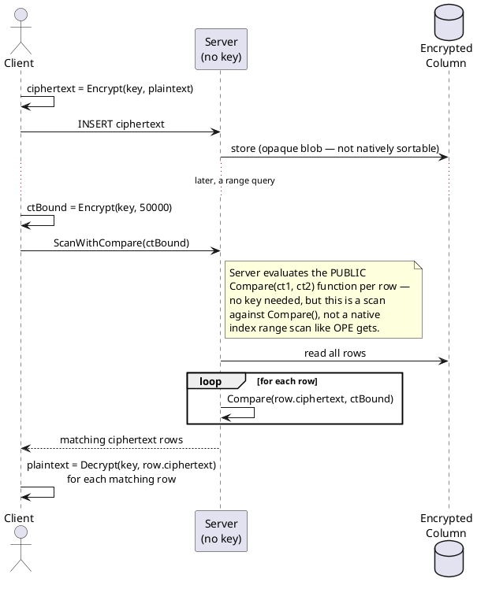

# Order-Revealing Encryption (ORE)

**Category:** Property-revealing encryption
**Status:** Research-mature, limited production adoption
**Home project:** [encrypted-search-and-computation](README.md)

## Table of Contents

- [What It Is](#what-it-is)
- [How It Works](#how-it-works)
- [Pseudocode](#pseudocode)
- [Protocol Flow](#protocol-flow)
- [Strengths](#strengths)
- [Limitations](#limitations)
- [Performance](#performance)
- [Use Cases](#use-cases)
- [Related Standards/Constructions](#related-standardsconstructions)

## What It Is

Order-Revealing Encryption generalizes OPE: instead of requiring ciphertext *byte order* to
directly match plaintext order, ORE only requires that there exist a public `Compare(ct1, ct2)`
function that outputs the correct order relation. That extra indirection is the whole point — it
decouples "what the ciphertexts look like" from "what a comparison of them reveals," which opens
room for schemes that hide value *frequency* even while still revealing *order* (so-called
frequency-hiding ORE), something plain OPE structurally cannot do.

## How It Works

The practical line of work here is Chenette, Lewi, Weis, and Wu's **"Practical Order-Revealing
Encryption with Limited Leakage"** (FSE 2016), which builds ORE for small message spaces
efficiently from pseudorandom functions, plus a domain-extension technique to handle larger
values. Lewi and Wu's follow-up, **"Order-Revealing Encryption: New Constructions, Applications,
and Lower Bounds"** (CCS 2016), pushes this to a "best-possible" security notion for ORE — the
scheme leaks the least an order-revealing scheme can leak (order and nothing else derivable from
ciphertext structure), as opposed to OPE's incidental extra leakage from the encoding itself.

## Pseudocode

Simplified illustration of the CLWW idea — encrypt each bit position blinded by a PRF keyed on
the plaintext *prefix* seen so far, so two ciphertexts can be compared position-by-position
without ever exposing the raw bits, only the order relation. **Not a rigorous reproduction of
CLWW's actual algebra** (real constructions use a right-to-left PRF chain and permutation-based
blinding) — enough to show why comparison can be a public function instead of native ciphertext
ordering.

```
function Encrypt(key, plaintext):  // n-bit value, bits x[1..n]
    ciphertext = []
    for i in 1..n:
        prefix = plaintext[1..i-1]
        bit = plaintext[i]
        mask = PRF(key, prefix)                    // pseudorandom, keyed on prefix only
        ciphertext.append(BlindBit(bit, mask))       // hides the raw bit value
    return ciphertext

// --- Public: no key required ---
function Compare(ct1, ct2):
    for i in 1..length(ct1):
        if ct1[i] != ct2[i]:
            // First differing position determines order; the blinding
            // is constructed so this comparison is still correct without
            // revealing either underlying bit directly.
            return OrderOf(ct1[i], ct2[i])   // LESS | GREATER
    return EQUAL

// --- Client: encrypt on insert, encrypt query bound ---
ciphertextRow = Encrypt(key, plaintextSalary)
Server.Insert(ciphertextRow)

ctBound = Encrypt(key, 50000)
matchingRows = Server.ScanWithCompare(ctBound)   // server holds no key

// --- Server: uses the PUBLIC Compare function, no key needed ---
function Server.ScanWithCompare(ctBound):
    return [row for row in encryptedColumn if Compare(row.ciphertext, ctBound) != LESS]

// --- Client: decrypt only the results it got back ---
plaintextResults = [Decrypt(key, row.ciphertext) for row in matchingRows]
```

## Protocol Flow



## Strengths

- Same query capability as OPE (range/comparison) with a materially better-defined leakage
  profile — order is revealed *only* through the compare function, not baked into ciphertext
  structure, so frequency-hiding variants are possible.
- Fast in practice: the Lewi-Wu construction encrypts a 32-bit integer in about 55 microseconds,
  roughly 65x faster than the OPE schemes it was benchmarked against.
- Same operational upside as OPE — enables server-side range queries without decryption or
  interaction with a trusted party per query.

## Limitations

- Still fundamentally leaks the **order** of the underlying values — that's the entire point of
  the scheme, not a bug, so the same class of statistical inference risk that broke OPE (order +
  auxiliary distribution knowledge) still applies in principle, just against a smaller attack
  surface than OPE's frequency+order leakage.
- Because comparison requires a dedicated `Compare` function rather than native ciphertext
  ordering, it typically can't drop directly into a standard database index the way OPE
  ciphertexts can — some ORE constructions require custom comparison logic at the application or
  index layer.
- Less battle-tested in production than PHE; most implementations are research/proof-of-concept
  rather than hardened libraries.

## Performance

Per the Lewi-Wu benchmark: ~55μs to encrypt a single 32-bit integer, ~65x faster than the
contemporaneous OPE schemes it was compared against. That performance gap (plus the tighter
leakage story) is why ORE is generally the better default over OPE whenever this whole class of
technique is actually the right tool.

## Use Cases

Same shape as OPE's use cases — encrypted range queries — but preferred over OPE wherever the
tradeoff is being made deliberately today, given the better leakage profile and faster
benchmarks.

## Related Standards/Constructions

- Chenette, Lewi, Weis, Wu — *Practical Order-Revealing Encryption with Limited Leakage* (FSE
  2016) — the CLWW construction.
- Lewi, Wu — *Order-Revealing Encryption: New Constructions, Applications, and Lower Bounds* (CCS
  2016) — best-possible-security ORE with domain extension.
- Reference implementations: [kevinlewi/fastore](https://github.com/kevinlewi/fastore) (Lewi's
  own implementation), [pdroalves/ore_lewi-wu](https://github.com/pdroalves/ore_lewi-wu),
  [averykhoo/order-revealing-encryption](https://github.com/averykhoo/order-revealing-encryption)
  (Python).
- **No formal standard exists**, same as OPE — see
  [RESEARCH_BIBLIOGRAPHY.md § Standards Bodies](RESEARCH_BIBLIOGRAPHY.md#standards-bodies--ongoing-standardization).
- See [Order-Preserving Encryption](ope-order-preserving-encryption.md) for the predecessor this
  generalizes, and the attack that motivated the tighter leakage design.
