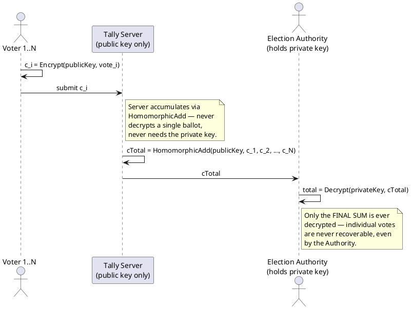

# Partially Homomorphic Encryption (PHE)

**Category:** Homomorphic encryption (single operation)
**Status:** Mature, in production
**Home project:** [encrypted-search-and-computation](README.md)

## Table of Contents

- [What It Is](#what-it-is)
- [How It Works](#how-it-works)
- [Pseudocode](#pseudocode)
- [Protocol Flow](#protocol-flow)
- [Strengths](#strengths)
- [Limitations](#limitations)
- [Use Cases](#use-cases)
- [Related Standards/Constructions](#related-standardsconstructions)

## What It Is

A homomorphic encryption scheme lets you perform an operation on ciphertexts such that decrypting
the result gives the same answer as if you'd performed the operation on the plaintexts directly —
`Dec(Enc(a) ⊕ Enc(b)) = a + b`, without ever decrypting `a` or `b`. "Partially" homomorphic means
the scheme supports exactly **one** such operation (either addition or multiplication), applied an
unlimited number of times to unlimited ciphertexts. This is a much older and more mature idea than
FHE — several classical public-key schemes turn out to already be homomorphic for one operation as
a structural side effect of their algebra.

## How It Works

- **Paillier** (1999) — additively homomorphic. Based on the decisional composite residuosity
  assumption. `Enc(a) · Enc(b) mod n² = Enc(a + b)`, and raising a ciphertext to a plaintext
  exponent gives homomorphic scalar multiplication (`Enc(a)^k = Enc(a·k)`). The standard choice
  whenever the operation needed is *addition*.
- **RSA** (textbook, unpadded) — multiplicatively homomorphic: `Enc(a) · Enc(b) mod n = Enc(a·b)`.
  This is actually a well-known *weakness* of textbook RSA for encryption (it's why real RSA
  encryption uses OAEP padding to destroy this property) but it's exactly the property that makes
  it usable as a PHE scheme when multiplication is the desired operation.
- **ElGamal** (1985) — multiplicatively homomorphic over a cyclic group; an additive variant
  ("exponential ElGamal") encodes the message in the exponent so that ciphertext multiplication
  yields exponentiated sums, at the cost of requiring a discrete-log computation (over a small
  range) to recover the final sum during decryption — practical when the summed result is bounded.
- **Goldwasser-Micali** (1982) — the original semantically-secure scheme, homomorphic for XOR of
  encrypted bits.

## Pseudocode

Textbook Paillier (additive PHE) — this one *is* a faithful sketch of the real algorithm, unlike
the illustrative OPE/ORE pseudocode above.

```
function KeyGen(bitLength):
    p, q = two random large primes of bitLength/2 bits each
    n = p * q
    λ = lcm(p - 1, q - 1)
    g = n + 1                                  // valid generator choice for this n
    μ = ModInverse(L(g^λ mod n²), n)            // L(x) := (x - 1) / n
    publicKey  = (n, g)
    privateKey = (λ, μ)
    return (publicKey, privateKey)

function Encrypt(publicKey, m):                // 0 <= m < n
    (n, g) = publicKey
    r = RandomCoprimeTo(n)                      // fresh randomness each call —
    c = (g^m * r^n) mod n²                      // same plaintext encrypts differently every time
    return c

function Decrypt(privateKey, c):
    (λ, μ) = privateKey
    m = (L(c^λ mod n²) * μ) mod n
    return m

// --- The homomorphic operations — no key required for either ---
function HomomorphicAdd(publicKey, c1, c2):
    return (c1 * c2) mod n²                     // = Encrypt(m1 + m2)

function HomomorphicScalarMultiply(publicKey, c, k):
    return (c^k) mod n²                         // = Encrypt(m * k)

// --- Example: tally two encrypted values without ever decrypting either ---
c1 = Encrypt(publicKey, 100)
c2 = Encrypt(publicKey, 250)
cSum = HomomorphicAdd(publicKey, c1, c2)         // server does this, holds no private key
total = Decrypt(privateKey, cSum)                // only the key holder can do this — total == 350
```

## Protocol Flow

Illustrated as an e-voting tally, the canonical PHE use case: many voters encrypt independently,
a server sums blindly, only the election authority ever decrypts — and only the *total*, never an
individual vote.



## Strengths

- Fast, decades-old, well-understood security (reduces to standard hardness assumptions: DDH,
  RSA problem, composite residuosity) — no exotic lattice machinery required.
- No order or frequency leakage the way OPE/ORE have — security is standard semantic security
  (IND-CPA), not a deliberately weakened property-preserving notion.
- Already deployed in real production systems for the operations they support.

## Limitations

- Genuinely limited to one operation. You cannot compute `a*b + c` under Paillier — only sums (and
  scalar multiples) of encrypted values. Any workload needing a mix of add and multiply needs FHE
  instead (or restructuring the computation to fit a single-operation model).
- Ciphertext expansion and per-operation cost are still non-trivial compared to plaintext
  arithmetic, though far cheaper than FHE.

## Use Cases

- **E-voting**: tallying encrypted votes via Paillier's additive homomorphism — sum all encrypted
  ballots, decrypt only the final total, individual votes never decrypted. Exponential ElGamal is
  used the same way in several deployed voting schemes.
- **Private Set Intersection (PSI)**: Paillier-based PSI protocols let two parties learn the
  intersection of their sets without revealing non-overlapping elements — used in practical
  contact-tracing designs (a health authority holds geocoordinate/timestamp sets for infected
  individuals; a phone holds its own set; the protocol reveals only the overlap).
- **Encrypted aggregation** generally — any "sum a bunch of private values, reveal only the total"
  pattern (billing aggregation, encrypted analytics, secure statistics).

## Related Standards/Constructions

- **[ISO/IEC 18033-6:2019](https://www.iso.org/standard/67740.html)** — *IT Security techniques —
  Encryption algorithms — Part 6: Homomorphic encryption.* PHE is the only one of the four schemes
  in this survey with a finished ISO standard: this directly specifies Exponential ElGamal and
  Paillier (key/parameter generation, encryption, decryption, the homomorphic operation, object
  identifiers, and numerical test vectors).
- Paillier — *Public-Key Cryptosystems Based on Composite Degree Residuosity Classes* (EUROCRYPT
  1999).
- Goldwasser, Micali — *Probabilistic Encryption* (1982) — foundational semantic security + the
  first homomorphic (XOR) scheme.
- ElGamal — *A Public Key Cryptosystem and a Signature Scheme Based on Discrete Logarithms*
  (1985).
- See [RESEARCH_BIBLIOGRAPHY.md § Standards Bodies](RESEARCH_BIBLIOGRAPHY.md#standards-bodies--ongoing-standardization)
  for the full standard text reference and an ISO-compliant reference implementation.
- See [Fully Homomorphic Encryption](fhe-fully-homomorphic-encryption.md) for the generalization
  that removes the single-operation restriction.
