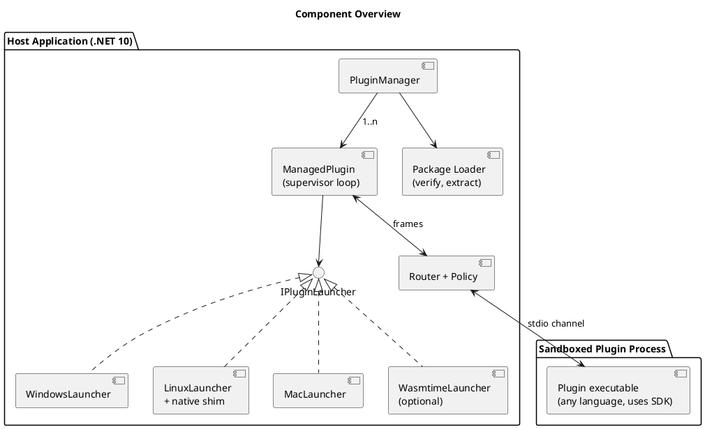
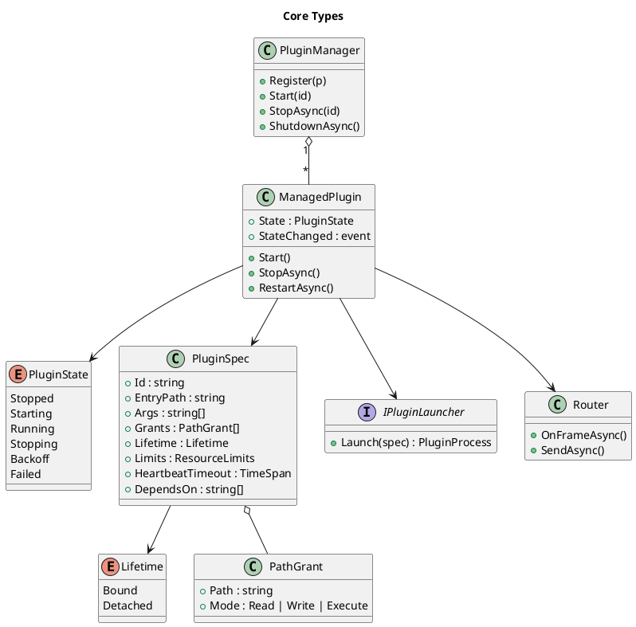
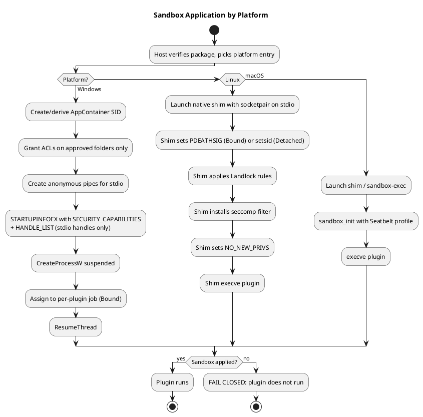
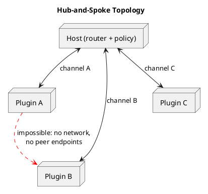
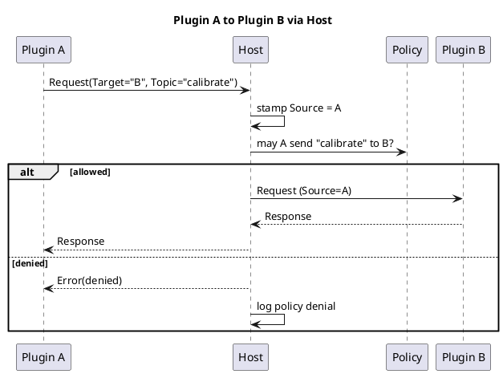
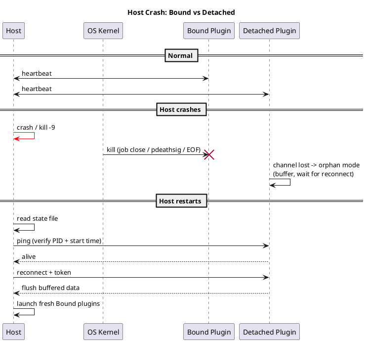
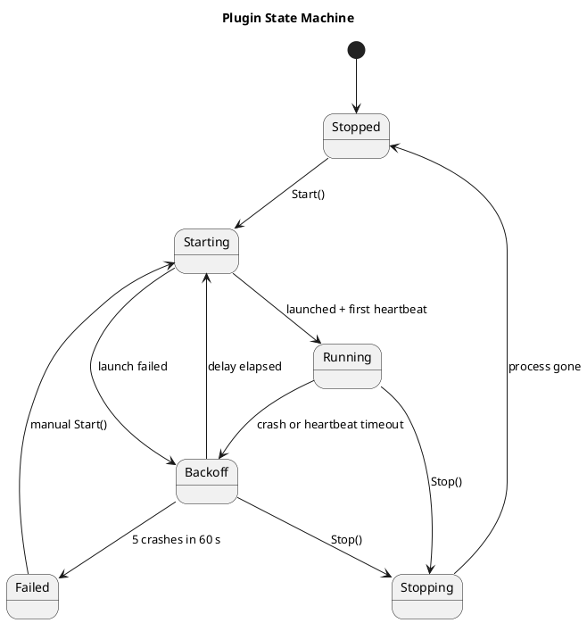
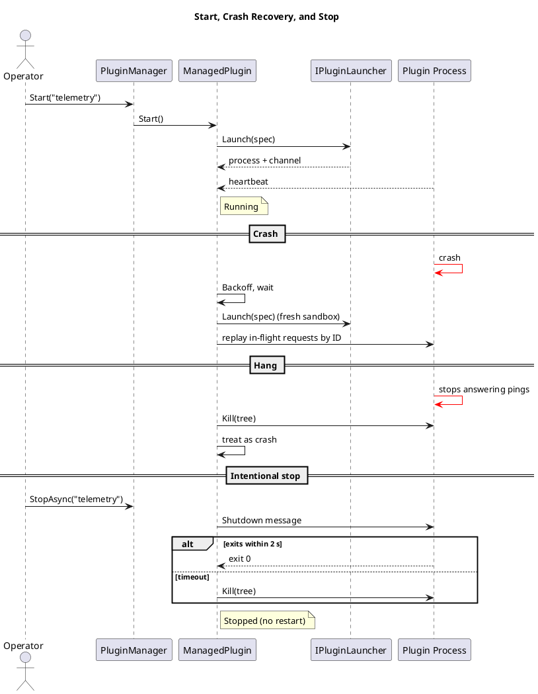
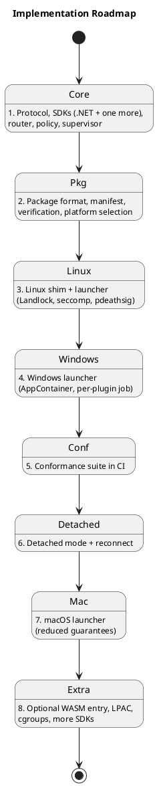

# Plugin Sandboxing, Communication, and Lifecycle: Design Document

Diagram sources are in `diagrams/src/` and rendered SVGs in `diagrams/svg/`. The PlantUML blocks below are the same diagrams inline.

## 1. Goals and Non-Goals

**Goals**
- Run third-party plugins, written in any language, under host-defined rules: no network, and only host-selected files.
- Pay a one-time startup cost only, with no per-call sandbox overhead.
- Give the host full lifecycle control: start, stop, restart, crash and hang recovery.
- Support two lifetime policies: **Bound** (dies with the host) and **Detached** (survives a host crash).
- Support Windows, Linux, and macOS with one protocol, one manifest, and one policy model.
- Plugins talk only to the host. Plugin-to-plugin traffic is always routed by the host.

**Non-goals**
- Sandboxing in-process code (not feasible).
- Defending against kernel exploits (use a VM for that).
- A single binary for every platform. Native plugins are built per platform, and WASM is the only optional single-artifact format.

## 2. Architecture

The host is a .NET 10 application. Each plugin is a separate sandboxed executable that speaks a framed protocol over a single channel to the host. The host never loads plugin code.



**Reuse:** about 70-80% of the host is shared across OSes: manager, supervisor, state machine, router, policy, protocol, config, and package handling. Only `IPluginLauncher` implementations are per-OS, and Linux and macOS share the libc P/Invokes.

```csharp
interface IPluginLauncher { PluginProcess Launch(PluginSpec spec); }
```

`PluginSpec` holds the verified entry path, args, capability grants, `Lifetime`, resource limits, heartbeat timeout, and dependencies.



## 3. Packaging and Platform Support

The contract is **the protocol, not a runtime**. No cross-platform runtime exists for every language, so a plugin is a package containing one executable per platform, and the host selects the match.

```
telemetry-1.2.0.plugin   (zip)
├─ manifest.json
├─ win-x64/telemetry.exe
├─ win-arm64/telemetry.exe
├─ linux-x64/telemetry
├─ linux-arm64/telemetry
├─ osx-universal/telemetry
└─ plugin.wasm            (optional, portable)
```

```json
{
  "id": "telemetry",
  "version": "1.2.0",
  "protocol": "2.1",
  "entry": {
    "wasm": "plugin.wasm",
    "win-x64": "win-x64/telemetry.exe",
    "linux-x64": "linux-x64/telemetry",
    "linux-arm64": "linux-arm64/telemetry",
    "osx-universal": "osx-universal/telemetry"
  },
  "platforms": ["win-x64", "linux-x64", "linux-arm64", "osx-universal"],
  "lifetime": "Bound",
  "capabilities": {
    "data": "rw",
    "publish": ["device.readings"],
    "subscribe": ["config.updated"],
    "sendTo": ["analytics"]
  },
  "files": { "win-x64/telemetry.exe": "sha256:...", "linux-x64/telemetry": "sha256:..." },
  "signature": "..."
}
```

**Support tiers**

| Tier | Languages | Packaging |
|---|---|---|
| 1 | .NET, Rust, Go, C/C++ | Native binary per platform, or WASM |
| 2 | Python, Node, Java | Runtime bundled into each platform folder |
| 3 | Anything else | Author supplies per-platform executables that pass conformance |

**Host responsibilities**
- **Select by platform:** detect OS and architecture and pick the entry. If none matches, report "unavailable on this platform" before launch. Emulation (Rosetta, x64-on-ARM64) is opt-in.
- **Verify, then extract:** check the signature and per-file hashes, extract to a host-owned read-only location, and never run from a writable folder. Set the execute bit on Unix.
- **Grant only the selected platform folder** to the sandbox, not the whole package.
- **Linux libc:** require static or musl builds, or treat `linux-musl-x64` as its own platform.
- **macOS:** Apple Silicon requires at least an ad-hoc signature. Either strip quarantine on files you verified yourself or require signed and notarized binaries.
- **Interpreted languages:** bundle the runtime. This keeps sandbox grants minimal and the version predictable.
- **Platform support is earned:** a platform is listed in `platforms` only after the plugin passes the conformance suite on that OS.

**WASM (optional)**
- Hosted with Wasmtime (NuGet), ideally in a small sandboxed host process.
- It's the only single-file portable format and has the strongest default sandbox (no files or network unless granted).
- Use epoch interruption for CPU caps and memory limits for RAM. Expect roughly 1.1-2x native on compute-heavy code, and near native for I/O-bound work. Cache precompiled modules.
- Language support, threads, and sockets are limited, so it's an option and never a requirement.

## 4. Sandbox Design

One policy is enforced everywhere, defined as what all three platforms can do: **no network, no spawning processes, filesystem access only to granted paths** (typically the plugin folder read-only plus a per-plugin data directory). Authors declare logical capabilities, and each launcher translates them.

| | Windows | Linux | macOS |
|---|---|---|---|
| Filesystem | AppContainer (consider LPAC), ACL grants to the container SID | Landlock | Seatbelt profile |
| Network | AppContainer with no capabilities | seccomp denies `socket`/`connect`; Landlock net rules on 6.7+ | Seatbelt `deny network*` |
| Process control | Job object `ActiveProcessLimit = 1` | seccomp denies `fork`/`vfork` and `clone` without `CLONE_THREAD` | Seatbelt `deny process-fork` |
| Applied by | Host, at `CreateProcess` | Native shim, before `execve` of the plugin | Shim or `sandbox-exec`, before the plugin starts |
| Resource limits | Job object memory/CPU | cgroups v2 or rlimits | rlimits (weak) |



**Rules**
- **Fail closed:** if any sandbox step fails, the plugin does not run.
- **The sandbox is applied before the plugin's first instruction.** A plugin in an arbitrary language can't sandbox itself, and restrictions applied late can miss threads the runtime already created.
- **Inherit only the channel handles.** Windows uses `PROC_THREAD_ATTRIBUTE_HANDLE_LIST` with `bInheritHandles = true`. Unix passes only the socketpair as stdio.
- **Seccomp is a deny-list.** Runtimes (Go, Node, JVM, .NET) need a wide syscall set and create threads, so allow thread creation. Don't deny `execve` in seccomp, since the shim's own exec must succeed. Landlock's execute right, limited to the plugin and runtime folders, controls what can run.
- **Linux:** set `PR_SET_NO_NEW_PRIVS` last. It also prevents pdeathsig from being cleared by setuid binaries.
- **Runtime grants:** bundled runtimes live in the plugin folder, so they're covered. A system runtime would need extra read+execute grants.
- **Broker pattern:** extra access (a user-selected file, for example) is requested over the channel. The host checks policy and returns data or a handle.
- **No shared named mutexes or shared memory** between host and plugin.
- **Windows specifics:** AppContainer needs Windows 8+. `Process.Start` can't set the attribute, so the launcher P/Invokes `CreateProcessW`. Grant the container SID read+execute on the plugin folder or it fails at startup. LPAC (`PROC_THREAD_ATTRIBUTE_ALL_APPLICATION_PACKAGES_POLICY`) is stricter and needs explicit grants even for system paths.
- **macOS:** `sandbox_init` is deprecated but functional. Don't promise Linux-grade isolation there.

## 5. Communication

### 5.1 Topology: hub and spoke

Every plugin has exactly one channel, and it goes to the host. Plugins never learn about each other, and the host is the only router, so policy, logging, and rate limits live in one place.



### 5.2 Structural enforcement

- **Bound plugins use stdio:** a socketpair (Unix) or anonymous pipes (Windows) wired to the child's stdin/stdout, and stderr is for logs. Every language can do this. Because the plugin needs no ability to create sockets or open named pipes, the sandbox denies them, so a plugin can't reach another plugin even if it wants to.
- **Detached plugins** can't use inherited stdio (see §6.2). They listen on a well-known endpoint (named pipe with an ACL on Windows, Unix socket in a `chmod 700` directory on Unix). On Linux this means the seccomp filter allows `socket(AF_UNIX)` only for those plugins. Authentication uses a token from a host-only file.

### 5.3 Envelope

```csharp
record Envelope(
    MessageType Type,        // Request, Response, Event, Heartbeat, Shutdown, Error, ResourceRequest, ResourceGrant
    Guid RequestId,
    Guid? CorrelationId,     // on responses
    string Topic,
    string? Target,          // logical name or capability, never a PID or pipe
    string Source,           // STAMPED BY HOST; plugin-supplied value ignored
    int TtlMs,
    int Hops,
    byte[] Payload);
```

- Frames are length-prefixed with a hard maximum (1-4 MB). Violations disconnect the plugin.
- The host stamps `Source` from the channel the frame arrived on.
- The protocol is defined in a language-neutral IDL (protobuf, or JSON-RPC with a published schema). Thin SDKs (C#, Rust, Go, Python, Node, C/C++) implement it, and any other language can follow the spec.
- Use a strict-schema serializer with **no type-name or polymorphic deserialization**.

### 5.3.1 Supported patterns

| Pattern | Flow |
|---|---|
| Host to plugin request/response | Matched by `CorrelationId` |
| Plugin to host event | Published on a topic, and the host consumes it |
| Plugin to host request | Config, or a file via the broker |
| Plugin to plugin | Sent to the host with a `Target`, and the host checks policy and forwards |
| Pub/sub | Only through the host's topic table |



### 5.4 Policy and reliability

- **Default deny.** Each plugin's manifest declares what it may publish, subscribe to, and send to, plus limits (`msgPerSec`, `maxFrameBytes`). The receiver may also refuse unsolicited senders. Log all denials.
- **Bounded per-plugin queues** (`System.Threading.Channels`) so one slow plugin can't stall the router. When a queue fills, drop, fail, or disconnect per policy.
- **Timeouts on every request** (`TtlMs`), and a hop counter stops relay storms.
- **Priority lane for control traffic** (heartbeat, shutdown), so data floods can't cause false hang detection.
- **Restarting plugin:** fail fast with "unavailable" by default. Optionally buffer bounded idempotent messages and replay by `RequestId`.
- **Treat every payload as hostile,** including plugin A's data arriving at B. Enforce size, rate, and depth limits before deserializing.
- **Large data:** chunk it over the channel or use the broker to hand over a file handle.

Policy example:

```json
{
  "id": "telemetry",
  "publish": ["device.readings"],
  "subscribe": ["config.updated"],
  "sendTo": ["analytics"],
  "limits": { "msgPerSec": 200, "maxFrameBytes": 1048576 }
}
```

## 6. Lifetime Binding

### 6.1 Bound plugins

| OS | Mechanism |
|---|---|
| Windows | **One job object per plugin** with `KILL_ON_JOB_CLOSE` and `ActiveProcessLimit = 1`. Start suspended, assign, then resume. Never inherit or duplicate the job handle. |
| Linux | `PR_SET_PDEATHSIG(SIGKILL)` set in the shim, plus a `getppid()` check to close the race. Spawn from a long-lived dedicated thread, because pdeathsig fires when the spawning *thread* exits. Cgroup `cgroup.kill` is a stronger option when a supervisor is available. |
| macOS | No kernel equivalent. Use the channel-EOF watchdog plus `getppid()` polling or kqueue `NOTE_EXIT`. |

The **channel-EOF watchdog** is the portable baseline: the SDK exits when stdin reaches EOF, which the kernel guarantees when the host dies, provided nothing else holds the write end. The kernel mechanisms are hardening on top. All of them are outright kills with no cleanup, so plugins must tolerate being killed at any instant.

### 6.2 Detached plugins

- **Windows:** don't assign to a kill-on-close job, use `CREATE_BREAKAWAY_FROM_JOB` if a parent job requires it, and use `DETACHED_PROCESS`.
- **Linux/macOS:** skip pdeathsig and call `setsid()`. Under systemd, launch via `systemd-run --user --scope` or a separate unit, since a service's cgroup is killed on stop by default.
- **Reconnect:** a state file holds PID, **start time** (PID-reuse guard), and endpoint. On startup the host pings and reattaches, or relaunches if the plugin is dead.
- **Single instance:** a named mutex or `flock` prevents duplicates.
- **Orphan mode:** channel loss means "wait for reconnect", not "exit". The plugin buffers data (bounded, ideally to disk) and has a max-orphan timeout.
- **Still capped:** memory limits via job object or cgroup.
- **Explicit stop:** the host reconnects and sends a stop message, and the uninstaller must stop detached plugins.
- **Must-always-run work** such as telemetry collection is better as an OS service (Windows Service, systemd, launchd) with the host as a client.



## 7. Lifecycle Management

The model is **desired state vs. actual state**. `Start()` and `Stop()` change intent, and one supervisor loop per plugin reconciles reality. Manual control and crash recovery share one code path, so they can't conflict.



**Supervisor behavior**
- **Crash detection:** process exit, or no heartbeat for 10 s. Hung plugins are killed (`Kill(entireProcessTree: true)`) and treated as crashes.
- **Heartbeat semantics:** pings must be answered by the same loop that handles requests, so a deadlocked plugin can't keep beating from a side thread. The SDK spec requires this.
- **Backoff:** 500 ms doubling to 30 s with jitter, reset after one stable minute.
- **Crash-loop protection:** 5 crashes in 60 s moves the plugin to `Failed`, and a manual `Start()` resets it.
- **Intentional stop never restarts.** It sends a shutdown message, waits about 2 s, then kills.
- **Every restart rebuilds the sandbox,** including a fresh job object, grants, and channel.
- **`StopAsync` completes only when the process is gone,** so `RestartAsync` can't leave two copies running.
- **Dependencies:** start in dependency order and stop in reverse.
- **Host shutdown:** gracefully stop Bound plugins and leave Detached ones running. Job objects and pdeathsig remain the backstop if the host crashes first.
- **Windows detail:** keep the process handle open for exit codes, and prefer waiting on the raw handle, since `Process.GetProcessById` can fail with access denied on sandboxed processes.



## 8. Crash Safety and State

- Plugins must be **idempotent and restartable**, not reentrant. The host can kill and relaunch them at any instant.
- Plugins stream results and checkpoints to the host as they go, and the host owns committed state. After a restart the host replays in-flight requests by ID.
- Locks are not shared with plugins, which avoids the following kill behavior:

| Lock type | Result when its holder is killed |
|---|---|
| Windows named mutex | Released, marked *abandoned* |
| `flock` / `fcntl` | Released |
| SysV semaphore | Released only with `SEM_UNDO` |
| POSIX named semaphore | **Stays locked forever** |
| pthread mutex in shared memory | Stuck unless robust (`EOWNERDEAD`) |

- Every host wait on a plugin has a timeout.

## 9. Per-Plugin Configuration

| Field | Purpose |
|---|---|
| `enabled` | Auto-start on host launch |
| `lifetime` | `Bound` or `Detached` |
| `entry`, `files`, `signature` | Platform artifacts and verification data |
| `capabilities` | Data access, publish, subscribe, sendTo |
| `limits` | Memory, CPU, message rate, frame size |
| `heartbeatTimeout` | Hang detection |
| `restartPolicy` | Backoff and crash-loop window |
| `dependsOn` | Start/stop ordering |

## 10. Conformance Suite

The conformance suite is the real portability guarantee, since artifacts differ per platform. It is language-neutral: a set of test plugins and a runner that exercise the protocol and escape attempts.
- Network connections, spawning, and access to ungranted files are denied.
- Denials surface as consistent errors across OSes.
- Heartbeat is answered by the main loop, shutdown is honored, and message round-trips work.
- Every SDK must pass it on every OS it claims, and results gate the manifest's `platforms` list.

## 11. Security Checklist

- [ ] Verify signature and per-file hashes before extraction
- [ ] Run only from host-owned, read-only locations
- [ ] Least-privilege grants, and remove ACLs on uninstall (they persist on disk)
- [ ] Inherit only channel handles, and share no named objects
- [ ] Fail closed on any sandbox error
- [ ] Host stamps `Source`, and validates and rate-limits every frame
- [ ] Strict-schema serialization with no type-name deserialization
- [ ] Log launches, crashes, denials, and policy violations

## 12. Testing

| Test | Expected |
|---|---|
| `kill -9` or Task Manager on host | Bound children die, Detached survive |
| Plugin attempts network, spawn, or unauthorized file access | Denied on every OS |
| Plugin deadlocks its main loop | Heartbeat timeout, kill, restart |
| Plugin crash-loops | Reaches `Failed` after 5 in 60 s |
| `Stop` during `Backoff` | No restart |
| Plugin A tries to reach B directly | Impossible. Via host without permission: denied and logged |
| Host inside a parent job (Windows) | Bound and Detached semantics still hold |
| Host in a container or PID namespace | `getppid()` check behaves correctly |
| Detached plugin dead at host restart | Relaunched with no duplicate |
| Missing platform entry | Clear "unavailable" message |
| Go, Node, and JVM plugins under seccomp | Thread creation works |

## 13. Build Order



## 14. Open Questions

1. How strong must the macOS guarantee be, given no kill-on-parent-death primitive and weak resource limits?
2. Is the optional WASM path worth building in v1, or after native packages are stable?
3. Should long-running telemetry plugins be Detached children or OS services with the host as a client?
4. Fat packages (all platforms in one file) or per-platform packages with a registry?
5. Which SDK languages ship first?
