# Plugin Sandboxing, Communication, and Lifecycle: Design Document

Diagram sources are in `diagrams/src/` and rendered SVGs in `diagrams/svg/`. The PlantUML blocks below are the same diagrams inline.

> **Review status (2026-10-08).** Sections 1-9 and 14-18 are the migrated design, extended where noted. Sections **10-13** (permissions and approval, brokered external access, network isolation, resource limits and abuse handling) are **proposed additions** from a follow-up discussion. They are not yet settled decisions. See `decision-log.md` (decisions 17-26 and the "Open questions added" list) and `use-cases.md` for the scenarios they are meant to serve. Diagrams 10-12 have PlantUML sources only and are not yet rendered to SVG. OS-specific claims in the new sections were written from general knowledge and are listed in §18 under "Claims to verify".

## 1. Goals and Non-Goals

**Goals**
- Run third-party plugins, written in any language, under host-defined rules: no network, and only host-selected files.
- Pay a one-time startup cost only, with no per-call sandbox overhead.
- Give the host full lifecycle control: start, stop, restart, crash and hang recovery.
- Support two lifetime policies: **Bound** (dies with the host) and **Detached** (survives a host crash).
- Support Windows, Linux, and macOS with one protocol, one manifest, and one policy model.
- Plugins talk only to the host. Plugin-to-plugin traffic is always routed by the host.
- *(Proposed)* Let a plugin **declare** the external files and network endpoints it needs, and let the host **approve** them separately (§10). The OS sandbox stays deny-all, and approved access is served by a host broker (§11).
- *(Proposed)* Keep each plugin a network island that uses no host ports (§12).
- *(Proposed)* Detect and limit abusive resource use, with OS-enforced hard limits and host-enforced soft limits (§13).

**Non-goals**
- Sandboxing in-process code (not feasible).
- Defending against kernel exploits (use a VM for that).
- A single binary for every platform. Native plugins are built per platform, and WASM is the only optional single-artifact format.

## 2. Architecture

The host is a .NET 10 application. Each plugin is a separate sandboxed executable that speaks a framed protocol over a single channel to the host. The host never loads plugin code.

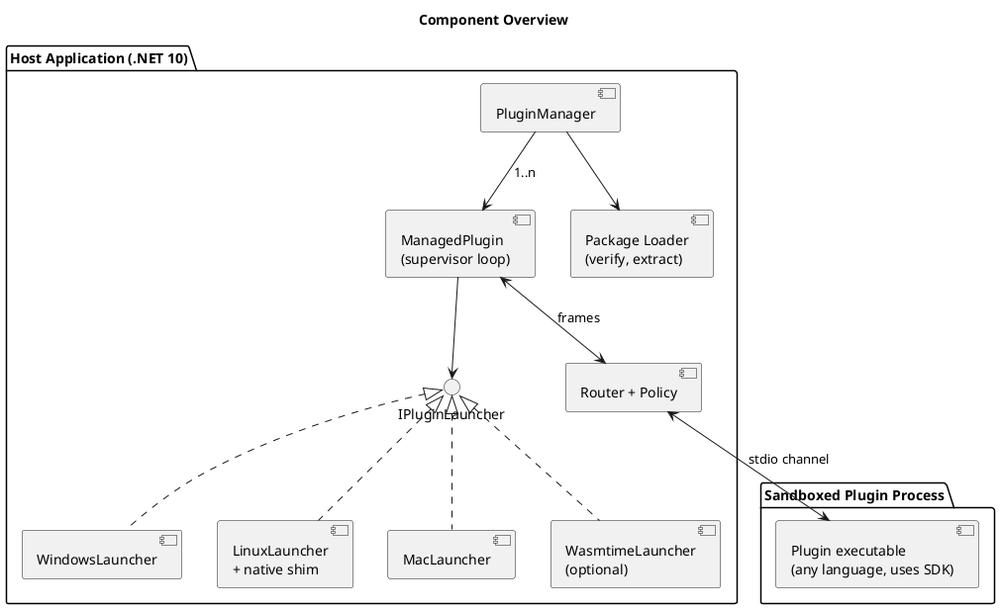

**Reuse:** about 70-80% of the host is shared across OSes: manager, supervisor, state machine, router, policy, protocol, config, and package handling. Only `IPluginLauncher` implementations are per-OS, and Linux and macOS share the libc P/Invokes.

```csharp
interface IPluginLauncher { PluginProcess Launch(PluginSpec spec); }
```

`PluginSpec` holds the verified entry path, args, capability grants, `Lifetime`, resource limits, heartbeat timeout, and dependencies.

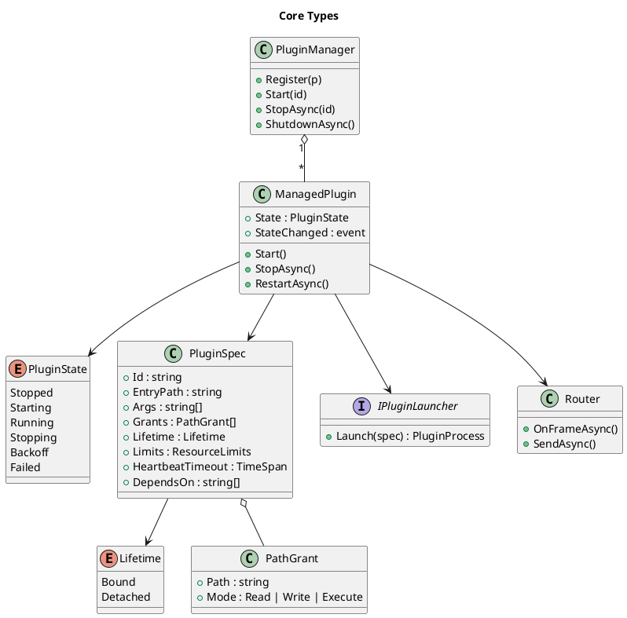

## 3. Packaging and Platform Support

The contract is **the protocol, not a runtime**. No cross-platform runtime exists for every language, so a plugin is a package containing one executable per platform, and the host selects the match.

```
telemetry-1.2.0.plugin   (zip)
├─ manifest.json
├─ win-x64/telemetry.exe
├─ win-arm64/telemetry.exe
├─ linux-x64/telemetry
├─ linux-arm64/telemetry
├─ osx-universal/telemetry
└─ plugin.wasm            (optional, portable)
```

```json
{
  "id": "telemetry",
  "version": "1.2.0",
  "protocol": "2.1",
  "entry": {
    "wasm": "plugin.wasm",
    "win-x64": "win-x64/telemetry.exe",
    "linux-x64": "linux-x64/telemetry",
    "linux-arm64": "linux-arm64/telemetry",
    "osx-universal": "osx-universal/telemetry"
  },
  "platforms": ["win-x64", "linux-x64", "linux-arm64", "osx-universal"],
  "lifetime": "Bound",
  "capabilities": {
    "data": "rw",
    "publish": ["device.readings"],
    "subscribe": ["config.updated"],
    "sendTo": ["analytics"]
  },
  "files": { "win-x64/telemetry.exe": "sha256:...", "linux-x64/telemetry": "sha256:..." },
  "signature": "..."
}
```

**Support tiers**

| Tier | Languages | Packaging |
|---|---|---|
| 1 | .NET, Rust, Go, C/C++ | Native binary per platform, or WASM |
| 2 | Python, Node, Java | Runtime bundled into each platform folder |
| 3 | Anything else | Author supplies per-platform executables that pass conformance |

**Host responsibilities**
- **Select by platform:** detect OS and architecture and pick the entry. If none matches, report "unavailable on this platform" before launch. Emulation (Rosetta, x64-on-ARM64) is opt-in.
- **Verify, then extract:** check the signature and per-file hashes, extract to a host-owned read-only location, and never run from a writable folder. Set the execute bit on Unix.
- **Grant only the selected platform folder** to the sandbox, not the whole package.
- **Linux libc:** require static or musl builds, or treat `linux-musl-x64` as its own platform.
- **macOS:** Apple Silicon requires at least an ad-hoc signature. Either strip quarantine on files you verified yourself or require signed and notarized binaries.
- **Interpreted languages:** bundle the runtime. This keeps sandbox grants minimal and the version predictable.
- **Platform support is earned:** a platform is listed in `platforms` only after the plugin passes the conformance suite on that OS.

**WASM (optional)**
- Hosted with Wasmtime (NuGet), ideally in a small sandboxed host process.
- It's the only single-file portable format and has the strongest default sandbox (no files or network unless granted).
- Use epoch interruption for CPU caps and memory limits for RAM. Expect roughly 1.1-2x native on compute-heavy code, and near native for I/O-bound work. Cache precompiled modules.
- Language support, threads, and sockets are limited, so it's an option and never a requirement.

## 4. Sandbox Design

One policy is enforced everywhere, defined as what all three platforms can do: **no network, no spawning processes, filesystem access only to granted paths** (typically the plugin folder read-only plus a per-plugin data directory). Authors declare logical capabilities, and each launcher translates them.

| | Windows | Linux | macOS |
|---|---|---|---|
| Filesystem | AppContainer (consider LPAC), ACL grants to the container SID | Landlock | Seatbelt profile |
| Network | AppContainer with no capabilities | seccomp denies `socket`/`connect`; Landlock net rules on 6.7+ | Seatbelt `deny network*` |
| Process control | Job object `ActiveProcessLimit = 1` | seccomp denies `fork`/`vfork` and `clone` without `CLONE_THREAD` | Seatbelt `deny process-fork` |
| Applied by | Host, at `CreateProcess` | Native shim, before `execve` of the plugin | Shim or `sandbox-exec`, before the plugin starts |
| Resource limits | Job object memory/CPU | cgroups v2 or rlimits | rlimits (weak) |

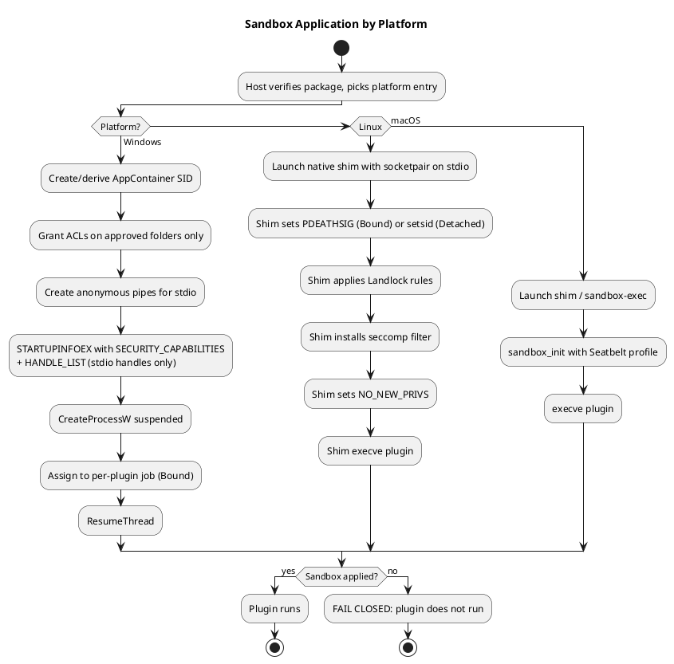

**Rules**
- **Fail closed:** if any sandbox step fails, the plugin does not run.
- **The sandbox is applied before the plugin's first instruction.** A plugin in an arbitrary language can't sandbox itself, and restrictions applied late can miss threads the runtime already created.
- **Inherit only the channel handles.** Windows uses `PROC_THREAD_ATTRIBUTE_HANDLE_LIST` with `bInheritHandles = true`. Unix passes only the socketpair as stdio.
- **Seccomp is a deny-list.** Runtimes (Go, Node, JVM, .NET) need a wide syscall set and create threads, so allow thread creation. Don't deny `execve` in seccomp, since the shim's own exec must succeed. Landlock's execute right, limited to the plugin and runtime folders, controls what can run.
- **Linux:** set `PR_SET_NO_NEW_PRIVS` last. It also prevents pdeathsig from being cleared by setuid binaries.
- **Runtime grants:** bundled runtimes live in the plugin folder, so they're covered. A system runtime would need extra read+execute grants.
- **Broker pattern:** extra access (a user-selected file, for example) is requested over the channel. The host checks policy and returns data or a handle. §10 and §11 extend this into declared, approved permissions for external files and network endpoints.
- **No shared named mutexes or shared memory** between host and plugin.
- **Windows specifics:** AppContainer needs Windows 8+. `Process.Start` can't set the attribute, so the launcher P/Invokes `CreateProcessW`. Grant the container SID read+execute on the plugin folder or it fails at startup. LPAC (`PROC_THREAD_ATTRIBUTE_ALL_APPLICATION_PACKAGES_POLICY`) is stricter and needs explicit grants even for system paths.
- **macOS:** `sandbox_init` is deprecated but functional. Don't promise Linux-grade isolation there.

## 5. Communication

### 5.1 Topology: hub and spoke

Every plugin has exactly one channel, and it goes to the host. Plugins never learn about each other, and the host is the only router, so policy, logging, and rate limits live in one place.

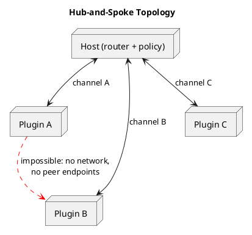

### 5.2 Structural enforcement

- **Bound plugins use stdio:** a socketpair (Unix) or anonymous pipes (Windows) wired to the child's stdin/stdout, and stderr is for logs. Every language can do this. Because the plugin needs no ability to create sockets or open named pipes, the sandbox denies them, so a plugin can't reach another plugin even if it wants to.
- **Detached plugins** can't use inherited stdio (see §6.2). They listen on a well-known endpoint (named pipe with an ACL on Windows, Unix socket in a `chmod 700` directory on Unix). On Linux this means the seccomp filter allows `socket(AF_UNIX)` only for those plugins. Authentication uses a token from a host-only file.

### 5.3 Envelope

```csharp
record Envelope(
    MessageType Type,        // Request, Response, Event, Heartbeat, Shutdown, Error, ResourceRequest, ResourceGrant
    Guid RequestId,
    Guid? CorrelationId,     // on responses
    string Topic,
    string? Target,          // logical name or capability, never a PID or pipe
    string Source,           // STAMPED BY HOST; plugin-supplied value ignored
    int TtlMs,
    int Hops,
    byte[] Payload);
```

- Frames are length-prefixed with a hard maximum (1-4 MB). Violations disconnect the plugin.
- The host stamps `Source` from the channel the frame arrived on.
- The protocol is defined in a language-neutral IDL (protobuf, or JSON-RPC with a published schema). Thin SDKs (C#, Rust, Go, Python, Node, C/C++) implement it, and any other language can follow the spec.
- Use a strict-schema serializer with **no type-name or polymorphic deserialization**.

### 5.3.1 Supported patterns

| Pattern | Flow |
|---|---|
| Host to plugin request/response | Matched by `CorrelationId` |
| Plugin to host event | Published on a topic, and the host consumes it |
| Plugin to host request | Config, or a file via the broker |
| Plugin to plugin | Sent to the host with a `Target`, and the host checks policy and forwards |
| Pub/sub | Only through the host's topic table |

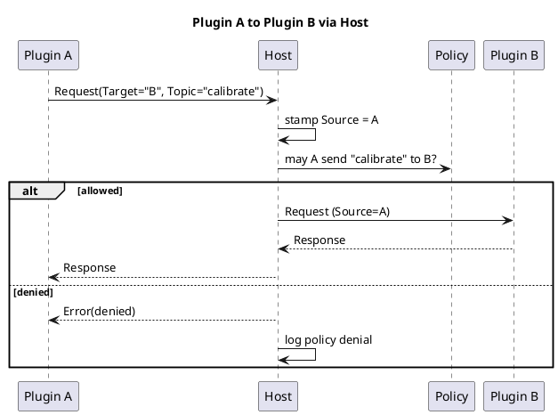

### 5.4 Policy and reliability

- **Default deny.** Each plugin's manifest declares what it may publish, subscribe to, and send to, plus limits (`msgPerSec`, `maxFrameBytes`). The receiver may also refuse unsolicited senders. Log all denials.
- **Bounded per-plugin queues** (`System.Threading.Channels`) so one slow plugin can't stall the router. When a queue fills, drop, fail, or disconnect per policy.
- **Timeouts on every request** (`TtlMs`), and a hop counter stops relay storms.
- **Priority lane for control traffic** (heartbeat, shutdown), so data floods can't cause false hang detection.
- **Restarting plugin:** fail fast with "unavailable" by default. Optionally buffer bounded idempotent messages and replay by `RequestId`.
- **Treat every payload as hostile,** including plugin A's data arriving at B. Enforce size, rate, and depth limits before deserializing.
- **Large data:** chunk it over the channel or use the broker to hand over a file handle.

Policy example:

```json
{
  "id": "telemetry",
  "publish": ["device.readings"],
  "subscribe": ["config.updated"],
  "sendTo": ["analytics"],
  "limits": { "msgPerSec": 200, "maxFrameBytes": 1048576 }
}
```

## 6. Lifetime Binding

### 6.1 Bound plugins

| OS | Mechanism |
|---|---|
| Windows | **One job object per plugin** with `KILL_ON_JOB_CLOSE` and `ActiveProcessLimit = 1`. Start suspended, assign, then resume. Never inherit or duplicate the job handle. |
| Linux | `PR_SET_PDEATHSIG(SIGKILL)` set in the shim, plus a `getppid()` check to close the race. Spawn from a long-lived dedicated thread, because pdeathsig fires when the spawning *thread* exits. Cgroup `cgroup.kill` is a stronger option when a supervisor is available. |
| macOS | No kernel equivalent. Use the channel-EOF watchdog plus `getppid()` polling or kqueue `NOTE_EXIT`. |

The **channel-EOF watchdog** is the portable baseline: the SDK exits when stdin reaches EOF, which the kernel guarantees when the host dies, provided nothing else holds the write end. The kernel mechanisms are hardening on top. All of them are outright kills with no cleanup, so plugins must tolerate being killed at any instant.

### 6.2 Detached plugins

- **Windows:** don't assign to a kill-on-close job, use `CREATE_BREAKAWAY_FROM_JOB` if a parent job requires it, and use `DETACHED_PROCESS`.
- **Linux/macOS:** skip pdeathsig and call `setsid()`. Under systemd, launch via `systemd-run --user --scope` or a separate unit, since a service's cgroup is killed on stop by default.
- **Reconnect:** a state file holds PID, **start time** (PID-reuse guard), and endpoint. On startup the host pings and reattaches, or relaunches if the plugin is dead.
- **Single instance:** a named mutex or `flock` prevents duplicates.
- **Orphan mode:** channel loss means "wait for reconnect", not "exit". The plugin buffers data (bounded, ideally to disk) and has a max-orphan timeout.
- **Still capped:** memory limits via job object or cgroup.
- **Explicit stop:** the host reconnects and sends a stop message, and the uninstaller must stop detached plugins.
- **Must-always-run work** such as telemetry collection is better as an OS service (Windows Service, systemd, launchd) with the host as a client.

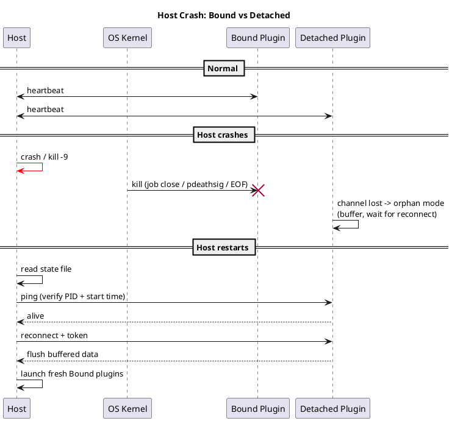

## 7. Lifecycle Management

The model is **desired state vs. actual state**. `Start()` and `Stop()` change intent, and one supervisor loop per plugin reconciles reality. Manual control and crash recovery share one code path, so they can't conflict.

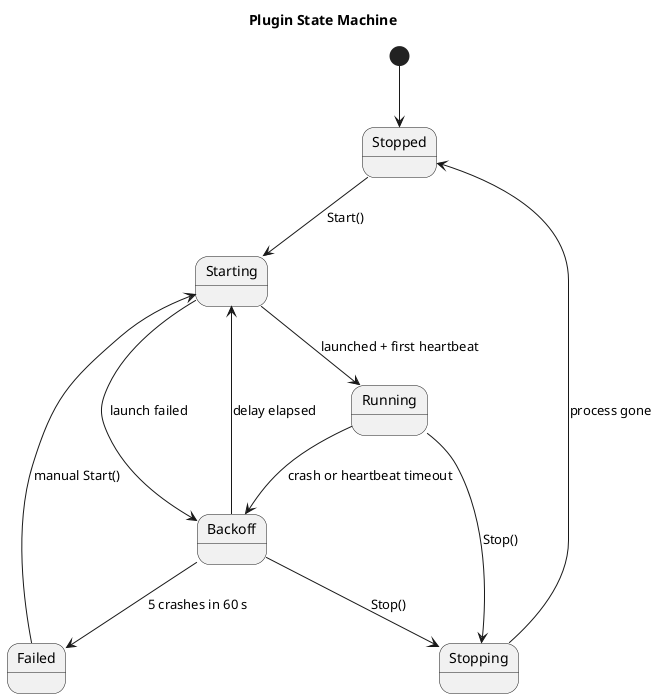

**Supervisor behavior**
- **Crash detection:** process exit, or no heartbeat for 10 s. Hung plugins are killed (`Kill(entireProcessTree: true)`) and treated as crashes.
- **Heartbeat semantics:** pings must be answered by the same loop that handles requests, so a deadlocked plugin can't keep beating from a side thread. The SDK spec requires this.
- **Backoff:** 500 ms doubling to 30 s with jitter, reset after one stable minute.
- **Crash-loop protection:** 5 crashes in 60 s moves the plugin to `Failed`, and a manual `Start()` resets it.
- **Intentional stop never restarts.** It sends a shutdown message, waits about 2 s, then kills.
- **Every restart rebuilds the sandbox,** including a fresh job object, grants, and channel.
- **`StopAsync` completes only when the process is gone,** so `RestartAsync` can't leave two copies running.
- **Dependencies:** start in dependency order and stop in reverse.
- **Host shutdown:** gracefully stop Bound plugins and leave Detached ones running. Job objects and pdeathsig remain the backstop if the host crashes first.
- **Windows detail:** keep the process handle open for exit codes, and prefer waiting on the raw handle, since `Process.GetProcessById` can fail with access denied on sandboxed processes.

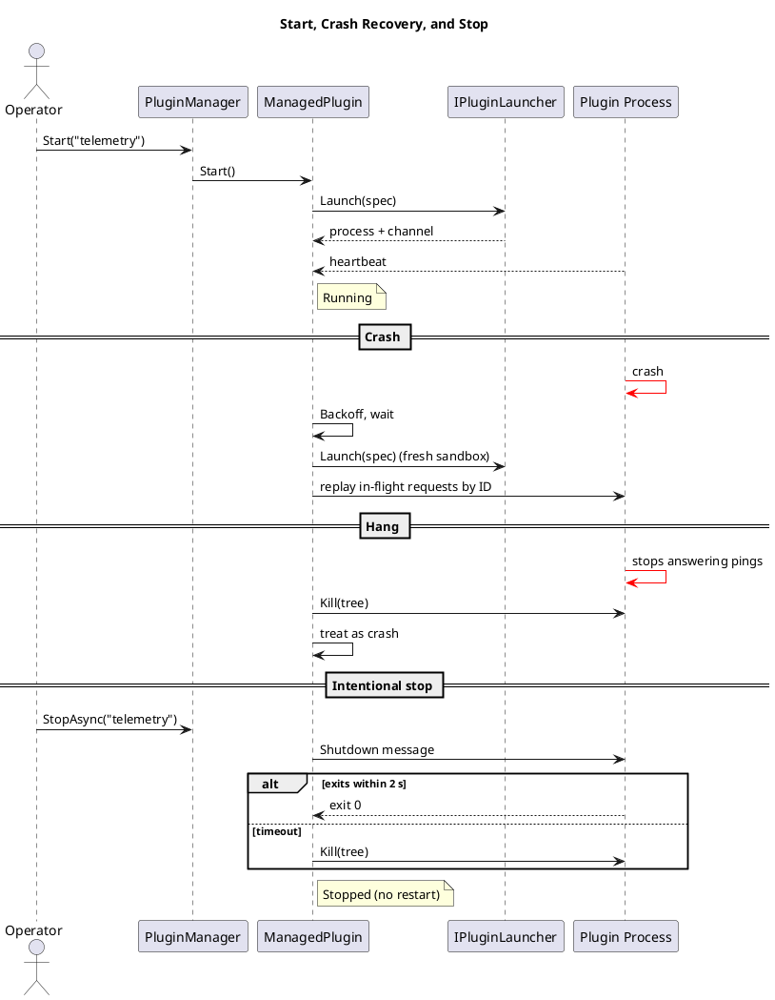

## 8. Crash Safety and State

- Plugins must be **idempotent and restartable**, not reentrant. The host can kill and relaunch them at any instant.
- Plugins stream results and checkpoints to the host as they go, and the host owns committed state. After a restart the host replays in-flight requests by ID.
- Locks are not shared with plugins, which avoids the following kill behavior:

| Lock type | Result when its holder is killed |
|---|---|
| Windows named mutex | Released, marked *abandoned* |
| `flock` / `fcntl` | Released |
| SysV semaphore | Released only with `SEM_UNDO` |
| POSIX named semaphore | **Stays locked forever** |
| pthread mutex in shared memory | Stuck unless robust (`EOWNERDEAD`) |

- Every host wait on a plugin has a timeout.

## 9. Per-Plugin Configuration

| Field | Purpose |
|---|---|
| `enabled` | Auto-start on host launch |
| `lifetime` | `Bound` or `Detached` |
| `entry`, `files`, `signature` | Platform artifacts and verification data |
| `capabilities` | Data access, publish, subscribe, sendTo |
| `permissions` *(proposed, §10)* | Requested external files, network endpoints, groups, listeners, each with a reason |
| `limits` | Memory, CPU, message rate, frame size; *(proposed, §13)* also tunnel and I/O limits |
| `heartbeatTimeout` | Hang detection |
| `restartPolicy` | Backoff and crash-loop window |
| `dependsOn` | Start/stop ordering |

The manifest is the plugin author's **request** and is signed with the package. The host's **approval** is stored separately and never inside the package (§10).

## 10. Permissions and Approval (proposed)

Plugins start with the deny-all baseline from §4. A plugin that needs more, such as managing third-party data outside the host application, **declares** it in the manifest. A second party, the operator or user of the host, **approves** it. The author cannot grant themselves access.

### 10.1 Declaring permissions

Authors declare logical permissions, not raw OS rules or paths. Each has an `id` (used in broker calls and audit logs) and a plain-language `reason` shown at review.

```json
"permissions": {
  "files": [
    { "id": "exports", "scope": "external", "path": "{userDocuments}/Exports",
      "mode": "read", "delivery": "handle",
      "reason": "Read customer export files to import them" }
  ],
  "network": [
    { "id": "orders-db", "transport": "tcp", "mode": "blind",
      "host": "mongo.example.com", "port": 27017,
      "secondary": [ { "host": "mongo2.example.com", "port": 27017 } ],
      "reason": "Read and write order records in the customer's MongoDB" }
  ],
  "groups": [
    { "id": "feed", "transport": "udp-multicast", "group": "239.1.2.3", "port": 5000,
      "direction": "receive", "reason": "Receive instrument telemetry" }
  ],
  "listen": [],
  "limits": { "tunnelBytesPerSec": 5000000, "maxStreams": 4, "cpuPercent": 25, "memoryMb": 256 }
}
```

- Fields mirror §11's connection models. Anything not declared is denied.
- `{userDocuments}`-style tokens are resolved by the host, so manifests are portable and never contain machine paths.
- Wildcards (`*.mongodb.net`) are allowed only with an explicit `wildcard: true`, and the review dialog calls them out as broad.

### 10.2 Approval

An approval record is keyed by plugin id, **package hash and signer**, and permission id:

| Field | Meaning |
|---|---|
| decision | `approved`, `denied`, or `ask-each-time` |
| scope | `install`, `session`, `once`, or until `expires` |
| granted | The permission as approved, including any lower limits the approver set |
| by / at | Who approved and when |

- **Re-approval is required** when a new version requests anything not already approved, or widens a limit. A new version that requests a subset keeps its approvals.
- **Approval modes** per permission: `auto` (inside the host ceiling, low risk), `user`, `admin`, `deny`. Whether any permission should need two approvers (dual control) is open (§18).
- **Revocation** takes effect immediately for brokered access, because the broker stops serving. A permission change that needs a different OS sandbox restarts the plugin.
- **Audit:** every request, approval, revocation, use and denial is logged with plugin id, version, hash and permission id.

### 10.3 Effective policy

```
effective policy  =  requested (manifest)  ∩  approved (store)  ∩  host ceiling
```

The **host ceiling** is host-wide configuration the plugin can never exceed, regardless of approval. Examples: never reach loopback, link-local, cloud metadata addresses or private ranges; never reach paths outside named roots; maximum limits. Anything outside any one of the three sets is denied, which preserves fail-closed.

### 10.4 Review dialog

Show what is being requested, why, and **combinations that matter**. Reading external files or data plus any network path means data can leave the host, so say so plainly. Broad wildcards, inbound listeners, peer-to-peer traffic and raised limits get explicit warnings.

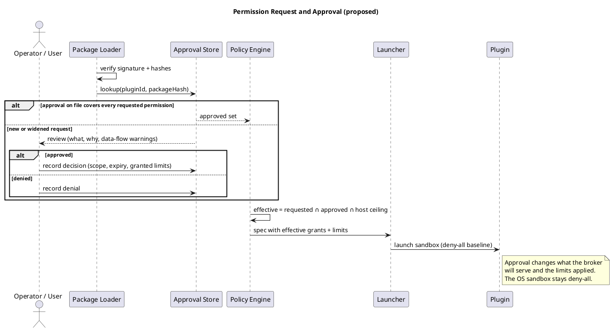

## 11. Brokered External Access (proposed)

Approved access to files and the network is **served by the host**, not by widening the OS sandbox. The sandbox stays at "no network, no files beyond the plugin folder and data directory". The host performs approved operations on the plugin's behalf over its single channel, which fits hub-and-spoke (§5.1).

Benefits: one policy model on all three OSes (macOS and Windows can't match Linux's fine-grained network rules); approval changes the broker, not the sandbox, so grants and revocations need no restart and per-use prompts become possible; every use is logged in one place.

### 11.1 Connection models

| Model | Examples | Host behavior | Declared as |
|---|---|---|---|
| Point to point, stream | HTTPS, SFTP, SSH, single-node DB | Open one outbound TCP connection to an approved endpoint and relay it | host, port, `tcp` |
| Point to point, datagram | DNS, NTP, syslog, UDP telemetry | Relay datagrams with rate and size caps | host, port, `udp` |
| Point to multipoint | UDP multicast, LAN broadcast, pub/sub feeds | Host joins the group on an approved interface and fans out to each approved plugin | group, port, interface, direction |
| Primary plus secondary connections | FTP, Mongo replica sets, SIP/RTP | Open the primary; secondary endpoints must be **declared** (blind mode) or **derived** by a protocol helper | primary plus `secondary` list or a `helper` |
| Inbound | A plugin that serves a webhook | **Host** owns the listening socket and passes accepted connections to the plugin | port, bind interface, allowed source ranges, max connections |
| Peer to peer | BitTorrent, WebRTC, custom mesh | Destinations unknown at approval time, so limit by class only | port range, quotas; no per-peer allowlist; deny by default |

### 11.2 Blind tunnels (default)

A blind tunnel is a `CONNECT`-style relay: the plugin names a host and port, the host checks it against the approved policy, then copies bytes in both directions. The host does **not** terminate TLS and never sees plaintext.

- **Works for any protocol** (Mongo over TLS, SFTP, SMTP, custom binary), with no parser per protocol.
- **Credentials and certificate checks stay in the plugin.** The host never holds them.
- **The plugin sends a hostname, and the host resolves it.** The host then rejects loopback, private, link-local and metadata ranges unless the approval names them, which blocks SSRF and DNS rebinding.
- **Enforced without reading content:** destination, transport, concurrent streams, new streams per second, bytes per direction, duration. Logged: destination, start/end, bytes.
- **Not enforceable:** operations (read versus delete), data loss prevention, or whether the plugin verified certificates. **Approving a blind tunnel means trusting the plugin with everything that endpoint accepts.** The review dialog must say so.
- **No derived secondary connections.** Protocols that negotiate extra connections inside the stream (FTP passive data ports, FTPS) cannot be handled blind. Either list every host and port in `secondary`, or use an application-level helper (§11.4), or require a better protocol (use SFTP, not FTP).
- **Wildcards are broad.** `*.mongodb.net:27017` makes everything under that domain reachable. On shared CDN or cloud addresses, a host-level approval is only as narrow as the address.

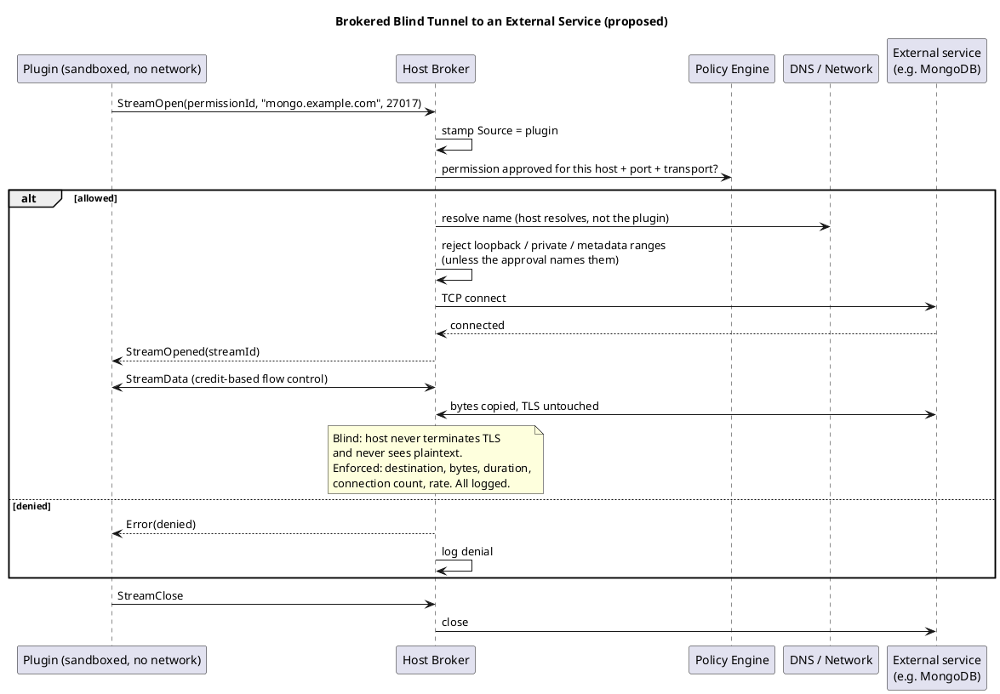

### 11.3 Broker operations on the channel

New message types alongside the envelope's existing `ResourceRequest` and `ResourceGrant`:

| Operation | Purpose |
|---|---|
| `StreamOpen(permissionId, host, port)` / `StreamOpened` / `StreamClose` | Outbound relay |
| `StreamData` | Bulk data. Uses a small stream frame (stream id, flags, length) with **credit-based flow control** so queues stay bounded, rather than a full envelope per chunk |
| `DatagramSend` / `DatagramReceived` | UDP and multicast |
| `GroupJoin` / `GroupLeave` | Multicast membership |
| `Listen` / `Accepted` | Host-owned listener, accepted connections handed to the plugin as streams |
| `Dns.Lookup(name, type)` | Host-resolved name lookup, checked against the approved list. Covers SRV/TXT for `mongodb+srv://` |
| `File.Open(permissionId, relativePath)` | Returns a read-only (or approved mode) **handle** or stream. See §11.5 |

Every call is checked against the effective policy (§10.3) and logged.

### 11.4 Optional protocol-aware modes

Blind tunnels are the baseline. Two opt-in extensions exist for cases that need more enforcement. Neither is required for v1.

- **Semantic broker.** The plugin calls a host API (`data.find(collection, filter, options)`) and the host runs it with its own driver. Credentials never reach the plugin, policy is structured (database, collection, read-only), and results can be size-capped. Cost: a narrower API than the full driver, and the abstraction must be maintained. Best for a few well-known backends.
- **Protocol helper** (for example an FTP gateway). Parses the control stream so passive-mode data connections can be opened for exactly that session, to the same host, and closed with it. Active mode (server connects back) is refused. Cannot work when the control channel is encrypted (FTPS) unless the host terminates TLS, which defeats blind mode.
- A wire-protocol-aware proxy (parsing Mongo OP_MSG to allow only some commands) is possible but fragile and parser bugs become security bugs. Treat it as a later option.

### 11.5 Brokered files

- The host opens the approved path and hands the plugin a **handle** (`DuplicateHandle` on Windows, fd passing over a Unix socket on Linux and macOS) or streams the content. The plugin needs no filesystem rights beyond its own folders.
- The host resolves and checks paths itself, which avoids symlink and traversal races, and can pass read-only handles.
- Limits: plugins that need real paths (native libraries, tools that shell out) won't work through handles. Very large data should use handles or streaming rather than being copied in messages.

### 11.6 How a plugin reaches the broker

A sandboxed plugin has no sockets. The primary route is an **SDK stream API** over the existing channel (`OpenStream(...)` returning a stream the language's networking library can wrap). Many database drivers do not accept a custom transport. For those, an option is a local SOCKS5 or `CONNECT` endpoint on a Unix socket or named pipe that the sandbox permits for that purpose only. This relaxes the structural rule that plugins cannot create sockets, so it needs a deliberate decision (§18, open question).

### 11.7 Detached plugins

A Detached plugin keeps running when the host dies, but brokered access dies with the host. A Detached plugin that needs external network access therefore cannot rely on the broker while the host is down. Options: buffer in orphan mode until the host returns (§6.2), or run it as an OS service with its own tightly scoped direct network access. This is a real design gap (§18).

## 12. Network Isolation (proposed)

**Baseline: plugins use no host ports at all.** The channel is stdio, a socketpair or a pipe (§5.2), not TCP. Tunnels, files and plugin-to-plugin traffic all ride on it. The only ports consumed are the host's own ephemeral ports for approved outbound connections, bounded by `maxStreams` (§13).

| OS | Isolation | Notes |
|---|---|---|
| Linux | Add an **empty network namespace** per plugin (`CLONE_NEWNET`, usually with a user namespace) on top of seccomp and Landlock | Only a private loopback exists. Even a gap in the seccomp filter finds no interface to send on, and a plugin that wants an internal loopback gets its own `127.0.0.1`, so identical port numbers never collide. Unprivileged user namespaces are restricted on some distributions, so the shim may need a capability or configuration. |
| Windows | AppContainer with no capabilities. Loopback to other processes is blocked by default for AppContainers | AppContainer does not give a plugin its own IP address. A genuinely separate network stack means Windows containers via the Host Compute Network service, or Hyper-V isolation. These are heavier and conflict with the low-latency goal, so treat them as an optional backend. |
| macOS | Seatbelt `deny network*` | No network namespace equivalent. Deny-only. |

- **Docker/OCI containers** per plugin are an optional backend. `--network none` yields the same island and an internal network can give an IP. It adds a runtime dependency, so it is not the baseline.
- **Plugins reachable from outside** never get an externally reachable address. The host owns the listener and forwards (§11.1).
- **Optional source-address attribution:** if the machine has several addresses, the host may bind a distinct source address per plugin so firewall logs identify plugins.

### 12.1 Windows Firewall as a second layer (optional)

Windows Firewall and the Windows Filtering Platform can match an AppContainer by **package SID** (for example PowerShell's `New-NetFirewallRule -Package <SID>`, or the `ALE_PACKAGE_ID` condition in WFP). A host can give a plugin's SID a block-all rule, which backs up the "no capabilities" rule. Caveats:

- Creating rules needs elevation (installer or service), and rules are machine-wide state that can go stale. Reconcile on startup and remove on uninstall.
- Rules match addresses and ports, not hostnames.
- Windows only. Nothing equivalent exists on Linux or macOS.

Because the broker is the portable mechanism, the firewall rule is defense in depth, not a replacement.

## 13. Resource Limits and Abuse Handling (proposed)

Two layers, because host-side detection is reactive and polling-based.

### 13.1 Hard limits (OS-enforced)

These hold even if the plugin hangs, spins or ignores the host. The existing per-plugin job object (`PluginJob.cs`) is the Windows starting point.

| Resource | Windows (job object) | Linux (cgroup v2) | macOS |
|---|---|---|---|
| CPU | CPU rate control, hard cap | `cpu.max` | Weak: `setrlimit`, monitoring |
| Memory | Job memory limit | `memory.max` | `setrlimit`, monitoring |
| Processes / threads | Active process limit | `pids.max` | `RLIMIT_NPROC` |
| Disk I/O | Limited, rely on monitoring | `io.max` | Monitoring only |
| Disk space | Quota on the data directory | Quota or size-limited mount | Quota or monitoring |

### 13.2 Soft limits (host-enforced)

Each plugin is serviced by its own loop with bounded queues, so one flooding plugin cannot stall the router or other plugins.

- **Channel:** token buckets for messages and bytes per second, `maxFrameBytes`, bounded queues. Backpressure first; never buffer without bound. Control traffic (heartbeat, shutdown) keeps its priority lane (§5.4).
- **Tunnels:** `maxStreams`, new streams per second, bytes per direction, duration. These also protect the **external service** from a plugin that floods it.
- **Brokered files:** open handles, throughput, size.
- **Liveness:** a plugin burning CPU misses its heartbeat (§7), so hangs and spins are caught as a side effect.

### 13.3 Escalation ladder

1. **Allow short bursts:** token buckets with a burst size, and a sustained window before acting.
2. **Throttle:** delay or slow reads so the plugin feels backpressure.
3. **Warn:** send a "slow down" event and log it.
4. **Kill and restart:** kill the process tree, then restart with the §7 backoff.
5. **Quarantine:** repeated violations in a window move the plugin to `Failed` (no automatic restart) and notify the operator, who clears it after review.

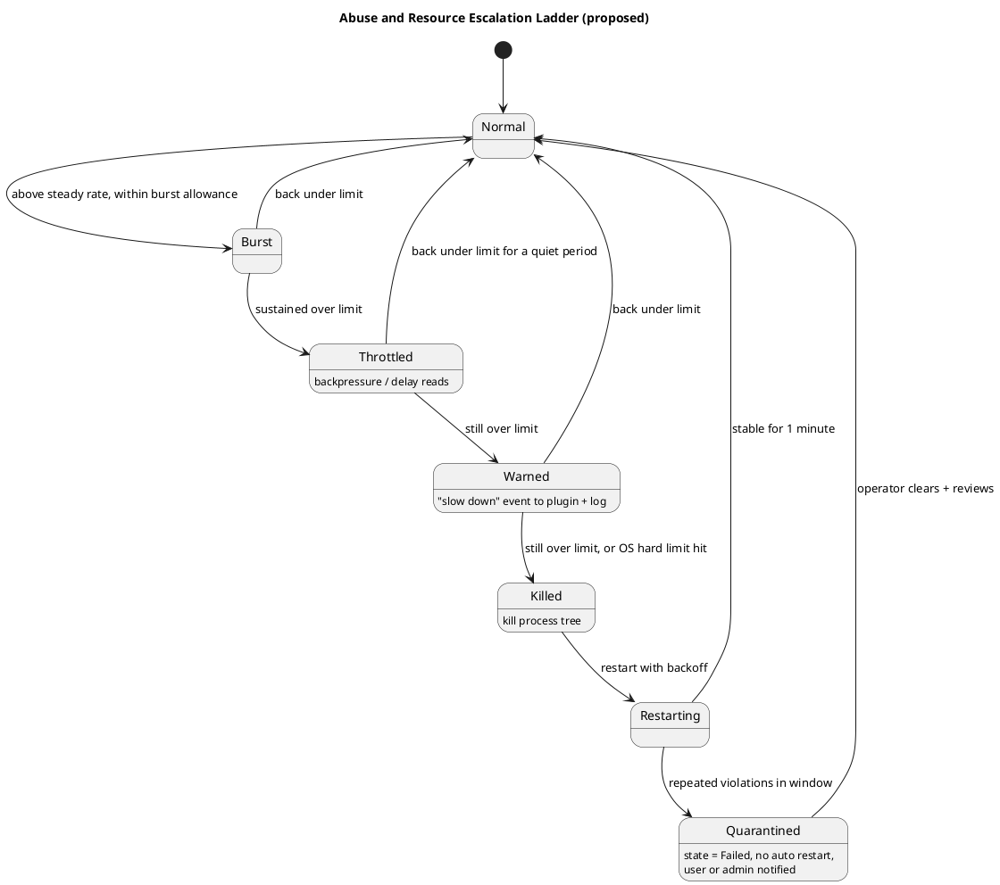

### 13.4 Declared and approved limits

The manifest may request higher limits (a high-volume telemetry plugin, for example). Effective limits follow the same intersection as other permissions (§10.3), and unusually high requests are flagged at review. Log throttle events as well as kills, so throttling does not hide a real problem.

### 13.5 Caveats

- A fork bomb, memory spike or disk fill needs the OS limits to stop quickly; the host only observes and reports.
- Account usage per plugin so a limit hit is attributed correctly.
- "Looks like a DoS" is a heuristic. Fixed limits plus a quarantine rule are more predictable than anomaly detection, so start there.

## 14. Conformance Suite

The conformance suite is the real portability guarantee, since artifacts differ per platform. It is language-neutral: a set of test plugins and a runner that exercise the protocol and escape attempts.
- Network connections, spawning, and access to ungranted files are denied.
- *(Proposed)* Brokered access works only for approved permissions: an unapproved host, port, transport, path or mode is denied; a revoked permission stops being served; private, loopback and metadata destinations are refused after DNS resolution.
- *(Proposed)* Resource limits hold: a CPU spinner, memory hog, fork bomb and stream flooder are each throttled or killed, and other plugins keep running.
- Denials surface as consistent errors across OSes.
- Heartbeat is answered by the main loop, shutdown is honored, and message round-trips work.
- Every SDK must pass it on every OS it claims, and results gate the manifest's `platforms` list.

## 15. Security Checklist

- [ ] Verify signature and per-file hashes before extraction
- [ ] Run only from host-owned, read-only locations
- [ ] Least-privilege grants, and remove ACLs on uninstall (they persist on disk)
- [ ] Inherit only channel handles, and share no named objects
- [ ] Fail closed on any sandbox error
- [ ] Host stamps `Source`, and validates and rate-limits every frame
- [ ] Strict-schema serialization with no type-name deserialization
- [ ] Log launches, crashes, denials, and policy violations
- [ ] *(Proposed)* Approvals keyed to package hash and signer; widened requests require re-approval
- [ ] *(Proposed)* Effective policy is the intersection of requested, approved and host ceiling
- [ ] *(Proposed)* Host resolves DNS and rejects loopback, private, link-local and metadata ranges unless named in the approval
- [ ] *(Proposed)* Review dialog warns about data-flow combinations, wildcards, listeners and peer-to-peer
- [ ] *(Proposed)* Bounded queues, credit-based flow control and per-plugin limits on every brokered stream
- [ ] *(Proposed)* Hard OS limits (job object, cgroup) set on every launch, not only soft limits

## 16. Testing

| Test | Expected |
|---|---|
| `kill -9` or Task Manager on host | Bound children die, Detached survive |
| Plugin attempts network, spawn, or unauthorized file access | Denied on every OS |
| Plugin deadlocks its main loop | Heartbeat timeout, kill, restart |
| Plugin crash-loops | Reaches `Failed` after 5 in 60 s |
| `Stop` during `Backoff` | No restart |
| Plugin A tries to reach B directly | Impossible. Via host without permission: denied and logged |
| Host inside a parent job (Windows) | Bound and Detached semantics still hold |
| Host in a container or PID namespace | `getppid()` check behaves correctly |
| Detached plugin dead at host restart | Relaunched with no duplicate |
| Missing platform entry | Clear "unavailable" message |
| Go, Node, and JVM plugins under seccomp | Thread creation works |
| *(Proposed)* Unapproved tunnel host, port or transport | `StreamOpen` denied and logged |
| *(Proposed)* Approved hostname that resolves to a private or metadata address | Refused after resolution |
| *(Proposed)* Plugin ships a new version requesting an extra permission | Re-approval required; old version's approvals unchanged |
| *(Proposed)* Permission revoked while a stream is open | Stream closed, further opens denied, no restart needed |
| *(Proposed)* Plugin floods a tunnel or the channel | Backpressure, then warning, then kill; other plugins unaffected |
| *(Proposed)* CPU spinner / memory hog / fork bomb | Stopped by the OS hard limit |
| *(Proposed)* Repeated violations | Plugin quarantined (`Failed`), operator notified |
| *(Proposed)* Two plugins both want local port N | No conflict: neither opens host ports |
| *(Proposed)* Host dies while Detached plugin has brokered access | Access stops; plugin enters orphan mode (see §11.7) |

## 17. Build Order

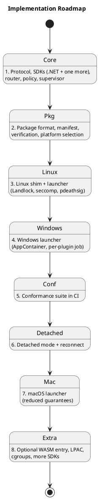

*(Proposed)* Suggested placement of the new work: resource limits (§13.1) belong with steps 3 and 4, since the launchers should set job objects and cgroups from the start. The permission manifest and approval store (§10) belong with step 2. The broker (§11) comes after the conformance suite exists (step 5), because its deny cases are the tests that matter. Network namespaces (§12) go with the Linux launcher, and the optional Windows firewall layer with step 8.

## 18. Open Questions

1. How strong must the macOS guarantee be, given no kill-on-parent-death primitive and weak resource limits?
2. Is the optional WASM path worth building in v1, or after native packages are stable?
3. Should long-running telemetry plugins be Detached children or OS services with the host as a client?
4. Fat packages (all platforms in one file) or per-platform packages with a registry?
5. Which SDK languages ship first?

**Added 2026-10-08 (proposed sections 10-13):**

6. Approval timing: install time, first use, per use, or a mix? Which permission kinds always prompt?
7. Should any permission require **two approvers** (dual control), and who is the "second" party (an admin, or the owner of the external data)?
8. How do plugins use standard drivers with no custom transport? SDK stream API only, or a local SOCKS5/`CONNECT` endpoint over a Unix socket or named pipe (which relaxes "plugins cannot create sockets")?
9. Data-plane performance: is channel-multiplexed streaming with credit-based flow control fast enough for bulk data, or should bulk data use passed handles or a separate pipe?
10. Which backends, if any, get a semantic broker or protocol helper (Mongo, FTP), versus blind tunnels only?
11. How are wildcard host approvals constrained (allowed suffixes, DNS-based checks, review wording)?
12. Detached plugins and brokered access: orphan-mode buffering, or run needy plugins as OS services with their own scoped network access? (§11.7)
13. Is peer-to-peer ever supported, or always denied?
14. Is the optional Windows firewall layer (§12.1) worth the elevation and cleanup cost?
15. Should plugins that exceed limits be quarantined automatically, or only warned until an operator acts?

**Claims to verify before building** (written from general knowledge, not checked against current documentation):

- Windows Firewall and WFP matching on AppContainer package SID (`New-NetFirewallRule -Package`, `ALE_PACKAGE_ID`), and whether FQDN rules are available outside managed scenarios.
- AppContainer loopback behavior, including whether a plugin can connect to its own listener.
- Job object CPU hard-cap and memory-limit options, and what disk I/O limits exist on Windows.
- Linux unprivileged user and network namespaces, including distribution restrictions, and cgroup v2 delegation to an unprivileged supervisor.
- Landlock network rules cover TCP ports only (not hostnames), and from which kernel version.
- Whether the .NET MongoDB driver (and other target drivers) accept a custom stream or transport factory.
- Handle passing: `DuplicateHandle` into an AppContainer process, `WSADuplicateSocket`, fd passing over `AF_UNIX`, and whether the sandbox rules allow them.
- macOS options for resource limiting and network scoping beyond Seatbelt.
